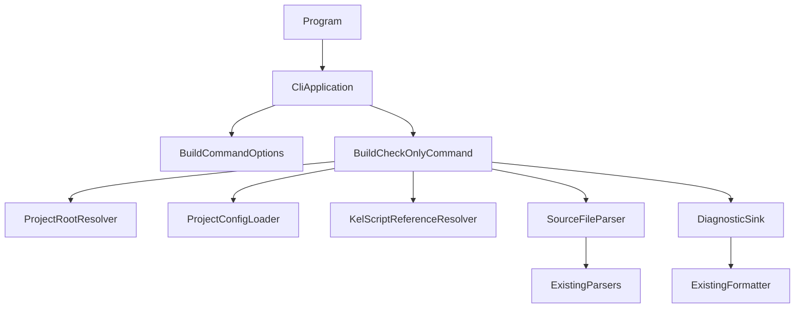
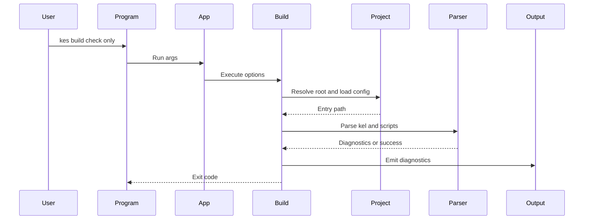

# Design Document

## Overview

This feature adds the first executable skeleton for `kes build --check-only`. It lets CLI users and developers validate a KES project configuration and input scripts without producing build artifacts or starting any runtime.

The implementation extends the existing `KoromoEventScript.Cli` project. Existing lexer, parser, diagnostic, and formatter types remain the parsing and reporting foundation, while new CLI command components provide argument routing, project resolution, `kes.xml` loading, entry `.kel` parsing, referenced script parsing, diagnostic output, and exit code mapping.

### Goals

- Provide a testable `kes build --check-only` command path.
- Reuse existing `.ke` / `.kel` parser and diagnostic formatter contracts.
- Preserve the strict no-artifact and no-runtime boundary for check-only validation.

### Non-Goals

- `.k` intermediate representation generation.
- Manifest generation.
- Runtime startup.
- Full Phase 2 semantic analysis such as import resolution, tag resolution, type checking, resource validation, or locale emission.
- Complete CLI command suite implementation beyond the minimal routing needed for `build --check-only`.

## Boundary Commitments

### This Spec Owns

- The `kes build --check-only` command route and minimal argument validation.
- Project root resolution from explicit `PROJECT_DIR`, explicit `--project`, or current-directory upward `kes.xml` discovery.
- Minimal `kes.xml` loading required to read `Project.Entry` and path settings.
- Parsing of the entry `.kel` file and referenced script files discovered from `chapter` entries.
- Diagnostic formatting selection for text and JSON Lines output.
- Exit code mapping for command-line, syntax, and file/config input failures.

### Out of Boundary

- Artifact writers for `.k`, diagnostics files, manifest files, build directories, or distribution directories.
- Runtime process startup or runtime input preparation.
- Meaning analysis beyond syntax parsing and minimal script reference discovery.
- Changes to existing parser grammar unless required to expose already-supported diagnostics.
- `run`, `clean`, `publish`, and non-check-only `build` behavior.

### Allowed Dependencies

- Existing `KoromoEventScript.Cli.Diagnostics` types for diagnostic data and formatting.
- Existing `KoromoEventScript.Cli.Lexing` and `KoromoEventScript.Cli.Parsing` types for `.ke` / `.kel` syntax validation.
- .NET standard library APIs for filesystem, XML loading, console I/O, and process exit.
- Existing repository docs under `docs/spec/` as the public behavior contract.

### Revalidation Triggers

- CLI argument shape changes for `build`, `--check-only`, `--project`, or `--log-format`.
- Changes to `kes.xml` required fields or `Project.Entry` meaning.
- Changes to `.kel` script reference conventions such as replacing `chapter` with another key.
- Diagnostic formatter contract changes.
- Parser diagnostic code classification changes that affect exit code mapping.

## Architecture

### Existing Architecture Analysis

`source/cli/KoromoEventScript.Cli` currently contains reusable lexer/parser/diagnostic code but no executable command entrypoint. `KeParser` and `KelParser` expose static parse methods and throw `LexerException` / `ParserException` containing a `Diagnostic`. `DiagnosticFormatter` already formats text and JSON Lines output.

The tests are NUnit-based under `tests/KoromoEventScript.Cli.Tests`, with `testdata/` providing sample `.kel`, project, and diagnostic fixtures. New design should keep command workflow logic callable without spawning a process for most tests, and add process-style tests only for end-to-end exit code behavior.

### Architecture Pattern & Boundary Map

Selected pattern: thin entrypoint plus typed services. `Program` owns process integration only. `CliApplication` parses command-level arguments and dispatches to `BuildCheckOnlyCommand`. Build validation uses small services for project/config/reference resolution and parser execution.



Dependency direction: `Program` -> `CliApplication` -> command models -> services -> existing parser/diagnostic primitives. Existing parser and diagnostic primitives must not import new command-layer types.

### Technology Stack

| Layer | Choice / Version | Role in Feature | Notes |
|-------|------------------|-----------------|-------|
| CLI | .NET `net10.0` project | Entrypoint, argument routing, console output | Existing target framework |
| Parsing | Existing KES lexer/parser | `.ke` / `.kel` syntax validation | No parser dependency inversion required |
| Config | `System.Xml.Linq` | Minimal `kes.xml` read | No external XML package |
| Tests | NUnit 4.x | Unit and integration validation | Existing test stack |

## File Structure Plan

### Directory Structure

```txt
source/cli/KoromoEventScript.Cli/
├── Program.cs
├── Commands/
│   ├── CliApplication.cs
│   ├── CliExitCode.cs
│   ├── CliInvocationResult.cs
│   └── Build/
│       ├── BuildCommandOptions.cs
│       ├── BuildCheckOnlyCommand.cs
│       └── BuildCheckOnlyResult.cs
├── ProjectSystem/
│   ├── ProjectConfig.cs
│   ├── ProjectConfigLoader.cs
│   └── ProjectRootResolver.cs
├── Build/
│   ├── KelScriptReferenceResolver.cs
│   └── SourceFileParser.cs
├── Diagnostics/
│   ├── Diagnostic.cs
│   ├── DiagnosticFormatter.cs
│   ├── DiagnosticLevel.cs
│   └── DiagnosticSink.cs
├── Lexing/
└── Parsing/

tests/KoromoEventScript.Cli.Tests/
├── Commands/
│   ├── CliApplicationTests.cs
│   └── BuildCheckOnlyCommandTests.cs
├── ProjectSystem/
│   └── ProjectConfigLoaderTests.cs
└── Build/
    └── KelScriptReferenceResolverTests.cs

testdata/projects/
├── minimal/
├── missing-entry/
└── invalid-script/
```

### Modified Files

- `source/cli/KoromoEventScript.Cli/KoromoEventScript.Cli.csproj` — set executable output behavior if required for `Program.cs`, keep `net10.0`, nullable, and implicit usings.
- `source/cli/KoromoEventScript.Cli/Diagnostics/DiagnosticFormatter.cs` — no behavior change expected; only use from `DiagnosticSink`.
- `source/cli/KoromoEventScript.Cli/Parsing/*` — no ownership change; parser behavior is consumed, not expanded.
- `tests/KoromoEventScript.Cli.Tests/KoromoEventScript.Cli.Tests.csproj` — no new packages expected.

## System Flows



Key decision: file/config failures stop later parsing because subsequent inputs cannot be resolved reliably. Parser diagnostics preserve collection order and map to syntax-stage exit code `3`.

## Requirements Traceability

| Requirement | Summary | Components | Interfaces | Flows |
|-------------|---------|------------|------------|-------|
| 1.1 | Start check-only validation | `CliApplication`, `BuildCheckOnlyCommand` | `Run(args)`, `Execute(options)` | Main sequence |
| 1.2 | Use `PROJECT_DIR` | `BuildCommandOptions`, `ProjectRootResolver` | `ProjectDirectory` option | Main sequence |
| 1.3 | Discover project from current directory | `ProjectRootResolver` | `Resolve(startDirectory)` | Main sequence |
| 1.4 | Invalid args return 2 | `CliApplication`, `DiagnosticSink` | `CliInvocationResult` | Error strategy |
| 2.1 | Read `kes.xml` | `ProjectConfigLoader` | `Load(projectRoot)` | Main sequence |
| 2.2 | Missing `kes.xml` returns 6 | `ProjectRootResolver`, `ProjectConfigLoader` | `ProjectConfigLoadResult` | Error strategy |
| 2.3 | Invalid config diagnostic | `ProjectConfigLoader`, `DiagnosticSink` | `ProjectConfigLoadResult` | Error strategy |
| 2.4 | Use config entry | `ProjectConfig`, `BuildCheckOnlyCommand` | `ProjectConfig.EntryPath` | Main sequence |
| 3.1 | Parse entry `.kel` | `SourceFileParser`, existing `KelParser` | `ParseKel(path)` | Main sequence |
| 3.2 | Parse referenced `.ke` files | `KelScriptReferenceResolver`, `SourceFileParser`, existing `KeParser` | `ResolveScripts(document)` | Main sequence |
| 3.3 | Missing input returns 6 | `SourceFileParser`, `DiagnosticSink` | file parse result | Error strategy |
| 3.4 | Syntax diagnostics return 3 | `SourceFileParser`, existing parser exceptions | diagnostic propagation | Error strategy |
| 3.5 | No artifact prerequisites | `BuildCheckOnlyCommand` | execution invariant | Boundary |
| 4.1 | Emit diagnostic fields | `DiagnosticSink`, `DiagnosticFormatter` | `Write(diagnostics)` | Output |
| 4.2 | Text layout | `DiagnosticSink`, `DiagnosticFormatter` | text format option | Output |
| 4.3 | JSON Lines layout | `DiagnosticSink`, `DiagnosticFormatter` | json format option | Output |
| 4.4 | Preserve diagnostic order | `BuildCheckOnlyResult`, `DiagnosticSink` | ordered diagnostics | Output |
| 4.5 | Success without errors | `BuildCheckOnlyCommand` | empty diagnostic result | Main sequence |
| 5.1 | Success exit code 0 | `BuildCheckOnlyCommand` | `CliExitCode.Success` | Main sequence |
| 5.2 | Argument exit code 2 | `CliApplication` | `CliExitCode.CommandLineError` | Error strategy |
| 5.3 | Syntax exit code 3 | `BuildCheckOnlyCommand` | `CliExitCode.SyntaxError` | Error strategy |
| 5.4 | I/O exit code 6 | `ProjectRootResolver`, `ProjectConfigLoader`, `SourceFileParser` | `CliExitCode.FileOrDirectoryError` | Error strategy |
| 5.5 | Earliest stage wins | `BuildCheckOnlyCommand` | stage ordered result | Error strategy |
| 6.1 | No `.k` files | `BuildCheckOnlyCommand` | execution invariant | Boundary |
| 6.2 | No manifest files | `BuildCheckOnlyCommand` | execution invariant | Boundary |
| 6.3 | No runtime startup | `BuildCheckOnlyCommand` | execution invariant | Boundary |
| 6.4 | Existing artifacts unchanged | `BuildCheckOnlyCommand` | read-only file policy | Boundary |

## Components and Interfaces

| Component | Domain/Layer | Intent | Req Coverage | Key Dependencies | Contracts |
|-----------|--------------|--------|--------------|------------------|-----------|
| `Program` | Process | Convert process args to exit code | 1.1, 5.1 | `CliApplication` P0 | API |
| `CliApplication` | CLI | Route minimal CLI commands and validate arguments | 1.1, 1.4, 5.2 | `BuildCheckOnlyCommand` P0 | Service |
| `BuildCommandOptions` | CLI | Typed command options for build validation | 1.2, 1.3, 4.2, 4.3 | none | State |
| `BuildCheckOnlyCommand` | Build | Orchestrate check-only validation | 1.1, 2.4, 3.5, 5.1, 5.3, 5.5, 6.1-6.4 | project/parser/diagnostic services P0 | Service |
| `ProjectRootResolver` | ProjectSystem | Locate project root and `kes.xml` | 1.2, 1.3, 2.2, 5.4 | filesystem P0 | Service |
| `ProjectConfigLoader` | ProjectSystem | Load minimal project config | 2.1, 2.3, 2.4 | XML API P0 | Service |
| `KelScriptReferenceResolver` | Build | Discover script paths from parsed `.kel` | 3.2 | `KelDocumentSyntax` P0 | Service |
| `SourceFileParser` | Build | Read and parse `.kel` / `.ke` files | 3.1-3.4 | existing parsers P0 | Service |
| `DiagnosticSink` | Diagnostics | Emit ordered diagnostics in selected format | 4.1-4.4 | `DiagnosticFormatter` P0 | Service |

### CLI Layer

#### `CliApplication`

| Field | Detail |
|-------|--------|
| Intent | Minimal command router for `build --check-only` |
| Requirements | 1.1, 1.4, 5.2 |

**Responsibilities & Constraints**
- Accept only the command forms needed by this spec: `build [PROJECT_DIR] --check-only`, optional `--project <DIR>`, and optional `--log-format <text|json>`.
- Return command-line diagnostics for unsupported commands, missing option values, duplicate project directory sources, or invalid log formats.
- Keep command-line parsing independent from filesystem access.

**Dependencies**
- Outbound: `BuildCheckOnlyCommand` — executes validated build options (P0)
- Outbound: `DiagnosticSink` — writes command-line diagnostics (P0)

**Contracts**: Service [x] / API [ ] / Event [ ] / Batch [ ] / State [ ]

##### Service Interface

```csharp
public sealed class CliApplication
{
    public int Run(IReadOnlyList<string> args, TextWriter output, TextWriter error, string currentDirectory);
}
```

- Preconditions: `args`, `output`, `error`, and `currentDirectory` are non-null.
- Postconditions: returns a documented CLI exit code.
- Invariants: invalid arguments do not access project files.

### Build Layer

#### `BuildCheckOnlyCommand`

| Field | Detail |
|-------|--------|
| Intent | Execute read-only project validation for check-only build |
| Requirements | 1.1, 2.4, 3.1-3.5, 5.1, 5.3, 5.5, 6.1-6.4 |

**Responsibilities & Constraints**
- Resolve project root, load config, parse entry `.kel`, resolve referenced scripts, and parse scripts.
- Accumulate diagnostics in processing order.
- Return the exit code for the earliest failed stage: command-line, project/config I/O, syntax.
- Never write build, dist, `.k`, manifest, or runtime files.

**Dependencies**
- Outbound: `ProjectRootResolver` — project discovery (P0)
- Outbound: `ProjectConfigLoader` — config read (P0)
- Outbound: `SourceFileParser` — syntax parse (P0)
- Outbound: `KelScriptReferenceResolver` — script discovery (P0)
- Outbound: `DiagnosticSink` — diagnostic output (P0)

**Contracts**: Service [x] / API [ ] / Event [ ] / Batch [ ] / State [ ]

##### Service Interface

```csharp
public sealed class BuildCheckOnlyCommand
{
    public BuildCheckOnlyResult Execute(BuildCommandOptions options, string currentDirectory);
}

public sealed record BuildCheckOnlyResult(
    CliExitCode ExitCode,
    IReadOnlyList<Diagnostic> Diagnostics);
```

- Preconditions: `options` has already passed command-line validation.
- Postconditions: all returned diagnostics are in emission order.
- Invariants: no output artifact path is created or modified.

#### `KelScriptReferenceResolver`

| Field | Detail |
|-------|--------|
| Intent | Extract script file references from parsed `.kel` documents |
| Requirements | 3.2 |

**Responsibilities & Constraints**
- Traverse the `KelDocumentSyntax` tree.
- Treat `chapter` properties with string or identifier values as referenced script paths.
- Preserve first-seen order and avoid duplicate parse work for identical normalized paths.
- Do not validate `entry`, `type`, `trigger`, or other semantic keys.

**Dependencies**
- Inbound: `BuildCheckOnlyCommand` — invokes script discovery (P0)
- Outbound: `KelDocumentSyntax` — parsed input tree (P0)

**Contracts**: Service [x] / API [ ] / Event [ ] / Batch [ ] / State [ ]

##### Service Interface

```csharp
public sealed class KelScriptReferenceResolver
{
    public IReadOnlyList<string> ResolveScriptReferences(KelDocumentSyntax document);
}
```

- Preconditions: `document` is parsed successfully.
- Postconditions: returned paths are raw `.kel` values; project-root path normalization happens in `BuildCheckOnlyCommand`.
- Invariants: resolver does not throw for unknown keys or value types.

#### `SourceFileParser`

| Field | Detail |
|-------|--------|
| Intent | Read source files and convert lexer/parser failures to diagnostics |
| Requirements | 3.1, 3.2, 3.3, 3.4 |

**Responsibilities & Constraints**
- Read files as text.
- Parse `.kel` through `KelParser` and scripts through `KeParser`.
- Convert `LexerException` and `ParserException` to file-scoped diagnostics.
- Convert file read failures to `KES9xxx` diagnostics and file I/O stage failure.

**Dependencies**
- Outbound: `KelParser`, `KeParser` — syntax parsing (P0)
- Outbound: filesystem — source reading (P0)

**Contracts**: Service [x] / API [ ] / Event [ ] / Batch [ ] / State [ ]

##### Service Interface

```csharp
public sealed class SourceFileParser
{
    public SourceParseResult<KelDocumentSyntax> ParseKel(string absolutePath, string displayPath);
    public SourceParseResult<ScriptSyntax> ParseKe(string absolutePath, string displayPath);
}

public sealed record SourceParseResult<T>(
    T? Syntax,
    Diagnostic? Diagnostic,
    SourceParseStatus Status);

public enum SourceParseStatus
{
    Success,
    FileError,
    SyntaxError
}
```

- Preconditions: `absolutePath` and `displayPath` are non-empty.
- Postconditions: `Success` includes syntax and no diagnostic; failures include diagnostic and no syntax.
- Invariants: parser diagnostics are emitted with the caller-provided display path.

### Project System Layer

#### `ProjectRootResolver`

| Field | Detail |
|-------|--------|
| Intent | Resolve project root from explicit path or upward discovery |
| Requirements | 1.2, 1.3, 2.2, 5.4 |

**Responsibilities & Constraints**
- Prefer explicit `PROJECT_DIR` or `--project` over upward discovery.
- Discover upward from `currentDirectory` until `kes.xml` is found.
- Return a diagnostic instead of throwing for missing or inaccessible directories.

**Dependencies**
- Outbound: filesystem — directory and file checks (P0)

**Contracts**: Service [x] / API [ ] / Event [ ] / Batch [ ] / State [ ]

##### Service Interface

```csharp
public sealed class ProjectRootResolver
{
    public ProjectRootResolveResult Resolve(string? explicitProjectDirectory, string currentDirectory);
}

public sealed record ProjectRootResolveResult(
    string? ProjectRoot,
    Diagnostic? Diagnostic,
    bool Succeeded);
```

#### `ProjectConfigLoader`

| Field | Detail |
|-------|--------|
| Intent | Load the minimal `kes.xml` fields needed by check-only validation |
| Requirements | 2.1, 2.3, 2.4 |

**Responsibilities & Constraints**
- Read `kes.xml` from the resolved project root.
- Extract `Project.Entry` and path settings into strongly typed values.
- Report invalid XML or missing required attributes as CLI diagnostics.
- Avoid full XSD validation in this spec.

**Dependencies**
- Outbound: `System.Xml.Linq` — XML parsing (P0)
- Outbound: filesystem — config reading (P0)

**Contracts**: Service [x] / API [ ] / Event [ ] / Batch [ ] / State [ ]

##### Service Interface

```csharp
public sealed record ProjectConfig(
    string ProjectRoot,
    string EntryPath,
    string EventsPath,
    string AssetsPath,
    string LocalePath,
    string BuildPath,
    string DistPath);

public sealed class ProjectConfigLoader
{
    public ProjectConfigLoadResult Load(string projectRoot);
}

public sealed record ProjectConfigLoadResult(
    ProjectConfig? Config,
    Diagnostic? Diagnostic,
    bool Succeeded);
```

### Diagnostics Layer

#### `DiagnosticSink`

| Field | Detail |
|-------|--------|
| Intent | Emit diagnostics in text or JSON Lines format |
| Requirements | 4.1, 4.2, 4.3, 4.4, 4.5 |

**Responsibilities & Constraints**
- Write diagnostics in received order.
- Use `DiagnosticFormatter.FormatText` for text output.
- Use `DiagnosticFormatter.FormatJsonLines` for JSON Lines output.
- Write nothing for an empty diagnostic collection.

**Dependencies**
- Outbound: `DiagnosticFormatter` — formatting (P0)
- Outbound: `TextWriter` — output target (P0)

**Contracts**: Service [x] / API [ ] / Event [ ] / Batch [ ] / State [ ]

##### Service Interface

```csharp
public enum DiagnosticOutputFormat
{
    Text,
    JsonLines
}

public sealed class DiagnosticSink
{
    public void Write(IEnumerable<Diagnostic> diagnostics, DiagnosticOutputFormat format, TextWriter writer);
}
```

## Data Models

### Domain Model

- `BuildCommandOptions`: command-level intent after parsing args.
- `ProjectConfig`: minimal read model for `kes.xml`.
- `BuildCheckOnlyResult`: ordered diagnostics and exit code.
- `SourceParseResult<T>`: typed parse outcome that separates success, syntax failure, and file failure.

No persistent domain state is introduced.

### Data Contracts & Integration

Diagnostics keep the existing contract:

| Field | Type | Source |
|-------|------|--------|
| `level` | `DiagnosticLevel` | parser or CLI service |
| `code` | `string` | `KES1xxx`, `KES2xxx`, or `KES9xxx` |
| `file` | `string` | project-relative display path when possible |
| `line` | `int` | parser/config location, or `1` for file-level errors |
| `column` | `int` | parser/config location, or `1` for file-level errors |
| `message` | `string` | actionable user-facing message |

## Error Handling

### Error Strategy

- Command-line errors are detected before filesystem access and return `2`.
- Project root, config, and source file read errors return `6`.
- Lexer/parser failures return `3`, even when the parser diagnostic code is currently `KES2xxx`, because the failure occurs in the syntax validation stage for check-only.
- When multiple diagnostics occur within the same stage, all collected diagnostics are emitted and the stage exit code is returned.
- When an earlier stage fails, later stages are skipped to avoid misleading diagnostics.

### Error Categories and Responses

| Category | Diagnostic Code Range | Exit Code | Response |
|----------|-----------------------|-----------|----------|
| Command-line | `KES9xxx` | `2` | Report invalid command or option |
| Project/config/file I/O | `KES9xxx` | `6` | Report missing/inaccessible path or invalid config read |
| Syntax validation | `KES1xxx` / parser diagnostic | `3` | Report parser diagnostic with file, line, column |

### Monitoring

No telemetry or persistent logging is introduced. Console diagnostic output is the observable reporting mechanism for this spec.

## Testing Strategy

### Unit Tests

- `CliApplicationTests` verifies `build --check-only`, `build <PROJECT_DIR> --check-only`, invalid option, and unsupported command routing with exit codes `0` or `2`.
- `ProjectRootResolverTests` verifies explicit project root, upward `kes.xml` discovery, and missing project root diagnostics.
- `ProjectConfigLoaderTests` verifies valid `kes.xml` extraction and invalid/missing required XML diagnostics.
- `KelScriptReferenceResolverTests` verifies `chapter` references are extracted from nested `.kel` objects in stable order and duplicate references are collapsed.
- `SourceFileParserTests` verifies parser exceptions become diagnostics with the requested display path.

### Integration Tests

- `BuildCheckOnlyCommandTests` verifies a minimal project parses successfully and returns exit code `0` without creating `.k`, manifest, build, or dist artifacts.
- `BuildCheckOnlyCommandTests` verifies a missing entry `.kel` returns exit code `6` and emits a file diagnostic.
- `BuildCheckOnlyCommandTests` verifies a malformed `.kel` or referenced script syntax error returns exit code `3`.
- `BuildCheckOnlyCommandTests` verifies JSON Lines output preserves diagnostic order and fields.

### End-to-End Tests

- A process-level test invokes the built CLI with `build --check-only` against `testdata/projects/minimal` and verifies exit code `0`.
- A process-level test invokes the built CLI against an invalid project and verifies documented non-zero exit code behavior.

### Regression Checks

- Existing lexer/parser/diagnostic formatter tests must continue to pass.
- `git diff --check` must pass for changed spec and source files.

## Security Considerations

The feature reads local project files only. It does not execute scripts, launch runtimes, load remote resources, or write artifacts. Path handling must keep diagnostics clear for inaccessible paths and should avoid following behavior that changes files outside the selected project root.

## Performance & Scalability

No performance target is introduced. The check-only command parses the entry `.kel` and referenced scripts once per invocation. Duplicate script references should be de-duplicated to avoid unnecessary repeated parsing.
