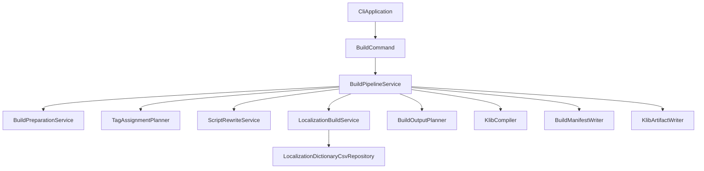
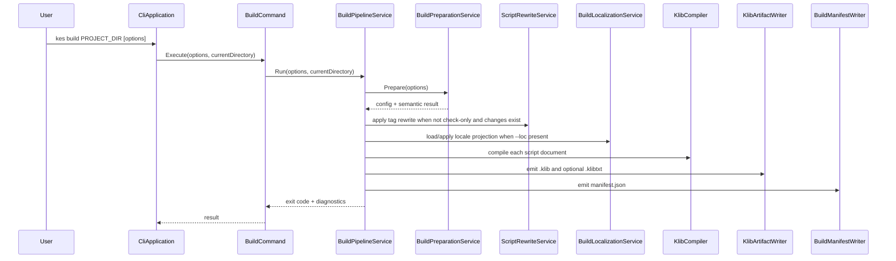

# Design Document

## Overview

この feature は、KES CLI 利用者が `kes build` だけで `.kc` / `.kel` の検証、必要なタグ補完、`.klib` / `.klibtxt` / `manifest.json` の生成まで完了できるようにする。対象利用者は CLI 上でビルドを回すシナリオ開発者と、後続の run / publish へつなぐビルド成果物を必要とする開発者である。

現在の実装は `build --check-only` を中心とした検証基盤と、基準言語 `.klib` の最小出力だけを持つ。そのため、公開仕様にある `--out-dir`、`--loc`、`--txt-il`、manifest、`kes correct` 相当の書き戻し連携が欠けている。本設計では既存の parsing / semantics / compilation / localization 境界を保ったまま、build orchestration を追加し、CLI 公開契約を満たす最小構成へ広げる。

### Goals

- `kes build` を公開仕様どおりの CLI 契約へ拡張する
- `kes correct` 相当の前処理、基準言語ビルド、言語別ビルド、補助成果物出力を一貫した build pipeline にまとめる
- run / publish が依存できる `manifest.json` を build 成果物として安定化する

### Non-Goals

- `unity` / `unreal` 向けターゲット実装
- `kes clean` / `kes run` / `kes publish` 自体の実装
- ローカライズ辞書テンプレート `.csv` の生成
- VM/runtime 側の locale 解決機構追加

## Boundary Commitments

### This Spec Owns

- `kes build` の CLI 入力契約と終了コード契約
- `kes correct` 相当の前処理を含む build orchestration
- `--check-only`、`--txt-il`、`--out-dir`、`--loc`、`--warnings-as-errors`、`--target windows` の実行意味
- `.klib`、`.klibtxt`、`manifest.json`、diagnostics を含む build 出力ツリー
- ローカライズ辞書 `.csv` の入力検証と compile-time 文字列適用

### Out of Boundary

- `kes loc` の辞書生成責務
- `unity` / `unreal` ターゲット向け成果物レイアウト
- runtime 実行、publish アーカイブ、clean 処理
- `.klib` 命令体系自体の拡張

### Allowed Dependencies

- `Commands`: `CliApplication`, `BuildCommand`, `BuildCheckOnlyCommand`, `DiagnosticSink`
- `Build`: `BuildPreparationService`, 新規 build orchestration / output planning service
- `Localization`: `TagAssignmentPlanner`, `ScriptRewriteService`, `LocalizationDictionaryCsvRepository`
- `Compilation`: `KlibCompiler`, `KlibArtifactWriter`, `KlibDocument`
- `ProjectSystem`: `ProjectConfig`, `ProjectConfigLoader`, `ProjectRootResolver`

### Revalidation Triggers

- `docs/spec/cli-tool-spec.md` の `kes build` オプションや成果物契約が変わる場合
- `docs/spec/k-intermediate-representation-spec.md` の manifest / `.klibtxt` / localized `.klib` 契約が変わる場合
- `kes correct` のタグ補完対象や命名規則が変わる場合
- ローカライズ辞書 `.csv` の必須列や言語タグ規則が変わる場合

## Architecture

### Existing Architecture Analysis

- 現状の `BuildCommand` は `BuildPreparationService`、`KlibCompiler`、`KlibArtifactWriter` を直列に呼び、基準言語 `.klib` を `build/<target>/...` へ出力する最小実装である。
- `BuildCheckOnlyCommand` は `BuildPreparationService` だけを使い、非破壊の diagnostics 契約をテストで固定している。
- `kes correct` と `kes loc` は command orchestration + service 分離のパターンを採っており、build でも同じ境界に合わせるのが自然である。

### Architecture Pattern & Boundary Map



**Architecture Integration**

- Selected pattern: 既存 CLI 拡張パターン。command は入口、service が orchestration と個別責務を持つ。
- Domain/feature boundaries: preparation、tag rewrite、localization apply、output planning、manifest emission を分離する。
- Existing patterns preserved: `CommandOptions` / `CommandResult`、`CliExitCode`、`DiagnosticSink`、service 主導 orchestration。
- New components rationale: build の公開契約が 1 クラスには収まらず、特に locale apply と output layout は独立検証が必要なため。
- Steering compliance: CLI 中心の単一アプリ構成を保ち、`Compilation` と `Localization` の責務を混線させない。

### Technology Stack

| Layer | Choice / Version | Role in Feature | Notes |
|-------|------------------|-----------------|-------|
| Frontend / CLI | C# / .NET 10 | `kes build` の引数受付と command dispatch | 既存 `CliApplication` を拡張 |
| Backend / Services | C# service classes | build orchestration、locale apply、manifest generation | 新規 service を追加 |
| Data / Storage | File system, XML, CSV, JSON | `kes.xml`、locale `.csv`、`manifest.json`、artifacts | 新規外部依存は追加しない |
| Infrastructure / Runtime | `.klib` / `.klibtxt` artifact pipeline | VM 向け成果物を出力 | 既存 `KlibArtifactWriter` を再利用 |

## File Structure Plan

### Directory Structure

```text
source/cli/KoromoEventScript.Cli/
├── Commands/
│   └── Build/
│       ├── BuildCommand.cs
│       ├── BuildCheckOnlyCommand.cs
│       └── BuildCommandOptions.cs
├── Build/
│   ├── BuildPreparationService.cs
│   ├── BuildPipelineService.cs
│   ├── BuildOutputPlanner.cs
│   ├── BuildLocalizationService.cs
│   ├── BuildManifestWriter.cs
│   └── BuildManifestDocument.cs
└── Localization/
    └── LocalizationDictionaryCsvRepository.cs
```

### Modified Files

- `source/cli/KoromoEventScript.Cli/Commands/CliApplication.cs` — `build` parse を公開仕様のオプションへ拡張し、`--out-dir` / `--loc` / `--no-incremental` / `--txt-il` / `--check-only` の整合を検証する
- `source/cli/KoromoEventScript.Cli/Commands/Build/BuildCommandOptions.cs` — build 実行に必要な option state を保持する
- `source/cli/KoromoEventScript.Cli/Commands/Build/BuildCommand.cs` — direct compilation から build pipeline 呼び出しへ置き換える
- `source/cli/KoromoEventScript.Cli/Commands/Build/BuildCheckOnlyCommand.cs` — build pipeline の validation-only 経路へ接続する
- `source/cli/KoromoEventScript.Cli/Build/BuildPreparationService.cs` — check-only / normal build 両経路から使える前処理結果を維持する
- `source/cli/KoromoEventScript.Cli/Compilation/KlibArtifactWriter.cs` — `manifest.json` 以外の `.klib` / `.klibtxt` 出力契約を維持し、必要なら出力呼び分けを補助する
- `tests/KoromoEventScript.Cli.Tests/Commands/CliApplicationTests.cs` — build option parse 契約の回帰テストを追加する
- `tests/KoromoEventScript.Cli.Tests/Commands/BuildCheckOnlyCommandTests.cs` — check-only の非破壊・diagnostics 契約に新オプション前提を加える

### New Files

- `source/cli/KoromoEventScript.Cli/Build/BuildPipelineService.cs` — build orchestration 全体を統括する
- `source/cli/KoromoEventScript.Cli/Build/BuildOutputPlanner.cs` — 基準言語 / locale 別の出力先パスを計画する
- `source/cli/KoromoEventScript.Cli/Build/BuildLocalizationService.cs` — `--loc` 時に locale `.csv` を読み込み、対象言語向け text projection を返す
- `source/cli/KoromoEventScript.Cli/Build/BuildManifestWriter.cs` — build 出力ツリーに対応する `manifest.json` を生成する
- `source/cli/KoromoEventScript.Cli/Build/BuildManifestDocument.cs` — manifest の最小 document model
- `tests/KoromoEventScript.Cli.Tests/Commands/BuildCommandTests.cs` — normal build、`--txt-il`、`--out-dir`、`--loc`、manifest 出力の integration test
- `tests/KoromoEventScript.Cli.Tests/Build/BuildLocalizationServiceTests.cs` — locale `.csv` 読込と対象言語 projection の unit test
- `tests/KoromoEventScript.Cli.Tests/Build/BuildManifestWriterTests.cs` — manifest 内容と出力位置の unit test
- `tests/KoromoEventScript.Cli.Tests/Build/BuildOutputPlannerTests.cs` — 基準言語 / locale 別パス決定の unit test

## System Flows



- `check-only` は `Pipe` 内で artifact generation より前に停止する。
- `--loc` 時だけ localized projection を挟み、compiler と artifact writer は通常 build と同じ契約を使う。

## Requirements Traceability

| Requirement | Summary | Components | Interfaces | Flows |
|-------------|---------|------------|------------|-------|
| 1.1 | `PROJECT_DIR` を対象に build を起動する | `CliApplication`, `BuildCommandOptions` | CLI parse contract | Sequence |
| 1.2 | `kes.xml` 探索で project root を解決する | `BuildPreparationService` | `BuildCommandOptions` | Sequence |
| 1.3 | `--entry` を entry `.kel` として扱う | `BuildPreparationService` | `BuildCommandOptions` | Sequence |
| 1.4 | `--out-dir` を成果物出力先に使う | `BuildOutputPlanner` | planner contract | Sequence |
| 1.5 | `--target windows` を受理する | `CliApplication`, `BuildCommandOptions` | CLI parse contract | なし |
| 1.6 | 非 windows target を拒否する | `CliApplication` | CLI parse contract | なし |
| 1.7 | `--txt-il` と `--check-only` の同時指定を拒否する | `CliApplication` | CLI parse contract | なし |
| 1.8 | 不正引数を command line error にする | `CliApplication`, `DiagnosticSink` | diagnostics contract | なし |
| 2.1 | `.kel` / `.kc` を解決して build 対象を確定する | `BuildPreparationService` | preparation contract | Sequence |
| 2.2 | semantic validation を行う | `BuildPreparationService` | diagnostics contract | Sequence |
| 2.3 | normal build 時に `kes correct` 相当を書き戻す | `BuildPipelineService`, `TagAssignmentPlanner`, `ScriptRewriteService` | pipeline contract | Sequence |
| 2.4 | check-only 時に書き戻さない | `BuildCheckOnlyCommand`, `BuildPipelineService` | pipeline contract | Sequence |
| 2.5 | syntax error を code 3 で返す | `BuildPreparationService`, `BuildPipelineService` | result contract | Sequence |
| 2.6 | compile diagnostics を code 4 で返す | `BuildPreparationService`, `BuildPipelineService` | result contract | Sequence |
| 2.7 | file I/O error を code 6 で返す | `BuildPreparationService`, `BuildPipelineService`, `BuildManifestWriter` | result contract | Sequence |
| 3.1 | `.klib` を生成する | `BuildPipelineService`, `KlibCompiler`, `KlibArtifactWriter` | artifact emission contract | Sequence |
| 3.2 | 基準言語 `.klib` の出力先を決める | `BuildOutputPlanner` | planner contract | Sequence |
| 3.3 | `--txt-il` 時に `.klibtxt` を出力する | `BuildPipelineService`, `KlibArtifactWriter` | artifact emission contract | Sequence |
| 3.4 | check-only では成果物を出さない | `BuildCheckOnlyCommand`, `BuildPipelineService` | pipeline contract | Sequence |
| 3.5 | manifest を含む build 出力を生成する | `BuildManifestWriter`, `BuildManifestDocument` | manifest contract | Sequence |
| 4.1 | `--loc` 時に locale `.csv` を検証する | `BuildLocalizationService`, `LocalizationDictionaryCsvRepository` | locale input contract | Sequence |
| 4.2 | locale `.csv` 不在を file error にする | `BuildLocalizationService` | locale input contract | Sequence |
| 4.3 | locale 列不在を失敗として止める | `BuildLocalizationService` | locale input contract | Sequence |
| 4.4 | compile-time に localized `.klib` を生成する | `BuildLocalizationService`, `KlibCompiler` | localized projection contract | Sequence |
| 4.5 | locale 別出力先へ `.klib` を配置する | `BuildOutputPlanner`, `KlibArtifactWriter` | planner contract | Sequence |
| 4.6 | locale build でも `.klibtxt` を出力する | `BuildPipelineService`, `KlibArtifactWriter` | artifact emission contract | Sequence |
| 4.7 | `--loc` なしを基準言語 build として扱う | `BuildOutputPlanner` | planner contract | Sequence |
| 5.1 | success code 0 を返す | `BuildCommandResult`, `BuildCheckOnlyResult` | result contract | なし |
| 5.2 | warning-only check-only でも成功する | `BuildCheckOnlyCommand`, `WarningPolicy` | diagnostics contract | なし |
| 5.3 | warnings-as-errors を code 9 にする | `BuildPreparationService`, `WarningPolicy` | diagnostics contract | なし |
| 5.4 | JSON Lines diagnostics を出力する | `CliApplication`, `DiagnosticSink` | diagnostics contract | なし |
| 5.5 | text diagnostics を出力する | `CliApplication`, `DiagnosticSink` | diagnostics contract | なし |
| 5.6 | success 時に error diagnostics を出さない | `CliApplication`, `DiagnosticSink` | diagnostics contract | なし |

## Components and Interfaces

| Component | Domain/Layer | Intent | Req Coverage | Key Dependencies (P0/P1) | Contracts |
|-----------|--------------|--------|--------------|--------------------------|-----------|
| `CliApplication` build parse | Commands | build option の正規化と command line validation | 1.1, 1.4, 1.5, 1.6, 1.7, 1.8, 5.4, 5.5 | `BuildCommand` (P0), `BuildCheckOnlyCommand` (P0), `DiagnosticSink` (P0) | Service |
| `BuildCommand` / `BuildCheckOnlyCommand` | Commands | normal build と validation-only build の入口 | 2.3, 2.4, 5.1, 5.2 | `BuildPipelineService` (P0) | Service |
| `BuildPipelineService` | Build | build 全体の orchestration | 2.3, 2.4, 3.1, 3.3, 3.4, 4.4, 4.6 | `BuildPreparationService` (P0), `ScriptRewriteService` (P0), `BuildLocalizationService` (P0), `KlibCompiler` (P0), `BuildManifestWriter` (P0), `KlibArtifactWriter` (P0) | Service, State |
| `BuildOutputPlanner` | Build | 基準言語 / locale 別の出力先決定 | 1.4, 3.2, 4.5, 4.7 | `ProjectConfig` (P0) | Service |
| `BuildLocalizationService` | Build | locale `.csv` 読込と localized text projection | 4.1, 4.2, 4.3, 4.4 | `LocalizationDictionaryCsvRepository` (P0) | Service |
| `BuildManifestWriter` | Build | `manifest.json` の生成と保存 | 3.5, 2.7 | file system (P0), `BuildManifestDocument` (P0) | Service |

### Commands

#### BuildCommand / BuildCheckOnlyCommand

| Field | Detail |
|-------|--------|
| Intent | `kes build` の CLI 境界として build 実行モードを切り替える |
| Requirements | 2.3, 2.4, 5.1, 5.2 |

**Responsibilities & Constraints**

- `BuildCommand` は normal build を、`BuildCheckOnlyCommand` は validation-only build を起動する
- diagnostics 出力形式そのものは持たず、`CliApplication` に結果を返す
- command 自身は `.klib` / `.csv` / manifest の詳細構築を持たない

**Dependencies**

- Inbound: `CliApplication` — parse 済み option を受け取る (P0)
- Outbound: `BuildPipelineService` — build pipeline 実行 (P0)

**Contracts**: Service [x] / API [ ] / Event [ ] / Batch [ ] / State [ ]

##### Service Interface

```csharp
public sealed record BuildCommandOptions(
    string? ProjectDirectory,
    DiagnosticOutputFormat OutputFormat,
    bool WarningsAsErrors,
    string? EntryPath,
    bool CheckOnly,
    bool EmitTextIr,
    string Target,
    string? OutputDirectory,
    string? Locale,
    bool NoIncremental);

public sealed class BuildCommand
{
    public BuildCommandResult Execute(BuildCommandOptions options, string currentDirectory);
}

public sealed class BuildCheckOnlyCommand
{
    public BuildCheckOnlyResult Execute(BuildCommandOptions options, string currentDirectory);
}
```

- Preconditions:
  - `options` は parse 済みで、command line invalid state を含まない
  - `currentDirectory` は空でない
- Postconditions:
  - success 時は `ExitCode == Success`
  - failure 時は artifact emission 前に停止する
- Invariants:
  - diagnostics format は `DiagnosticSink` が一元的に扱う

**Implementation Notes**

- Integration: `BuildCheckOnlyCommand` も同じ pipeline を使い、artifact emission gate のみ異なる
- Validation: `--check-only` + `--txt-il` は command 到達前に拒否する
- Risks: command ごとにロジック分岐を増やさない

### Build

#### BuildPipelineService

| Field | Detail |
|-------|--------|
| Intent | build の前処理、locale 適用、コンパイル、成果物書き出しを統括する |
| Requirements | 2.3, 2.4, 3.1, 3.3, 3.4, 4.4, 4.6 |

**Responsibilities & Constraints**

- `BuildPreparationService` で解析済み document 群を取得する
- normal build では tag plan を計算し、必要時のみ `.kc` へ書き戻す
- locale 指定時は localized text projection を作り、compiler 入力として使う
- check-only では artifact emission と rewrite を抑止する
- success 時のみ `BuildManifestWriter` へ制御を渡す

**Dependencies**

- Inbound: `BuildCommand`, `BuildCheckOnlyCommand` — build mode の入口 (P0)
- Outbound: `BuildPreparationService` — project + semantic preparation (P0)
- Outbound: `TagAssignmentPlanner` — rewrite plan 生成 (P0)
- Outbound: `ScriptRewriteService` — source rewrite (P0)
- Outbound: `BuildLocalizationService` — localized projection (P0)
- Outbound: `BuildOutputPlanner` — artifact path 決定 (P0)
- Outbound: `KlibCompiler` — `.klib` logical document 生成 (P0)
- Outbound: `KlibArtifactWriter` — `.klib` / `.klibtxt` 出力 (P0)
- Outbound: `BuildManifestWriter` — manifest 生成 (P0)

**Contracts**: Service [x] / API [ ] / Event [ ] / Batch [ ] / State [x]

##### Service Interface

```csharp
public sealed record BuildPipelineRequest(
    BuildCommandOptions Options,
    string CurrentDirectory,
    bool ValidateOnly);

public sealed record BuildPipelineResult(
    CliExitCode ExitCode,
    IReadOnlyList<Diagnostic> Diagnostics,
    BuildManifestDocument? Manifest);

public sealed class BuildPipelineService
{
    public BuildPipelineResult Run(BuildPipelineRequest request);
}
```

- Preconditions:
  - `ValidateOnly` が true のとき artifact emission を試みない
- Postconditions:
  - success かつ `ValidateOnly == false` のとき manifest まで永続化済み
  - failure 時は後続 artifact を部分成功扱いしない
- Invariants:
  - compiler は常に document 単位で呼び出す
  - localized build でも output planner のみが出力先を決定する

**State Management**

- State model:
  - prepared documents
  - optional tag assignment plan
  - optional localized projection
  - output artifact descriptors
- Persistence & consistency:
  - rewrite 成功後に compile へ進む
  - manifest は最後に書き出す
- Concurrency strategy:
  - 初期実装は逐次 build
  - parallel compile は out of boundary

**Implementation Notes**

- Integration: `LocCommand` と同じ rewrite 連携を再利用する
- Validation: locale 指定時だけ CSV repository を通す
- Risks: partial artifact emission を避けるため manifest は最後に書く

#### BuildOutputPlanner

| Field | Detail |
|-------|--------|
| Intent | 基準言語と locale 別の artifact 出力先を一元決定する |
| Requirements | 1.4, 3.2, 4.5, 4.7 |

**Responsibilities & Constraints**

- `--out-dir` 指定時は project 設定より優先する
- 基準言語 build は `events/` 配下、locale build は `events/loc/<tag>/` 配下を返す
- `.klibtxt`、manifest、diagnostics の相対位置も同じ planner から導く

**Dependencies**

- Inbound: `BuildPipelineService` — artifact path 決定要求 (P0)
- External: `ProjectConfig` — `BuildPath` と project root (P0)

**Contracts**: Service [x] / API [ ] / Event [ ] / Batch [ ] / State [ ]

##### Service Interface

```csharp
public sealed record BuildArtifactPaths(
    string KlibPath,
    string? KlibTextPath,
    string ManifestPath);

public sealed class BuildOutputPlanner
{
    public BuildArtifactPaths Resolve(ProjectConfig config, BuildCommandOptions options, string projectRelativeScriptPath);
}
```

- Preconditions:
  - `projectRelativeScriptPath` は `.kc` の project-relative path
- Postconditions:
  - locale build では `loc/<language-tag>/` が path に含まれる
- Invariants:
  - path 決定ロジックは command や writer に分散しない

**Implementation Notes**

- Integration: `.klib` と `.klibtxt` の base path を共有する
- Validation: invalid locale tag は parse 済み前提
- Risks: `--out-dir` と project-relative path の連結規則を固定して回帰テストを置く

#### BuildLocalizationService

| Field | Detail |
|-------|--------|
| Intent | locale `.csv` を入力として対象言語向け source text を解決する |
| Requirements | 4.1, 4.2, 4.3, 4.4 |

**Responsibilities & Constraints**

- `--loc` 指定時だけ locale `.csv` を読み込む
- 指定言語列の存在を検証する
- `say` / `nar` / `select-case` の tag をキーに localized text を引く
- 手動追加 tag や欠損翻訳の扱いを diagnostics として返す

**Dependencies**

- Inbound: `BuildPipelineService` — localized projection 要求 (P0)
- Outbound: `LocalizationDictionaryCsvRepository` — locale `.csv` 読込 (P0)

**Contracts**: Service [x] / API [ ] / Event [ ] / Batch [ ] / State [ ]

##### Service Interface

```csharp
public sealed record LocalizedBuildProjection(
    IReadOnlyList<ScriptDocument> Documents,
    IReadOnlyList<Diagnostic> Diagnostics);

public sealed class BuildLocalizationService
{
    public LocalizedBuildProjection Resolve(ProjectConfig config, IReadOnlyList<ScriptDocument> documents, string localeTag);
}
```

- Preconditions:
  - `localeTag` は parse 済みの単一言語タグ
- Postconditions:
  - success 時は compiler 入力に使える text-resolved documents を返す
- Invariants:
  - `.csv` の schema validation は repository の責務を再利用する

**Implementation Notes**

- Integration: `LocalizationTextExtractor` と同じ tag semantics を使う
- Validation: locale 列欠損、required tag 欠損は build failure として返す
- Risks: source mapping と本文差し替え位置の乖離を避ける

#### BuildManifestWriter

| Field | Detail |
|-------|--------|
| Intent | build 出力に対応した最小 `manifest.json` を生成する |
| Requirements | 3.5, 2.7 |

**Responsibilities & Constraints**

- 生成 `.klib` / `.klibtxt` の相対パス、入力 `.kc` / `.kel`、locale 情報、CLI version を含む
- build 成果物全体の最後に書き出す
- file I/O failure は build failure として返す

**Dependencies**

- Inbound: `BuildPipelineService` — artifact summary を受ける (P0)
- External: file system — manifest 保存 (P0)

**Contracts**: Service [x] / API [ ] / Event [ ] / Batch [ ] / State [x]

##### State Management

- State model:
  - scripts list
  - localized variant list
  - entry `.kel`
  - CLI version / target
- Persistence & consistency:
  - `manifest.json` は artifact path が全て確定した後に 1 回だけ保存する

**Implementation Notes**

- Integration: run / publish が読める最小 schema に留める
- Validation: path は project root からの相対形式で保持する
- Risks: schema を広げすぎず、必要最小限を保つ

## Data Models

### Domain Model

- `BuildCommandOptions`
  - build 実行時の option state
  - `ProjectDirectory`, `EntryPath`, `Target`, `OutputDirectory`, `Locale`, `CheckOnly`, `EmitTextIr`, `WarningsAsErrors`, `NoIncremental`
- `BuildArtifactPaths`
  - 1 script ごとの `.klib` / `.klibtxt` / manifest 連携 path
- `BuildManifestDocument`
  - build 出力全体の scripts、localized variants、entry 情報を持つ
- `LocalizedBuildProjection`
  - locale 適用済みの compile input documents

### Logical Data Model

| Entity | Key | Attributes | Rules |
|--------|-----|------------|-------|
| `BuildCommandOptions` | なし | target, locale, output paths, flags | parse 済みの valid state のみ保持 |
| `BuildArtifactPaths` | script path | klib path, txt path, locale path | planner が唯一の生成元 |
| `BuildManifestDocument` | target + entry | scripts, variants, metadata | success build 時のみ永続化 |

**Consistency & Integrity**

- manifest は build output tree と一致しなければならない
- locale build の path は locale tag と 1:1 に対応する
- `check-only` 時は `BuildManifestDocument` を永続化しない

### Data Contracts & Integration

**API Data Transfer**

- 外部 API はなし

**Cross-Service Data Management**

- `LocalizationDictionaryCsvRepository` から得た locale document を `BuildLocalizationService` が compile input へ投影する
- `BuildManifestWriter` は build pipeline の結果だけを受け取り、source `.csv` を直接読まない

## Error Handling

### Error Strategy

- command line invalid state は parse 段階で停止する
- syntax / compile / file I/O の順で早い段階の failure code を優先する
- locale build 失敗は基準言語 build 成功へフォールバックせず、指定 build 全体を失敗にする

### Error Categories and Responses

- **User Errors**: 不正オプション、未対応ターゲット、`--txt-il` + `--check-only`。`KES9001` と exit code `2`
- **Syntax Errors**: `.kel` / `.kc` parse failure。exit code `3`
- **Compile Errors**: name/type/import/tag/locale semantic failure。exit code `4`
- **File Errors**: `kes.xml`、input script、locale `.csv`、artifact path、manifest 保存失敗。exit code `6`

### Monitoring

- diagnostics は既存 `DiagnosticSink` を唯一の観測面とする
- build success path では標準出力メッセージは必須ではなく、artifact tree が成果物となる

## Testing Strategy

### Unit Tests

- `BuildOutputPlannerTests`: `--out-dir` あり / なし、基準言語 / locale build の path 決定を検証する
- `BuildLocalizationServiceTests`: locale `.csv` 不在、locale 列不在、対象 tag の localized text 差し替えを検証する
- `BuildManifestWriterTests`: 基準言語 build と locale build の manifest scripts / variants 情報を検証する

### Integration Tests

- `BuildCommandTests`: normal build が `.klib` を出力し、`manifest.json` を含むことを検証する
- `BuildCommandTests`: `--txt-il` 指定時に `.klibtxt` も生成されることを検証する
- `BuildCommandTests`: `--out-dir` 指定時に project 設定ではなく明示出力先へ出ることを検証する
- `BuildCommandTests`: `--loc en` で `events/loc/en/` 配下に localized `.klib` が出ることを検証する
- `BuildCommandTests`: locale `.csv` 欠損や locale 列欠損で失敗し、artifact を成功扱いしないことを検証する

### E2E / CLI Tests

- `CliApplicationTests`: `build` が `--out-dir`、`--loc`、`--no-incremental` を parse し、invalid combinations を拒否することを検証する
- `BuildCheckOnlyCommandTests`: `check-only` 時に `.kc` 書き戻しも artifact 生成も行われないことを検証する
- `BuildCheckOnlyCommandTests`: warnings-as-errors、JSON diagnostics、syntax / compile / file exit code 契約を維持することを検証する

## Supporting References

- 詳細な discovery と意思決定ログは `research.md` を参照する
