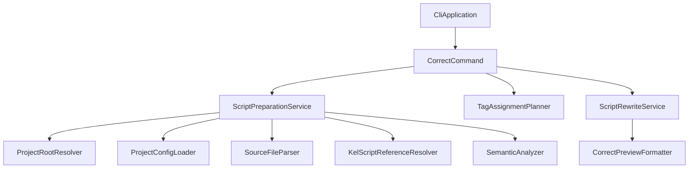
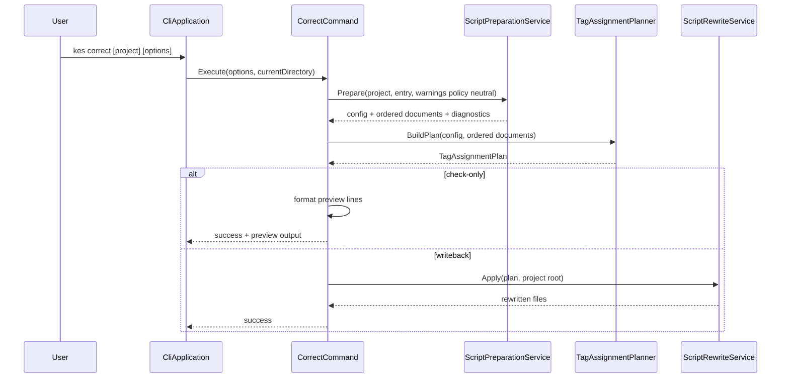

# Design Document

## Overview

この feature は、CLI 利用者が `kes correct` を実行したときに、entry `.kel` から参照される `.kc` を解析し、不足しているローカライズタグを公開仕様の規則で自動採番して `.kc` へ書き戻せるようにする。対象は `say`、`nar`、`select` のみであり、辞書生成や `.klib` ビルドは含めない。

本設計は既存 CLI の parse/semantic パイプラインを再利用しつつ、`kes correct` 固有の責務を「タグ補完計画」「局所書き戻し」「check-only 出力」に分離する。これにより、次段の `kes build` からも同じタグ補完境界を呼び出しやすくする。

### Goals

- `kes correct` を既存 CLI に追加する
- project / entry / `.kc` 解決と semantic 解析を既存 build と整合する形で再利用する
- 公開仕様どおりの自動採番規則と衝突回避規則を実装可能な境界に分ける
- `--check-only` と実書き戻しを同じ補完計画から分岐できるようにする

### Non-Goals

- `.csv` ローカライズ辞書の生成
- `.klib` / `.klibtxt` の生成
- DSL 全体の formatter 実装
- `select` 自体の tag 構文追加や parser 拡張

## Boundary Commitments

### This Spec Owns

- `kes correct` コマンドの CLI 入口、option 解析、結果出力
- entry `.kel` から到達可能な `.kc` のみに対する自動タグ補完
- `say` / `nar` / `select` の不足タグ判定、採番、衝突回避
- `.kc` への局所書き戻しと `--check-only` の差分出力

### Out of Boundary

- `kes build` への自動補完組み込み
- ローカライズ辞書テンプレート出力
- 既存手動タグの強制リネームや全面再採番
- `label` / `jump` / `case` ジャンプ先タグの補完

### Allowed Dependencies

- `ProjectSystem` の project root / config 解決
- `Build` 層の `.kel` / `.kc` parse 補助
- `Parsing` の AST / source location
- `Semantics` の import 解決と semantic diagnostics
- `Diagnostics` の標準出力形式

### Revalidation Triggers

- `kes correct` の公開 option 形状が変わる
- タグ命名規則、採番規則、衝突回避規則が変わる
- `ScriptDocument` / `SourceLocation` の表現が変わる
- build が共通準備サービスへ依存する前提が変わる

## Architecture

### Existing Architecture Analysis

- 既存 CLI は `CliApplication` がコマンド文字列を手動解析し、`build` / `init` を専用 command へ委譲する。
- build 系は `BuildPreparationService` が project root 解決、`kes.xml` load、entry `.kel` parse、参照 `.kc` parse、semantic 解析を一括で担う。
- AST は `say` / `nar` / `select` / `case` のタグ情報を保持するが、タグ補完や書き戻し専用の層は存在しない。

### Architecture Pattern & Boundary Map

**Architecture Integration**:

- Selected pattern: 既存 CLI レイヤに沿った command + service + text rewrite の拡張
- Domain/feature boundaries: CLI 入口、script 準備、タグ補完計画、書き戻しを明確に分離する
- Existing patterns preserved: `CliApplication` での手動 parse、`ProjectSystem` / `Build` / `Parsing` / `Semantics` の依存方向
- New components rationale: `kes correct` は build と異なり artifact ではなく source 書き戻しを主責務とするため、専用の plan / rewrite 層が必要
- Steering compliance: .NET/C# 既存スタックを維持し、新規依存は追加しない



### Technology Stack

| Layer | Choice / Version | Role in Feature | Notes |
|-------|------------------|-----------------|-------|
| Frontend / CLI | C# / .NET 10 | `kes correct` command parsing and dispatch | 既存 CLI 入口を拡張 |
| Backend / Services | Existing `Build` + `Semantics` services | project/script preparation and diagnostics | 新規依存なし |
| Data / Storage | File system `.kc` source files | source read/write target | build artifact storage は対象外 |
| Messaging / Events | None | Not used | |
| Infrastructure / Runtime | NUnit test infrastructure | command/integration verification | `TemporaryProject` を再利用 |

## File Structure Plan

### Directory Structure

```text
source/cli/KoromoEventScript.Cli/
├── Commands/
│   ├── CliApplication.cs
│   └── Correct/
│       ├── CorrectCommand.cs
│       ├── CorrectCommandOptions.cs
│       └── CorrectCommandResult.cs
├── Build/
│   ├── BuildPreparationService.cs
│   ├── KelScriptReferenceResolver.cs
│   ├── SourceFileParser.cs
│   ├── ScriptPreparationRequest.cs
│   ├── ScriptPreparationResult.cs
│   └── ScriptPreparationService.cs
└── Localization/
    ├── AutoTagPattern.cs
    ├── TagAssignmentCandidate.cs
    ├── TagAssignmentPlan.cs
    ├── TagAssignmentPlanner.cs
    ├── SourceTextEdit.cs
    ├── ScriptRewriteResult.cs
    ├── ScriptRewriteService.cs
    └── CorrectPreviewFormatter.cs
```

### Modified Files

- `source/cli/KoromoEventScript.Cli/Commands/CliApplication.cs` — `correct` コマンドの parse/dispatch を追加し、requirements 1, 4, 5 の入口を担う
- `source/cli/KoromoEventScript.Cli/Commands/Build/BuildCommand.cs` — build が抽出後の共通 `ScriptPreparationService` を利用するよう調整する
- `source/cli/KoromoEventScript.Cli/Commands/Build/BuildCheckOnlyCommand.cs` — 同上
- `source/cli/KoromoEventScript.Cli/Build/BuildPreparationService.cs` — build 固有 wrapper 化または共通準備サービスへの委譲に縮退する
- `tests/KoromoEventScript.Cli.Tests/Commands/CliApplicationTests.cs` — `correct` parse/dispatch を追加検証する
- `tests/KoromoEventScript.Cli.Tests/Commands/CorrectCommandTests.cs` — command の成功/失敗/`--check-only` を検証する
- `tests/KoromoEventScript.Cli.Tests/Build/ScriptPreparationServiceTests.cs` — 共通準備サービス抽出後の project/script 解決を固定する
- `tests/KoromoEventScript.Cli.Tests/Localization/TagAssignmentPlannerTests.cs` — 採番規則、共有連番、衝突回避を検証する
- `tests/KoromoEventScript.Cli.Tests/Localization/ScriptRewriteServiceTests.cs` — 局所書き戻しとファイル不変性を検証する

## System Flows



Key Decisions:

- semantic 解析が失敗した場合、plan 生成へ進まない
- `--check-only` でも補完計画は同一で、最後の永続化だけ抑止する
- 同一ファイルの複数編集は offset 降順適用で整合を保つ

## Requirements Traceability

| Requirement | Summary | Components | Interfaces | Flows |
|-------------|---------|------------|------------|-------|
| 1.1-1.5 | `kes correct` の project / entry 解決と CLI エラー | `CliApplication`, `CorrectCommand`, `ScriptPreparationService` | `CorrectCommandOptions`, `ScriptPreparationRequest` | `kes correct` 実行フロー |
| 2.1-2.4 | entry から参照される `.kc` の解析と semantic 失敗時停止 | `ScriptPreparationService` | `ScriptPreparationResult` | `kes correct` 実行フロー |
| 3.1-3.9 | 対象構文、命名、共有連番、衝突回避 | `TagAssignmentPlanner`, `AutoTagPattern` | `TagAssignmentCandidate`, `TagAssignmentPlan` | `kes correct` 実行フロー |
| 4.1-4.4 | 実書き戻しと `--check-only` の分岐 | `CorrectCommand`, `ScriptRewriteService`, `CorrectPreviewFormatter` | `ScriptRewriteResult` | `kes correct` 実行フロー |
| 5.1-5.6 | 診断形式と終了コード | `CorrectCommand`, `CliApplication` | `CorrectCommandResult` | `kes correct` 実行フロー |

## Components and Interfaces

| Component | Domain/Layer | Intent | Req Coverage | Key Dependencies (P0/P1) | Contracts |
|-----------|--------------|--------|--------------|--------------------------|-----------|
| `CliApplication` | CLI | `correct` コマンド文字列を parse/dispatch する | 1.1-1.5, 5.1-5.6 | `CorrectCommand` (P0) | Service |
| `CorrectCommand` | Commands | `kes correct` のユースケース全体を調停する | 1.1-5.6 | `ScriptPreparationService` (P0), `TagAssignmentPlanner` (P0), `ScriptRewriteService` (P0) | Service |
| `ScriptPreparationService` | Build | project/script/semantic 準備を共通化する | 1.1-2.4 | `ProjectRootResolver` (P0), `ProjectConfigLoader` (P0), `SourceFileParser` (P0), `SemanticAnalyzer` (P0) | Service, State |
| `TagAssignmentPlanner` | Localization | AST からタグ補完計画を生成する | 3.1-3.9, 4.4 | `ScriptDocument` (P0), `AutoTagPattern` (P0) | Service, State |
| `ScriptRewriteService` | Localization | 補完計画を `.kc` テキストへ局所適用する | 4.1-4.4 | `TagAssignmentPlan` (P0) | Service, State |
| `CorrectPreviewFormatter` | Localization | `--check-only` 向けの予定タグ一覧を整形する | 4.2, 5.6 | `TagAssignmentPlan` (P1) | Service |

### Commands

#### CorrectCommand

| Field | Detail |
|-------|--------|
| Intent | `kes correct` の parse 済み options を受け取り、解析・採番・書き戻しを調停する |
| Requirements | 1.1, 1.2, 1.3, 1.4, 1.5, 4.1, 4.2, 4.3, 4.4, 5.1, 5.2, 5.3, 5.4, 5.5, 5.6 |

**Responsibilities & Constraints**

- `PROJECT_DIR` / `--entry` / `--check-only` を受け取り、共通準備サービスを呼ぶ
- semantic エラーがある場合は plan 生成へ進まない
- `--check-only` と実書き戻しの分岐だけを持ち、採番ロジック自体は保持しない

**Dependencies**

- Inbound: `CliApplication` — parse 済み command 呼び出し (P0)
- Outbound: `ScriptPreparationService` — project/script 解析 (P0)
- Outbound: `TagAssignmentPlanner` — 採番計画生成 (P0)
- Outbound: `ScriptRewriteService` — 書き戻し適用 (P0)
- Outbound: `CorrectPreviewFormatter` — preview 文面整形 (P1)

**Contracts**: Service [x] / API [ ] / Event [ ] / Batch [ ] / State [ ]

##### Service Interface

```csharp
public sealed class CorrectCommand
{
    public CorrectCommandResult Execute(CorrectCommandOptions options, string currentDirectory);
}
```

- Preconditions:
  - `options` と `currentDirectory` は null/empty でない
- Postconditions:
  - 成功時は preview 出力または書き戻し結果を返す
  - 失敗時は diagnostics と終了コードを返す
- Invariants:
  - `--check-only` ではファイルを書き換えない

**Implementation Notes**

- Integration: `CliApplication` から build/init と同列で呼び出される
- Validation: exit code と diagnostics を既存 `DiagnosticSink` へそのまま流せる形で返す
- Risks: command 層へ採番詳細を漏らさない

#### ScriptPreparationService

| Field | Detail |
|-------|--------|
| Intent | build/correct 共通の project root 解決、config load、entry/script parse、semantic 解析を返す |
| Requirements | 1.1, 1.2, 1.3, 1.5, 2.1, 2.2, 2.3, 2.4 |

**Responsibilities & Constraints**

- build 固有 options から切り離した request/result 型で前段解析を共通化する
- `OrderedDocuments`、`ProjectConfig`、diagnostics をまとめて返す
- warning policy は request で切り替えるが、`correct` では neutral に扱う

**Dependencies**

- Inbound: `CorrectCommand`, `BuildCommand`, `BuildCheckOnlyCommand` — 準備要求 (P0)
- Outbound: `ProjectRootResolver` — project 解決 (P0)
- Outbound: `ProjectConfigLoader` — `kes.xml` load (P0)
- Outbound: `SourceFileParser` — `.kel` / `.kc` parse (P0)
- Outbound: `KelScriptReferenceResolver` — chapter 解決 (P0)
- Outbound: `SemanticAnalyzer` — import/name/type/warning 解析 (P0)

**Contracts**: Service [x] / API [ ] / Event [ ] / Batch [ ] / State [x]

##### Service Interface

```csharp
public sealed class ScriptPreparationService
{
    public ScriptPreparationResult Prepare(ScriptPreparationRequest request, string currentDirectory);
}
```

- Preconditions:
  - request は project path と output-independent な解析条件を持つ
- Postconditions:
  - 成功時は `ProjectConfig` と `SemanticAnalysisResult` を返す
  - 失敗時は最初の failure category に整合する `CliExitCode` を返す
- Invariants:
  - project relative path は `/` 正規化済みで返す

**Implementation Notes**

- Integration: 既存 `BuildPreparationService` の責務を吸収し、build 側は薄い adapter に縮退させる
- Validation: 既存 build/check-only テストで回帰検知する
- Risks: warning policy と `--entry` 差し替えを request 側へきちんと移す

### Localization

#### TagAssignmentPlanner

| Field | Detail |
|-------|--------|
| Intent | `ScriptDocument` 群から不足タグと採番結果を `TagAssignmentPlan` として生成する |
| Requirements | 3.1, 3.2, 3.3, 3.4, 3.5, 3.6, 3.7, 3.8, 3.9, 4.4 |

**Responsibilities & Constraints**

- 対象は `SayStatementSyntax`、`NarStatementSyntax`、`SelectStatementSyntax` のみ
- 自動採番パターンに一致する既存タグだけを予約集合へ取り込む
- ファイル単位で共有番号空間を持ち、出現順で計画を作る

**Dependencies**

- Inbound: `CorrectCommand` — semantic 済み documents (P0)
- Outbound: `AutoTagPattern` — tag 形式の構築と解析 (P0)
- Outbound: `ScriptDocument` — AST 列挙 (P0)

**Contracts**: Service [x] / API [ ] / Event [ ] / Batch [ ] / State [x]

##### Service Interface

```csharp
public sealed class TagAssignmentPlanner
{
    public TagAssignmentPlan BuildPlan(ProjectConfig config, IReadOnlyList<ScriptDocument> orderedDocuments);
}
```

- Preconditions:
  - documents は semantic 済みで project relative path を持つ
- Postconditions:
  - 各ファイルの追加タグ候補と preview 情報を返す
- Invariants:
  - 同一ファイル内で番号重複を返さない

**Implementation Notes**

- Integration: `kes loc` / `kes build` からも再利用可能な plan 生成境界として維持する
- Validation: 共有連番、既存 `sy_*` 衝突、`9999` 超過をユニットテストで固定する
- Risks: AST 走査順と source 出現順がずれると採番結果が不安定になる

#### ScriptRewriteService

| Field | Detail |
|-------|--------|
| Intent | `TagAssignmentPlan` を用いて元 `.kc` テキストへ局所編集を適用する |
| Requirements | 4.1, 4.3, 4.4 |

**Responsibilities & Constraints**

- 元ファイルを読み込み、指定 offset へ tag token を挿入する
- 複数変更を含む同一ファイルでは offset 降順適用で整合を保つ
- preview モードでは書き込まない

**Dependencies**

- Inbound: `CorrectCommand` — apply 要求 (P0)
- Inbound: `TagAssignmentPlan` — 編集計画 (P0)
- External: file system — `.kc` read/write (P0)

**Contracts**: Service [x] / API [ ] / Event [ ] / Batch [ ] / State [x]

##### Service Interface

```csharp
public sealed class ScriptRewriteService
{
    public ScriptRewriteResult Apply(ProjectConfig config, TagAssignmentPlan plan);
}
```

- Preconditions:
  - plan の各 candidate は source location と project relative path を持つ
- Postconditions:
  - 成功時は書き換え対象ファイル一覧を返す
  - 失敗時は file I/O diagnostics を返す
- Invariants:
  - 指定されていないファイルは変更しない

**Implementation Notes**

- Integration: `.kc` の全文 pretty-print は行わず、局所編集に限定する
- Validation: 既存ファイル snapshot 比較で不要差分がないことを確認する
- Risks: source location から offset への変換ミス

## Data Models

### Domain Model

- `ScriptPreparationRequest`: project directory、entry override、warning policy などの解析条件
- `ScriptPreparationResult`: `ProjectConfig`、`SemanticAnalysisResult`、`CliExitCode`、diagnostics
- `TagAssignmentCandidate`: file path、kind (`say` / `nar` / `select`)、source location、generated tag、preview text
- `TagAssignmentPlan`: file ごとの candidate 集合と summary
- `SourceTextEdit`: offset、inserted text、reason
- `ScriptRewriteResult`: changed files、diagnostics

### Logical Data Model

- `TagAssignmentPlan` は file 単位の aggregate として扱う
- file 内の candidate 順序は source 出現順で保持し、rewrite 時には offset 降順へ変換する
- `AutoTagPattern` は `prefix`, `normalizedFileName`, `number` を分解可能な value object とする

## Error Handling

### Error Strategy

- project/config/file 解決失敗は前段で即時停止する
- parse/semantic 失敗時は補完計画を生成しない
- writeback 時の file I/O 失敗はその invocation 全体を失敗扱いにする

### Error Categories and Responses

- Command line: 未知 option、重複 project 指定、`--entry` 値欠落
- File / directory: `kes.xml` 未検出、entry `.kel` 未検出、`.kc` read/write 失敗
- Syntax / compile: `.kel` / `.kc` parse 失敗、import/name/type diagnostics

### Monitoring

- 追加の telemetry は持たず、既存 `DiagnosticSink` へ標準 diagnostics を流す

## Testing Strategy

### Unit Tests

- `TagAssignmentPlannerTests` で `say` / `nar` / `select` それぞれの prefix 生成を確認する
- 同一 `.kc` 内で `say` → `nar` → `select` が `0001` → `0002` → `0003` になることを確認する
- 既存の自動採番タグと衝突する場合に次番号へ回避することを確認する
- 自動採番パターンに一致しない手動タグを予約集合に含めないことを確認する

### Integration Tests

- `ScriptPreparationServiceTests` で project root 解決、entry `.kel` 解決、chapter `.kc` 解決が build と同等に成功することを確認する
- `ScriptRewriteServiceTests` で不足タグだけが挿入され、既存タグと無関係な本文が保持されることを確認する
- 複数ファイル・複数挿入時に file ごとの変更が安定して適用されることを確認する

### E2E / CLI Tests

- `CliApplicationTests` で `correct` コマンドが parse/dispatch されることを確認する
- `CorrectCommandTests` で `kes correct` 成功時に `.kc` が更新されることを確認する
- `CorrectCommandTests` で `kes correct --check-only` がファイルを変更せず、予定タグ一覧のみを返すことを確認する
- semantic エラーを含む project で `kes correct` が非 0 を返し、書き戻ししないことを確認する

## Supporting References (Optional)

- なし
