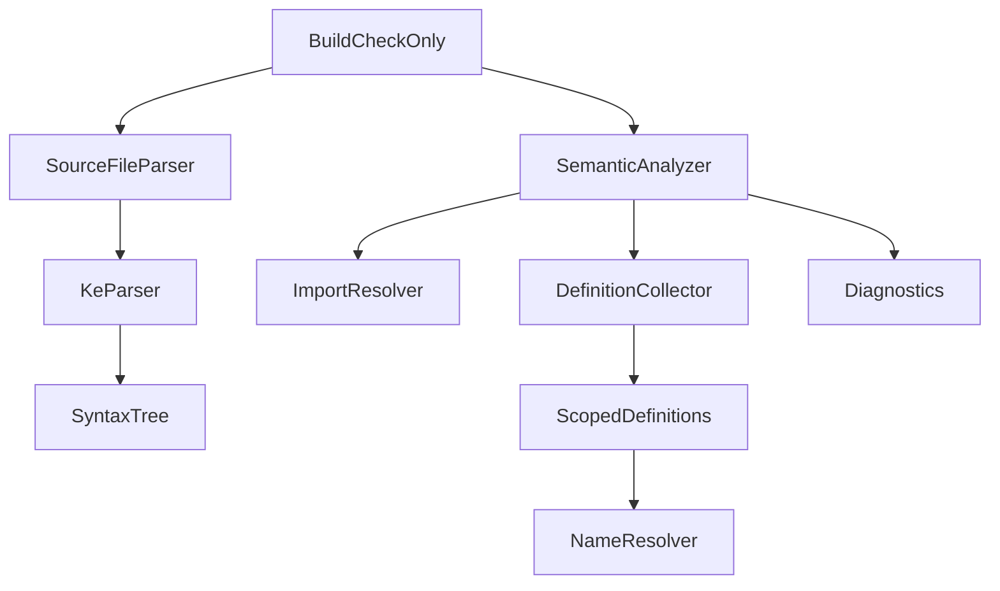
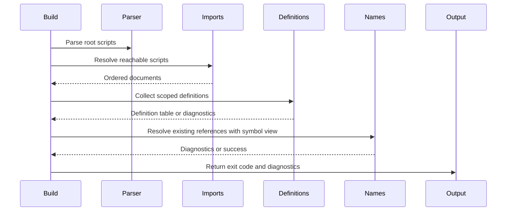
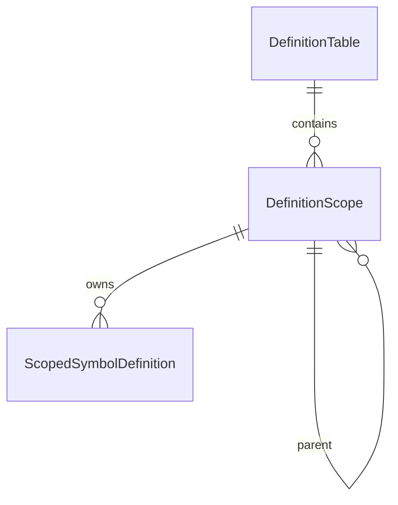

# Design Document

## Overview

この feature は、KoromoEventScript の意味解析に `actor`、`fn`、`class`、`enum`、`var` のスコープ付き定義収集基盤を追加する。CLI 利用者は `kes build --check-only` で定義衝突を検出でき、コンパイラ開発者は後続の参照解決と型検査で再利用できる定義表を得られる。

既存の import 解決、タグ解決、CLI 診断契約は維持する。Parser は主要宣言を AST として表現し、Semantics は AST から scope tree と definition table を構築する。型解釈、式評価、IR 生成は扱わない。

### Goals

- `actor`、`fn`、`class`、`enum`、`var` の名前と source location を AST と semantic definition に保持する。
- module / class / function-or-method / block の scope tree を構築する。
- 同一 scope 重複と外側 scope shadowing を compile diagnostic として報告する。
- 既存 `SemanticAnalyzer` と `NameResolver` に接続し、`kes build --check-only` の診断と終了コードへ反映する。

### Non-Goals

- 完全な型検査、式評価、オーバーロード解決、enum member 型検査。
- IR / `.k` 生成、manifest 生成、runtime 起動。
- STL 組み込み定義の完全登録。
- VS Code Language Server の定義ジャンプ、補完、診断実装。
- import モジュール探索、循環 import、タグ制御フロー検査の仕様変更。

## Boundary Commitments

### This Spec Owns

- 主要宣言構文を AST として表現するための parser-visible syntax shape。
- `actor`、`fn`、`class`、`enum`、`var` の `DefinitionKind` と source location。
- module / class / function-or-method / block の `ScopeKind` と parent-child 関係。
- 同一 scope 重複、outer scope shadowing の compile diagnostics。
- 後続参照解決向けの scoped definition result と、既存 `NameResolver` 向け module-level symbol view。
- `kes build --check-only` semantic stage での definition collection 実行と結果分類。

### Out of Boundary

- import graph 構築、module file discovery、import cycle diagnostics。
- `label` / `jump` / `case` のタグ解決と制御フロー妥当性。
- 型名の存在検証、関数呼び出し引数検証、member access 解決。
- STL / 組み込み型 / 組み込み関数の完全 symbol registration。
- Language Server と runtime の消費側機能。

### Allowed Dependencies

- Existing lexer token stream and indentation tokens.
- Existing `KeParser` / `SyntaxNodes` patterns and `SourceLocation`.
- Existing `ScriptDocument`、`ImportGraph`、`SemanticAnalyzer` semantic stage ordering.
- Existing `Diagnostic`、`DiagnosticLevel`、`CliExitCode` and diagnostic output formatting.
- Existing NUnit test project and `BuildCheckOnlyCommandTests` fixture patterns.

### Revalidation Triggers

- Public shape of major declaration syntax nodes changes.
- `DefinitionKind`、`ScopeKind`、`DefinitionCollectionResult` の contract changes.
- Duplicate or shadowing diagnostic code/category changes.
- `SemanticAnalyzer` stage ordering changes relative to import resolution or name resolution.
- `NameResolver` input contract changes away from module-level symbols.

## Architecture

### Existing Architecture Analysis

`KeLexer` は主要宣言キーワードを予約語として分類済みである。`KeParser` は現在 `var`、flow/text/select/command 系の syntax node のみを返すため、`fn`、`class`、`enum`、`actor` を parser entry point へ追加する必要がある。

`SemanticAnalyzer` は import 解決成功後に `DefinitionCollector` を全 document へ実行し、diagnostic があれば compile error として返す。この stage は今回の definition collection に適している。既存 `NameResolver` は flat な module-level `SymbolDefinition` を入力にするため、新しい scoped model から互換 view を提供して段階移行する。

### Architecture Pattern & Boundary Map

Selected pattern: existing thin CLI orchestration plus parser AST extension and scoped semantic model. Parser owns syntax shape only; Semantics owns scope and definition rules.



Dependency direction: CLI command layer depends on build/project/semantic services; semantic services depend on parsing syntax and diagnostics; parser and diagnostics primitives do not depend on semantic services.

### Technology Stack

| Layer | Choice / Version | Role in Feature | Notes |
|-------|------------------|-----------------|-------|
| CLI / Compiler | .NET `net10.0` | Existing CLI and semantic validation host | No new dependency |
| Parsing | Existing lexer/parser | Major declaration syntax input | Extend current recursive parser |
| Semantics | In-process C# records/services | Scope tree and definition table | Strongly typed records/enums |
| Tests | NUnit 4.x | Unit and integration validation | Existing test project |

## File Structure Plan

### Directory Structure

```txt
source/cli/KoromoEventScript.Cli/
├── Parsing/
│   ├── KeParser.cs              # Add major declaration parsing and block parsing
│   └── SyntaxNodes.cs           # Add declaration, member, parameter, and block syntax records
└── Semantics/
    ├── DefinitionCollector.cs   # Build scope tree, collect definitions, emit diagnostics
    ├── SemanticModels.cs        # Result contracts and compatibility symbol view
    ├── DefinitionModels.cs      # New definition/scope records and enums
    └── SemanticAnalyzer.cs      # Integrate scoped collection result with existing flow
```

### Modified Files

- `source/cli/KoromoEventScript.Cli/Parsing/KeParser.cs` — parse `actor`、`fn`、`class`、`enum` declarations, class members, parameters, enum members, and normal statement blocks.
- `source/cli/KoromoEventScript.Cli/Parsing/SyntaxNodes.cs` — add `FunctionDeclarationSyntax`、`ClassDeclarationSyntax`、`EnumDeclarationSyntax`、`ActorDeclarationSyntax`、`ParameterSyntax`、`ClassMemberSyntax`、`BlockSyntax` records.
- `source/cli/KoromoEventScript.Cli/Semantics/DefinitionCollector.cs` — replace flat top-level-only collection with scoped traversal while preserving module-level symbol view.
- `source/cli/KoromoEventScript.Cli/Semantics/SemanticModels.cs` — update `DefinitionCollectionResult` and `SemanticAnalysisResult` to carry scoped collection details.
- `source/cli/KoromoEventScript.Cli/Semantics/SemanticAnalyzer.cs` — aggregate scoped definition results, map collection diagnostics to compile error, pass compatibility symbol view to `NameResolver`.
- `source/cli/KoromoEventScript.Cli/Semantics/NameResolver.cs` — consume the compatibility symbol view without taking ownership of scope traversal.
- `tests/KoromoEventScript.Cli.Tests/Parsing/KeParserTests.cs` — cover major declaration syntax and parser diagnostics.
- `tests/KoromoEventScript.Cli.Tests/Semantics/DefinitionCollectorTests.cs` — cover scope tree, definition kinds, duplicate definitions, and shadowing.
- `tests/KoromoEventScript.Cli.Tests/Semantics/SemanticAnalyzerTests.cs` — verify semantic stage classification and downstream symbol view.
- `tests/KoromoEventScript.Cli.Tests/Commands/BuildCheckOnlyCommandTests.cs` — verify check-only exit codes and diagnostic output fields.

### New Files

- `source/cli/KoromoEventScript.Cli/Semantics/DefinitionModels.cs` — define `DefinitionKind`、`ScopeKind`、`DefinitionScope`、`ScopedSymbolDefinition`、`DefinitionTable`.

## System Flows



Import and syntax failures remain earlier stages. Definition diagnostics run before name resolution so invalid definition tables are not consumed by later semantic checks.

## Requirements Traceability

| Requirement | Summary | Components | Interfaces | Flows |
|-------------|---------|------------|------------|-------|
| 1.1 | top-level major definitions recognized | `KeParser`, syntax nodes | Declaration syntax records | Parser flow |
| 1.2 | class member definitions recognized | `KeParser`, syntax nodes | `ClassMemberSyntax` | Parser flow |
| 1.3 | parameters recognized | `KeParser`, syntax nodes | `ParameterSyntax` | Parser flow |
| 1.4 | local `var` recognized | `KeParser`, `DefinitionCollector` | `BlockSyntax`, scope traversal | Definition flow |
| 1.5 | incomplete forms stay syntax diagnostics | `KeParser`, `SourceFileParser` | existing parser diagnostics | Build flow |
| 2.1 | module scope collection | `DefinitionCollector`, `DefinitionTable` | `Collect` | Definition flow |
| 2.2 | class scope collection | `DefinitionCollector`, `DefinitionTable` | scope tree | Definition flow |
| 2.3 | function/method scope collection | `DefinitionCollector`, `DefinitionTable` | scope tree | Definition flow |
| 2.4 | block scope collection | `DefinitionCollector`, `DefinitionTable` | scope tree | Definition flow |
| 2.5 | parent-child scope relationships | `DefinitionTable` | state model | Definition flow |
| 3.1 | duplicate diagnostics | `DefinitionCollector` | diagnostics | Definition flow |
| 3.2 | shadowing diagnostics | `DefinitionCollector` | diagnostics | Definition flow |
| 3.3 | module-scope major definition collisions | `DefinitionCollector` | diagnostics | Definition flow |
| 3.4 | same member name in different classes allowed | `DefinitionCollector` | scope identity | Definition flow |
| 3.5 | diagnostic fields | `DefinitionCollector`, CLI formatter | `Diagnostic` | Output flow |
| 4.1 | definitions available after success | `SemanticAnalyzer`, `DefinitionCollectionResult` | semantic result | Definition flow |
| 4.2 | imported and local definitions distinguishable | `DefinitionTable`, `SemanticAnalyzer` | module identity | Definition flow |
| 4.3 | type-capable definitions identified | `DefinitionKind` | semantic model | Definition flow |
| 4.4 | callable definitions identified | `DefinitionKind` | semantic model | Definition flow |
| 4.5 | failed collection not consumed | `SemanticAnalyzer` | stage gating | Build flow |
| 5.1 | check-only includes collection | `BuildCheckOnlyCommand`, `SemanticAnalyzer` | command execution | Build flow |
| 5.2 | success exit code | `SemanticAnalyzer` | `CliExitCode.Success` | Build flow |
| 5.3 | compile error exit code | `SemanticAnalyzer` | `CliExitCode.CompileError` | Build flow |
| 5.4 | text diagnostics | CLI formatter | existing diagnostic contract | Output flow |
| 5.5 | JSON Lines diagnostics | CLI formatter | existing diagnostic contract | Output flow |

## Components and Interfaces

| Component | Domain/Layer | Intent | Req Coverage | Key Dependencies | Contracts |
|-----------|--------------|--------|--------------|------------------|-----------|
| Declaration Syntax Nodes | Parsing | Represent major definitions and locations | 1.1-1.5 | `Token`, `SourceLocation` P0 | State |
| `KeParser` | Parsing | Build declaration AST and preserve syntax diagnostics | 1.1-1.5 | `KeLexer` P0 | Service |
| Definition Models | Semantics | Represent definition kinds, scopes, and definition table | 2.1-4.4 | `Diagnostic` P1 | State |
| `DefinitionCollector` | Semantics | Traverse AST, build scoped definition table, emit diagnostics | 2.1-4.5, 3.1-3.5 | syntax nodes P0 | Service |
| `SemanticAnalyzer` | Semantics | Stage definition collection between import and name resolution | 4.1-5.3 | `ImportResolver` P0, `NameResolver` P0 | Service |
| CLI Check-only Flow | CLI | Surface diagnostics and exit codes | 5.1-5.5 | `BuildCheckOnlyCommand` P0 | Service |

### Parsing Layer

#### Declaration Syntax Nodes

| Field | Detail |
|-------|--------|
| Intent | Preserve syntax-level declaration names, locations, and nested bodies |
| Requirements | 1.1, 1.2, 1.3, 1.4, 1.5 |

**Responsibilities & Constraints**

- Represent syntax only; no type interpretation or name binding.
- Preserve source locations for names and parameters.
- Keep type annotations and initializer/body expressions as token lists or existing statement lists.

**Contracts**: Service [ ] / API [ ] / Event [ ] / Batch [ ] / State [x]

##### State Management

```csharp
public sealed record FunctionDeclarationSyntax(
    string Name,
    SourceLocation NameLocation,
    IReadOnlyList<ParameterSyntax> Parameters,
    IReadOnlyList<Token> ReturnTypeTokens,
    BlockSyntax Body) : StatementSyntax;

public sealed record ClassDeclarationSyntax(
    string Name,
    SourceLocation NameLocation,
    IReadOnlyList<ClassMemberSyntax> Members) : StatementSyntax;

public sealed record EnumDeclarationSyntax(
    string Name,
    SourceLocation NameLocation,
    IReadOnlyList<EnumMemberSyntax> Members) : StatementSyntax;

public sealed record ActorDeclarationSyntax(
    string Name,
    SourceLocation NameLocation,
    BlockSyntax Body) : StatementSyntax;
```

- Invariants: source locations point to the declared identifier, not the keyword.
- Invariants: incomplete declaration syntax is rejected by parser diagnostics.

#### `KeParser`

| Field | Detail |
|-------|--------|
| Intent | Parse major declaration syntax into AST nodes |
| Requirements | 1.1, 1.2, 1.3, 1.4, 1.5 |

**Responsibilities & Constraints**

- Add parser branches for `actor`、`fn`、`class`、`enum`.
- Parse class members as `public/private` optional modifiers plus `var` or `fn`.
- Parse function/method parameters as names with type token lists.
- Reuse existing syntax diagnostics category for malformed declarations.
- Preserve import placement rule.

**Contracts**: Service [x] / API [ ] / Event [ ] / Batch [ ] / State [ ]

##### Service Interface

```csharp
public static ScriptSyntax Parse(string source);
public static ScriptSyntax Parse(LexerResult lexerResult);
```

- Preconditions: input is lexable KES source.
- Postconditions: syntax-valid major declarations appear in `ScriptSyntax.Statements`.
- Invariants: parser does not perform semantic scope checks.

### Semantics Layer

#### Definition Models

| Field | Detail |
|-------|--------|
| Intent | Store scope tree and typed definitions for semantic consumers |
| Requirements | 2.1, 2.2, 2.3, 2.4, 2.5, 4.2, 4.3, 4.4 |

**Responsibilities & Constraints**

- Distinguish definition kind: variable, function, class, enum, enum member, actor, parameter, class field, class method.
- Distinguish scope kind: module, class, function, method, block.
- Preserve module name and source file for all definitions.
- Provide module-level symbol view for existing `NameResolver`.

**Contracts**: Service [ ] / API [ ] / Event [ ] / Batch [ ] / State [x]

##### State Management

```csharp
public enum DefinitionKind
{
    Variable,
    Function,
    Class,
    Enum,
    EnumMember,
    Actor,
    Parameter,
    ClassField,
    ClassMethod,
}

public enum ScopeKind
{
    Module,
    Class,
    Function,
    Method,
    Block,
}

public sealed record ScopedSymbolDefinition(
    string Name,
    DefinitionKind Kind,
    string ModuleName,
    string File,
    int Line,
    int Column,
    string ScopeId);
```

- Invariants: `ScopeId` is unique within one document collection result.
- Invariants: each non-module scope has a parent scope.
- Invariants: module-level compatibility symbols exclude enum members, parameters, and local variables.

#### `DefinitionCollector`

| Field | Detail |
|-------|--------|
| Intent | Build scoped definitions and validate duplicate/shadowing rules |
| Requirements | 2.1-2.5, 3.1-3.5, 4.1-4.5 |

**Responsibilities & Constraints**

- Traverse syntax tree in source order.
- Create scopes for module, class, function/method, and local blocks.
- Add definitions to their owning scope.
- Report duplicate definitions within the same scope.
- Report shadowing when a new definition repeats any visible outer-scope name.
- Continue collecting enough information to report deterministic diagnostics, but mark failed collection as not successful.

**Dependencies**

- Inbound: `SemanticAnalyzer` — semantic stage invocation (P0)
- Outbound: syntax node records — AST traversal (P0)
- Outbound: diagnostics primitives — compile diagnostics (P0)

**Contracts**: Service [x] / API [ ] / Event [ ] / Batch [ ] / State [x]

##### Service Interface

```csharp
public sealed class DefinitionCollector
{
    public DefinitionCollectionResult Collect(ScriptDocument document);
}
```

- Preconditions: document syntax was parsed successfully.
- Postconditions: success result contains a definition table and module-level compatibility symbols.
- Invariants: duplicate/shadowing diagnostics use compile diagnostic category and source location of the later definition.

#### `SemanticAnalyzer`

| Field | Detail |
|-------|--------|
| Intent | Integrate scoped definition collection into semantic validation |
| Requirements | 4.1, 4.2, 4.5, 5.1, 5.2, 5.3 |

**Responsibilities & Constraints**

- Run definition collection only after import resolution succeeds.
- Stop before name resolution when definition collection has compile diagnostics.
- Pass module-level compatibility symbols to existing `NameResolver`.
- Keep existing import and syntax error precedence.

**Dependencies**

- Inbound: `BuildCheckOnlyCommand` — check-only validation (P0)
- Outbound: `ImportResolver` — reachable documents (P0)
- Outbound: `DefinitionCollector` — scoped definitions (P0)
- Outbound: `NameResolver` — existing reference validation (P0)

**Contracts**: Service [x] / API [ ] / Event [ ] / Batch [ ] / State [ ]

##### Service Interface

```csharp
public SemanticAnalysisResult Analyze(
    ProjectConfig config,
    IReadOnlyList<ScriptDocument> entryDocuments);
```

- Preconditions: entry documents are syntax-valid scripts.
- Postconditions: success result exposes definition collection details for semantic consumers.
- Invariants: definition diagnostics map to `CliExitCode.CompileError`.

## Data Models

### Domain Model

- `DefinitionTable`: one document's scope tree and collected definitions.
- `DefinitionScope`: scope identity, scope kind, optional parent identity, and owner definition.
- `ScopedSymbolDefinition`: name, kind, module, file, source location, and owning scope.
- `DefinitionCollectionResult`: document, definition table, compatibility symbol view, diagnostics, and success status.

### Logical Data Model



Rules:

- Module scope is the root scope for each `ScriptDocument`.
- Class scope is a child of module scope.
- Function scope is a child of module scope; method scope is a child of class scope.
- Block scope is a child of the nearest containing function, method, or block scope.
- Shadowing checks walk parent scopes from the owning scope to root.

### Data Contracts & Integration

`DefinitionCollectionResult` remains in-process only. No serialization, persistence, API, or event contract is introduced.

The compatibility symbol view is a dictionary keyed by module name:

```csharp
IReadOnlyDictionary<string, IReadOnlyList<SymbolDefinition>>
```

It contains module-visible major definitions needed by the existing `NameResolver`.

## Error Handling

### Error Strategy

- Malformed declaration syntax remains a syntax-stage parser diagnostic.
- Duplicate and shadowing are compile-stage semantic diagnostics.
- Import and source file failures remain earlier-stage diagnostics.
- If definition collection fails, name resolution is skipped for that semantic analysis result.

### Error Categories and Responses

| Error | Response |
|-------|----------|
| Incomplete `fn` / `class` / `enum` / `actor` syntax | Existing parser diagnostic and syntax exit code |
| Duplicate definition in same scope | Compile diagnostic at duplicate name location |
| Disallowed shadowing | Compile diagnostic at shadowing definition location |
| Definition collection failure in check-only | Compile error exit code |

### Monitoring

No telemetry is added. Existing text and JSON Lines diagnostics are the observable reporting surface.

## Testing Strategy

### Unit Tests

- `KeParserTests` verifies `actor`、top-level `fn`、`class` with fields/methods、`enum` members、function parameters、local `var` bodies are parsed with source locations.
- `KeParserTests` verifies malformed major declarations produce syntax diagnostics rather than partial AST nodes.
- `DefinitionCollectorTests` verifies module, class, function/method, and block scopes with parent-child relationships.
- `DefinitionCollectorTests` verifies `DefinitionKind` for variable, function, class, enum, actor, parameter, class field, and class method.
- `DefinitionCollectorTests` verifies duplicate and shadowing diagnostics, including allowing same member names in different classes.

### Integration Tests

- `SemanticAnalyzerTests` verifies collection runs after import resolution and before name resolution.
- `SemanticAnalyzerTests` verifies collection diagnostics produce `CliExitCode.CompileError` and skip name resolution.
- `BuildCheckOnlyCommandTests` verifies valid major definitions return success.
- `BuildCheckOnlyCommandTests` verifies duplicate/shadowing diagnostics appear in text and JSON Lines outputs with required fields.

### Regression Checks

- Existing lexer/parser tests for commands, LESS, text blocks, select, label, jump remain passing.
- Existing import-resolution and tag-resolution tests remain passing.
- `dotnet test KoromoEventScript.slnx --no-restore` and `git diff --check` pass before implementation completion.

## Performance & Scalability

Definition collection traverses each reachable syntax tree once after import resolution. Scope and definition lookup use in-memory dictionaries with ordinal string comparison. No persistent cache or background index is introduced in this spec.
