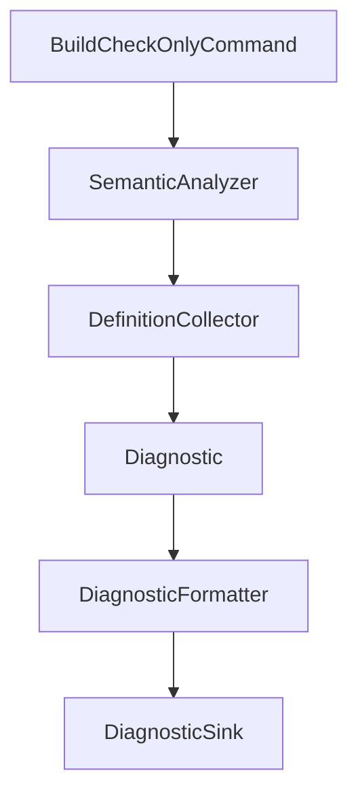
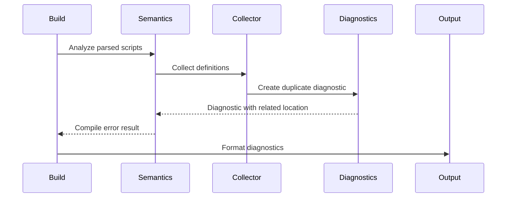

# Design Document

## Overview

この feature は、KoromoEventScript の同一スコープ重複定義診断を強化し、CLI 利用者とコンパイラ開発者が重複先だけでなく重複元の位置も確認できるようにする。対象は `actor`、`fn`、`class`、`enum`、`var` と、既存 parser が定義候補として扱う class member / local var である。

実装は既存の `KoromoEventScript.Cli` に対する拡張である。`DefinitionCollector` が scope-local な重複判定を所有し、`Diagnostic` が optional related location を運び、`DiagnosticFormatter` が text と JSON Lines へ出力する。

### Goals

- 同一 scope/name の重複を `KES2009` compile diagnostic として安定して報告する。
- duplicate definition location と original definition location を診断モデルと CLI 出力で保持する。
- 既存の import、syntax、name resolution、shadowing、check-only stage ordering を変更しない。

### Non-Goals

- シャドーイング診断 `KES2014` の仕様変更。
- 型検査、overload resolution、式評価、IR / `.klib` 生成。
- import 解決、module discovery、CLI exit code の変更。
- VS Code Language Server 固有の診断表示。

## Boundary Commitments

### This Spec Owns

- `KES2009` duplicate definition diagnostics の重複元・重複先位置情報。
- `Diagnostic` が関連位置を保持するための in-process contract。
- text / JSON Lines formatter が関連位置を欠落させず出力する契約。
- `DefinitionCollector` の同一スコープ重複検出テストと check-only 統合テスト。

### Out of Boundary

- `KES2014` shadowing diagnostic の関連位置追加。
- import collision、ambiguous import、unresolved name の診断仕様変更。
- parser grammar や AST shape の拡張。
- 成果物生成、runtime 実行、Language Server protocol 変換。

### Allowed Dependencies

- `source/cli/KoromoEventScript.Cli/Parsing` の既存 syntax node と `SourceLocation`。
- `source/cli/KoromoEventScript.Cli/Semantics` の `DefinitionScope`、`ScopedSymbolDefinition`、`DefinitionTable`。
- `source/cli/KoromoEventScript.Cli/Diagnostics` の `Diagnostic`、`DiagnosticFormatter`、`DiagnosticSink`。
- `BuildCheckOnlyCommand` と `SemanticAnalyzer` の既存 stage ordering。
- NUnit ベースの既存 test project。

### Revalidation Triggers

- `Diagnostic` または JSON Lines diagnostic schema のフィールド名変更。
- `DefinitionScope` / `ScopedSymbolDefinition` の source location contract 変更。
- `SemanticAnalyzer` の definition collection 実行順または name resolution gating 変更。
- parser が `actor`、`fn`、`class`、`enum`、`var` の location を保持しなくなる変更。
- CLI 仕様の diagnostic layout または compile error exit code 変更。

## Architecture

### Existing Architecture Analysis

`BuildCheckOnlyCommand` は `.kel` と referenced script parsing の後に `SemanticAnalyzer` を呼び出す。`SemanticAnalyzer` は import 解決、definition collection、name resolution の順に処理し、definition diagnostics がある場合は `CliExitCode.CompileError` を返して name resolution をスキップする。

`DefinitionCollector` は `definitionsByScope` を使い、scope ID ごとに最初の `ScopedSymbolDefinition` を保持している。現状の duplicate diagnostic は duplicate location のみを主位置として持つため、original location を構造化できない。`DiagnosticFormatter` は text と JSON Lines の標準フィールドのみを出力している。

### Architecture Pattern & Boundary Map



**Architecture Integration**:

- Selected pattern: 既存 semantic pipeline の局所拡張。新しい validation pipeline は作らない。
- Domain/feature boundaries: duplicate detection は `DefinitionCollector`、diagnostic payload は `Diagnostics`、stage ordering は既存 `SemanticAnalyzer` / `BuildCheckOnlyCommand` が保持する。
- Existing patterns preserved: immutable record model、`StringComparer.Ordinal` による case-sensitive name comparison、ordered diagnostics、NUnit tests。
- New components rationale: `DiagnosticRelatedLocation` は original definition location を machine-readable に運ぶために必要である。
- Steering compliance: `.kiro/steering/` は存在しないため、既存仕様とコードベース規約を優先する。

### Technology Stack

| Layer | Choice / Version | Role in Feature | Notes |
|-------|------------------|-----------------|-------|
| CLI | .NET `net10.0` | `kes build --check-only` の既存実行経路 | 新規 dependency なし |
| Services | C# records/services | semantic diagnostics と formatting | 既存 `KoromoEventScript.Cli` 内で完結 |
| Data / Storage | In-memory records | diagnostic と related location の伝搬 | 永続化なし |
| Messaging / Events | N/A | 対象外 | 追加なし |
| Infrastructure / Runtime | NUnit | unit / integration tests | 既存 test project を使用 |

## File Structure Plan

### Directory Structure

```text
source/cli/KoromoEventScript.Cli/
├── Diagnostics/
│   ├── Diagnostic.cs              # DiagnosticRelatedLocation と Diagnostic contract
│   ├── DiagnosticFormatter.cs     # text と JSON Lines への related location 出力
│   └── DiagnosticSink.cs          # 既存 sink contract を維持
├── Semantics/
│   ├── DefinitionCollector.cs     # 同一スコープ重複診断に original location を付与
│   ├── DefinitionModels.cs        # 既存 scope/definition model
│   └── SemanticAnalyzer.cs        # 既存 stage ordering を維持
└── Commands/
    └── Build/
        └── BuildCheckOnlyCommand.cs # semantic diagnostics の既存連携を維持

tests/KoromoEventScript.Cli.Tests/
├── Diagnostics/
│   └── DiagnosticFormatterTests.cs # related location の text / JSON Lines 出力
├── Semantics/
│   ├── DefinitionCollectorTests.cs # actor/fn/class/enum/var 重複と位置情報
│   └── SemanticAnalyzerTests.cs    # compile error と name resolution skip
└── Commands/
    └── BuildCheckOnlyCommandTests.cs # check-only text/JSON Lines 統合
```

### Modified Files

- `source/cli/KoromoEventScript.Cli/Diagnostics/Diagnostic.cs` — `DiagnosticRelatedLocation` を追加し、`Diagnostic` が optional related locations を保持する。
- `source/cli/KoromoEventScript.Cli/Diagnostics/DiagnosticFormatter.cs` — related locations がある場合に text と JSON Lines へ出力する。
- `source/cli/KoromoEventScript.Cli/Semantics/DefinitionCollector.cs` — duplicate diagnostic 生成時に first definition を related location として渡す。
- `tests/KoromoEventScript.Cli.Tests/Diagnostics/DiagnosticFormatterTests.cs` — related locations あり/なしの互換性を検証する。
- `tests/KoromoEventScript.Cli.Tests/Semantics/DefinitionCollectorTests.cs` — `actor`、`fn`、`class`、`enum`、`var` の同一スコープ重複と first duplicate mapping を検証する。
- `tests/KoromoEventScript.Cli.Tests/Commands/BuildCheckOnlyCommandTests.cs` — text / JSON Lines の check-only 統合で original location を検証する。

## System Flows



Key decision: syntax、file、import failure は従来通り earlier stage として処理し、duplicate diagnostics は import 成功後の semantic compile diagnostics としてのみ表面化する。

## Requirements Traceability

| Requirement | Summary | Components | Interfaces | Flows |
|-------------|---------|------------|------------|-------|
| 1.1 | module scope の主要定義重複 | `DefinitionCollector` | `Collect(document)` | Definition flow |
| 1.2 | class scope の member 重複 | `DefinitionCollector` | `CollectClassMember` | Definition flow |
| 1.3 | function/method/block scope の `var` 重複 | `DefinitionCollector` | `CollectBlock` | Definition flow |
| 1.4 | 異なる scope の同名許可 | `DefinitionCollector`, `DefinitionScope` | scope ID boundary | Definition flow |
| 1.5 | case-sensitive 比較 | `DefinitionCollector` | `StringComparer.Ordinal` scope table | Definition flow |
| 2.1 | duplicated name | `DefinitionCollector` | `Diagnostic.Message` | Diagnostic flow |
| 2.2 | duplicate location | `Diagnostic` | `File`, `Line`, `Column` | Diagnostic flow |
| 2.3 | original location | `Diagnostic`, `DiagnosticRelatedLocation` | `RelatedLocations` | Diagnostic flow |
| 2.4 | 3件以上の first original association | `DefinitionCollector` | first definition lookup | Definition flow |
| 2.5 | cross-file module scope location preservation | `DefinitionCollector`, `SemanticAnalyzer` | module/document file paths | Definition flow |
| 3.1 | check-only diagnostic output | `BuildCheckOnlyCommand`, `DiagnosticSink` | existing output flow | Check-only flow |
| 3.2 | compile error exit code | `SemanticAnalyzer` | `CliExitCode.CompileError` | Check-only flow |
| 3.3 | text output fields | `DiagnosticFormatter` | `FormatText` | Output flow |
| 3.4 | JSON Lines related location | `DiagnosticFormatter` | `FormatJsonLine` | Output flow |
| 3.5 | earlier-stage ordering | `BuildCheckOnlyCommand`, `SemanticAnalyzer` | parse/import gating | Check-only flow |
| 4.1 | shadowing と duplicate の分離 | `DefinitionCollector` | `KES2009`, `KES2014` | Definition flow |
| 4.2 | type checking なしで診断 | `DefinitionCollector` | syntax traversal only | Definition flow |
| 4.3 | duplicate なしで無診断 | `DefinitionCollector` | empty diagnostics | Definition flow |
| 4.4 | ordering rule 維持 | `SemanticAnalyzer`, `DiagnosticSink` | ordered diagnostics | Check-only flow |

## Components and Interfaces

| Component | Domain/Layer | Intent | Req Coverage | Key Dependencies (P0/P1) | Contracts |
|-----------|--------------|--------|--------------|--------------------------|-----------|
| `Diagnostic` | Diagnostics | 主位置と関連位置を保持する診断 record | 2.1-2.5, 3.3, 3.4 | formatter P0 | State |
| `DiagnosticFormatter` | Diagnostics | text / JSON Lines へ診断を整形する | 3.1, 3.3, 3.4 | `Diagnostic` P0 | Service |
| `DefinitionCollector` | Semantics | scope-local definitions を収集し duplicate diagnostics を生成する | 1.1-1.5, 2.1-2.5, 4.1-4.3 | parsing syntax P0, diagnostics P0 | Service |
| `SemanticAnalyzer` | Semantics | semantic stage ordering と compile error result を保持する | 3.2, 3.5, 4.4 | import resolver P0, collector P0 | Service |
| `BuildCheckOnlyCommand` | CLI | semantic diagnostics を check-only result へ渡す | 3.1-3.5 | semantic analyzer P0, diagnostic sink P1 | Service |

### Diagnostics Layer

#### `Diagnostic`

| Field | Detail |
|-------|--------|
| Intent | 診断の主位置と関連位置を型安全に保持する |
| Requirements | 2.1, 2.2, 2.3, 2.5, 3.3, 3.4 |

**Responsibilities & Constraints**

- 主位置 `File` / `Line` / `Column` は duplicate definition location を表す。
- related location は original definition location を表す。
- related location がない既存診断は標準フィールドのみで表現できる。

**Dependencies**

- Inbound: `DefinitionCollector` — duplicate diagnostics の生成 (P0)
- Outbound: `DiagnosticFormatter` — text / JSON Lines 出力 (P0)

**Contracts**: State [x]

##### State Management

- State model: `Diagnostic` は `IReadOnlyList<DiagnosticRelatedLocation>` を持つ。`DiagnosticRelatedLocation` は file / line / column / message を持つ value object。
- Persistence & consistency: in-memory only。CLI 出力時に serialization される。
- Concurrency strategy: なし。診断 record は immutable として扱う。

**Implementation Notes**

- Integration: existing constructor usages が多いため、related locations は optional parameter または overload で追加する。
- Validation: null list を空配列へ正規化し、file path は既存 `Diagnostic.File` と同じ display path 規則に従う。
- Risks: JSON Lines に不要な空配列を出すと既存スナップショットが変わるため、related location がある場合のみ追加フィールドを出す。

#### `DiagnosticFormatter`

| Field | Detail |
|-------|--------|
| Intent | 関連位置を欠落させず、既存診断 layout と互換に整形する |
| Requirements | 3.1, 3.3, 3.4 |

**Responsibilities & Constraints**

- text output は既存の先頭形式 `file:line:column level code:` を維持する。
- related location がある duplicate diagnostic では original location を人が読める形で message に追加する。
- JSON Lines output は標準フィールドを維持し、関連位置を追加フィールドとして出力する。

**Dependencies**

- Inbound: `DiagnosticSink` — selected output format (P0)
- Outbound: `System.Text.Json` — JSON Lines serialization (P0)

**Contracts**: Service [x]

##### Service Interface

```csharp
public static string FormatText(Diagnostic diagnostic);
public static string FormatJsonLine(Diagnostic diagnostic);
```

- Preconditions: diagnostic は null ではない。
- Postconditions: 標準フィールドは既存形式で出力される。
- Invariants: diagnostics の順序は formatter 内で変更しない。

**Implementation Notes**

- Integration: `DiagnosticSink` の public contract は変更しない。
- Validation: formatter tests で related location あり/なしの text と JSON Lines を検証する。
- Risks: related location の JSON field 名は design で固定し、後続実装で変更する場合は downstream revalidation が必要。

### Semantics Layer

#### `DefinitionCollector`

| Field | Detail |
|-------|--------|
| Intent | scope-local definition table を構築し、同一 scope/name の重複を診断する |
| Requirements | 1.1-1.5, 2.1-2.5, 4.1-4.3 |

**Responsibilities & Constraints**

- `definitionsByScope` の first definition を original definition として保持する。
- duplicate definition は diagnostic の主位置にする。
- 同じ name でも scope ID が異なる場合は duplicate としない。
- `StringComparer.Ordinal` により case-sensitive 判定を維持する。
- shadowing diagnostic は既存 `KES2014` として分離する。

**Dependencies**

- Inbound: `SemanticAnalyzer` — parsed documents の semantic validation (P0)
- Outbound: `Diagnostics` — `KES2009` / `KES2014` diagnostics (P0)
- Outbound: `Parsing` — syntax nodes and source locations (P0)

**Contracts**: Service [x] / State [x]

##### Service Interface

```csharp
public DefinitionCollectionResult Collect(ScriptDocument document);
```

- Preconditions: `document.Syntax` は parser が成功した syntax tree である。
- Postconditions: duplicate definitions after the first produce `KES2009` diagnostics with original related location。
- Invariants: collection order は syntax traversal order と existing stage order に従う。

**Implementation Notes**

- Integration: `DuplicateDefinitionDiagnostic` overload は original と duplicate の両方を受け取る contract に寄せる。
- Validation: 3件以上の同名定義では 2件目と3件目がどちらも1件目を original related location として参照する。
- Risks: enum member や parameter は既存 collector の対象だが、Issue #20 の対象外である。既存挙動を壊さず、追加テストは要求対象の定義種別へ絞る。

#### `SemanticAnalyzer`

| Field | Detail |
|-------|--------|
| Intent | import 成功後に definition diagnostics を compile error として返す |
| Requirements | 3.2, 3.5, 4.4 |

**Responsibilities & Constraints**

- import failure がある場合は definition collection を実行しない。
- definition diagnostics がある場合は name resolution を実行しない。
- diagnostics の順序は ordered documents と collector order に従う。

**Dependencies**

- Inbound: `BuildCheckOnlyCommand` — check-only validation (P0)
- Outbound: `ImportResolver` — import graph (P0)
- Outbound: `DefinitionCollector` — duplicate diagnostics (P0)
- Outbound: `NameResolver` — duplicate-free semantic validation (P1)

**Contracts**: Service [x]

##### Service Interface

```csharp
public SemanticAnalysisResult Analyze(ProjectConfig config, IReadOnlyList<ScriptDocument> entryDocuments);
```

- Preconditions: entry documents は syntax parse 済みである。
- Postconditions: definition diagnostics があれば `CliExitCode.CompileError` を返す。
- Invariants: earlier-stage failure を later-stage diagnostic で上書きしない。

**Implementation Notes**

- Integration: stage ordering は変更しない。
- Validation: duplicate diagnostics がある場合に name resolution が skip されることを既存テストへ追加する。
- Risks: 同一 module 名の複数 document は通常 import ambiguity で遮断される。semantic input に同名 module が入るテストが必要な場合は、現在の graph invariant を確認してから扱う。

### CLI Layer

#### `BuildCheckOnlyCommand`

| Field | Detail |
|-------|--------|
| Intent | semantic diagnostics を CLI result と output path へ接続する |
| Requirements | 3.1, 3.2, 3.3, 3.4, 3.5 |

**Responsibilities & Constraints**

- `SemanticAnalyzer` から返る diagnostics をそのまま `BuildCheckOnlyResult` に保持する。
- syntax/file diagnostics がある場合は semantic validation を実行しない。
- output formatting は `DiagnosticSink` に委譲する。

**Dependencies**

- Inbound: `CliApplication` — command execution (P0)
- Outbound: `SemanticAnalyzer` — semantic validation (P0)
- Outbound: `DiagnosticSink` — output formatting (P1)

**Contracts**: Service [x]

##### Service Interface

```csharp
public BuildCheckOnlyResult Execute(BuildCommandOptions options, string currentDirectory);
```

- Preconditions: options と currentDirectory は valid input である。
- Postconditions: duplicate diagnostics は compile error result として返る。
- Invariants: check-only は成果物を生成しない。

**Implementation Notes**

- Integration: command code の変更は原則不要。テストで既存接続を固定する。
- Validation: `CliApplication.Run(... --log-format json)` で related locations が stderr JSON Lines に出ることを確認する。
- Risks: CLI integration は formatter contract に依存するため、unit tests と integration tests の両方で確認する。

## Data Models

### Domain Model

- `Diagnostic`: diagnostic level、code、primary location、message、related locations を持つ診断 aggregate。
- `DiagnosticRelatedLocation`: primary diagnostic に関連する source location。duplicate diagnostics では original definition location を表す。
- `ScopedSymbolDefinition`: name、kind、module、file、line、column、scope ID を持つ semantic definition。
- `DefinitionScope`: scope identity と parent relation を持つ。

### Logical Data Model

**Structure Definition**:

- `Diagnostic.RelatedLocations`: 0 件以上。既存診断は空、duplicate diagnostics は original definition location を 1 件持つ。
- `DiagnosticRelatedLocation.File`: project-relative display path。
- `DiagnosticRelatedLocation.Line` / `Column`: 1-based source location。
- `DiagnosticRelatedLocation.Message`: `"Original definition is here."` のような短い説明。

**Consistency & Integrity**:

- duplicate diagnostic の primary location は duplicate definition after the first を指す。
- duplicate diagnostic の first related location は first original definition を指す。
- 3件以上の同名定義では、各 duplicate diagnostic が同じ first original definition を参照する。

### Data Contracts & Integration

**JSON Lines Diagnostic**

- Standard fields: `level`, `code`, `file`, `line`, `column`, `message`
- Conditional field: `relatedLocations`
- `relatedLocations` item fields: `file`, `line`, `column`, `message`

related location がない診断では `relatedLocations` を省略し、既存 JSON Lines consumers の標準フィールド期待を維持する。

## Error Handling

### Error Strategy

- Duplicate definition: `KES2009`, `DiagnosticLevel.Error`, compile error exit code `4`。
- Shadowing: 既存 `KES2014` を維持し、この仕様では related location を追加しない。
- Syntax / file / import failure: existing earlier-stage diagnostics を優先し、duplicate validation は実行しない。

### Error Categories and Responses

| Category | Diagnostic | Exit Code | Response |
|----------|------------|-----------|----------|
| Same-scope duplicate definition | `KES2009` | `4` | duplicate location を主位置、original location を related location として報告 |
| Shadowing | `KES2014` | `4` | 既存挙動を維持 |
| Syntax failure | `KES1xxx` | `3` | semantic validation を実行しない |
| File/import file failure | `KES9xxx` | `6` | semantic validation を実行しない |

### Monitoring

No telemetry is added. Console diagnostics and NUnit assertions are the observable reporting surface.

## Testing Strategy

### Unit Tests

- `DefinitionCollectorTests` verifies module scope duplicates across `actor` / `fn` / `class` / `enum` / `var` produce `KES2009` with duplicate primary location and original related location. Covers 1.1, 2.1-2.3.
- `DefinitionCollectorTests` verifies class member `fn` / `var` duplicate diagnostics and different class scopes allowed. Covers 1.2, 1.4.
- `DefinitionCollectorTests` verifies function/method/block local `var` duplicates and case-sensitive names. Covers 1.3, 1.5.
- `DefinitionCollectorTests` verifies three same-name definitions produce diagnostics for the second and third definitions, both associated with the first definition. Covers 2.4.
- `DiagnosticFormatterTests` verifies related locations appear in text and JSON Lines, while diagnostics without related locations preserve existing fields. Covers 3.3, 3.4.

### Integration Tests

- `SemanticAnalyzerTests` verifies duplicate definition diagnostics return `CliExitCode.CompileError` and skip name resolution. Covers 3.2, 4.4.
- `BuildCheckOnlyCommandTests` verifies `kes build --check-only` emits duplicate diagnostics through the existing output flow. Covers 3.1.
- `BuildCheckOnlyCommandTests` verifies syntax or import failure prevents duplicate validation and preserves earlier-stage exit code. Covers 3.5.
- Existing import/name/shadowing tests continue to pass, proving 4.1 and 4.2 boundaries remain intact.

### E2E / CLI Tests

- `CliApplication.Run` with `--log-format json` verifies `relatedLocations[0]` contains original file, line, column, and message for `KES2009`. Covers 3.4.
- Text output path verifies duplicate diagnostic contains standard primary location and readable original location. Covers 3.3.

### Performance / Load

- No new performance target is introduced. Duplicate detection remains O(number of definitions per document) using existing per-scope dictionaries.

## Security Considerations

No new file access, network access, runtime execution, or user permission behavior is introduced. Diagnostics only expose project-relative paths already used by existing CLI diagnostics.

## Performance & Scalability

Related location storage adds one small value object per duplicate diagnostic. The collector continues to use scope-local dictionaries and does not introduce project-wide scans beyond existing semantic analysis.
