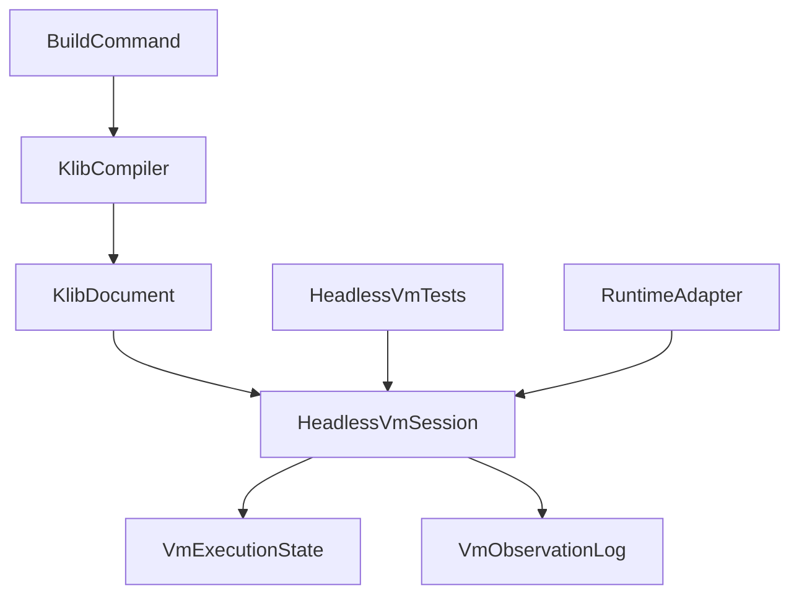
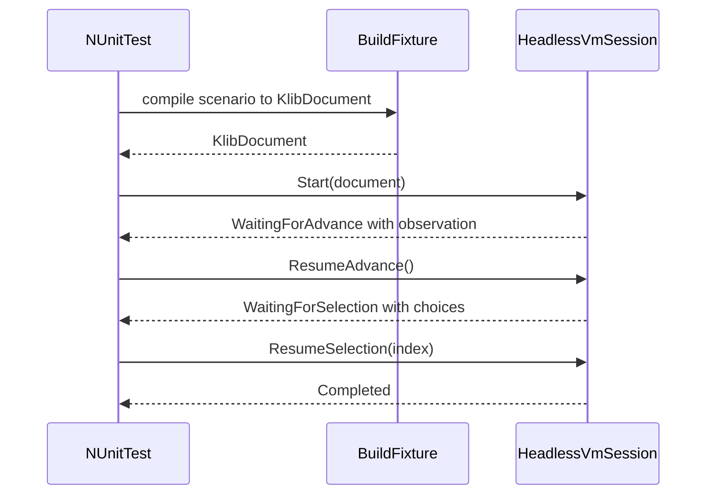

# Design Document

## Overview

`kes-headless-vm-execution` は、既存の `.klib` 中間表現を runtime 非依存で実行できる headless VM 層を KoromoEventScript に追加する設計である。対象利用者は VM 実装者、CLI テスト整備担当、将来の runtime 実装者であり、UI を起動せずにシナリオ進行、待機、選択分岐を検証できることを目的とする。

本設計は compiler や `.klib` 仕様の再設計を行わない。既存 build pipeline が生成する `KlibDocument` を実行入力とし、待機理由、観測結果、再開入力を明示する session 型を導入して、VM core と runtime adapter の責務境界を固定する。

### Goals

- `.klib` を runtime 非依存で順次実行できる headless VM core を定義する。
- `say`、`nar`、`select`、`jump`、`label`、`END` の進行と停止をテストコードから観測できるようにする。
- CI で手動入力なしに再現可能な VM test 入口を既存 NUnit test suite に追加できるようにする。

### Non-Goals

- Windows / Unity / Unreal runtime の描画、音声、入力デバイス制御の設計。
- `.klib` バイナリ形式、opcode、source mapping 契約の変更。
- セーブ UI、バックログ UI、配布契約、publish 成果物の変更。

## Boundary Commitments

### This Spec Owns

- `KlibDocument` を入力として実行する headless VM session の責務境界。
- 実行状態、停止理由、選択肢待ち、再開 API の契約。
- テストが参照する観測状態の最小モデル。
- 既存 CLI test project における headless VM test の配置方針。

### Out of Boundary

- `.klib` 生成ロジックそのものの変更。
- runtime 固有 UI 表示、クリック判定、描画レイヤー、音声再生。
- セーブデータ形式や manifest 契約の追加。
- `bg`、`show`、`face`、`trans` など未実装 runtime 命令の描画仕様確定。

### Allowed Dependencies

- `source/cli/KoromoEventScript.Cli/Compilation/` の `KlibDocument` と関連 enum / model。
- `docs/spec/k-intermediate-representation-spec.md` の opcode / 停止意味。
- 既存 NUnit test project と `TemporaryProject` fixture。

### Revalidation Triggers

- `.klib` 命令セットや `KlibDocument` 構造が変わるとき。
- runtime 側が待機理由や観測イベントの追加情報を必須化するとき。
- binary `.klib` loader を追加し、session の入力前提を変えるとき。
- `kes run` や runtime state management が同じ session 契約を共有し始めるとき。

## Architecture

### Existing Architecture Analysis

現行コードベースには `Compilation`、`Build`、`Commands`、`Semantics` 層があり、`.klib` 生成までは `BuildCommand` と `KlibCompiler` で完結している。一方で VM 実行責務は独立した名前空間としてまだ存在せず、`docs/testing-strategy.md` では VM test を golden test とは別の段階として定義している。このため、build-time 層を汚さずに `Execution` 層を新設するのが最も自然である。

### Architecture Pattern & Boundary Map

**Architecture Integration**:

- Selected pattern: Headless VM core + adapter seam。`KlibDocument` を消費する core と、入力供給や UI 表示を担う adapter を分離する。
- Domain/feature boundaries: `Compilation` は IR 生成のみ、`Execution` は IR 実行のみ、`tests` は観測結果の検証のみを担当する。
- Existing patterns preserved: CLI 内の責務別ディレクトリ分割、NUnit test project、`.klib` を公開契約とする方針。
- New components rationale: 実行 session、停止状態、観測イベント、テスト helper が新たに必要である。
- Steering compliance: `.kiro/steering/` は未配置のため、`AGENTS.md` と `docs/testing-strategy.md` の方針に従う。



### Technology Stack

| Layer | Choice / Version | Role in Feature | Notes |
|-------|------------------|-----------------|-------|
| Frontend / CLI | .NET CLI 既存構成 | `KlibDocument` 生成と test fixture 入口 | 新規 CLI コマンド追加は対象外 |
| Backend / Services | C# / .NET 既存 runtime | headless VM session、状態遷移、resume 契約 | `Execution` 名前空間を新設 |
| Data / Storage | In-memory state only | instruction index、pending wait、観測ログ | 永続化は対象外 |
| Infrastructure / Runtime | NUnit / `dotnet test` | CI での headless VM test 実行 | UI 起動なし |

## File Structure Plan

### Directory Structure

```text
source/cli/KoromoEventScript.Cli/
├── Compilation/
│   └── KlibModels.cs                     # 既存 IR 実装モデル。headless VM の入力契約
├── Execution/
│   ├── HeadlessVmSession.cs             # 実行 session と公開 API
│   ├── HeadlessVmState.cs               # 実行状態、停止理由、pending payload
│   ├── HeadlessVmObservation.cs         # 観測イベントと transcript モデル
│   └── HeadlessVmExecutor.cs            # instruction dispatch と状態更新
tests/KoromoEventScript.Cli.Tests/
├── Execution/
│   ├── HeadlessVmExecutionTests.cs      # 逐次実行、待機、分岐、完了の検証
│   └── HeadlessVmTestHelper.cs          # build fixture から session を生成する helper
```

### Modified Files

- `source/cli/KoromoEventScript.Cli/KoromoEventScript.Cli.csproj` — `Execution/` 配下の新規コードを project に含める。
- `tests/KoromoEventScript.Cli.Tests/KoromoEventScript.Cli.Tests.csproj` — `Execution/` テスト追加に伴う compile include 整理のみを行う。
- `tests/KoromoEventScript.Cli.Tests/TemporaryProject.cs` — 必要に応じて VM test fixture 用 helper 共有口を追加する。

## System Flows



状態遷移の要点は 2 つだけである。`say` / `nar` は自動進行せず `WaitingForAdvance` へ遷移し、`SELECT` は選択肢一覧を保持した `WaitingForSelection` へ遷移する。どちらも明示 resume がない限り先へ進まない。

## Requirements Traceability

| Requirement | Summary | Components | Interfaces | Flows |
|-------------|---------|------------|------------|-------|
| 1.1 | 有効な `.klib` 入力で実行開始できる | HeadlessVmSession, HeadlessVmExecutor | Session API | Start flow |
| 1.2 | 命令列を順次評価して停止条件まで進める | HeadlessVmExecutor | Executor contract | Start flow |
| 1.3 | `say` / `nar` / `jump` / `label` / `select` を命令意味どおり処理する | HeadlessVmExecutor, VmObservationLog | Observation contract | Start flow |
| 1.4 | `END` 到達を完了状態として判定できる | VmExecutionState | State contract | Start flow |
| 2.1 | 入力待ちで停止し再開可能にする | VmExecutionState, HeadlessVmSession | ResumeAdvance API | Resume flow |
| 2.2 | 選択肢待ちで choices を取得できる | VmExecutionState, VmObservationLog | Choice payload contract | Resume flow |
| 2.3 | 選択結果で対応先へ再開する | HeadlessVmSession, HeadlessVmExecutor | ResumeSelection API | Resume flow |
| 2.4 | 入力未供給なら待機を維持する | VmExecutionState | State invariants | Resume flow |
| 3.1 | 実行中、待機中、完了、失敗を判定できる | VmExecutionState | State contract | All |
| 3.2 | 観測可能な変化を保持する | VmObservationLog | Observation contract | Start flow |
| 3.3 | 停止理由を区別できる | VmExecutionState | Stop reason contract | All |
| 3.4 | 失敗原因を識別できる情報を返す | VmExecutionState | Fault contract | Error flow |
| 4.1 | runtime や UI なしで test 実行できる | HeadlessVmExecutionTests, HeadlessVmTestHelper | Test helper contract | Start flow |
| 4.2 | 合否を状態と観測結果で判定する | HeadlessVmExecutionTests | Assertion pattern | All |
| 4.3 | CI で手動入力を要求しない | HeadlessVmSession, HeadlessVmExecutionTests | Explicit resume API | All |
| 4.4 | runtime 固有表示を必須前提にしない | VmObservationLog, HeadlessVmExecutionTests | Observation contract | All |

## Components and Interfaces

| Component | Domain/Layer | Intent | Req Coverage | Key Dependencies | Contracts |
|-----------|--------------|--------|--------------|------------------|-----------|
| HeadlessVmSession | Execution | テストと runtime adapter が使う公開 session | 1.1, 2.1, 2.3, 3.1, 4.3 | KlibDocument P0, HeadlessVmExecutor P0, VmExecutionState P0 | Service, State |
| HeadlessVmExecutor | Execution | instruction dispatch と状態更新 | 1.2, 1.3, 1.4, 2.4 | KlibInstruction P0, VmObservationLog P0 | Service |
| VmExecutionState | Execution | 実行状態と停止理由の単一の真実 | 1.4, 2.1, 2.2, 2.4, 3.1, 3.3, 3.4 | none | State |
| VmObservationLog | Execution | `say` / `nar` / `select` の観測結果を保持 | 1.3, 2.2, 3.2, 4.4 | KlibConstant P1 | State |
| HeadlessVmExecutionTests | Tests | headless VM の受け入れ確認 | 4.1, 4.2, 4.3 | HeadlessVmSession P0, HeadlessVmTestHelper P1 | Service |

### Execution

#### HeadlessVmSession

| Field | Detail |
|-------|--------|
| Intent | session 開始、継続、状態参照の公開窓口 |
| Requirements | 1.1, 2.1, 2.3, 3.1, 4.3 |

**Responsibilities & Constraints**

- `KlibDocument` を受け取り、単一 session の進行状態を所有する。
- 現在 state が resume 可能でない場合は、対応しない resume 呼び出しを拒否する。
- 実行の詳細 dispatch は内部 executor へ委譲し、session は契約とライフサイクルを担当する。

**Dependencies**

- Inbound: `HeadlessVmExecutionTests` — NUnit からの利用口（P0）
- Inbound: 将来の runtime adapter — UI 連携時の利用口（P1）
- Outbound: `HeadlessVmExecutor` — instruction 実行（P0）
- Outbound: `VmExecutionState` — session state 参照（P0）

**Contracts**: Service [x] / API [ ] / Event [ ] / Batch [ ] / State [x]

##### Service Interface

```csharp
public interface IHeadlessVmSession
{
    VmExecutionState State { get; }
    VmObservationLog Observation { get; }
    void Start(KlibDocument document);
    void ResumeAdvance();
    void ResumeSelection(int selectedIndex);
}
```

- Preconditions:
  - `Start` は未開始 session でのみ呼び出す。
  - `ResumeAdvance` は `WaitingForAdvance` でのみ呼び出す。
  - `ResumeSelection` は `WaitingForSelection` でのみ呼び出す。
- Postconditions:
  - 各 API は新しい `State` と `Observation` を外部から参照可能にする。
- Invariants:
  - `Completed` / `Faulted` 到達後は状態遷移しない。

**Implementation Notes**

- Integration: `KlibDocument` 以外の入力形式を直接受け取らない。
- Validation: resume 前提条件違反は fault ではなく API misuse として即時拒否する。
- Risks: 開始 API を static factory にするかは実装時に調整可能だが、単一 session 契約は維持する。

#### HeadlessVmExecutor

| Field | Detail |
|-------|--------|
| Intent | opcode ごとの意味解釈と instruction pointer 更新 |
| Requirements | 1.2, 1.3, 1.4, 2.4 |

**Responsibilities & Constraints**

- `KlibInstruction` を順次 dispatch し、停止条件に当たるまで進める。
- `LABEL` は状態更新のみ、`JUMP` は label map に従って PC を変更する。
- `SAY` / `NAR` 相当 syscall は観測ログ更新後に `WaitingForAdvance` へ遷移させる。
- `SELECT` は choice payload を生成して `WaitingForSelection` へ遷移させる。

**Dependencies**

- Inbound: `HeadlessVmSession` — session から呼び出される（P0）
- Outbound: `VmExecutionState` — 停止理由と PC 更新（P0）
- Outbound: `VmObservationLog` — 観測イベント追加（P0）
- External: `KlibDocument` / `KlibInstruction` — 入力 IR（P0）

**Contracts**: Service [x] / API [ ] / Event [ ] / Batch [ ] / State [ ]

##### Service Interface

```csharp
public interface IHeadlessVmExecutor
{
    VmStepResult RunToBoundary(KlibDocument document, VmExecutionState currentState, VmObservationLog observation);
}
```

- Preconditions:
  - `currentState` は `Running` または resume 直後の再開可能状態である。
- Postconditions:
  - `RunToBoundary` は `Running` を返さず、必ず待機・完了・失敗のいずれかへ到達して返る。
- Invariants:
  - instruction pointer は backward jump を除き単調増加し、無効 offset には遷移しない。

**Implementation Notes**

- Integration: `.klib` opcode の意味は `docs/spec/k-intermediate-representation-spec.md` を唯一の根拠とする。
- Validation: unknown opcode、無効 label、範囲外 choice index は fault へ正規化する。
- Risks: 現段階では runtime 命令全体を扱わず、観測可能な最小集合に限定する。

#### VmExecutionState

| Field | Detail |
|-------|--------|
| Intent | 実行ステータス、停止理由、再開に必要な最小情報を保持 |
| Requirements | 1.4, 2.1, 2.2, 2.4, 3.1, 3.3, 3.4 |

**Responsibilities & Constraints**

- `NotStarted`、`Running`、`WaitingForAdvance`、`WaitingForSelection`、`Completed`、`Faulted` を discriminated state として持つ。
- `WaitingForSelection` では pending choice 群と resume 基点 offset を保持する。
- `Faulted` では message、opcode、script id、可能なら source mapping を保持する。

**Dependencies**

- Inbound: `HeadlessVmSession`, `HeadlessVmExecutor` — state 読み書き（P0）

**Contracts**: Service [ ] / API [ ] / Event [ ] / Batch [ ] / State [x]

##### State Management

- State model: 単一 session 内の有限状態機械
- Persistence & consistency: in-memory only。常に 1 つの current state を authoritative source とする
- Concurrency strategy: 並列実行非対応。session ごとに単一スレッド使用を前提とする

**Implementation Notes**

- Integration: 将来の save/load はこの state をそのまま永続化するのではなく、別仕様で再検討する。
- Validation: pending payload が state kind と不一致にならないことを constructor レベルで保証する。
- Risks: state 種別を増やす場合は runtime adapter と test helper の再検証が必要になる。

#### VmObservationLog

| Field | Detail |
|-------|--------|
| Intent | テストが assert する観測可能結果の保持 |
| Requirements | 1.3, 2.2, 3.2, 4.4 |

**Responsibilities & Constraints**

- `say` の話者名と本文、`nar` の本文、`select` の選択肢一覧を保持する。
- 直近イベントと累積 transcript の両方を提供する。
- 観測モデルは UI widget ではなく、テキストと分岐候補の意味情報だけを持つ。

**Dependencies**

- Inbound: `HeadlessVmExecutor` — event 追加（P0）
- Inbound: `HeadlessVmExecutionTests` — assertion 参照（P0）

**Contracts**: Service [ ] / API [ ] / Event [ ] / Batch [ ] / State [x]

##### State Management

- State model: append-only transcript + current prompt snapshot
- Persistence & consistency: session 寿命中のみ保持
- Concurrency strategy: session 単位で排他不要

**Implementation Notes**

- Integration: runtime adapter はこの観測モデルから UI 表示用 DTO へ変換する。
- Validation: 改行、空話者、null prompt の扱いは `.klib` 実行意味に従う。
- Risks: 将来 `bg` や `show` を含める場合は event kind 拡張が必要になる。

### Tests

#### HeadlessVmExecutionTests

| Field | Detail |
|-------|--------|
| Intent | headless VM の受け入れ条件を CI で固定する |
| Requirements | 4.1, 4.2, 4.3 |

**Responsibilities & Constraints**

- build fixture から `KlibDocument` を作り、session の状態遷移と観測結果を検証する。
- golden test のような全文 snapshot 比較ではなく、停止理由、choices、transcript を assert する。
- UI 起動、手動入力、外部プロセス前提を持たない。

**Dependencies**

- Outbound: `HeadlessVmSession` — 実行対象（P0）
- Outbound: `HeadlessVmTestHelper` — fixture 生成（P1）

**Contracts**: Service [x] / API [ ] / Event [ ] / Batch [ ] / State [ ]

**Implementation Notes**

- Integration: 既存 `TemporaryProject` を使い broad-surface あるいは最小専用 fixture を生成する。
- Validation: `say` 待ち、`select` 待ち、選択再開、`END` 完了、invalid selection fault を最低限固定する。
- Risks: compiler 側変更の影響を受けすぎる場合は document-level helper を併用する。

## Data Models

### Domain Model

- `HeadlessVmSession`: 単一の VM 実行ライフサイクルを表す aggregate。
- `VmExecutionState`: session の現在地と停止理由を表す value object。
- `VmObservationLog`: 外部観測可能な transcript と pending choice を表す value object。
- `VmChoice`: 表示文言と遷移先 offset を表す value object。

### Logical Data Model

- `HeadlessVmSession` は 1 つの `KlibDocument`、1 つの `VmExecutionState`、1 つの `VmObservationLog` を保持する。
- `VmExecutionState` が `WaitingForSelection` の場合のみ 0..n 件の `VmChoice` を持つ。
- `Faulted` は script id、instruction offset、diagnostic message を最小識別子として保持する。

### Data Contracts & Integration

- Session input: `KlibDocument`
- Session output: `VmExecutionState`, `VmObservationLog`
- Resume input: `Advance`, `SelectionIndex`

## Error Handling

### Error Strategy

headless VM は、テストで識別不能な generic exception を契約にしない。IR 不整合、範囲外選択、未知 opcode、無効 jump 先は `Faulted` 状態へ正規化し、識別可能な fault payload を返す。一方、session API の誤用はプログラミングエラーとして即時拒否し、実行中 fault とは区別する。

### Error Categories and Responses

- User Errors: 対象外。headless VM は end-user 入力 UI を持たない。
- System Errors: 不正 offset、未知 opcode、欠落 label は `Faulted` に遷移する。
- Business Logic Errors: resume 不可状態での再開要求は API misuse として拒否する。

### Monitoring

- NUnit failure message で state kind、offset、choices、最新 transcript を出せる構造にする。
- fault payload には source mapping があれば file / line / column を含める。

## Testing Strategy

### Unit Tests

- `HeadlessVmExecutor` が `LABEL` と `JUMP` を正しく解釈する。
- `say` / `nar` 実行で観測ログ追加後に `WaitingForAdvance` へ遷移する。
- `SELECT` 実行で choices を保持し、自動進行しない。
- 無効 selection index が `Faulted` になる。

### Integration Tests

- build fixture から `KlibDocument` を生成して headless session を開始できる。
- `say` 待ちから `ResumeAdvance` で `select` 待ちまで進行できる。
- `ResumeSelection` で対応 case に分岐し、その後 `END` まで完了できる。
- compiler 既存 broad-surface fixture と併用して CLI build から VM test まで接続できる。

## Supporting References

- `research.md` に discovery の根拠、代替案比較、将来 adapter 連携上の注意点を記録する。
