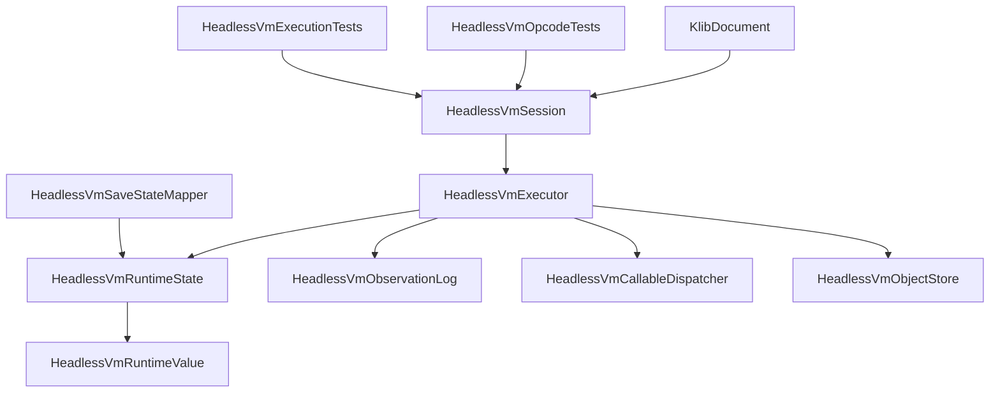
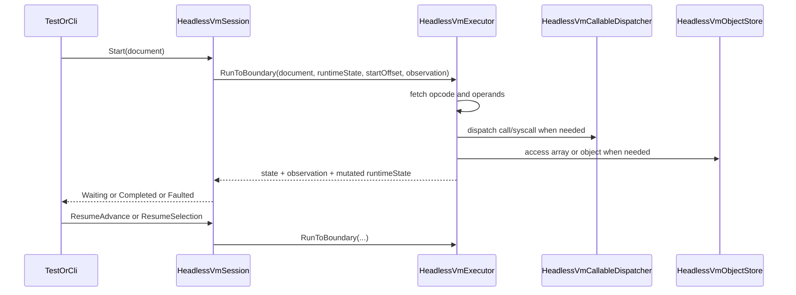

# Design Document

## Overview

`kes-headless-vm-full-opcodes` は、KoromoEventScript の headless VM を「最小集合のシナリオ再生器」から「`.klib` 仕様で定義された opcode を一通り解釈できる実行 core」へ拡張する設計である。対象利用者はコンパイラ開発者と CLI 利用者であり、UI runtime を起動せずに言語機能全体の回帰検証を行えることを目的とする。

本設計は `.klib` の仕様や compiler の lowering 契約を再定義しない。既存の `HeadlessVmSession` / `HeadlessVmExecutor` / save state 群を土台に、型付き runtime value、callable dispatch、object store、完全な opcode dispatch を `Execution` 層に追加し、headless 実行だけで変数、式、分岐、関数、配列、クラス、syscall を扱える境界を固定する。

### Goals

- `.klib` 仕様で定義された全 `KlibOpCode` を headless VM で解釈できる状態にする。
- 値スタック、変数、call frame、配列、クラスインスタンスを runtime 非依存に継続実行できる state モデルを定義する。
- compiler 駆動テストと synthetic document テストの両方で opcode 完全性を回帰確認できるようにする。

### Non-Goals

- `.klib` opcode、オペランド規約、source mapping 契約の変更。
- Windows / Unity / Unreal runtime の描画、音声、入力デバイス、UI widget の設計。
- save/load 公開契約の再設計、serializer 形式、保存先、セーブ UI の追加。

## Boundary Commitments

### This Spec Owns

- `Execution` 層における全 opcode の headless 実行意味。
- 実行中の値、変数、call frame、配列/クラス参照を保持する runtime state。
- `CALL*` / `SYSCALL*` / `CALL_METHOD*` を headless で継続可能な結果へ正規化する dispatch 契約。
- full opcode coverage を固定するテスト配置と検証方針。

### Out of Boundary

- `KlibCompiler` がどの構文からどの opcode を emit するかという lowering 方針。
- runtime 固有の視覚・音声演出、素材ロード、入力デバイス制御、待機 UI。
- `.klib` versioning、manifest、公開言語仕様、STL 仕様の変更。
- save slot、serializer、暗号化、完全セーブデータ構造。

### Allowed Dependencies

- `source/cli/KoromoEventScript.Cli/Compilation/KlibModels.cs` の `KlibDocument` と関連 enum / model。
- `source/cli/KoromoEventScript.Cli/Semantics/BuiltInSignatureRegistry.cs` の built-in callable 定義。
- `source/cli/KoromoEventScript.Cli/Execution/HeadlessVmSaveState*.cs` の save/load 契約。
- `docs/spec/k-intermediate-representation-spec.md`、`docs/spec/windows-runtime-spec.md`、既存 headless/save-state spec。
- 既存 NUnit テストプロジェクトと `HeadlessVmTestHelper`。

### Revalidation Triggers

- `KlibOpCode` 列挙や opcode operand 規約が変わるとき。
- compiler が `New`、`SetField`、`CallMethod*` など dormant opcode を emit し始めるとき。
- save/load が heap object や call frame の保存方式を変更するとき。
- runtime 側が headless VM に描画結果や音声状態の authoritative ownership を要求し始めるとき。

## Architecture

### Existing Architecture Analysis

現行 `Execution` 層は `HeadlessVmSession`、`HeadlessVmExecutor`、`HeadlessVmState`、`HeadlessVmObservationLog`、`HeadlessVmSaveStateMapper` を持つが、executor は最小のシナリオ opcode しか解釈しない。runtime state も `HeadlessVmSaveStateMapper` 内部の `HeadlessVmRuntimeState` に閉じており、`object?` ベースの値・変数・operand stack だけでは call、array、class、syscall を安定実装できない。

既存の良い境界は残す。`Session` は公開ライフサイクル、`Executor` は実行 orchestration、`Observation` は外部観測、`SaveState` は永続化契約を担当する。この設計では、その中間に runtime value / object / callable の責務を明示的に差し込み、unsupported opcode を giant switch で増やすのではなく interpreter core と補助 dispatcher の形へ一般化する。

### Architecture Pattern & Boundary Map

**Architecture Integration**:

- Selected pattern: stateful interpreter core + specialized dispatch services。
- Domain/feature boundaries: `Compilation` は bytecode 生成のみ、`Execution` は bytecode 解釈と runtime state のみ、`Tests` は compiler 駆動と synthetic document 駆動の検証のみを担当する。
- Existing patterns preserved: `Execution` 名前空間の session/executor 分離、immutable な state/observation record、save/load 契約の別責務化。
- New components rationale: 型付き runtime value、object store、callable dispatcher、expanded runtime state がないと opcode 完全性を bounded task に落とせない。
- Steering compliance: `.kiro/steering/` は未配置のため、`AGENTS.md`、既存 spec、公開仕様文書の境界に従う。



### Technology Stack

| Layer | Choice / Version | Role in Feature | Notes |
|-------|------------------|-----------------|-------|
| Frontend / CLI | .NET CLI 既存構成 | `KlibDocument` の生成と headless 実行入口 | 新規 CLI コマンドは対象外 |
| Backend / Services | C# / .NET 既存 runtime | interpreter core、runtime state、dispatch | `Execution` 名前空間を継続利用 |
| Data / Storage | In-memory runtime state | operand stack、variables、call frames、heap objects | 永続化形式は対象外 |
| Infrastructure / Runtime | NUnit / `dotnet test` | opcode 完全性の自動検証 | UI 起動なし |

## File Structure Plan

### Directory Structure

```text
source/cli/KoromoEventScript.Cli/
└── Execution/
    ├── HeadlessVmSession.cs              # 開始、再開、状態参照、save/load 接続の公開窓口
    ├── HeadlessVmExecutor.cs             # fetch/decode/dispatch、停止境界、fault 正規化
    ├── HeadlessVmState.cs                # 外部公開 state、stop reason、fault 契約
    ├── HeadlessVmObservation.cs          # transcript、current choices、runtime-neutral event
    ├── HeadlessVmRuntimeState.cs         # operand stack、variables、call stack、heap の authoritative live state
    ├── HeadlessVmRuntimeValue.cs         # 数値、bool、string、null、reference の型付き runtime value
    ├── HeadlessVmObjectStore.cs          # 配列と class instance の live object 管理
    ├── HeadlessVmCallableDispatcher.cs   # CALL*、SYSCALL*、CALL_METHOD* の解決と実行
    ├── HeadlessVmSaveState.cs            # save/load 用 snapshot 契約
    └── HeadlessVmSaveStateMapper.cs      # live runtime state と snapshot の相互変換
tests/KoromoEventScript.Cli.Tests/
└── Execution/
    ├── HeadlessVmExecutionTests.cs       # compiler 駆動の言語機能回帰
    ├── HeadlessVmOpcodeTests.cs          # synthetic document による opcode 単位検証
    ├── HeadlessVmSaveStateTests.cs       # full runtime state と save/load の整合
    └── HeadlessVmTestHelper.cs           # compiler fixture と synthetic KlibDocument helper
```

### Modified Files

- `source/cli/KoromoEventScript.Cli/Execution/HeadlessVmExecutor.cs` — unsupported 前提の最小 switch を full opcode dispatcher へ置き換える。
- `source/cli/KoromoEventScript.Cli/Execution/HeadlessVmSession.cs` — expanded runtime state、callable dispatcher、object store を使う session へ更新する。
- `source/cli/KoromoEventScript.Cli/Execution/HeadlessVmSaveStateMapper.cs` — `HeadlessVmRuntimeState` の独立化と typed value 変換に追随する。
- `source/cli/KoromoEventScript.Cli/Execution/HeadlessVmSaveState.cs` — 配列/参照/将来の call frame 保存に必要な snapshot 契約へ合わせる。
- `tests/KoromoEventScript.Cli.Tests/Execution/HeadlessVmExecutionTests.cs` — `SupportedOpCodes` ベースの unsupported test を置き換え、compiler 生成フローの期待値へ更新する。
- `tests/KoromoEventScript.Cli.Tests/Execution/HeadlessVmTestHelper.cs` — synthetic opcode document と runtime fixture の両方を支える helper を追加する。

## System Flows



重要な判断は 3 つある。1 つ目は executor が live state を自前で複製せず `HeadlessVmRuntimeState` を単一の authoritative source とすること、2 つ目は call/syscall/method 呼び出しを dispatcher へまとめて giant switch を避けること、3 つ目は array/class 参照を object store に集約して save/load と fault 判定を安定させることである。

## Requirements Traceability

| Requirement | Summary | Components | Interfaces | Flows |
|-------------|---------|------------|------------|-------|
| 1.1 | 定義済み opcode を未実装扱いで拒否しない | HeadlessVmExecutor, HeadlessVmCallableDispatcher, HeadlessVmObjectStore | Executor contract | Start/Resume flow |
| 1.2 | opcode 群ごとの結果を後続命令へ引き継ぐ | HeadlessVmRuntimeState, HeadlessVmRuntimeValue | Runtime state contract | Start/Resume flow |
| 1.3 | 仕様外 opcode を fault にする | HeadlessVmExecutor, HeadlessVmState | Fault contract | Error flow |
| 1.4 | 既存 session 契約を維持する | HeadlessVmSession, HeadlessVmState | Session API | Start/Resume flow |
| 2.1 | スタック操作を正しく再現する | HeadlessVmRuntimeState, HeadlessVmRuntimeValue, HeadlessVmExecutor | Runtime state contract | Start/Resume flow |
| 2.2 | 演算 opcode の結果を生成する | HeadlessVmExecutor, HeadlessVmRuntimeValue | Executor contract | Start/Resume flow |
| 2.3 | 変数識別子とスコープに対応する値状態を更新する | HeadlessVmRuntimeState, HeadlessVmSaveStateMapper | Runtime state contract | Start/Resume flow |
| 2.4 | オペランド不足や不正値形状を fault にする | HeadlessVmExecutor, HeadlessVmState | Fault contract | Error flow |
| 3.1 | `JUMP` / `JUMP_FALSE` / `LABEL` / `END` を offset 規約どおり処理する | HeadlessVmExecutor | Executor contract | Start/Resume flow |
| 3.2 | `SELECT` で choices と待機理由を保持する | HeadlessVmState, HeadlessVmObservationLog | State contract | Selection flow |
| 3.3 | 待機状態から正しい地点へ再開する | HeadlessVmSession, HeadlessVmRuntimeState | Resume API | Selection flow |
| 3.4 | 無効な制御フローを fault に正規化する | HeadlessVmExecutor, HeadlessVmState | Fault contract | Error flow |
| 4.1 | `CALL*` / `SYSCALL*` / `CALL_METHOD*` を引数順と戻り値契約どおり処理する | HeadlessVmCallableDispatcher, HeadlessVmRuntimeValue | Callable contract | Call flow |
| 4.2 | `ARRAY_*` の要素順、読取、更新を再現する | HeadlessVmObjectStore, HeadlessVmRuntimeState | Object store contract | Array flow |
| 4.3 | `NEW` / `GET_FIELD` / `SET_FIELD` / `DISPOSE` を継続実行可能な範囲で再現する | HeadlessVmObjectStore, HeadlessVmCallableDispatcher | Object store contract | Object flow |
| 4.4 | 呼び出し対象や index などの実行時不正を fault にする | HeadlessVmCallableDispatcher, HeadlessVmObjectStore, HeadlessVmState | Fault contract | Error flow |
| 5.1 | runtime 連携命令を headless で扱える形に正規化する | HeadlessVmCallableDispatcher, HeadlessVmObservationLog | Callable contract | Call flow |
| 5.2 | 描画・音声を直接再現できなくても継続可能にする | HeadlessVmCallableDispatcher, HeadlessVmState | Syscall contract | Call flow |
| 5.3 | 有効な `.klib` を opcode 未対応で fault させない | HeadlessVmExecutor, HeadlessVmOpcodeTests, HeadlessVmExecutionTests | Test contracts | All |
| 5.4 | runtime 非起動で言語機能全体を検証できる | HeadlessVmExecutionTests, HeadlessVmOpcodeTests, HeadlessVmTestHelper | Test helper contract | All |

## Components and Interfaces

| Component | Domain/Layer | Intent | Req Coverage | Key Dependencies (P0/P1) | Contracts |
|-----------|--------------|--------|--------------|--------------------------|-----------|
| HeadlessVmSession | Execution | headless 実行ライフサイクルの公開窓口 | 1.4, 3.3 | HeadlessVmExecutor (P0), HeadlessVmRuntimeState (P0), HeadlessVmSaveStateMapper (P1) | Service, State |
| HeadlessVmExecutor | Execution | full opcode dispatch と停止境界の制御 | 1.1, 1.3, 2.2, 3.1, 3.4 | KlibDocument (P0), HeadlessVmRuntimeState (P0), HeadlessVmCallableDispatcher (P0), HeadlessVmObjectStore (P0) | Service |
| HeadlessVmRuntimeState | Execution | operand stack、variables、call stack、heap の live state | 1.2, 2.1, 2.3, 3.3 | HeadlessVmRuntimeValue (P0), HeadlessVmObjectStore (P0) | State |
| HeadlessVmRuntimeValue | Execution | 演算と保存に使う型付き runtime value | 2.1, 2.2, 2.4, 4.1 | none | State |
| HeadlessVmCallableDispatcher | Execution | built-in call、syscall、method call の headless 実行 | 4.1, 4.4, 5.1, 5.2 | BuiltInSignatureRegistry (P0), HeadlessVmRuntimeState (P0), HeadlessVmObservationLog (P1) | Service, State |
| HeadlessVmObjectStore | Execution | 配列と class instance の生成・参照・更新・dispose | 4.2, 4.3, 4.4 | HeadlessVmRuntimeValue (P0), KlibDocument (P1) | Service, State |
| HeadlessVmSaveStateMapper | Execution | expanded runtime state と snapshot の相互変換 | 2.3, 3.3 | HeadlessVmRuntimeState (P0), HeadlessVmSaveState (P0) | Service, State |
| HeadlessVmExecutionTests | Tests | compiler 駆動の言語機能回帰 | 5.3, 5.4 | HeadlessVmSession (P0), HeadlessVmTestHelper (P0) | Service |
| HeadlessVmOpcodeTests | Tests | dormant opcode と fault 条件の直接検証 | 1.1, 1.3, 4.2, 4.3, 4.4, 5.3 | HeadlessVmSession (P0), HeadlessVmTestHelper (P0) | Service |

### Execution

#### HeadlessVmSession

| Field | Detail |
|-------|--------|
| Intent | 開始、再開、状態参照、save/load 接続の公開窓口 |
| Requirements | 1.4, 3.3 |

**Responsibilities & Constraints**

- `KlibDocument` と 1 つの `HeadlessVmRuntimeState` を束ねる。
- `Start`、`ResumeAdvance`、`ResumeSelection` は既存公開 API と互換のライフサイクルを維持する。
- 実行詳細や値操作は executor / dispatcher / object store へ委譲し、session 自身は orchestration と guard に専念する。

**Dependencies**

- Inbound: `HeadlessVmExecutionTests` / `HeadlessVmOpcodeTests` — headless 実行の利用口（P0）
- Outbound: `HeadlessVmExecutor` — opcode 実行（P0）
- Outbound: `HeadlessVmRuntimeState` — live state 所有（P0）
- Outbound: `HeadlessVmSaveStateMapper` — save/load 変換（P1）

**Contracts**: Service [x] / API [ ] / Event [ ] / Batch [ ] / State [x]

##### Service Interface

```csharp
public interface IHeadlessVmSession
{
    HeadlessVmState State { get; }
    HeadlessVmObservationLog Observation { get; }
    HeadlessVmSaveState ExportSaveState();
    void Start(KlibDocument document);
    void Restore(KlibDocument document, HeadlessVmSaveState snapshot);
    void ResumeAdvance();
    void ResumeSelection(int selectedIndex);
}
```

- Preconditions:
  - `Start` は有効な `KlibDocument` を受け取る。
  - `ResumeAdvance` は `WaitingForAdvance` でのみ呼び出す。
  - `ResumeSelection` は `WaitingForSelection` でのみ呼び出す。
- Postconditions:
  - `Start` / `Resume*` は `Waiting*`、`Completed`、`Faulted` のいずれかを返す。
  - `Restore` 後の session は再開可能な state を再構築する。
- Invariants:
  - live runtime state の authoritative source は session 配下の 1 つだけである。

**Implementation Notes**

- Integration: 将来 `kes run` が使っても API 形状はそのまま再利用できる。
- Validation: state に合わない resume 呼び出しは fault ではなく API misuse として拒否する。
- Risks: session が値操作責務を持ち始めると境界が崩れるため、実装レビューで executor への委譲漏れを重点確認する。

#### HeadlessVmExecutor

| Field | Detail |
|-------|--------|
| Intent | fetch/decode/dispatch と停止境界の制御 |
| Requirements | 1.1, 1.3, 2.2, 3.1, 3.4 |

**Responsibilities & Constraints**

- instruction offset から命令を取り出し、停止条件まで評価を進める。
- スタック、変数、配列、クラス、callable 呼び出しの状態更新は runtime state と補助 dispatcher を通して行う。
- unknown opcode、invalid offset、stack underflow、invalid control flow は必ず `Faulted` に正規化する。

**Dependencies**

- Inbound: `HeadlessVmSession` — 実行委譲元（P0）
- Outbound: `HeadlessVmRuntimeState` — live state 更新（P0）
- Outbound: `HeadlessVmCallableDispatcher` — `CALL*` / `SYSCALL*` / `CALL_METHOD*` 実行（P0）
- Outbound: `HeadlessVmObjectStore` — `ARRAY_*` / `NEW` / field / dispose（P0）
- External: `KlibDocument` — opcode と operand の入力契約（P0）

**Contracts**: Service [x] / API [ ] / Event [ ] / Batch [ ] / State [ ]

##### Service Interface

```csharp
public interface IHeadlessVmExecutor
{
    HeadlessVmExecutionResult RunToBoundary(
        KlibDocument document,
        HeadlessVmRuntimeState runtimeState,
        int startOffset,
        HeadlessVmObservationLog observation);
}
```

- Preconditions:
  - `startOffset` は既知命令 offset であるか、空 document のときだけ `0` である。
- Postconditions:
  - `RunToBoundary` は `Running` を返さず、待機・完了・失敗のいずれかへ到達して返る。
- Invariants:
  - opcode ごとの fault 条件は例外ではなく `HeadlessVmFault` へ集約される。

**Implementation Notes**

- Integration: `JumpFalse`、`Call`、`ArrayNew` など compiler 既出 opcode を first wave で実装し、dormant opcode も同じ dispatch テーブルに載せる。
- Validation: operand count、operand type、jump target、case offset の整合を opcode 単位で検証する。
- Risks: giant switch のまま責務が肥大化しやすいため、callable/object 群は委譲を強制する。

#### HeadlessVmRuntimeState

| Field | Detail |
|-------|--------|
| Intent | live 実行に必要な mutable state の単一所有 |
| Requirements | 1.2, 2.1, 2.3, 3.3 |

**Responsibilities & Constraints**

- operand stack、variable values、call frames、heap object references を保持する。
- variable は `var_idx` または stable ID ベースの両方で save/load と整合するように扱う。
- `WaitingForSelection` などの外向き state に保持しない内部値はすべてここに集約する。

**Dependencies**

- Inbound: `HeadlessVmExecutor` — opcode 実行時に更新（P0）
- Inbound: `HeadlessVmSaveStateMapper` — export/import 対象（P0）
- Outbound: `HeadlessVmRuntimeValue` — stack と variable の値型（P0）
- Outbound: `HeadlessVmObjectStore` — reference 解決（P0）

**Contracts**: Service [ ] / API [ ] / Event [ ] / Batch [ ] / State [x]

##### State Management

- State model: session 単位の mutable runtime state
- Persistence & consistency: live state はここが authoritative source、save/load は snapshot に写像する
- Concurrency strategy: session 単位で単一スレッド前提

**Implementation Notes**

- Integration: 現在 `HeadlessVmSaveStateMapper` 内部の `HeadlessVmRuntimeState` をここへ昇格させる。
- Validation: stack underflow、unknown variable slot、dangling object reference を helper API で即座に検出する。
- Risks: state が外部から直接書き換えられると壊れるため、公開 API は最小に保つ。

#### HeadlessVmRuntimeValue

| Field | Detail |
|-------|--------|
| Intent | headless VM が扱う値の型安全な共通表現 |
| Requirements | 2.1, 2.2, 2.4, 4.1 |

**Responsibilities & Constraints**

- `Null`、`Number`、`Bool`、`String`、`Reference` を discriminated value として持つ。
- 演算、比較、論理、display string 変換、snapshot 変換の基礎型となる。
- 配列とクラスインスタンスは object store を介した `Reference` として扱い、raw object を露出しない。

**Dependencies**

- Inbound: `HeadlessVmRuntimeState`、`HeadlessVmCallableDispatcher`、`HeadlessVmObjectStore`（P0）

**Contracts**: Service [ ] / API [ ] / Event [ ] / Batch [ ] / State [x]

##### State Management

- State model: immutable value object
- Persistence & consistency: save/load snapshot へ loss-aware に変換可能
- Concurrency strategy: immutable

**Implementation Notes**

- Integration: `HeadlessVmValueSnapshot` との相互変換は mapper 側に集約し、value 自体は live runtime semantics に集中させる。
- Validation: 不正型演算は `Faulted` の材料になる識別可能な error を返す。
- Risks: `object?` 互換 API を残しすぎると型安全の効果が失われる。

#### HeadlessVmCallableDispatcher

| Field | Detail |
|-------|--------|
| Intent | 関数、syscall、メソッド呼び出しを headless 実行へ正規化する |
| Requirements | 4.1, 4.4, 5.1, 5.2 |

**Responsibilities & Constraints**

- `CALL` / `CALL_VOID` は built-in callable と将来の user-defined callable の双方を扱える入口にする。
- `SYSCALL` / `SYSCALL_VOID` は headless 実行で必要な観測イベント、待機、戻り値、no-op を定義する。
- `CALL_METHOD` / `CALL_METHOD_VOID` は receiver 参照を object store と連携して解決する。

**Dependencies**

- Inbound: `HeadlessVmExecutor` — opcode 実行時の委譲元（P0）
- Outbound: `HeadlessVmRuntimeState` — 引数 pop / 戻り値 push（P0）
- Outbound: `HeadlessVmObservationLog` — `scenario.say` / `scenario.nar` / `select` 周辺イベント（P1）
- Outbound: `HeadlessVmObjectStore` — receiver 参照解決（P0）
- External: `BuiltInSignatureRegistry` — built-in 名とシグネチャ（P0）

**Contracts**: Service [x] / API [ ] / Event [ ] / Batch [ ] / State [x]

##### Service Interface

```csharp
public interface IHeadlessVmCallableDispatcher
{
    HeadlessVmCallableResult InvokeCall(string name, int argc, bool returnsValue, HeadlessVmRuntimeState runtimeState);
    HeadlessVmCallableResult InvokeSysCall(string name, int argc, bool returnsValue, HeadlessVmRuntimeState runtimeState, HeadlessVmObservationLog observation);
    HeadlessVmCallableResult InvokeMethod(int methodReferenceIndex, int argc, bool returnsValue, HeadlessVmRuntimeState runtimeState);
}
```

- Preconditions:
  - `argc` に対応する引数が runtime state に積まれている。
  - method call は receiver 参照が stack 上に存在する。
- Postconditions:
  - returnsValue が真なら戻り値が stack に push されるか、fault が返る。
  - `scenario.say` / `scenario.nar` は待機可能なイベントへ正規化される。
- Invariants:
  - headless で非再現の runtime 効果は no-op または観測イベント化し、raw UI dependency を持ち込まない。

**Implementation Notes**

- Integration: `print`、`array_len`、`range`、`assert`、`wait`、`bg`、`show` などは headless 意味をここで集中管理する。
- Validation: 未知 callable 名、引数不足、receiver 不整合、戻り値利用違反は fault 化する。
- Risks: runtime 効果を全部 event 化すると責務が広がりすぎるため、テスト観測に必要な最小集合だけ event とする。

#### HeadlessVmObjectStore

| Field | Detail |
|-------|--------|
| Intent | 配列と class instance の live object を管理する |
| Requirements | 4.2, 4.3, 4.4 |

**Responsibilities & Constraints**

- `ARRAY_NEW`、`ARRAY_GET`、`ARRAY_SET` を一貫した参照モデルで支える。
- `NEW`、`GET_FIELD`、`SET_FIELD`、`CALL_METHOD*`、`DISPOSE` の receiver と member state を保持する。
- object identity は runtime 中だけ有効な reference ID とし、外部へ raw object を出さない。

**Dependencies**

- Inbound: `HeadlessVmExecutor`、`HeadlessVmCallableDispatcher` — opcode / method 実行時に利用（P0）
- Outbound: `HeadlessVmRuntimeValue` — reference value の生成（P0）
- External: `KlibDocument` constants / refs — fieldRef, methodRef, classRef の解決補助（P1）

**Contracts**: Service [x] / API [ ] / Event [ ] / Batch [ ] / State [x]

##### State Management

- State model: session 単位の object table
- Persistence & consistency: live 中は reference ID が authoritative、save/load は snapshot 化可能な範囲だけ保持
- Concurrency strategy: runtime state と同じく単一スレッド

**Implementation Notes**

- Integration: class instance の field storage は `fieldRef` index ベースで持ち、symbol 解決責務を compiler 側へ戻さない。
- Validation: 範囲外 index、未知 object ID、未定義 field/method は fault 化する。
- Risks: save/load で object graph をどう snapshot 化するかは既存 save-state spec の再検証トリガーになる。

#### HeadlessVmSaveStateMapper

| Field | Detail |
|-------|--------|
| Intent | expanded runtime state と save snapshot の整合維持 |
| Requirements | 2.3, 3.3 |

**Responsibilities & Constraints**

- typed runtime value と variable/call frame/object reference を save snapshot へ変換する。
- restore 時に runtime state の最小再構築を行い、resume 可能状態へ戻す。
- full opcode 対応で増えた state を save/load 契約と矛盾なく扱う。

**Dependencies**

- Inbound: `HeadlessVmSession` — export/import の公開利用口（P0）
- Outbound: `HeadlessVmRuntimeState` — restore 先 live state（P0）
- Outbound: `HeadlessVmSaveState` — snapshot 契約（P0）

**Contracts**: Service [x] / API [ ] / Event [ ] / Batch [ ] / State [x]

##### Service Interface

```csharp
public interface IHeadlessVmSaveStateMapper
{
    HeadlessVmSaveState Export(HeadlessVmSession session);
    void Restore(HeadlessVmSession session, KlibDocument document, HeadlessVmSaveState snapshot);
}
```

- Preconditions:
  - export は started かつ faulted でない session に対して行う。
- Postconditions:
  - restore 後の session は `Running`、`WaitingForAdvance`、`WaitingForSelection`、`Completed` のいずれかになる。
- Invariants:
  - live runtime state の authoritative source は restore 後も `HeadlessVmRuntimeState` に一元化される。

**Implementation Notes**

- Integration: 現在 mapper 内に閉じている runtime state 型を外出しし、save/load はその利用者になる。
- Validation: unsupported snapshot value、unknown object reference、inconsistent continuation payload を restore fault として扱う。
- Risks: object snapshot 範囲が広がる場合は `kes-vm-save-state` spec の再検証が必要。

### Tests

#### HeadlessVmExecutionTests

| Field | Detail |
|-------|--------|
| Intent | compiler 生成 `.klib` で言語機能回帰を固定する |
| Requirements | 5.3, 5.4 |

**Responsibilities & Constraints**

- `if`、`while`、`for`、built-in command、`say` / `nar` / `select` を compiler 経由で検証する。
- runtime 観測、変数更新、待機・再開の user-visible contract を固定する。
- unsupported opcode 前提の期待値を残さない。

**Dependencies**

- Outbound: `HeadlessVmSession` — 実行対象（P0）
- Outbound: `HeadlessVmTestHelper` — scenario compile helper（P0）

**Contracts**: Service [x] / API [ ] / Event [ ] / Batch [ ] / State [ ]

**Implementation Notes**

- Integration: 既存 broad-surface fixture を活かしつつ、言語機能別の小さな scenario に分割する。
- Validation: transcript、state kind、variable-visible outcome、branch result を assert する。
- Risks: compiler の変更影響が大きいので synthetic tests と役割を分ける。

#### HeadlessVmOpcodeTests

| Field | Detail |
|-------|--------|
| Intent | dormant opcode と fault 条件を synthetic document で直接固定する |
| Requirements | 1.1, 1.3, 4.2, 4.3, 4.4, 5.3 |

**Responsibilities & Constraints**

- compiler がまだ emit しない opcode も `KlibDocument` 直構築で検証する。
- stack underflow、invalid field/method/index、unknown opcode の fault を opcode 単位で固定する。
- `.klib` 仕様のオペランド規約を headless 実装に直結させる。

**Dependencies**

- Outbound: `HeadlessVmSession` — 実行対象（P0）
- Outbound: `HeadlessVmTestHelper` — synthetic document helper（P0）

**Contracts**: Service [x] / API [ ] / Event [ ] / Batch [ ] / State [ ]

**Implementation Notes**

- Integration: `SupportedOpCodes` の列挙型除外テストは廃止し、opcode ごとの期待 state/fault を明示する。
- Validation: `ArraySet`、`New`、`GetField`、`SetField`、`CallMethod*`、`Dispose` の最小 happy path と failure path を持つ。
- Risks: synthetic document が `.klib` 仕様からずれないよう helper で size/offset 規約を共有する。

## Data Models

### Domain Model

- `HeadlessVmRuntimeState`: live operand stack、variables、call frames、object references を束ねる aggregate。
- `HeadlessVmRuntimeValue`: 数値、bool、string、null、reference の value object。
- `HeadlessVmObjectStore`: array instance と class instance の session-local repository。
- `HeadlessVmCallableResult`: call/syscall/method 実行結果、待機要求、fault を返す service result。
- `HeadlessVmState`: 外部公開される waiting/completed/faulted 状態。

### Logical Data Model

- variable values は `var_idx` を一次参照とし、save/load では stable ID と scope を併記する。
- operand stack は `HeadlessVmRuntimeValue` の LIFO とする。
- object store は `objectId -> array or class-instance payload` の map を持つ。
- class instance payload は `fieldRef index -> HeadlessVmRuntimeValue` を保持する。
- call frame は current script と return offset を持ち、将来 cross-script call にも拡張可能な最小契約とする。

### Data Contracts & Integration

- Session input: `KlibDocument`
- Session live output: `HeadlessVmState`, `HeadlessVmObservationLog`
- Internal execution contract: `HeadlessVmRuntimeState`, `HeadlessVmRuntimeValue`, `HeadlessVmCallableResult`
- Save/load contract: `HeadlessVmSaveState`

## Error Handling

### Error Strategy

headless VM は「未実装だから generic exception を投げる」を許さない。未知 opcode、stack underflow、型不整合、未知 callable、invalid object reference、範囲外 array index、invalid control flow はすべて `HeadlessVmFault` に正規化する。一方、`ResumeAdvance` を誤った state で呼ぶような session API misuse は実行 fault と混ぜず、即時拒否する。

### Error Categories and Responses

- User Errors: 対象外。headless VM は end-user 向け UI 入力面を持たない。
- System Errors: unknown opcode、unknown offset、dangling object reference、unsupported snapshot は `Faulted` に遷移する。
- Business Logic Errors: 引数不足、戻り値利用違反、範囲外 index、未定義 field/method は識別可能な fault message を返す。

### Monitoring

- fault payload は script id、instruction offset、可能なら source mapping を持つ。
- test failure では opcode 名、stack 状態、choices、直近 transcript を追跡できる helper を整備する。

## Testing Strategy

### Unit Tests

- `HeadlessVmRuntimeValue` が演算・比較・display string 変換を正しく扱う。
- `HeadlessVmRuntimeState` が stack underflow と unknown variable slot を検出する。
- `HeadlessVmCallableDispatcher` が built-in call と syscall の戻り値・待機・fault を正規化する。
- `HeadlessVmObjectStore` が array/class 参照の生成、取得、更新、dispose を検証する。

### Integration Tests

- compiler 生成の `if` / `while` / `for` シナリオが `JumpFalse`、演算、変数更新を通して正しく完了する。
- built-in command を含む scenario が `Call` / `CallVoid` 経由で継続実行できる。
- `say` / `nar` / `select` と一般 opcode が混在する scenario が待機と再開を維持する。
- save/load round-trip 後も expanded runtime state で同じ分岐先へ再開できる。

## Supporting References

- 設計判断の比較、compiler が emit している opcode 群、save/load との結合点は `research.md` を参照する。
