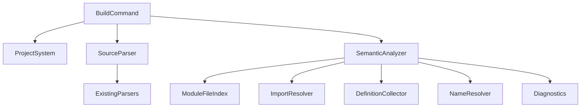
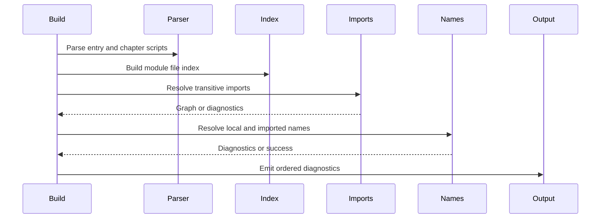

# Design Document

## Overview

This feature adds semantic import resolution to the existing KES CLI validation flow. CLI users can split reusable definitions into imported script files, and compiler developers get a bounded semantic stage that resolves import dependencies before later name resolution.

The implementation extends the current `KoromoEventScript.Cli` project. Existing lexer/parser types continue to own syntax only; import resolution runs after `.kel` chapter discovery and `.kc`/`.kc` parsing, then feeds imported definitions into a minimal name-resolution pass used by `kes build --check-only`.

### Goals

- Resolve import module names against project script inputs.
- Build stable transitive import dependencies with duplicate and cycle handling.
- Report import and name-resolution diagnostics using the existing CLI diagnostic contract.
- Integrate compile-stage failures into `kes build --check-only` exit code behavior.

### Non-Goals

- Adding new import syntax.
- Extending `.kel` syntax.
- Completing full type checking, expression typing, IR generation, manifest generation, or runtime startup.
- Changing parser grammar except where required to expose existing syntax information.

## Boundary Commitments

### This Spec Owns

- Import module discovery and resolution for parsed KES script files.
- Import dependency graph construction, including transitive imports, duplicate suppression, ambiguity detection, and cycle diagnostics.
- Minimal exported-definition collection from parsed script syntax.
- Minimal name lookup that can distinguish imported, local, missing, colliding, and ambiguous names.
- `kes build --check-only` integration for import/name-resolution diagnostics and compile-stage exit code `4`.

### Out of Boundary

- Parser ownership of import semantics.
- `.kel` key semantics beyond providing script entry references already used by build validation.
- Type checking, resource validation, code generation, `.klib` output, manifest output, and runtime launch.
- New project configuration fields or external package dependencies.

### Allowed Dependencies

- Existing `ProjectConfig` / project root resolution to locate the project and `Paths.Events`.
- Existing `SourceFileParser`, `KeParser`, `KelParser`, and syntax node records.
- Existing `Diagnostic`, `DiagnosticSink`, and CLI exit code conventions.
- .NET filesystem APIs for project-local script discovery and file reading.

### Revalidation Triggers

- Changes to import syntax or `ImportStatementSyntax`.
- Changes to canonical script extensions or `Paths.Events` meaning.
- Changes to diagnostic code classification or CLI exit codes.
- Changes to top-level definition syntax nodes such as `fn`, `class`, `enum`, or `actor`.
- Changes to `kes build --check-only` stage ordering.

## Architecture

### Existing Architecture Analysis

The current CLI has a thin `Program` → `CliApplication` → `BuildCheckOnlyCommand` flow. `BuildCheckOnlyCommand` resolves the project, loads `kes.xml`, parses entry `.kel`, extracts `chapter` script references, parses each referenced script, and returns success, syntax, or file I/O exit codes.

`KeParser` already emits `ImportStatementSyntax`, and current tests verify import placement constraints. No semantic stage currently consumes imports or exported definitions. This design adds a semantic boundary after script parsing and before final exit-code selection.

### Architecture Pattern & Boundary Map

Selected pattern: existing thin command orchestration plus dedicated semantic services. The build command remains responsible for stage ordering; import and name-resolution behavior lives under a semantic boundary.



Dependency direction: command layer depends on build/project/semantic services; semantic services depend on parsing syntax and diagnostics; parser and diagnostics primitives do not depend on semantic or command-layer types.

### Technology Stack

| Layer | Choice / Version | Role in Feature | Notes |
|-------|------------------|-----------------|-------|
| CLI | .NET `net10.0` | `kes build --check-only` integration | Existing project target |
| Parsing | Existing KES lexer/parser | Source syntax input | No parser semantic ownership |
| Semantics | New in-process C# services | Import graph and name lookup | No external dependency |
| Tests | NUnit 4.x | Unit and integration validation | Existing test stack |

## File Structure Plan

### Directory Structure

```txt
source/cli/KoromoEventScript.Cli/
├── Semantics/
│   ├── SemanticAnalyzer.cs
│   ├── SemanticAnalysisResult.cs
│   ├── ScriptDocument.cs
│   ├── ModuleFileIndex.cs
│   ├── ModuleFileMatch.cs
│   ├── ImportResolver.cs
│   ├── ImportResolutionResult.cs
│   ├── ImportGraph.cs
│   ├── DefinitionCollector.cs
│   ├── SymbolDefinition.cs
│   ├── NameResolver.cs
│   └── NameResolutionResult.cs
```

### Modified Files

- `source/cli/KoromoEventScript.Cli/Commands/Build/BuildCheckOnlyCommand.cs` — collect parsed scripts into semantic documents, run semantic analysis, and map semantic diagnostics to exit code `4` or `6`.
- `source/cli/KoromoEventScript.Cli/Commands/CliExitCode.cs` — ensure compile error exit code is available and used by build flow.
- `source/cli/KoromoEventScript.Cli/Build/SourceFileParser.cs` — no ownership change; may expose read/parse helpers only if required by import resolver.
- `source/cli/KoromoEventScript.Cli/ProjectSystem/ProjectConfig.cs` — existing `EventsPath` is used by module indexing; no new fields expected.
- `source/cli/KoromoEventScript.Cli/Parsing/SyntaxNodes.cs` — only modified if existing syntax nodes lack source-location data needed for diagnostics.
- `tests/KoromoEventScript.Cli.Tests/Semantics/*` — unit tests for module index, import graph, definition collection, and name resolver.
- `tests/KoromoEventScript.Cli.Tests/Commands/BuildCheckOnlyCommandTests.cs` — integration tests for check-only import behavior and exit codes.
- `testdata/projects/*` — project fixtures for successful import, missing import, ambiguous import, cycle import, and imported-name lookup.

## System Flows



File and syntax failures remain earlier stages. Import graph errors are compile-stage errors except unreadable import files, which remain file I/O stage errors.

## Requirements Traceability

| Requirement | Summary | Components | Interfaces | Flows |
|-------------|---------|------------|------------|-------|
| 1.1 | import 文を処理する | `SemanticAnalyzer`, `ImportResolver` | `Analyze`, `ResolveImports` | Semantic flow |
| 1.2 | 拡張子なし module 解決 | `ModuleFileIndex` | `FindModule` | Semantic flow |
| 1.3 | プロジェクト基準解決 | `ModuleFileIndex` | `Build` | Semantic flow |
| 1.4 | 未存在 import 診断 | `ImportResolver` | `ImportResolutionResult` | Error flow |
| 1.5 | あいまい import 診断 | `ModuleFileIndex`, `ImportResolver` | `ModuleFileMatch` | Error flow |
| 2.1 | 直接 import 依存 | `ImportGraph` | `ImportGraph` state | Semantic flow |
| 2.2 | transitive import | `ImportResolver` | `ResolveImports` | Semantic flow |
| 2.3 | duplicate import 抑制 | `ImportGraph` | module identity | Semantic flow |
| 2.4 | 安定順序 | `ImportGraph` | ordered documents | Semantic flow |
| 2.5 | artifact 不要 | `BuildCheckOnlyCommand`, `SemanticAnalyzer` | read-only analysis | Semantic flow |
| 3.1 | 未存在診断形式 | `ImportResolver` | diagnostics | Error flow |
| 3.2 | 読取失敗診断 | `ImportResolver`, `SourceFileParser` | diagnostics | Error flow |
| 3.3 | 循環診断 | `ImportResolver`, `ImportGraph` | cycle path | Error flow |
| 3.4 | import 先構文診断 | `ImportResolver`, `SourceFileParser` | parse result | Error flow |
| 3.5 | 診断順序 | `SemanticAnalysisResult` | ordered diagnostics | Error flow |
| 4.1 | imported definitions available | `DefinitionCollector`, `NameResolver` | symbol tables | Name flow |
| 4.2 | imported refs not undefined | `NameResolver` | `ResolveNames` | Name flow |
| 4.3 | unimported refs undefined | `NameResolver` | diagnostics | Name flow |
| 4.4 | local/import collision | `NameResolver` | diagnostics | Name flow |
| 4.5 | ambiguous imported names | `NameResolver` | diagnostics | Name flow |
| 5.1 | check-only includes imports | `BuildCheckOnlyCommand`, `SemanticAnalyzer` | command execution | Build flow |
| 5.2 | success exit code | `BuildCheckOnlyCommand` | exit code | Build flow |
| 5.3 | compile exit code | `BuildCheckOnlyCommand` | exit code `4` | Build flow |
| 5.4 | file I/O exit code | `BuildCheckOnlyCommand`, `ImportResolver` | exit code `6` | Build flow |
| 5.5 | earliest stage wins | `BuildCheckOnlyCommand` | stage ordering | Build flow |

## Components and Interfaces

| Component | Domain/Layer | Intent | Req Coverage | Key Dependencies | Contracts |
|-----------|--------------|--------|--------------|------------------|-----------|
| `SemanticAnalyzer` | Semantics | Orchestrate import and name analysis | 1.1, 2.1-2.5, 4.1-4.5, 5.1 | ImportResolver P0, DefinitionCollector P0, NameResolver P0 | Service |
| `ModuleFileIndex` | Semantics | Map module names to project script files | 1.2, 1.3, 1.5 | ProjectConfig P0, filesystem P0 | Service, State |
| `ImportResolver` | Semantics | Resolve transitive import graph and import diagnostics | 1.1, 1.4, 2.1-2.4, 3.1-3.4 | ModuleFileIndex P0, SourceFileParser P0 | Service |
| `ImportGraph` | Semantics | Represent ordered import dependencies | 2.1-2.4, 3.3 | ScriptDocument P0 | State |
| `DefinitionCollector` | Semantics | Extract top-level symbols from parsed scripts | 4.1, 4.4, 4.5 | ScriptSyntax P0 | Service |
| `NameResolver` | Semantics | Check identifier references against local and imported definitions | 4.1-4.5 | SymbolDefinition P0, ImportGraph P0 | Service |

### Semantics Layer

#### `SemanticAnalyzer`

| Field | Detail |
|-------|--------|
| Intent | Run semantic validation after syntax parsing |
| Requirements | 1.1, 2.1, 2.2, 2.3, 2.4, 2.5, 4.1, 4.2, 4.3, 4.4, 4.5, 5.1 |

**Responsibilities & Constraints**
- Accept already parsed chapter scripts from build validation.
- Build module index once for the project.
- Resolve imports before name resolution.
- Preserve diagnostic order by stage and traversal order.
- Never generate artifacts or start runtime.

**Dependencies**
- Inbound: `BuildCheckOnlyCommand` — semantic stage invocation (P0)
- Outbound: `ModuleFileIndex`, `ImportResolver`, `DefinitionCollector`, `NameResolver` — semantic work (P0)

**Contracts**: Service [x] / API [ ] / Event [ ] / Batch [ ] / State [ ]

##### Service Interface

```csharp
public sealed class SemanticAnalyzer
{
    public SemanticAnalysisResult Analyze(
        ProjectConfig config,
        IReadOnlyList<ScriptDocument> entryDocuments);
}

public sealed record SemanticAnalysisResult(
    CliExitCode ExitCode,
    IReadOnlyList<Diagnostic> Diagnostics,
    ImportGraph? ImportGraph);
```

- Preconditions: `entryDocuments` contains successfully parsed script files referenced from entry `.kel`.
- Postconditions: success returns an import graph and no diagnostics; failure returns ordered diagnostics and a CLI stage exit code.
- Invariants: file I/O diagnostics map to `FileOrDirectoryError`; semantic diagnostics map to `CompileError`.

#### `ModuleFileIndex`

| Field | Detail |
|-------|--------|
| Intent | Resolve module names to project script files |
| Requirements | 1.2, 1.3, 1.5 |

**Responsibilities & Constraints**
- Scan the project event source root for `.kc` and current-compatible `.kc` files.
- Use base filename without extension as the module key.
- Treat duplicate module keys as ambiguous.
- Return project-relative display paths for diagnostics.

**Dependencies**
- Inbound: `ImportResolver` — module lookup (P0)
- Outbound: filesystem and `ProjectConfig.EventsPath` — script discovery (P0)

**Contracts**: Service [x] / API [ ] / Event [ ] / Batch [ ] / State [x]

##### Service Interface

```csharp
public sealed class ModuleFileIndex
{
    public ModuleFileIndexResult Build(ProjectConfig config);
    public ModuleFileMatch FindModule(string moduleName);
}
```

- Preconditions: project root and events path are resolved.
- Postconditions: each module lookup is `Found`, `Missing`, or `Ambiguous`.
- Invariants: module identity is case-sensitive and based on filename without extension.

#### `ImportResolver`

| Field | Detail |
|-------|--------|
| Intent | Resolve import dependencies and detect import failures |
| Requirements | 1.1, 1.4, 2.1, 2.2, 2.3, 2.4, 3.1, 3.2, 3.3, 3.4 |

**Responsibilities & Constraints**
- Traverse `ImportStatementSyntax` from parsed scripts.
- Parse imported files that were not already parsed by the build stage.
- Detect missing, ambiguous, unreadable, syntax-invalid, and cyclic imports.
- Preserve first-seen order and avoid duplicate parse work.

**Dependencies**
- Inbound: `SemanticAnalyzer` — import graph construction (P0)
- Outbound: `ModuleFileIndex` — module lookup (P0)
- Outbound: `SourceFileParser` — imported source parsing (P0)

**Contracts**: Service [x] / API [ ] / Event [ ] / Batch [ ] / State [ ]

##### Service Interface

```csharp
public sealed class ImportResolver
{
    public ImportResolutionResult ResolveImports(
        ModuleFileIndex moduleIndex,
        IReadOnlyList<ScriptDocument> roots);
}
```

- Preconditions: roots are syntax-valid scripts.
- Postconditions: success returns an `ImportGraph`; failure returns ordered diagnostics.
- Invariants: cycle diagnostics include the import path that formed the cycle.

#### `DefinitionCollector`

| Field | Detail |
|-------|--------|
| Intent | Collect top-level definitions available to name resolution |
| Requirements | 4.1, 4.4, 4.5 |

**Responsibilities & Constraints**
- Extract supported top-level definitions from `ScriptSyntax`.
- Initially include parsed top-level declarations already represented in syntax nodes, such as variables and labels.
- Keep collection extensible for future `fn`, `class`, `enum`, and `actor` syntax nodes without changing import graph behavior.
- Report duplicate definitions within a module as compile diagnostics.

**Dependencies**
- Inbound: `SemanticAnalyzer`, `NameResolver` — symbol table construction (P0)
- Outbound: parser syntax nodes — source definitions (P0)

**Contracts**: Service [x] / API [ ] / Event [ ] / Batch [ ] / State [ ]

##### Service Interface

```csharp
public sealed class DefinitionCollector
{
    public DefinitionCollectionResult Collect(ScriptDocument document);
}

public sealed record SymbolDefinition(
    string Name,
    string ModuleName,
    string File,
    int Line,
    int Column);
```

- Preconditions: document syntax is parse-successful.
- Postconditions: exported symbols are stable and source-located.
- Invariants: symbol names remain case-sensitive.

#### `NameResolver`

| Field | Detail |
|-------|--------|
| Intent | Resolve references against local and imported symbols |
| Requirements | 4.1, 4.2, 4.3, 4.4, 4.5 |

**Responsibilities & Constraints**
- Build lookup scope from local definitions plus imported module definitions.
- Treat local/import collisions and multiple imported definitions as compile diagnostics.
- Report unresolved references only for syntactic identifier positions that current parser exposes.
- Avoid type checking and expression evaluation.

**Dependencies**
- Inbound: `SemanticAnalyzer` — final semantic validation (P0)
- Outbound: `DefinitionCollector`, `ImportGraph` — symbols and imports (P0)

**Contracts**: Service [x] / API [ ] / Event [ ] / Batch [ ] / State [ ]

##### Service Interface

```csharp
public sealed class NameResolver
{
    public NameResolutionResult ResolveNames(
        ImportGraph graph,
        IReadOnlyDictionary<string, IReadOnlyList<SymbolDefinition>> symbolsByModule);
}
```

- Preconditions: import graph has no missing modules or cycles.
- Postconditions: diagnostics identify missing, colliding, or ambiguous names.
- Invariants: imported names are visible only through the importing module's dependency graph.

## Data Models

### Domain Model

- `ScriptDocument`: project-relative path, module name, and parsed `ScriptSyntax`.
- `ModuleFileMatch`: discriminated result for found/missing/ambiguous module lookup.
- `ImportGraph`: ordered modules, direct import edges, transitive reachability, and cycle path data.
- `SymbolDefinition`: exported name plus source location.

### Data Contracts & Integration

Diagnostics follow the existing CLI contract:

| Category | Code Range | Exit Code | Notes |
|----------|------------|-----------|-------|
| Import file I/O | `KES9xxx` | `6` | Missing or unreadable import file |
| Import/name semantic error | `KES2xxx` | `4` | Missing module, ambiguous module, cycle, name error |
| Syntax in imported file | `KES1xxx` | `3` | Syntax stage remains earlier than compile |

## Error Handling

### Error Strategy

- Missing or unreadable import file produces file I/O diagnostics and exit code `6`.
- Ambiguous import, cycle import, duplicate definition, unresolved name, and ambiguous name produce compile diagnostics and exit code `4`.
- Syntax diagnostics in imported files preserve syntax classification and exit code `3`.
- Earlier stages still win: project/config/source read failures skip semantic analysis.

### Error Categories and Responses

| Error | Response |
|-------|----------|
| Missing module | Diagnostic at import statement location with module name |
| Ambiguous module | Diagnostic listing matching project-relative paths |
| Import cycle | Diagnostic listing cycle path in traversal order |
| Unreadable import file | File I/O diagnostic for import target |
| Imported syntax error | Imported file syntax diagnostic preserved |
| Missing imported name | Compile diagnostic at reference location |
| Name collision | Compile diagnostic naming the conflicting definitions |

### Monitoring

No telemetry is added. Console diagnostics and test assertions are the observable reporting mechanism.

## Testing Strategy

### Unit Tests

- `ModuleFileIndexTests` verifies `.kc` and `.kc` module discovery, missing module lookup, and ambiguous module lookup.
- `ImportResolverTests` verifies direct imports, transitive imports, duplicate import suppression, stable order, missing imports, cycles, and syntax-invalid imported files.
- `DefinitionCollectorTests` verifies supported top-level definitions and duplicate definitions.
- `NameResolverTests` verifies imported definition lookup, unimported unresolved names, local/import collisions, and ambiguous imported names.

### Integration Tests

- `BuildCheckOnlyCommandTests` verifies a project with imported definitions succeeds.
- `BuildCheckOnlyCommandTests` verifies missing import returns file I/O exit code `6`.
- `BuildCheckOnlyCommandTests` verifies cycle and ambiguity diagnostics return compile exit code `4`.
- `BuildCheckOnlyCommandTests` verifies imported file syntax errors return syntax exit code `3`.
- JSON Lines diagnostics preserve order and fields for import-related diagnostics.

### Regression Checks

- Existing lexer/parser/diagnostic tests continue to pass.
- Existing `kes build --check-only` minimal project remains successful without import files.
- `git diff --check` passes for changed source, test, and spec files.

## Performance & Scalability

Import resolution scans project script files once per invocation and parses each imported file at most once. Duplicate imports reuse the same module document within the invocation. No persistent cache is introduced in this spec.
