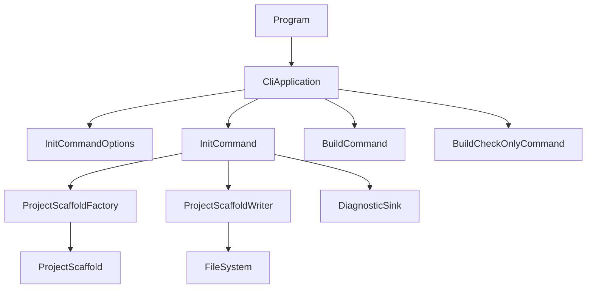
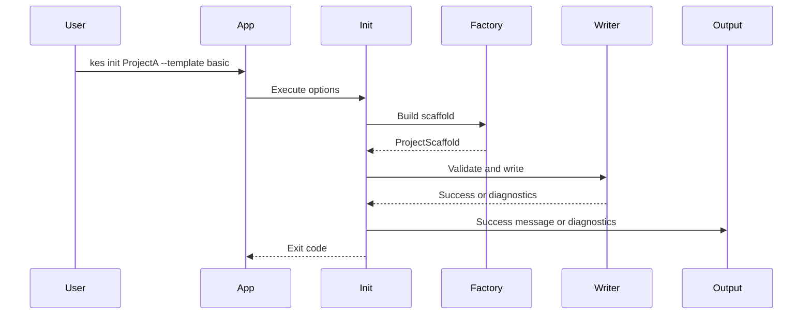

# Design Document

## Overview

`kes init` は、KoromoEventScript の CLI 利用者が公開仕様どおりの新規プロジェクトをすぐ作り始められるようにする機能である。現在の CLI は `build` 系のルートしか持たないため、利用者は `kes.xml`、イベントファイル、素材配置先ディレクトリを手作業で用意する必要がある。本 feature では、`CliApplication` に `init` ルートを追加し、標準構成とテンプレート差分を安全に生成する。

この設計は既存の「薄い CLI ルータ + 専用 command」パターンを維持する。`CliApplication` は `kes init` の引数を typed options へ変換し、`InitCommand` が雛形生成を orchestrate する。実際のディレクトリ/ファイル構成は scaffold model として一度 in-memory で確定し、その後で衝突判定と書き込みを実行する。これにより、`basic` / `empty`、`--name`、`--force`、`--no-sample` の組み合わせを型安全かつテストしやすく扱える。

### Goals

- `kes init [PROJECT_DIR] [options]` を既存 CLI へ追加する。
- 公開仕様どおりの標準ディレクトリ構成と `basic` / `empty` テンプレート差分を生成する。
- `--force` なしの安全な衝突失敗と、`--force` ありの managed file 上書きを実現する。
- `basic` テンプレート生成物が `kes build --check-only` へ直結できる状態を保証する。

### Non-Goals

- 対話式の project wizard。
- `basic` / `empty` 以外のテンプレート追加。
- 素材ファイル本体や高度なサンプルシナリオの生成。
- 既存プロジェクトの移行、修復、再構成。
- CLI 全体を外部 parser へ置き換える再設計。

## Boundary Commitments

### This Spec Owns

- `kes init` のコマンド受付、引数解釈、成功/失敗の CLI 応答。
- `PROJECT_DIR`、`--name`、`--template`、`--force`、`--no-sample` の typed option 化。
- 公開仕様に定義された標準ディレクトリと scaffold file content の生成。
- `basic` / `empty` のテンプレート差分と `--no-sample` によるサンプル抑止。
- managed scaffold に対する衝突判定、上書き判定、実ファイル書き込み。

### Out of Boundary

- `build`、`run`、`publish`、`clean` の仕様変更。
- `kes.xml` schema 自体の変更。
- `.kel` / `.kc` の parser grammar や language semantics の変更。
- template registry、remote template download、ユーザー定義テンプレート。
- `--force` による未知ファイル削除やディレクトリ全消去。

### Allowed Dependencies

- 既存 `KoromoEventScript.Cli.Diagnostics` の診断型・format 生成。
- 既存 `CliExitCode` による終了コード契約。
- 既存 `kes build --check-only` 成功系が期待する `kes.xml` / `.kel` / `.kc` 契約。
- .NET 標準ライブラリの filesystem / path / text I/O API。
- 公開仕様 `docs/spec/cli-tool-spec.md` と `docs/spec/kes-config.xsd`。

### Revalidation Triggers

- `kes init` の引数形やオプション一覧が公開仕様で変更されたとき。
- `kes.xml` の必須属性、標準パス、既定 runtime/build 値が変更されたとき。
- `basic` テンプレートの sample event contract が `.kc` から別形式へ変更されたとき。
- `build --check-only` が初期 scaffold に追加前提を要求するようになったとき。
- 公開仕様へ `--name` 省略時の既定 project name 規則が明文化され、現設計と差が出たとき。

## Architecture

### Existing Architecture Analysis

既存の `CliApplication` は `build` コマンドだけを手動でパースし、`BuildCheckOnlyCommand` または `BuildCommand` に渡す。command 実体は typed options を受け取って処理を実行し、diagnostics は `DiagnosticSink` が text / JSON Lines へ整形して標準エラーへ出力する。`kes init` も同じ構造へ乗せることで、CLI 境界と filesystem 副作用境界を分離できる。

`build --check-only` は `ProjectConfigLoader` と parser 群により `kes.xml` / `.kel` / `.kc` の整合を検証できるため、`basic` テンプレートの正当性確認にそのまま利用できる。新規の runtime 層や外部 dependency は不要であり、現在の C# / .NET 10 単一 CLI 内で完結できる。

### Architecture Pattern & Boundary Map

選択したパターンは「thin CLI router + typed init command + scaffold factory/writer」である。`CliApplication` は `init` と `build` の command routing を担当し、`InitCommand` は init 用の orchestration だけを持つ。`ProjectScaffoldFactory` は option と public spec に基づいて最終 scaffold を決定し、`ProjectScaffoldWriter` は衝突判定、`--force` 判定、directory / file 作成を行う。



**Architecture Integration**

- Selected pattern: 既存 `build` 系と同じ command orchestration pattern を維持しつつ、init 専用の scaffold boundary を追加する。
- Domain/feature boundaries: CLI 引数解釈、scaffold 内容決定、filesystem 書き込みを分離する。
- Existing patterns preserved: `CliApplication` 起点の routing、typed options、`DiagnosticSink` 再利用、`CliExitCode` 契約。
- New components rationale: `ProjectScaffoldFactory` は template / option 組み合わせを deterministic に表現するため、`ProjectScaffoldWriter` は副作用を一箇所へ閉じ込めるために必要。
- Steering compliance: 既存責務分割を維持し、公開仕様と自動テストで contract を固定する。

### Technology Stack

| Layer | Choice / Version | Role in Feature | Notes |
|-------|------------------|-----------------|-------|
| CLI | C# / .NET `net10.0` | `kes init` の引数受付と終了コード返却 | 既存 project target |
| Command Services | In-process C# classes | init orchestration、scaffold 生成、書き込み | 新規外部依存なし |
| Diagnostics | Existing `DiagnosticSink` / formatter | 標準 CLI 診断出力 | 既存 contract を再利用 |
| Validation | Existing `build --check-only` path | `basic` template の利用可能性確認 | 実装ではテスト側から利用 |
| Tests | NUnit | unit / integration / CLI flow test | 既存 test stack |

## File Structure Plan

### Directory Structure

```txt
source/cli/KoromoEventScript.Cli/
├── Program.cs                                # 既存 entrypoint。CliApplication を呼ぶ
├── Commands/
│   ├── CliApplication.cs                     # `init` / `build` の command routing と引数解釈
│   ├── CliExitCode.cs                        # 既存終了コード契約を再利用
│   ├── Build/
│   │   ├── BuildCheckOnlyCommand.cs          # 既存検証経路。`basic` template 検証で再利用
│   │   └── BuildCommand.cs                   # 既存 build route。`init` 追加後も非退行を守る
│   └── Init/
│       ├── InitCommand.cs                    # init orchestration
│       ├── InitCommandOptions.cs             # init 引数の typed model
│       └── InitCommandResult.cs              # init 実行結果と diagnostics
├── ProjectSystem/
│   ├── ProjectScaffold.cs                    # 生成対象ディレクトリとファイル内容の model
│   ├── ProjectScaffoldFactory.cs             # template と option から scaffold を組み立てる
│   ├── ProjectScaffoldWriter.cs              # 衝突判定、`--force` 判定、filesystem 書き込み
│   └── ProjectScaffoldWriteResult.cs         # writer の success/failure と diagnostics
└── Diagnostics/
    └── DiagnosticSink.cs                     # 既存出力経路を init でも利用

tests/KoromoEventScript.Cli.Tests/
├── Commands/
│   ├── CliApplicationTests.cs                # `init` の引数エラーと既存 `build` 非退行
│   └── InitCommandTests.cs                   # init 実行フロー、template 差分、check-only 検証
├── ProjectSystem/
│   ├── ProjectScaffoldFactoryTests.cs        # scaffold 内容の決定ロジック
│   └── ProjectScaffoldWriterTests.cs         # 衝突、`--force`、書き込み失敗
└── TemporaryProject.cs                       # 既存 helper を init テストでも再利用
```

### Modified Files

- `source/cli/KoromoEventScript.Cli/Commands/CliApplication.cs` — `init` command route、option parse、`InitCommand` 呼び出しを追加する。
- `source/cli/KoromoEventScript.Cli/Program.cs` — 新規 command 追加後も current behavior の entrypoint を維持する。実装変更は不要または最小に留める。
- `source/cli/KoromoEventScript.Cli/Commands/Build/BuildCheckOnlyCommand.cs` — 実装変更は想定しないが、`basic` template 検証の依存先として扱う。
- `source/cli/KoromoEventScript.Cli/Commands/Build/BuildCommand.cs` — 実装変更は想定しないが、`CliApplication` の route 非退行対象として扱う。
- `tests/KoromoEventScript.Cli.Tests/Commands/CliApplicationTests.cs` — `init` 成功/失敗系と `build` 非退行を追加する。
- `tests/KoromoEventScript.Cli.Tests/TemporaryProject.cs` — 既存 helper の再利用を前提とし、必要なら init 向け snapshot 補助を最小追加する。

## System Flows



Key decisions:

- scaffold は書き込み前に完全に決定し、部分的な分岐生成で整合を崩さない。
- 衝突判定は write 前に行い、`--force` なしでは既存 managed path を上書きしない。
- `--force` は managed file の overwrite に限定し、未知ファイル削除は行わない。

## Requirements Traceability

| Requirement | Summary | Components | Interfaces | Flows |
|-------------|---------|------------|------------|-------|
| 1.1 | 対象ディレクトリで init 開始 | `CliApplication`, `InitCommand` | `Run`, `Execute` | Main init flow |
| 1.2 | `PROJECT_DIR` 省略時に current directory を使う | `CliApplication`, `InitCommandOptions` | `ProjectDirectory` | Main init flow |
| 1.3 | 対象ディレクトリを project root として扱う | `InitCommand`, `ProjectScaffoldFactory` | `TargetRoot` | Main init flow |
| 1.4 | 不正引数で非 0 と診断 | `CliApplication`, `DiagnosticSink` | parse result | Error strategy |
| 2.1 | `--name` を `kes.xml` へ反映 | `InitCommandOptions`, `ProjectScaffoldFactory` | `ProjectName` | Scaffold build |
| 2.2 | `--name` 省略時の既定名決定 | `ProjectScaffoldFactory` | project name rule | Scaffold build |
| 2.3 | `--template` 選択 | `InitCommandOptions`, `ProjectScaffoldFactory` | `Template` | Scaffold build |
| 2.4 | template 省略時に `basic` | `CliApplication`, `InitCommandOptions` | parser default | Scaffold build |
| 2.5 | `--no-sample` で sample 抑止 | `InitCommandOptions`, `ProjectScaffoldFactory` | `NoSample` | Scaffold build |
| 2.6 | `--force` で許可範囲のみ上書き | `InitCommandOptions`, `ProjectScaffoldWriter` | `Force` | Conflict flow |
| 3.1 | `kes.xml` 生成 | `ProjectScaffoldFactory`, `ProjectScaffoldWriter` | scaffold files | Main init flow |
| 3.2 | 標準ディレクトリ生成 | `ProjectScaffoldFactory`, `ProjectScaffoldWriter` | scaffold directories | Main init flow |
| 3.3 | `assets` 配下サブディレクトリ生成 | `ProjectScaffoldFactory` | scaffold directories | Main init flow |
| 3.4 | `basic` sample 生成 | `ProjectScaffoldFactory`, `ProjectScaffoldWriter` | scaffold files | Main init flow |
| 3.5 | 参照パス整合 | `ProjectScaffoldFactory` | content generation rules | Scaffold build |
| 4.1 | `kes.xml` が `events/main.kel` を参照 | `ProjectScaffoldFactory` | generated config | Scaffold build |
| 4.2 | `main.kel` が `chapter001.kc` を参照 | `ProjectScaffoldFactory` | generated sample event | Scaffold build |
| 4.3 | 生成直後に `build --check-only` 成功 | `ProjectScaffoldFactory`, tests via existing `BuildCheckOnlyCommand` | generated scaffold contract | Validation path |
| 5.1 | `--force` なし衝突失敗 | `ProjectScaffoldWriter`, `DiagnosticSink` | conflict diagnostics | Conflict flow |
| 5.2 | `--force` ありで managed path 上書き継続 | `ProjectScaffoldWriter` | overwrite policy | Conflict flow |
| 5.3 | file/directory update 失敗で非 0 | `ProjectScaffoldWriter` | write result | Error strategy |
| 5.4 | failure 時に success と報告しない | `InitCommand` | `InitCommandResult` | Error strategy |
| 6.1 | success message を出す | `InitCommand`, `CliApplication` | success output | Main init flow |
| 6.2 | project root を success output に含める | `InitCommandResult` | success payload | Main init flow |
| 6.3 | failure は標準診断形式 | `DiagnosticSink` | diagnostic output | Error strategy |

## Components and Interfaces

| Component | Domain/Layer | Intent | Req Coverage | Key Dependencies (P0/P1) | Contracts |
|-----------|--------------|--------|--------------|--------------------------|-----------|
| `CliApplication` | CLI | `init` / `build` command を route し、typed options へ変換する | 1.1-1.4, 2.4, 6.3 | `InitCommand` P0, existing build commands P0, `DiagnosticSink` P0 | Service |
| `InitCommandOptions` | CLI State | `kes init` の解釈済み引数を保持する | 1.2, 2.1-2.6 | none | State |
| `InitCommand` | Command | scaffold 生成、書き込み、結果分類を orchestrate する | 1.1, 1.3, 3.1-3.5, 5.4, 6.1-6.2 | `ProjectScaffoldFactory` P0, `ProjectScaffoldWriter` P0 | Service |
| `ProjectScaffold` | ProjectSystem State | 生成予定の directories / files と success metadata を表現する | 3.1-3.5, 4.1-4.2 | none | State |
| `ProjectScaffoldFactory` | ProjectSystem | template と option から deterministic な scaffold を構築する | 2.1-2.5, 3.1-3.5, 4.1-4.2 | `ProjectScaffold` P0 | Service |
| `ProjectScaffoldWriter` | ProjectSystem | 衝突判定、`--force` 判定、filesystem 書き込みを行う | 2.6, 5.1-5.3 | filesystem P0, `Diagnostic` P1 | Service |
| `ProjectScaffoldWriteResult` | ProjectSystem State | writer の success/failure と diagnostics を保持する | 5.1-5.3 | none | State |
| `DiagnosticSink` | Diagnostics | failure diagnostics を既存フォーマットで出力する | 1.4, 5.1, 5.3, 6.3 | existing formatter P0 | Service |

### CLI Layer

#### `CliApplication`

| Field | Detail |
|-------|--------|
| Intent | `init` と `build` の top-level command を解釈し、適切な command object へ委譲する |
| Requirements | 1.1, 1.2, 1.4, 2.4, 6.3 |

**Responsibilities & Constraints**

- `args[0]` に応じて `init` と `build` の routing を行う。
- `init` では `PROJECT_DIR`、`--name`、`--template`、`--force`、`--no-sample`、既存共通 `--log-format` を解釈する。
- invalid option、欠落値、重複指定、unsupported template value は filesystem access 前に診断する。
- existing `build` parse path を壊さない。

**Dependencies**

- Outbound: `InitCommand` — 解釈済み init options を実行する (P0)
- Outbound: `BuildCheckOnlyCommand` / `BuildCommand` — 既存 build path を維持する (P0)
- Outbound: `DiagnosticSink` — standard error へ diagnostics を出力する (P0)

**Contracts**: Service [x] / API [ ] / Event [ ] / Batch [ ] / State [ ]

##### Service Interface

```csharp
public sealed class CliApplication
{
    public int Run(IReadOnlyList<string> args, TextWriter output, TextWriter error, string currentDirectory);
}
```

- Preconditions: `args`、`output`、`error`、`currentDirectory` は non-null。
- Postconditions: documented CLI exit code を返し、failure 時は `DiagnosticSink` を通じて diagnostics を出力する。
- Invariants: command-line parse failure は filesystem を変更しない。

### Command Layer

#### `InitCommand`

| Field | Detail |
|-------|--------|
| Intent | `kes init` の成功/失敗を 1 つの command execution としてまとめる |
| Requirements | 1.1, 1.3, 3.1-3.5, 5.4, 6.1-6.2 |

**Responsibilities & Constraints**

- `InitCommandOptions` を受け取り、解決済み project root と project name を `ProjectScaffoldFactory` へ渡す。
- scaffold build failure は command-line stage ではなく init execution failure として扱う。
- `ProjectScaffoldWriter` の結果を `CliExitCode.Success` または `CliExitCode.FileOrDirectoryError` へ分類する。
- success 時のみ human-readable success message と project root を返す。

**Dependencies**

- Inbound: `CliApplication` — options 供給元 (P0)
- Outbound: `ProjectScaffoldFactory` — scaffold 生成 (P0)
- Outbound: `ProjectScaffoldWriter` — filesystem apply (P0)

**Contracts**: Service [x] / API [ ] / Event [ ] / Batch [ ] / State [ ]

##### Service Interface

```csharp
public sealed class InitCommand
{
    public InitCommandResult Execute(InitCommandOptions options, string currentDirectory);
}
```

- Preconditions: `options` は parse 済みで、template value は有効。
- Postconditions: success 時は generated project root を含む結果を返す。failure 時は diagnostics を返す。
- Invariants: success message は writer 成功後のみ生成される。

**Implementation Notes**

- Integration: `CliApplication` から直接呼び出され、`Program` 変更は不要または最小。
- Validation: success path は `basic` / `empty`、`--no-sample`、`--force` の組み合わせで検証する。
- Risks: current directory と relative `PROJECT_DIR` の解決を間違えると `--name` default と output path がずれる。

### ProjectSystem Layer

#### `ProjectScaffoldFactory`

| Field | Detail |
|-------|--------|
| Intent | option と public spec から final scaffold を決定する |
| Requirements | 2.1-2.5, 3.1-3.5, 4.1-4.2 |

**Responsibilities & Constraints**

- `Project.Name`、`Entry`、`Paths.*`、`Build`、`Runtime` を含む `kes.xml` content を生成する。
- 常に `events/`、`assets/`、`locale/`、`build/`、`dist/` と `assets` 配下サブディレクトリを scaffold に含める。
- `basic` かつ `--no-sample` なしでのみ `events/main.kel` と `events/chapter001.kc` を含める。
- `--name` 省略時は resolved target root basename を project name として採用する。

**Dependencies**

- Inbound: `InitCommand` — resolved option を受け取る (P0)
- Outbound: `ProjectScaffold` — generated scaffold model を返す (P0)

**Contracts**: Service [x] / API [ ] / Event [ ] / Batch [ ] / State [ ]

##### Service Interface

```csharp
public sealed class ProjectScaffoldFactory
{
    public ProjectScaffold Create(InitCommandOptions options, string resolvedProjectRoot);
}
```

- Preconditions: `resolvedProjectRoot` は absolute path。
- Postconditions: required directories と managed files が一貫した `ProjectScaffold` を返す。
- Invariants: generated `kes.xml`、`main.kel`、`chapter001.kc` の参照パスは常に相互整合する。

**Implementation Notes**

- Integration: scaffold content は code-owned template として保持し、`testdata/projects/minimal` のコピーにはしない。
- Validation: `basic` と `empty` の差分は directory ではなく managed files の有無で主に表現する。
- Risks: public spec が sample file 名を変更した場合、factory の固定文字列が revalidation 対象になる。

#### `ProjectScaffoldWriter`

| Field | Detail |
|-------|--------|
| Intent | scaffold を安全に filesystem へ適用する |
| Requirements | 2.6, 5.1-5.3 |

**Responsibilities & Constraints**

- scaffold directories を先に保証し、その後 scaffold files を書き込む。
- `--force` なしでは existing managed file conflict を診断して中断する。
- `--force` ありでは managed file content を overwrite できるが、未知 file の削除や tree cleanup は行わない。
- directory path に file が存在する、または file write が失敗するケースを file/directory diagnostic として返す。

**Dependencies**

- Inbound: `InitCommand` — resolved scaffold を受け取る (P0)
- Inbound: `ProjectScaffold` — apply 対象の directories/files (P0)
- External: .NET filesystem API — directory create, file write, path check (P0)

**Contracts**: Service [x] / API [ ] / Event [ ] / Batch [ ] / State [ ]

##### Service Interface

```csharp
public sealed class ProjectScaffoldWriter
{
    public ProjectScaffoldWriteResult Write(ProjectScaffold scaffold, bool force);
}
```

- Preconditions: `scaffold` は factory で生成済み。
- Postconditions: success 時は managed scaffold paths が filesystem へ反映される。
- Invariants: failure 時は success message を返さない。未知ファイル削除は行わない。

**Implementation Notes**

- Integration: diagnostics は `KES9xxx` の CLI/file error family で返し、最終出力は `DiagnosticSink` に委譲する。
- Validation: conflict path、directory-as-file、file overwrite、IO failure の各経路をテストする。
- Risks: partial write 後に failure した場合 rollback は行わないため、error message で incomplete initialization を明示する。

## Data Models

### Domain Model

- `InitCommandOptions`
  - `ProjectDirectory`
  - `ProjectName`
  - `Template`
  - `Force`
  - `NoSample`
  - `OutputFormat`
- `ProjectScaffold`
  - `ProjectRoot`
  - `Directories`
  - `Files`
  - `ResolvedProjectName`
- `ProjectScaffoldFile`
  - `RelativePath`
  - `Contents`
  - `ManagedByTemplate`

この feature の transactional boundary は「1 回の init command 実行」である。`ProjectScaffold` はその実行が所有する生成対象の authoritative model であり、filesystem 書き込み前の single source of truth として扱う。

### Logical Data Model

**Structure Definition**

- `ProjectScaffold` は 1 つの project root に属する。
- `Directories` は relative path の集合であり、重複を持たない。
- `Files` は relative path と content の集合であり、同一 relative path を複数持たない。

**Consistency & Integrity**

- すべての file path は `ProjectRoot` 基準の relative path で保持する。
- `kes.xml` の `Project.Entry` は `events/main.kel` を指し、`main.kel` は `chapter001.kc` を指す。
- `empty` または `--no-sample` 時は sample files が存在しない代わりに、他の標準ディレクトリは維持される。

### Data Contracts & Integration

**API Data Transfer**

- なし。CLI in-process contract のみ。

**Cross-Service Data Management**

- `CliApplication` -> `InitCommandOptions`
- `InitCommand` -> `ProjectScaffold`
- `ProjectScaffoldWriter` -> `ProjectScaffoldWriteResult`

## Error Handling

### Error Strategy

- 引数解釈エラーは `CliApplication` で即時失敗させ、exit code `2` を返す。
- scaffold content 決定後の conflict / I/O failure は `ProjectScaffoldWriter` が診断し、exit code `6` を返す。
- success message は writer 成功後にだけ生成する。

### Error Categories and Responses

**User Errors**

- invalid option value (`--template` 不正、値欠落) -> command-line diagnostic、exit code `2`
- force なしの既存 file conflict -> file/directory diagnostic、exit code `6`

**System Errors**

- directory create failure -> file/directory diagnostic、exit code `6`
- file write failure -> file/directory diagnostic、exit code `6`

**Business Logic Errors**

- なし。init は project scaffold 生成に限定し、compile/runtime/business rule は扱わない。

### Monitoring

- 既存 CLI の標準診断出力へ統一し、新規ログ subsystem は導入しない。
- failure message は conflict path または write failure path を特定できる内容にする。

## Testing Strategy

### Unit Tests

- `ProjectScaffoldFactoryTests` で `basic` 既定時に `kes.xml`、`events/main.kel`、`events/chapter001.kc`、標準 directories、asset subdirectories が含まれることを検証する。対象: 2.1-2.5, 3.1-3.5, 4.1-4.2
- `ProjectScaffoldFactoryTests` で `empty` template と `--no-sample` が sample files を除外し、他の標準 directories は残すことを検証する。対象: 2.3-2.5, 3.2-3.3
- `ProjectScaffoldFactoryTests` で `--name` 指定時と省略時の `Project.Name` 決定規則を検証する。対象: 2.1-2.2
- `ProjectScaffoldWriterTests` で force なし conflict、directory path conflict、force overwrite success を検証する。対象: 2.6, 5.1-5.3

### Integration Tests

- `InitCommandTests` で `basic` template の成功時に expected tree が生成され、success message に project root が含まれることを検証する。対象: 1.1-1.3, 3.1-3.5, 6.1-6.2
- `InitCommandTests` で `basic` template 生成後に既存 `BuildCheckOnlyCommand` または `CliApplication` 経由の `build --check-only` が成功することを検証する。対象: 4.1-4.3
- `InitCommandTests` で `--force` あり既存 managed file 上書きと、未知ファイル保持を検証する。対象: 5.2
- `InitCommandTests` で failure 時に success output を返さないことを検証する。対象: 5.4, 6.3

### E2E/UI Tests

- `CliApplicationTests` で `kes init` 不正引数が command-line diagnostic と exit code `2` を返すことを確認する。対象: 1.4
- `CliApplicationTests` で `kes init .` が current directory を root として扱うことを確認する。対象: 1.2
- `CliApplicationTests` で `kes init <dir> --template empty --log-format json` の failure 時に既存 JSON diagnostics format が維持されることを確認する。対象: 6.3
- `CliApplicationTests` で `build` の既存 route が `init` 追加後も非退行であることを確認する。対象: boundary protection

## Supporting References

- `docs/spec/cli-tool-spec.md` — command shape、template contract、標準ディレクトリ構成。
- `docs/spec/kes-config.xsd` — 生成する `kes.xml` の shape。
- `testdata/projects/minimal/` — `basic` sample content の参照元。実装コピー元ではなく content comparison の参考として使う。
