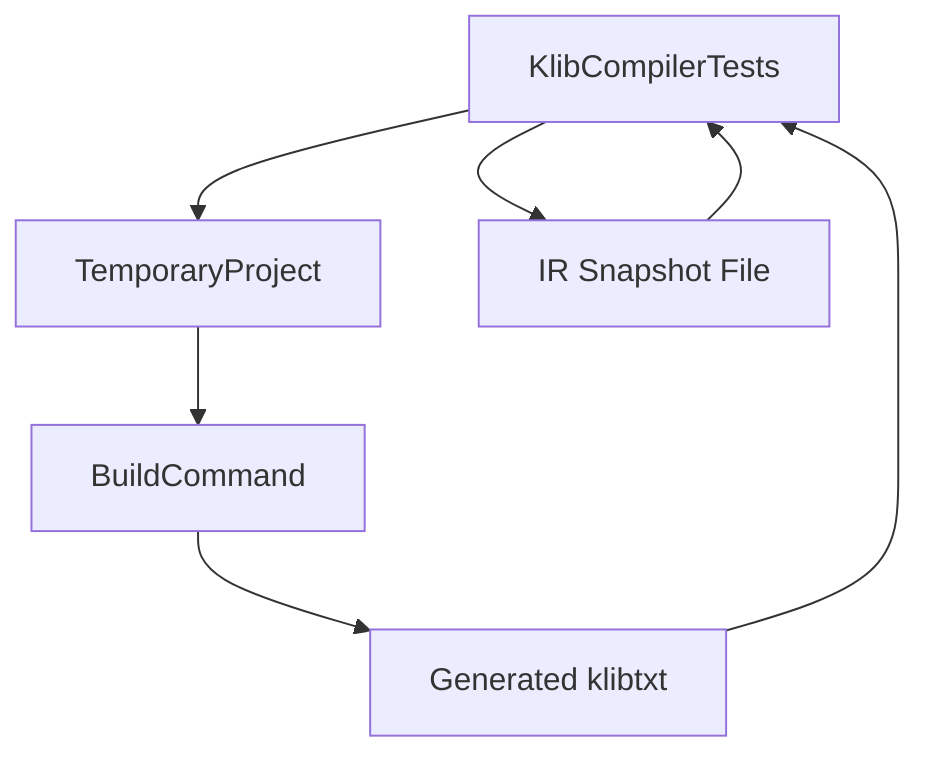
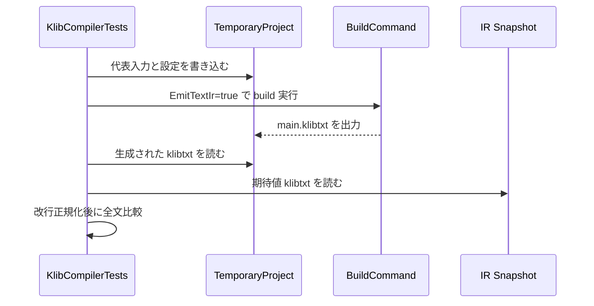

# Design Document

## Overview

この機能は、KoromoEventScript の IR 生成結果を既存の `.klibtxt` テキスト表現で固定し、コンパイラ変更時の退行をレビュー可能な差分として検知できるようにする。利用者は主にコンパイラ保守者と CI であり、期待値ファイルとテスト失敗差分を通じて IR 変更の妥当性を判断する。

本設計は既存の CLI 出力契約とテスト基盤を拡張する extension であり、新しい production 機能や出力形式は導入しない。責務は、代表入力の選定、snapshot 資産の配置、全文比較テストの安定化に限定する。

### Goals

- 代表的な `.ke` 入力に対する `.klibtxt` 出力を golden snapshot として固定する
- IR 差分を人間が読める形でテスト失敗へ反映する
- 期待値資産を既存の `testdata/snapshots/ir/` 規約に沿って継続管理できるようにする

### Non-Goals

- `.klib` バイナリ形式の検証強化
- runtime 実行結果や manifest 生成の golden test 追加
- CLI の新オプション追加や IR 仕様変更

## Boundary Commitments

### This Spec Owns

- IR golden test の責務を `Compilation` テスト層へ明示的に固定すること
- 代表入力と snapshot ファイルの対応付け規約
- `.klibtxt` 全文比較と改行正規化を含む失敗判定契約

### Out of Boundary

- `BuildCommand`、`CliApplication`、IR formatter の公開契約変更
- diagnostics snapshot や manifest snapshot の統合的共通化
- 複数ターゲットや runtime 側の成果物検証

### Allowed Dependencies

- `source/cli/KoromoEventScript.Cli/Commands/Build/BuildCommand.cs` が提供する既存の `.klibtxt` 出力
- `tests/KoromoEventScript.Cli.Tests/TemporaryProject.cs` による一時プロジェクト生成
- `testdata/snapshots/ir/` と `docs/testing-strategy.md` の既存配置規約

### Revalidation Triggers

- `.klibtxt` の論理表現順序やフォーマット契約が変更される
- `BuildCommand` の `EmitTextIr` 処理または出力パス契約が変更される
- snapshot 資産の共通管理方針を diagnostics / manifest と横断的に統一する判断が入る
- 代表入力を複数 fixture へ分割する必要が出るほど IR 対象領域が拡大する

## Architecture

### Existing Architecture Analysis

- 既存の `BuildCommand` は `EmitTextIr` 経由で `.klibtxt` を build 出力へ書き出す。
- `KlibCompilerTests` は TemporaryProject 上に入力を構築し、build 結果の `.klibtxt` を snapshot と比較する既存パターンを既に持つ。
- `BuildCommandTests` は CLI 成果物の存在確認に適し、IR 全文固定の主責務は持たない。

### Architecture Pattern & Boundary Map

**Architecture Integration**:

- Selected pattern: 既存 compilation golden test 拡張。production code の出力契約をそのまま利用し、テスト層で snapshot 固定だけを担う。
- Domain/feature boundaries: production は IR を生成するまで、test は代表入力の構築・期待値読込・全文比較までを担当する。
- Existing patterns preserved: `TemporaryProject`、`BuildCommandOptions(EmitTextIr: true)`、`testdata/snapshots/ir/` 配置規約。
- New components rationale: 新しい runtime/CLI component は不要。必要なのはテスト責務を明確にする補助構成だけ。
- Steering compliance: `.kiro/steering/` は未配置のため、`docs/testing-strategy.md` と既存 testdata 規約を実質的なプロジェクト方針として採用する。



### Technology Stack

| Layer | Choice / Version | Role in Feature | Notes |
|-------|------------------|-----------------|-------|
| Frontend / CLI | Existing `BuildCommand` / `--txt-il` path | `.klibtxt` 生成 | 新依存なし |
| Backend / Services | Existing `KlibCompiler` pipeline | IR 本体生成 | 契約利用のみ |
| Data / Storage | Repository text snapshots | 期待値資産管理 | `testdata/snapshots/ir/` |
| Infrastructure / Runtime | NUnit test runner | 全文差分を伴う検証 | 既存テスト基盤 |

## File Structure Plan

### Directory Structure

```txt
tests/
└── KoromoEventScript.Cli.Tests/
    ├── Compilation/
    │   └── KlibCompilerTests.cs          # IR golden test の入力構築・実行・全文比較
    └── TemporaryProject.cs               # 一時プロジェクト作成と改行正規化

testdata/
└── snapshots/
    └── ir/
        └── broad-surface.klibtxt         # 代表入力に対応する IR golden snapshot
```

### Modified Files

- `tests/KoromoEventScript.Cli.Tests/Compilation/KlibCompilerTests.cs` — `KlibCompilerTests`、`Representative Input Fixture`、`Snapshot Resolver` の局所責務をまとめ、IR golden test の比較手順を整理する
- `testdata/snapshots/ir/broad-surface.klibtxt` — 代表入力の canonical IR snapshot を保持する

### Potentially Reused Files Without Behavioral Change

- `tests/KoromoEventScript.Cli.Tests/TemporaryProject.cs` — 改行正規化と fixture 作成を既存のまま再利用する
- `source/cli/KoromoEventScript.Cli/Commands/Build/BuildCommand.cs` — `.klibtxt` 生成契約の依存先として利用する

## System Flows



フロー上の重要点は、差分可読性を production code ではなく `.klibtxt` と NUnit の文字列比較へ委ねること、そして fixture 側で環境依存の改行差を吸収することにある。

## Requirements Traceability

| Requirement | Summary | Components | Interfaces | Flows |
|-------------|---------|------------|------------|-------|
| 1.1 | 少なくとも 1 つの代表入力 snapshot を保持する | `KlibCompilerTests`, `IR Snapshot Asset` | Snapshot file contract | IR golden comparison flow |
| 1.2 | 主要言語表面を含む代表入力を 1 期待値で検証する | `Representative Input Fixture` | Test input contract | IR golden comparison flow |
| 1.3 | build 実行結果と snapshot を比較する | `KlibCompilerTests` | Build invocation contract | IR golden comparison flow |
| 1.4 | 一致時にテスト成功とする | `KlibCompilerTests` | Assertion contract | IR golden comparison flow |
| 2.1 | 不一致時にテキスト差分で失敗する | `KlibCompilerTests` | Full-text assertion contract | IR golden comparison flow |
| 2.2 | 差分を生成物全体の順序で確認できる | `IR Snapshot Asset`, `KlibCompilerTests` | Canonical `.klibtxt` contract | IR golden comparison flow |
| 2.3 | バイナリ比較だけにしない | `KlibCompilerTests` | Text snapshot contract | IR golden comparison flow |
| 2.4 | 改行コード差だけでは失敗させない | `KlibCompilerTests`, `TemporaryProject` | Newline normalization contract | IR golden comparison flow |
| 3.1 | 期待値をリポジトリ管理下のテキストで保持する | `IR Snapshot Asset` | Snapshot path contract | なし |
| 3.2 | 新しい開発者が直接読める | `IR Snapshot Asset` | Human-readable `.klibtxt` contract | なし |
| 3.3 | 正当な変更時に更新対象を特定できる | `Snapshot Resolver`, `IR Snapshot Asset` | File-to-fixture mapping contract | なし |
| 3.4 | diagnostics / manifest snapshot と区別して扱える | `IR Snapshot Asset` | `testdata/snapshots/ir/` placement contract | なし |

## Components and Interfaces

| Component | Domain/Layer | Intent | Req Coverage | Key Dependencies (P0/P1) | Contracts |
|-----------|--------------|--------|--------------|--------------------------|-----------|
| KlibCompilerTests | Test | 代表入力の build と全文比較を実行する | 1.1, 1.2, 1.3, 1.4, 2.1, 2.3, 2.4 | TemporaryProject (P0), BuildCommand (P0), IR Snapshot Asset (P0) | Service, State |
| Representative Input Fixture | Test Data | broad surface 入力で主要言語表面を一括検証する | 1.2 | KlibCompilerTests (P0) | State |
| IR Snapshot Asset | Test Data | canonical `.klibtxt` を保管しレビュー対象化する | 1.1, 2.2, 3.1, 3.2, 3.4 | Repository text file (P0) | State |
| Snapshot Resolver | Test Utility | fixture 名から snapshot ファイルを解決する | 3.3 | KlibCompilerTests (P1) | Service |

### Test Layer

#### KlibCompilerTests

| Field | Detail |
|-------|--------|
| Intent | temporary project を build し、生成 `.klibtxt` と snapshot を全文比較する |
| Requirements | 1.1, 1.2, 1.3, 1.4, 2.1, 2.3, 2.4 |

**Responsibilities & Constraints**

- 代表入力の build 条件を self-contained に構築する
- `EmitTextIr=true` の既存契約を通じて `.klibtxt` を取得する
- 実結果と期待値の双方で改行正規化を行い、環境依存差を吸収する

**Dependencies**

- Inbound: NUnit runner — テスト実行 (P0)
- Outbound: `TemporaryProject` — project fixture 構築 (P0)
- Outbound: `BuildCommand` — `.klibtxt` 生成 (P0)
- Outbound: `testdata/snapshots/ir/*.klibtxt` — 期待値読込 (P0)

**Contracts**: Service [x] / API [ ] / Event [ ] / Batch [ ] / State [x]

##### Service Interface

```csharp
private static string GetSnapshotPath(string fileName);
```

- Preconditions: `fileName` は `testdata/snapshots/ir/` 配下の既存 snapshot を指す
- Postconditions: 絶対パスが返る
- Invariants: snapshot 解決先は IR snapshot ディレクトリに限定される

**Implementation Notes**

- Integration: `BuildCommandOptions` に `EmitTextIr: true` を渡す既存パターンを維持する
- Validation: `actual.Replace("\r\n", "\n")` と `expected.Replace("\r\n", "\n")` の比較を canonical にする
- Risks: fixture ソースをテスト本体へ長く埋め込む構成は拡張時に読みにくくなるため、将来ケース追加時は testdata 化を再検討する

#### Snapshot Resolver

| Field | Detail |
|-------|--------|
| Intent | test 名と snapshot ファイルの対応を局所化し、更新対象を一意にする |
| Requirements | 3.3 |

**Responsibilities & Constraints**

- snapshot パスの組み立て責務を 1 箇所に閉じ込める
- diagnostics / manifest snapshot へ解決しない

**Dependencies**

- Inbound: `KlibCompilerTests` — snapshot 読込要求 (P1)
- Outbound: repository file system — IR snapshot 読込 (P0)

**Contracts**: Service [x] / API [ ] / Event [ ] / Batch [ ] / State [ ]

##### Service Interface

```csharp
private static string GetSnapshotPath(string fileName);
```

- Preconditions: `fileName` は `.klibtxt` 拡張子を持つ
- Postconditions: `testdata/snapshots/ir/` 配下のパスを返す
- Invariants: IR snapshot ディレクトリ以外へ解決しない

**Implementation Notes**

- Integration: `GetRepositoryRoot()` を経由する既存 helper を再利用する
- Validation: パス解決規約は broad surface snapshot と一致させる
- Risks: snapshot 種別が増えた時は resolver の責務過多に注意する

### Test Data Layer

#### Representative Input Fixture

| Field | Detail |
|-------|--------|
| Intent | 主要言語表面を含む代表 `.kc` / `.kel` 入力を 1 ケースにまとめる |
| Requirements | 1.2 |

**Responsibilities & Constraints**

- 分岐、反復、ラベル、台詞、地の文、選択肢を少なくとも 1 つずつ含める
- 入力の意味を変えずに、不要な記法を増やしすぎない

**Dependencies**

- Inbound: `KlibCompilerTests` — fixture 構築 (P0)

**Contracts**: Service [ ] / API [ ] / Event [ ] / Batch [ ] / State [x]

##### State Management

- State model: test source text as canonical fixture
- Persistence & consistency: `KlibCompilerTests` 内で生成し、snapshot は別ファイルに分離する
- Concurrency strategy: 共有 mutable state なし

**Implementation Notes**

- Integration: 現行 broad surface ケースを基準に継続利用する
- Validation: 主要言語表面をコメントや test 名で説明できる状態にする
- Risks: 1 ケースへ責務を詰め込みすぎると failure triage が重くなる

#### IR Snapshot Asset

| Field | Detail |
|-------|--------|
| Intent | 代表入力に対する canonical `.klibtxt` をレビュー可能なテキスト資産として保持する |
| Requirements | 1.1, 2.2, 3.1, 3.2, 3.4 |

**Responsibilities & Constraints**

- UTF-8 テキストとして repository 配下に保持する
- `testdata/snapshots/ir/` に配置し、他 snapshot 種別と混在させない
- `.klibtxt` のセクション順と内容をそのまま保持する

**Dependencies**

- Inbound: `KlibCompilerTests` — 比較対象として読込 (P0)
- External: repository review workflow — 差分レビュー (P1)

**Contracts**: Service [ ] / API [ ] / Event [ ] / Batch [ ] / State [x]

##### State Management

- State model: 1 fixture ↔ 1 snapshot file
- Persistence & consistency: git 管理下テキストファイル
- Concurrency strategy: PR レビューによる競合解消

**Implementation Notes**

- Integration: `broad-surface.klibtxt` を canonical asset として扱う
- Validation: snapshot 更新理由を PR と task で説明する
- Risks: formatter 契約変更時に差分が大きくなる

## Data Models

### Domain Model

- **Golden Test Case**: 代表入力、build オプション、期待 snapshot の組
- **IR Snapshot Asset**: `.klibtxt` の canonical text
- **Comparison Result**: success または text diff failure

### Logical Data Model

- `GoldenTestCase`
  - `FixtureName: string`
  - `ProjectEntry: string`
  - `SnapshotFileName: string`
  - `NormalizationMode: string`
- `IrSnapshotAsset`
  - `Path: string`
  - `Format: ".klibtxt"`
  - `Content: string`

**Consistency & Integrity**:

- `GoldenTestCase.SnapshotFileName` は必ず `IrSnapshotAsset.Path` と 1:1 で対応する
- fixture 名と snapshot 名のマッピングは deterministic である必要がある

### Data Contracts & Integration

- Request/response 型の API は増えない
- test contract として「生成 `.klibtxt` 全文を snapshot と比較する」ことを固定する

## Error Handling

### Error Strategy

- build 自体が失敗した場合は既存の `BuildCommandResult` と diagnostics をそのまま使い、golden 比較へ進まない
- snapshot 不一致は NUnit assertion failure として報告し、全文差分を最優先の調査材料にする

### Error Categories and Responses

- **Fixture Error**: テスト入力や config が不正 — build failure として扱う
- **Snapshot Drift**: 実結果と期待値がずれる — text diff failure を返す
- **Path Resolution Error**: snapshot が見つからない — test setup failure として即時失敗する

### Monitoring

- 追加の監視は不要
- 失敗解析は CI ログ上の NUnit 差分出力を primary signal とする

## Testing Strategy

### Unit / Focused Tests

- `KlibCompilerTests` が broad surface 入力を build したとき、生成 `.klibtxt` 全文が `broad-surface.klibtxt` と一致することを検証する
- `KlibCompilerTests` が比較前に実結果と期待値の改行コードを正規化し、CRLF/LF 差異だけでは failure にならないことを維持する

### Integration Tests

- 既存 `BuildCommand` の `.klibtxt` 出力経路を通ることで、IR formatter・artifact writer・build path 契約を一体で検証する
- snapshot パス解決が常に `testdata/snapshots/ir/` を指し、diagnostics/manifest の期待値へ逸れないことを検証する

### E2E / Review Path

- PR で snapshot 更新が入ったとき、reviewer が `testdata/snapshots/ir/broad-surface.klibtxt` の差分だけで IR 変更内容を判断できることを確認対象とする

## Supporting References

- 詳細な調査経緯、代替案、既存コード参照は `research.md` に保持する
