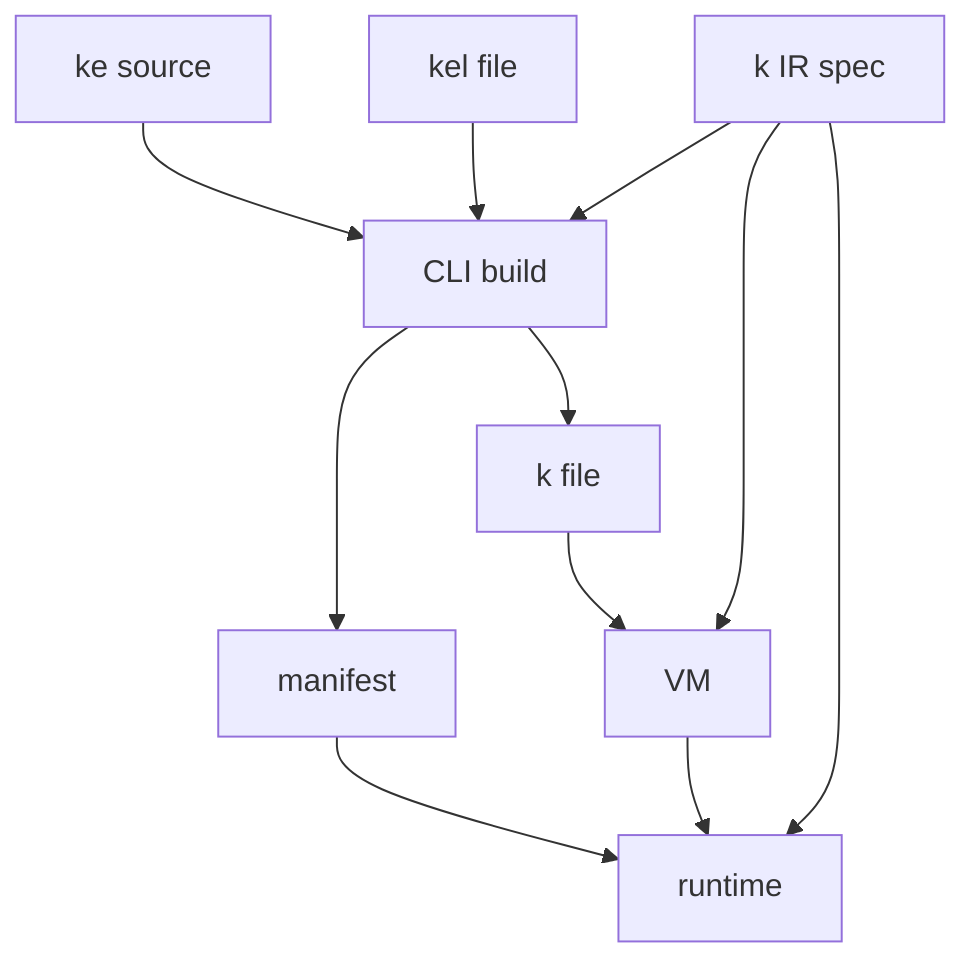
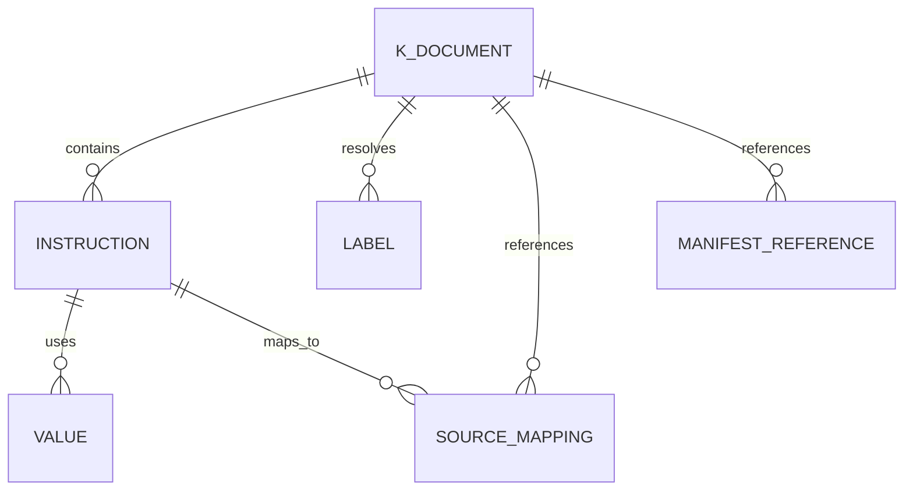
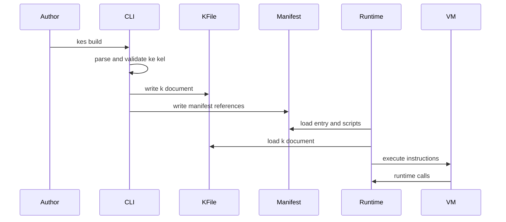

# Design Document

## Overview

この仕様は、`.kc` から生成される VM 実行用中間表現 `.klib` の公開契約を `docs/spec/k-intermediate-representation-spec.md` として追加する。
CLI、VM、Windows/Unity/Unreal runtime、debug tooling の実装者が同じ成果物契約を参照できるように、file format、instruction schema、value model、control flow、source mapping、manifest 参照、互換性方針を文書化する。

この設計は文書追加と既存仕様の cross-reference 更新に限定する。compiler emitter、VM interpreter、runtime rendering/audio/input、配布時の圧縮・暗号化は実装しない。

### Goals

- `.klib` の目的、拡張子、encoding、newline、version、feature compatibility、正規化例を定義する。
- VM が必要とする instruction、operand、value、variable、scope、execution state、control flow を表現できる契約を定義する。
- runtime error、debug 表示、golden test が元 `.kc` の位置を参照できる source mapping 方針を定義する。
- manifest が所有する情報と `.klib` が所有または参照する情報の境界を明記する。
- 既存仕様に残る `.kc` / `.klib` と現行 `.kc` / `.klib` の関係を注記する。

### Non-Goals

- `.klib` emitter、serializer、schema validator の実装。
- VM interpreter、save/load 実装、runtime rendering/audio/input 実装。
- asset manifest 全体、locale dictionary、runtime package manifest の完全 schema 定義。
- binary format、compression、encryption、署名形式の定義。
- 既存文書全体の `.kc` / `.klib` 表記の一括置換。

## Boundary Commitments

### This Spec Owns

- `docs/spec/k-intermediate-representation-spec.md` を `.klib` 中間表現の authoritative specification として追加する。
- `.klib` document の top-level schema、instruction schema、value/reference model、control-flow representation、source mapping、manifest 参照、compatibility policy を定義する。
- `say`、`nar`、通常命令、式評価、変数定義、代入、`label`、`jump`、`select`、`case`、`__systemcall__` 相当の runtime call を VM が読める形で表現するための契約を定義する。
- `.klib` が save data ではないことを前提に、save/load が参照できる script id、instruction index、call state、scope、variable state の識別情報を定義する。
- CLI、runtime、overview から新しい `.klib` 仕様へ到達できる最小限の参照更新を定義する。

### Out of Boundary

- `.klib` を生成または読み取る C# 実装は行わない。
- manifest が所有する entry、asset、locale、runtime、build metadata の完全 schema は本仕様で所有しない。
- `.kel` の構文、`.kc` 言語構文、STL syscall signature の詳細は既存仕様が所有する。
- Windows/Unity/Unreal runtime 固有の描画、音声、入力、保存先、UI、配布形式は本仕様で所有しない。
- `.kc` / `.klib` 旧称の全面的な用語移行は別作業に分離する。

### Allowed Dependencies

- `docs/spec/cli-tool-spec.md`: `kes build` / `kes run` / `kes publish` が `.klib` と `manifest.json` を扱う成果物契約。
- `docs/spec/kes-language-spec.md`: `.kc` の構文、名前、型、変数、制御構文、source position の前提。
- `docs/spec/kes-language-stl-spec.md`: `__systemcall__`、STL、runtime call、asset ID、actor/tag の既存語彙。
- `docs/spec/kel-file-spec.md`: `.kel` entry/chapter 参照と `.kc` script path の前提。
- `docs/spec/windows-runtime-spec.md`、`docs/spec/unity-runtime-spec.md`、`docs/spec/unreal-runtime-spec.md`: runtime が manifest と VM 成果物を読む隣接仕様。
- `docs/spec/overview.md`: 仕様一覧と現行/旧称の読者向け導線。

### Revalidation Triggers

- `.klib` top-level field、instruction field、opcode、value/reference representation、source mapping shape を変更する場合。
- manifest が所有する entry/script/asset/locale 情報と `.klib` が所有する情報の境界を変更する場合。
- `.kc` / `.klib` と `.kc` / `.klib` の authoritative term を変更する場合。
- VM/runtime が未知 version、unsupported feature、manifest reference error を扱う期待動作を変更する場合。
- import された `.kc` の execution unit 化、entry label 解決、instruction index の安定性を変更する場合。

## Architecture

### Existing Architecture Analysis

`docs/spec/cli-tool-spec.md` は、`kes build` が `.kc` / `.kel` を解析し、`.kc` ごとに VM 向け `.klib` を生成し、`manifest.json` とともに出力することを定義している。
一方で、中間表現の命令体系、データ構造、形式詳細は別仕様で定義する前提になっている。

`docs/spec/windows-runtime-spec.md` は、runtime が source script を直接実行せず、manifest と VM 成果物を読み込む構成を持つ。ただし既存文書には `.kc` / `.klib` という旧称が残るため、本仕様は `.kc` / `.klib` を現行の正とし、旧称は移行上の注記として扱う。

### Architecture Pattern & Boundary Map



- Selected pattern: 独立仕様による contract-first documentation。CLI、VM、runtime に詳細 schema を分散させず、`.klib` 仕様を共通参照点にする。
- Domain/feature boundaries: `.klib` は VM execution contract を所有し、manifest は成果物一覧、entry、asset、locale、runtime、build metadata を所有する。
- Existing patterns preserved: CLI 仕様の build output model、runtime 仕様の manifest-driven resource resolution、STL 仕様の `__systemcall__` 境界を維持する。
- New components rationale: `docs/spec/k-intermediate-representation-spec.md` は未定義だった `.klib` 詳細契約を埋めるために必要である。
- Steering compliance: `.kiro/steering/` は存在しないため、AGENTS.md の日本語ドキュメント方針と Issue/仕様駆動の境界管理に従う。

### Technology Stack

| Layer | Choice / Version | Role in Feature | Notes |
|-------|------------------|-----------------|-------|
| Documentation | Markdown | `.klib` 公開仕様と既存仕様参照を記述する | `docs/` 配下のため日本語で作成する |
| Contract format | JSON-style text example | `.klib` 正規化例と schema 説明を表現する | 実装形式の固定ではなく、review/golden test の基準として扱う |
| Diagrams | Mermaid | 成果物境界と実行関係を表現する | Markdown 内の純粋 Mermaid を使う |

## File Structure Plan

### Directory Structure

```text
docs/spec/
  k-intermediate-representation-spec.md  # 新規: .klib IR の authoritative specification
  cli-tool-spec.md                       # 変更: kes build/run/publish から .klib 仕様への参照を追加
  windows-runtime-spec.md                # 変更: .klib 仕様参照と .kc/.klib 旧称注記を追加
  overview.md                            # 変更: 仕様一覧または概要に .klib 仕様と旧称注記を追加

.kiro/specs/kes-k-intermediate-representation-spec/
  requirements.md                        # 既存: 要求定義
  research.md                            # 更新: discovery と設計判断
  design.md                              # 更新: 本設計
  spec.json                              # 更新: design generated metadata
```

### Modified Files

- `docs/spec/k-intermediate-representation-spec.md` — `.klib` の file format、schema、instruction、value、control flow、source mapping、manifest relation、compatibility、minimal sample を定義する。
- `docs/spec/cli-tool-spec.md` — `kes build` の `.klib` 出力説明から新仕様へ参照を張り、CLI 仕様が詳細 schema を所有しないことを明確にする。
- `docs/spec/windows-runtime-spec.md` — runtime が読む VM 成果物として `.klib` 仕様を参照し、`.kc` / `.klib` が旧称であることを注記する。
- `docs/spec/overview.md` — 詳細仕様一覧または workflow 説明に `.klib` 中間表現仕様を追加し、現行 `.kc` / `.klib` と旧称の関係を読者が追えるようにする。

## Requirements Traceability

| Requirement | Summary | Components | Interfaces | Flows |
|-------------|---------|------------|------------|-------|
| 1.1 | `.klib` の目的、拡張子、encoding、newline、version、互換性方針 | KIntermediateRepresentationSpec | K Document contract | Build to VM artifact |
| 1.2 | 単一 `.kc` と複数ファイル project の扱い | KIntermediateRepresentationSpec | Module/import contract | Build to VM artifact |
| 1.3 | 未知 version / unsupported feature の扱い | KIntermediateRepresentationSpec | Compatibility contract, Error categories | Load validation |
| 1.4 | human review と golden test 用の最小正規化例 | KIntermediateRepresentationSpec | Normalized sample contract | Review/golden flow |
| 2.1 | 命令列、opcode、引数、戻り値、実行順序 | KIntermediateRepresentationSpec | Instruction contract | VM execution flow |
| 2.2 | `say`、`nar`、通常命令、式、変数、代入 | KIntermediateRepresentationSpec | Text/expression/variable opcode contracts | VM execution flow |
| 2.3 | `label`、`jump`、`select`、`case` の制御フロー | KIntermediateRepresentationSpec | Flow opcode and labels contract | VM execution flow |
| 2.4 | `__systemcall__` / runtime call の syscall ID、引数、戻り値 | KIntermediateRepresentationSpec | Runtime call contract | VM to runtime flow |
| 2.5 | import された `.kc` の実行単位への反映 | KIntermediateRepresentationSpec | Module/import contract | Build to VM artifact |
| 3.1 | number、bool、string、null、array、actor/tag reference | KIntermediateRepresentationSpec | Value contract | VM execution flow |
| 3.2 | 変数宣言、読み取り、書き込み、scope、初期値 | KIntermediateRepresentationSpec | Variable/scope contract | VM execution flow |
| 3.3 | save/load が参照する実行位置、call state、variables | KIntermediateRepresentationSpec, RuntimeSpecTerminologyNote | Execution state reference contract | Save/load reference flow |
| 3.4 | compile-time resolved entity と runtime dynamic value の境界 | KIntermediateRepresentationSpec | Value boundary contract | Build to VM artifact |
| 4.1 | file、line、column への source mapping | KIntermediateRepresentationSpec | Source mapping contract | Debug/error flow |
| 4.2 | 1 構文が複数命令へ展開される場合の位置方針 | KIntermediateRepresentationSpec | Source mapping contract | Debug/error flow |
| 4.3 | module/file 名と命令位置の debug 表現 | KIntermediateRepresentationSpec | Debug location contract | Debug/error flow |
| 4.4 | source mapping が VM 意味論を変えないこと | KIntermediateRepresentationSpec | Debug metadata contract | Debug/error flow |
| 5.1 | manifest が `.klib` を列挙または参照する script 情報 | KIntermediateRepresentationSpec, CliSpecReferenceUpdate, RuntimeSpecTerminologyNote | Manifest reference contract | Manifest to VM flow |
| 5.2 | `.kel` entry/chapter と `.klib` 開始位置の対応 | KIntermediateRepresentationSpec, RuntimeSpecTerminologyNote | Entry/start position contract | Manifest to VM flow |
| 5.3 | asset ID、locale key、script path と manifest の対応 | KIntermediateRepresentationSpec, RuntimeSpecTerminologyNote | Manifest reference contract | Runtime resource flow |
| 5.4 | manifest 所有情報と `.klib` 所有情報の境界 | KIntermediateRepresentationSpec | Ownership boundary contract | Manifest to VM flow |
| 6.1 | CLI、language、STL、`.kel`、runtime 仕様への参照 | KIntermediateRepresentationSpec, CliSpecReferenceUpdate, RuntimeSpecTerminologyNote, OverviewIndexUpdate | Cross-reference contract | Documentation navigation |
| 6.2 | `.kc` / `.klib` と `.kc` / `.klib` の扱い | KIntermediateRepresentationSpec, RuntimeSpecTerminologyNote, OverviewIndexUpdate | Terminology contract | Documentation navigation |
| 6.3 | compiler、VM、runtime、compression/encryption の対象外明示 | KIntermediateRepresentationSpec | Scope contract | Documentation navigation |
| 6.4 | 既存仕様との不整合時の authoritative source または別 Issue 化 | KIntermediateRepresentationSpec, CliSpecReferenceUpdate, RuntimeSpecTerminologyNote, OverviewIndexUpdate | Cross-reference contract | Documentation navigation |

## Components and Interfaces

| Component | Domain/Layer | Intent | Req Coverage | Key Dependencies | Contracts |
|-----------|--------------|--------|--------------|------------------|-----------|
| KIntermediateRepresentationSpec | Documentation / Contract | `.klib` IR の authoritative contract を定義する | 1.1-6.4 | CLI spec P0, language/STL specs P0, runtime specs P1 | State, Batch |
| CliSpecReferenceUpdate | Documentation / CLI | CLI build output から `.klib` 仕様へ導線を張る | 5.1, 6.1, 6.4 | CLI spec P0, KIntermediateRepresentationSpec P0 | Batch |
| RuntimeSpecTerminologyNote | Documentation / Runtime | runtime 入力と旧称を `.klib` 仕様へ接続する | 3.3, 5.1-5.4, 6.1, 6.2, 6.4 | Windows runtime spec P0, KIntermediateRepresentationSpec P0 | State |
| OverviewIndexUpdate | Documentation / Navigation | overview から `.klib` 仕様へ到達可能にする | 6.1, 6.2, 6.4 | overview P1, KIntermediateRepresentationSpec P0 | Batch |

### Documentation Contracts

#### KIntermediateRepresentationSpec

| Field | Detail |
|-------|--------|
| Intent | `.klib` の形式と VM 実行契約を文書として安定化する |
| Requirements | 1.1, 1.2, 1.3, 1.4, 2.1, 2.2, 2.3, 2.4, 2.5, 3.1, 3.2, 3.3, 3.4, 4.1, 4.2, 4.3, 4.4, 5.1, 5.2, 5.3, 5.4, 6.1, 6.2, 6.3, 6.4 |

**Responsibilities & Constraints**

- `.klib` は UTF-8 text-based contract として説明し、改行と正規化例を human review/golden test 向けに定義する。
- `version` と `features` を持ち、未知 major version と unsupported feature の扱いを load 時点の失敗として定義する。
- instruction は `index`、`op`、`args`、`result`、`source` を基本契約とし、opcode ごとの operand と戻り値利用を定義する。
- source mapping は debug metadata であり、VM 実行意味を変えない。
- manifest 参照は ID/key/path の参照契約に限定し、manifest 側の完全 schema を所有しない。

**Dependencies**

- Inbound: CLI / VM / runtime / debug tooling — `.klib` contract の参照 (P0)
- Outbound: `cli-tool-spec.md`、`kes-language-spec.md`、`kes-language-stl-spec.md`、`kel-file-spec.md`、runtime specs — 既存語彙と隣接契約 (P0)
- External: なし (P2)

**Contracts**: Service [ ] / API [ ] / Event [ ] / Batch [x] / State [x]

##### State Contract

- K Document: `format`、`version`、`features`、`module`、`imports`、`instructions`、`labels`、`debug`、`manifestRefs`。
- Instruction: `index`、`op`、`args`、`result`、`source`、optional metadata。
- Value: number、bool、string、null、array、actor ref、tag ref、asset ref、locale key、runtime dynamic value。
- Execution state references: script id、instruction index、call/continuation state identifier、scope、variable identifier、branch/runtime call return position。

##### Batch Contract

- Trigger: `kes build` が `.kc` / `.kel` を解析し、`.klib` と `manifest.json` を生成する。
- Input / validation: `.kc` の名前解決、型検査、tag/asset/locale 参照検証は `.klib` 生成前に完了している前提を明記する。
- Output / destination: `.klib` は `build/<target>/events/*.klib` など CLI 仕様の出力先に配置され、manifest から参照される。
- Idempotency & recovery: 正規化例の field order と optional field policy を定義し、golden test で比較可能にする。

**Implementation Notes**

- Integration: 新仕様内に既存仕様への参照一覧を置き、詳細責務は各仕様へ戻す。
- Validation: すべての requirement ID が節単位で追跡できるように heading と表を構成する。
- Risks: 将来の VM 実装と schema がずれる可能性があるため、version/features と revalidation triggers を明記する。

#### CliSpecReferenceUpdate

| Field | Detail |
|-------|--------|
| Intent | CLI 仕様が `.klib` 詳細 schema を所有しないことを明示し、新仕様へ参照を張る |
| Requirements | 5.1, 6.1, 6.4 |

**Responsibilities & Constraints**

- `kes build` の成果物説明に `.klib` 仕様への参照を追加する。
- CLI は `.klib` を生成する責務を持つが、instruction schema の詳細定義は `KIntermediateRepresentationSpec` に委譲する。

**Dependencies**

- Inbound: `KIntermediateRepresentationSpec` — 詳細 schema の authoritative source (P0)
- Outbound: なし (P2)

**Contracts**: Service [ ] / API [ ] / Event [ ] / Batch [x] / State [ ]

##### Batch Contract

- Trigger: `kes build` / `kes run --build` / `kes publish`。
- Output / destination: `.klib` と `manifest.json` の出力関係を `.klib` 仕様へリンクする。

#### RuntimeSpecTerminologyNote

| Field | Detail |
|-------|--------|
| Intent | runtime が読む VM 成果物を `.klib` 仕様へ接続し、旧称との関係を注記する |
| Requirements | 3.3, 5.1, 5.2, 5.3, 5.4, 6.1, 6.2, 6.4 |

**Responsibilities & Constraints**

- Windows runtime 仕様の `.klib` 表記に対して、現行 `.klib` 仕様を参照する互換性注記を追加する。
- save/debug に必要な VM file、instruction position、tag などは `.klib` の script id / instruction index / source mapping を参照することを明確にする。
- 描画、音声、入力、保存先の runtime 固有詳細は変更しない。

**Dependencies**

- Inbound: Windows runtime spec — runtime 入力、save/debug の既存記述 (P0)
- Outbound: `KIntermediateRepresentationSpec` — `.klib` と source mapping の authoritative source (P0)

**Contracts**: Service [ ] / API [ ] / Event [ ] / Batch [ ] / State [x]

##### State Management

- State model: save/debug は `.klib` の script id、instruction index、label/tag、source mapping を参照する。
- Persistence & consistency: `.klib` 自体を save data とせず、save data は `.klib` 上の安定識別子を参照する。
- Concurrency strategy: 対象外。runtime 実装仕様側で扱う。

#### OverviewIndexUpdate

| Field | Detail |
|-------|--------|
| Intent | overview から `.klib` 仕様を発見できるようにする |
| Requirements | 6.1, 6.2, 6.4 |

**Responsibilities & Constraints**

- overview の workflow または仕様一覧に `.klib` 中間表現仕様を追加する。
- `.kc` / `.klib` 表記が残る場合は、現行仕様では `.kc` / `.klib` を正とする注記を追加する。

**Dependencies**

- Inbound: `overview.md` — 読者向け導線 (P1)
- Outbound: `KIntermediateRepresentationSpec` — 詳細仕様 (P0)

**Contracts**: Service [ ] / API [ ] / Event [ ] / Batch [x] / State [ ]

## Data Models

### Domain Model



- K Document は 1 つの VM execution unit を表す。
- Instruction は stable `index` により実行順序と save/load 参照位置を表す。
- Label は compile-time に instruction index へ解決済みであり、runtime は未解決 label name に依存しない。
- Source mapping と debug 情報は補助情報であり、VM semantics に影響しない。
- Manifest reference は manifest が所有する asset、locale、script path、entry 情報への ID/key/path 参照である。

### Logical Data Model

**K Document**

- `format`: `.klib` document を識別する固定値。
- `version`: major/minor/patch または同等の互換性判定情報。
- `features`: VM/runtime が対応可否を判定する feature identifier の集合。
- `module`: source path、module id、script id、entry label など script execution unit の識別情報。
- `imports`: import 済み `.kc` module の参照情報。
- `instructions`: 実行順序を持つ instruction sequence。
- `labels`: label name または compiler generated label から instruction index への解決済み mapping。
- `debug`: source mapping、生成元情報、module/file 表示名。
- `manifestRefs`: manifest 側の script id、asset id、locale key などへの参照情報。

**Instruction**

- `index`: instruction sequence 内の安定した位置。
- `op`: opcode。
- `args`: opcode ごとの operand list または named object。
- `result`: 値を生成する場合の temporary value または variable target。
- `source`: source mapping 参照。
- `flags`: VM が必要とする optional metadata。

**Value**

- primitive: number、bool、string、null。
- collection: array。
- reference: actor ref、tag ref、asset ref、locale key。
- runtime dynamic value: runtime call が返す値、または runtime が評価する値。

### Data Contracts & Integration

- `.klib` は `say` / `nar` 本文、LESS 展開、`select` / `case` のように 1 つの source construct が複数命令へ展開される場合、各命令の primary source と related source range の方針を定義する。
- `.klib` は `__systemcall__` 相当の runtime call に syscall ID、typed args、return value usage を含める。
- `.klib` は manifest の asset ID、locale key、script path を値または `manifestRefs` として参照し、manifest 側の詳細 metadata を複製しない。

## System Flows



Build 時点で名前、型、tag、syscall signature、manifest reference の静的検証を完了する。Runtime/VM は `.klib` load 時に version、features、instruction schema、manifest reference を検証し、実行中は instruction index と source mapping を debug/error 表示へ利用する。

## Error Handling

### Error Strategy

- 未知の major version は `.klib` load error として読み込み失敗にする。
- 未対応 feature は実行前に unsupported feature error として拒否する。
- instruction schema violation は VM load error とする。
- manifest reference が解決できない場合は manifest integration error とする。
- source mapping が欠落しても VM semantics は変えない。debug 表示は script id と instruction index への fallback を許容する。

### Error Categories and Responses

- Contract errors: `.klib` schema、opcode、operand、result が仕様に合わない場合は load 時点で失敗する。
- Compatibility errors: version/features が未対応の場合は実行前に失敗し、必要な version/feature を示す。
- Integration errors: manifest 上の script、asset、locale key が解決できない場合は manifest integration error とする。
- Debug metadata errors: source mapping 不備は warning または fallback 表示に留め、実行意味を変更しない。

## Testing Strategy

### Documentation Review

- `docs/spec/k-intermediate-representation-spec.md` が 1.1-6.4 の全 requirement ID を節または表で明示的に満たすことを確認する。
- `.klib` の正規化例が `format`、`version`、`features`、`module`、`instructions`、`labels`、`manifestRefs`、`debug` を含むことを確認する。
- `say`、`nar`、変数、式、代入、`label`、`jump`、`select`、`case`、runtime call の opcode 表現が VM 実装者にとって曖昧でないことを確認する。

### Integration Checks

- `rg "k-intermediate-representation-spec" docs/spec` で CLI、runtime、overview から新仕様への参照が存在することを確認する。
- `.kc` / `.klib` が残る箇所について、今回触る既存仕様に `.kc` / `.klib` への互換性注記があることを確認する。
- manifest 所有情報と `.klib` 所有情報が重複せず、ID/key/path 参照として説明されていることを確認する。

### Golden Test Preparation

- 最小 `.klib` サンプルが stable field order と optional field policy を示し、将来の golden test で比較可能であることを確認する。
- source mapping の例が単一命令と複数命令展開の両方を含み、runtime error/debug 表示に使えることを確認する。

### Automated Tests

- 本 design 生成段階では文書設計のみのため `dotnet test` は必須ではない。
- 実装タスクで文書を追加した後、Markdown link と用語参照の確認を実行する。コード変更を伴う場合のみ該当 test project の `dotnet test` を追加する。

## Security Considerations

- `.klib` 仕様は runtime が読む成果物契約を定義するが、署名、暗号化、改ざん検出は本仕様の対象外とする。
- VM/runtime は unknown version、unsupported feature、schema violation、manifest reference error を load 時に拒否する前提を文書化し、未検証の命令を実行しない。

## Performance & Scalability

- `.klib` は VM が sequential instruction execution と instruction index lookup を行える構造を持つ。
- label は runtime 解決ではなく build 時に instruction index へ解決済みとし、実行時 jump/select の探索負荷を抑える。
- import された `.kc` の扱いは module/import contract として定義し、複数ファイル project でも execution unit の境界を追跡できるようにする。

## ADR Consideration

今回の設計判断は公開仕様追加の範囲であり、C# 実装アーキテクチャ、永続化実装、binary format、圧縮・暗号化方式を固定しない。
ただし `.klib` format を emitter/VM 実装で採用する Issue では、互換性方針、schema validator、save/load reference stability を ADR 化するか再検討する。
