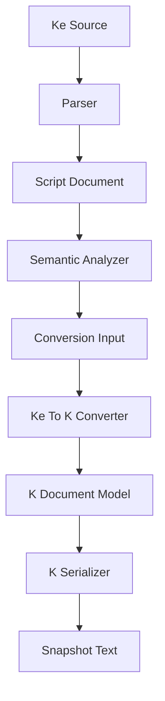
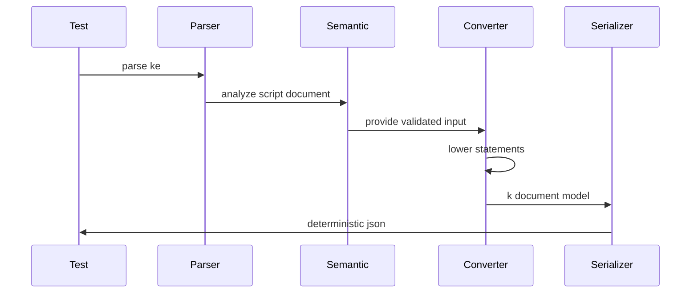
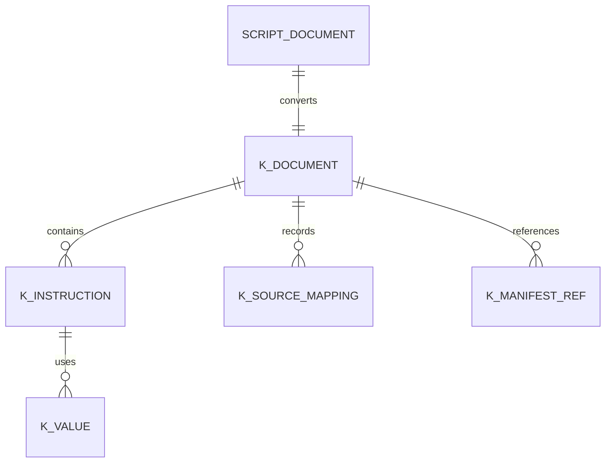

# Design Document

## Overview

この機能は、KoromoEventScript CLI に `.kc` AST から `.klib` 中間表現 document を生成する変換境界を追加する。
対象ユーザーは CLI / compiler 実装者、VM 実装者、reviewer であり、Issue #25 の `say`、`nar`、`select`、`jump`、通常命令を `.klib` 仕様に従って安定出力できる状態を提供する。

既存の parser、semantic diagnostics、`.klib` IR 仕様を前提に、実装は C# の typed model、converter、serializer、テスト fixture に分割する。
この design は VM 実行、runtime、manifest 完全生成を所有せず、`.klib` document が後続実装へ渡せる contract を安定化する。

### Goals

- `.kc` AST の対象 statement から `.klib` document model を生成する。
- `.klib` 仕様に沿った top-level field、instruction、labels、debug、manifestRefs を安定出力する。
- label / jump / select case の制御先を instruction index に解決する。
- golden / snapshot test で比較できる deterministic JSON を提供する。

### Non-Goals

- VM interpreter、runtime、save/load、debugger の実装。
- manifest 全体の生成、artifact path / hash / runtime metadata の所有。
- 式評価、変数、関数、class、if、while、for、LESS の完全 lowering。
- `.klib` schema validator または loader の実装。
- `.kc` / `.klib` 旧称の全面移行。

## Boundary Commitments

### This Spec Owns

- `.kc` の `ScriptDocument` と `ScriptSyntax` から `.klib` document model を生成する変換境界。
- `say`、`nar`、`command`、`label`、`jump`、`select` の instruction 生成。
- `.klib` document の `format`、`version`、`features`、`module`、`imports`、`instructions`、`labels`、`manifestRefs`、`debug` の生成。
- local label から instruction index への解決と、未解決制御先を成功出力に残さない failure result。
- deterministic JSON serialization と IR snapshot / golden test。

### Out of Boundary

- VM / runtime が instruction を実行する処理。
- `kes publish` や manifest 完全生成。
- asset / locale 実体の解決、配置、hash、platform variant。
- parser / lexer の構文変更、semantic diagnostics の既存ルール変更。
- 対象外 statement の完全 lowering。対象外構文は converter failure として扱う。

### Allowed Dependencies

- `Parsing`: `ScriptSyntax`、`StatementSyntax`、`SourceLocation`、`Token`。
- `Semantics`: `ScriptDocument`、`SemanticAnalysisResult`、`ImportGraph`。
- `Diagnostics`: converter failure を既存 diagnostic と同じ形式で表現する。
- `System.Text.Json`: 既存 .NET stack の標準 serializer として deterministic output に使う。
- `docs/spec/k-intermediate-representation-spec.md`: `.klib` contract の正。

### Revalidation Triggers

- `.klib` IR 仕様の top-level field、opcode、operand、source mapping、manifestRefs が変わる場合。
- AST の `SayStatementSyntax`、`NarStatementSyntax`、`SelectStatementSyntax`、`JumpStatementSyntax`、`CommandStatementSyntax` の shape が変わる場合。
- semantic analysis が label / actor / command 解決の責務を変更する場合。
- build pipeline が `--check-only` 以外の artifact 出力契約を追加する場合。
- manifest 生成仕様が scriptId、moduleId、entryLabel の所有境界を変更する場合。

## Architecture

### Existing Architecture Analysis

既存 CLI は project root 解決、config load、`.kel` parse、`.kc` parse、semantic analysis を `BuildCheckOnlyCommand` に集約している。
`SourceFileParser` は parse result と diagnostic を返し、`SemanticAnalyzer` は import、definition、name、type、warning diagnostics をまとめた `SemanticAnalysisResult` を返す。

`ScriptDocument` は project-relative path、module name、AST を保持するため、`.klib` module/debug 情報の入力として再利用できる。
既存 `--check-only` は artifact を変更しないことがテストで固定されているため、この仕様では converter と serializer を追加し、artifact 書き込みは通常 build 側の後続接続として扱う。

### Architecture Pattern & Boundary Map



- Selected pattern: typed model plus converter plus serializer。変換責務と出力責務を分け、`.klib` contract を型で保持する。
- Domain/feature boundaries: parser / semantics は入力検証、converter は lowering、serializer は deterministic JSON を担当する。
- Existing patterns preserved: `ScriptDocument`、`Diagnostic`、NUnit、`testdata/snapshots` の既存方針を使う。
- New components rationale: `.klib` model、converter、serializer、conversion result は現状存在しないため追加する。
- Steering compliance: `.kiro/steering` は存在しないため、AGENTS.md の日本語文書方針、Issue 単位の境界管理、テスト追加方針に従う。

### Technology Stack

| Layer | Choice / Version | Role in Feature | Notes |
|-------|------------------|-----------------|-------|
| CLI | C# / .NET `net10.0` | `.klib` model、converter、serializer を実装する | 既存 project stack に合わせる |
| Serialization | `System.Text.Json` | deterministic JSON 出力 | 新規外部依存は追加しない |
| Testing | NUnit 4.3.2 | converter unit test と snapshot test | 既存 test project の package を使う |
| Testdata | `testdata/snapshots/ir` | golden output の保存先 | timestamp と絶対 path は含めない |

## File Structure Plan

### Directory Structure

```text
source/cli/KoromoEventScript.Cli/
  Intermediate/
    KDocumentModel.cs              # .klib top-level document、module、instruction、manifestRefs、debug model
    KValueModel.cs                 # .klib operand value と reference の typed model
    KeToKConversionInput.cs        # converter 入力 context と options
    KeToKConversionResult.cs       # success/failure result と diagnostics
    KeToKConverter.cs              # AST statement から .klib document model への変換
    KDocumentSerializer.cs         # deterministic JSON serialization

tests/KoromoEventScript.Cli.Tests/
  Intermediate/
    KeToKConverterTests.cs         # statement lowering、label 解決、failure の unit tests
    KDocumentSerializerTests.cs    # field order、LF、deterministic output の serializer tests
    KeToKSnapshotTests.cs          # Issue #25 acceptance を含む snapshot comparison

testdata/
  snapshots/
    ir/
      basic-flow.klib.json            # say nar command jump select を含む expected .klib output
```

### Modified Files

- `source/cli/KoromoEventScript.Cli/Commands/Build/BuildCheckOnlyCommand.cs` — 通常 build への本格接続は行わない。必要な場合のみ converter 入力を作れる既存 flow の前提を保持する。
- `source/cli/KoromoEventScript.Cli/KoromoEventScript.Cli.csproj` — 新規外部 package は追加しない。SDK-style project の implicit include を利用するため原則変更しない。
- `tests/KoromoEventScript.Cli.Tests/KoromoEventScript.Cli.Tests.csproj` — 新規 package は追加しない。既存 NUnit 構成を利用するため原則変更しない。

## System Flows



converter は semantic success を前提に呼び出す。未解決 label のような成功出力に残してはいけない状態は、semantic diagnostics と重複しても converter 側で failure result にする。

## Requirements Traceability

| Requirement | Summary | Components | Interfaces | Flows |
|-------------|---------|------------|------------|-------|
| 1.1 | 検証済み AST から `.klib` document 生成 | KeToKConverter, KDocumentModel | Conversion Service | Parse to serialize |
| 1.2 | 対象 statement の扱い | KeToKConverter | Conversion Service | Parse to serialize |
| 1.3 | 対象外構文の failure | KeToKConverter, KeToKConversionResult | Conversion Result | Parse to serialize |
| 1.4 | semantic diagnostics を置換しない | KeToKConversionInput, KeToKConverter | Conversion Preconditions | Parse to serialize |
| 2.1 | top-level field 出力 | KDocumentModel, KDocumentSerializer | Document State, Serialization Batch | Parse to serialize |
| 2.2 | format と version | KDocumentModel | Document State | Parse to serialize |
| 2.3 | 連続 instruction index | KeToKConverter | Conversion Service | Parse to serialize |
| 2.4 | 同一入力の安定出力 | KDocumentSerializer, Snapshot Tests | Serialization Batch | Parse to serialize |
| 2.5 | 空 import の正規出力 | KDocumentModel, KeToKConverter | Document State | Parse to serialize |
| 3.1 | `say` instruction | KeToKConverter, KValueModel | Conversion Service | Parse to serialize |
| 3.2 | `nar` instruction | KeToKConverter, KValueModel | Conversion Service | Parse to serialize |
| 3.3 | text tag の label 反映 | KeToKConverter | Label Resolution State | Parse to serialize |
| 3.4 | command instruction | KeToKConverter, KValueModel | Conversion Service | Parse to serialize |
| 3.5 | 複数行 text 順序 | KeToKConverter, KValueModel | Text Value Contract | Parse to serialize |
| 4.1 | label map | KeToKConverter | Label Resolution State | Parse to serialize |
| 4.2 | jump target index | KeToKConverter | Control Flow Contract | Parse to serialize |
| 4.3 | select cases | KeToKConverter | Control Flow Contract | Parse to serialize |
| 4.4 | 未解決制御先 failure | KeToKConverter, KeToKConversionResult | Conversion Result | Parse to serialize |
| 4.5 | 通常順序と制御移動の区別 | KeToKConverter | Instruction Contract | Parse to serialize |
| 5.1 | source mapping | KeToKConverter, KDocumentModel | Debug State | Parse to serialize |
| 5.2 | 複数 instruction と元 statement 関係 | KeToKConverter, KDocumentModel | Debug State | Parse to serialize |
| 5.3 | fallback source | KDocumentModel | Debug State | Parse to serialize |
| 5.4 | source mapping が意味を変えない | KeToKConverter | Instruction Contract | Parse to serialize |
| 6.1 | script manifest 参照 | KDocumentModel, KeToKConverter | ManifestRefs State | Parse to serialize |
| 6.2 | asset / locale key 追跡 | KValueModel, KeToKConverter | ManifestRefs State | Parse to serialize |
| 6.3 | manifest 完全情報を要求しない | KDocumentModel | Manifest Boundary | Parse to serialize |
| 6.4 | `.klib` 単体比較 | KDocumentSerializer | Serialization Batch | Parse to serialize |
| 7.1 | representative snapshot | KeToKSnapshotTests | Test Contract | Parse to serialize |
| 7.2 | 非決定的差分なし | KDocumentSerializerTests | Test Contract | Parse to serialize |
| 7.3 | 差分確認可能な失敗 | KeToKSnapshotTests | Test Contract | Parse to serialize |
| 7.4 | Issue #25 acceptance coverage | KeToKSnapshotTests | Test Contract | Parse to serialize |

## Components and Interfaces

| Component | Domain/Layer | Intent | Req Coverage | Key Dependencies | Contracts |
|-----------|--------------|--------|--------------|------------------|-----------|
| KDocumentModel | Intermediate / State | `.klib` document の typed state を表す | 2.1, 2.2, 2.5, 5.1, 5.3, 6.1, 6.3 | `.klib` IR spec P0 | State |
| KValueModel | Intermediate / State | operand value と reference を表す | 3.1, 3.2, 3.4, 3.5, 6.2 | `.klib` IR spec P0 | State |
| KeToKConversionInput | Intermediate / Service | 変換に必要な document と options を束ねる | 1.1, 1.4 | ScriptDocument P0, SemanticAnalysisResult P1 | Service |
| KeToKConversionResult | Intermediate / Service | success document または diagnostics を返す | 1.3, 4.4 | Diagnostic P0 | Service |
| KeToKConverter | Intermediate / Service | AST statement を `.klib` instruction sequence に lower する | 1.1-7.4 | Parsing P0, Semantics P0, KDocumentModel P0 | Service, State |
| KDocumentSerializer | Intermediate / Batch | `.klib` model を deterministic JSON にする | 2.4, 6.4, 7.1-7.3 | System.Text.Json P0 | Batch |
| IR Tests | Tests / Validation | converter と serializer の contract を固定する | 1.1-7.4 | NUnit P0, testdata P0 | Batch |

### Intermediate

#### KDocumentModel

| Field | Detail |
|-------|--------|
| Intent | `.klib` top-level document と instruction/debug/manifestRefs の状態を型で表す |
| Requirements | 2.1, 2.2, 2.5, 5.1, 5.3, 6.1, 6.3 |

**Responsibilities & Constraints**

- `.klib` IR 仕様の top-level field order と必須 field を C# record で表す。
- `imports`、`manifestRefs.assets`、`manifestRefs.localeKeys` は空配列を正規形として保持する。
- artifact path、hash、asset 実体、locale 本文、runtime metadata 全体は持たない。

**Dependencies**

- Inbound: `KeToKConverter` — 生成先 state (P0)
- Outbound: `.klib` IR spec — field と opcode contract (P0)
- External: none

**Contracts**: Service [ ] / API [ ] / Event [ ] / Batch [ ] / State [x]

##### State Management

- State model: `KDocument`、`KVersion`、`KModule`、`KImport`、`KInstruction`、`KManifestRefs`、`KDebugInfo`、`KSourceMapping`。
- Persistence & consistency: model は serialization 前の immutable value とし、instruction index と labels は converter が整合させる。
- Concurrency strategy: 共有 mutable state を持たない。

**Implementation Notes**

- Integration: JSON property order は record property order または explicit attribute で固定する。
- Validation: constructor または factory で null collection を空配列へ正規化する。
- Risks: `.klib` 仕様変更時は model と snapshot の両方を更新する。

#### KValueModel

| Field | Detail |
|-------|--------|
| Intent | instruction args に入る primitive / reference / text value を型で表す |
| Requirements | 3.1, 3.2, 3.4, 3.5, 6.2 |

**Responsibilities & Constraints**

- `string`、`array`、`actorRef`、`assetRef`、`localeKey` のような `.klib` value shape を表す。
- text block は行順を失わない表現にする。
- command argument token は lexeme と primitive kind を保持し、完全な式 lowering は行わない。

**Dependencies**

- Inbound: `KeToKConverter` — operands 生成 (P0)
- Outbound: `Token` — command arguments の元 lexeme と token kind (P1)
- External: none

**Contracts**: Service [ ] / API [ ] / Event [ ] / Batch [ ] / State [x]

##### State Management

- State model: `KValue` base と primitive/reference 派生 record。必要に応じて `KTextValue` が複数行 text を保持する。
- Persistence & consistency: `kind` discriminator を JSON に含め、VM 側が型を識別できるようにする。
- Concurrency strategy: immutable value object。

#### KeToKConversionInput

| Field | Detail |
|-------|--------|
| Intent | converter に渡す context を明示する |
| Requirements | 1.1, 1.4 |

**Responsibilities & Constraints**

- 主変換対象の `ScriptDocument`、任意の `ImportGraph`、entry label、scriptId 生成方針、strict mode を保持する。
- semantic success 後に作られる前提を明示し、semantic diagnostics の責務を持たない。

**Dependencies**

- Inbound: build pipeline or tests — converter 呼び出し (P0)
- Outbound: `ScriptDocument`、`ImportGraph` (P0)
- External: none

**Contracts**: Service [x] / API [ ] / Event [ ] / Batch [ ] / State [ ]

##### Service Interface

```csharp
public sealed record KeToKConversionInput(
    ScriptDocument Document,
    ImportGraph? ImportGraph = null,
    string? EntryLabel = null,
    bool StrictUnsupportedStatements = true);
```

- Preconditions: `Document.Syntax` は parse 済みで、通常は semantic analysis success 後の document である。
- Postconditions: converter は入力 document 以外の source file を直接読まない。
- Invariants: path は project relative slash path として扱う。

#### KeToKConversionResult

| Field | Detail |
|-------|--------|
| Intent | converter success / failure を診断付きで返す |
| Requirements | 1.3, 4.4 |

**Responsibilities & Constraints**

- success 時は `KDocument` を 1 つ返す。
- failure 時は `Diagnostic` list を返し、成功 `.klib` document を返さない。
- 対象外構文、未解決 label、内部整合性不備を区別できる diagnostic code を持つ。

**Dependencies**

- Inbound: `KeToKConverter` (P0)
- Outbound: `Diagnostic` (P0)
- External: none

**Contracts**: Service [x] / API [ ] / Event [ ] / Batch [ ] / State [ ]

##### Service Interface

```csharp
public sealed record KeToKConversionResult(
    KDocument? Document,
    IReadOnlyList<Diagnostic> Diagnostics)
{
    public bool Succeeded { get; }
}
```

- Preconditions: diagnostics は null ではない。
- Postconditions: `Succeeded` の場合 `Document` は non-null かつ diagnostics は空。
- Invariants: failure は partial successful document を公開しない。

#### KeToKConverter

| Field | Detail |
|-------|--------|
| Intent | `.kc` AST statement を `.klib` instruction sequence へ変換する |
| Requirements | 1.1-7.4 |

**Responsibilities & Constraints**

- 対象 statement を順に走査し、instruction index を連続付番する。
- `label` statement と text tag から labels map を作る。
- `jump` と `select` case の target を labels map から instruction index に解決する。
- source mapping は statement-level を基本とし、位置がない場合は `source: null` を許容する。
- 対象外 statement は strict mode で diagnostic failure にする。

**Dependencies**

- Inbound: `KeToKConversionInput` (P0)
- Outbound: `KDocumentModel`、`KValueModel`、`Diagnostic` (P0)
- External: none

**Contracts**: Service [x] / API [ ] / Event [ ] / Batch [ ] / State [x]

##### Service Interface

```csharp
public sealed class KeToKConverter
{
    public KeToKConversionResult Convert(KeToKConversionInput input);
}
```

- Preconditions: input document は parse 済みで、semantic analysis success 後に渡される。
- Postconditions: success では `.klib` 仕様の必須 top-level field と連続 instruction index を持つ。
- Invariants: converter は filesystem へ書き込まない。

##### State Management

- State model: 変換中の instruction builder、labels builder、sourceMappings builder、manifestRefs builder。
- Persistence & consistency: builder state は `Convert` 呼び出し内だけで使う。
- Concurrency strategy: converter instance に呼び出し間 mutable state を持たせない。

**Implementation Notes**

- Integration: `LabelStatementSyntax` は `label` instruction を出力し、`SayStatementSyntax.Tag` / `NarStatementSyntax.Tag` は text instruction index を label target にできる。
- Validation: label map 作成後、jump/select target を解決する二段階変換にする。
- Risks: text line の line/column が AST にないため、source mapping は statement location を基本にする。

#### KDocumentSerializer

| Field | Detail |
|-------|--------|
| Intent | `.klib` model を deterministic JSON text に変換する |
| Requirements | 2.4, 6.4, 7.1, 7.2, 7.3 |

**Responsibilities & Constraints**

- UTF-8 / LF / stable field order を満たす JSON text を生成する。
- timestamp、絶対 path、実行環境依存値を出力しない。
- pretty printed JSON を snapshot 比較に使えるようにする。

**Dependencies**

- Inbound: tests or build integration — `.klib` model serialization (P0)
- Outbound: `System.Text.Json` (P0)
- External: none

**Contracts**: Service [ ] / API [ ] / Event [ ] / Batch [x] / State [ ]

##### Batch / Job Contract

- Trigger: converter success 後、または test が serializer を呼ぶ。
- Input / validation: `KDocument` が non-null で必須 collections を持つ。
- Output / destination: JSON string。ファイル書き込みはこの component の責務にしない。
- Idempotency & recovery: 同じ model から同じ JSON string を返す。

### Tests

#### IR Tests

| Field | Detail |
|-------|--------|
| Intent | `.kc` から `.klib` への変換 contract を固定する |
| Requirements | 1.1-7.4 |

**Responsibilities & Constraints**

- `say`、`nar`、command、label、jump、select を含む representative fixture を snapshot で検証する。
- unsupported statement と unresolved label の failure result を unit test で検証する。
- serializer が同一入力で同一 JSON を返すことを検証する。

**Dependencies**

- Inbound: NUnit runner (P0)
- Outbound: `KeToKConverter`、`KDocumentSerializer`、`testdata/snapshots/ir` (P0)
- External: none

**Contracts**: Service [ ] / API [ ] / Event [ ] / Batch [x] / State [ ]

##### Batch / Job Contract

- Trigger: `dotnet test`。
- Input / validation: inline AST fixture または `testdata` の `.kc` source。
- Output / destination: assertion result と snapshot diff。
- Idempotency & recovery: expected snapshot を明示更新しない限り結果は変わらない。

## Data Models

### Domain Model



- `ScriptDocument` は入力単位であり、`.klib` の `module.sourcePath` と `module.moduleId` の元になる。
- `KDocument` は 1 つの VM 実行単位であり、instruction index は document 内で局所的に安定する。
- `KInstruction` は VM が読む opcode と operand を持つ。
- `KSourceMapping` は debug metadata であり、VM semantics を変えない。

### Logical Data Model

**KDocument**

- `Format`: 固定値 `koromo.klib`。
- `Version`: `major`、`minor`、`patch`。
- `Features`: feature identifier list。初期 scope では空配列。
- `Module`: `moduleId`、`scriptId`、`sourcePath`、`entryLabel`。
- `Imports`: import graph に基づく参照。import なしでは空配列。
- `Instructions`: `KInstruction` の ordered list。
- `Labels`: label name から instruction index への dictionary。
- `ManifestRefs`: scripts、assets、localeKeys、entry。
- `Debug`: module/file display name と source mappings。

**KInstruction**

- `Index`: 0-based continuous integer。
- `Op`: `label`、`say`、`nar`、`command`、`jump`、`select`。
- `Args`: opcode-specific object。
- `Result`: 初期 scope では `null`。
- `Source`: mapping reference または `null`。

**Conversion diagnostics**

- Unsupported statement: 対象外 AST statement の kind と source location。
- Unresolved control target: label name と参照 location。
- Internal consistency error: duplicate label index など converter invariants の破れ。

### Data Contracts & Integration

- JSON output は `.klib` IR 仕様の field naming を使う。C# property 名と JSON 名が異なる場合は serializer metadata で明示する。
- `scriptId` は deterministic に `script.` + normalized module name を基本とする。manifest 仕様が正式化した場合は revalidation する。
- `moduleId` は deterministic に `module.` + normalized module name を基本とする。
- text block は行順を維持する array または joined text として表す。選択する表現は `.klib` IR 仕様に矛盾しない形で snapshot に固定する。

## Error Handling

### Error Strategy

converter は success と failure を `KeToKConversionResult` で返す。
既存 semantic diagnostics が扱う名前解決や型検査は再実装しないが、未解決 label など `.klib` 成功出力に残せない状態は防御的に failure とする。

### Error Categories and Responses

- Unsupported syntax: `KES3xxx` range の compile diagnostic として、対象外 statement kind と source location を示す。
- Unresolved control target: label name と参照位置を diagnostic に含め、`.klib` document を返さない。
- Serialization error: model invariant の破れとして test failure または internal diagnostic にする。
- Source mapping absence: opcode と operand が valid であれば error にせず、`source: null` または fallback mapping にする。

### Monitoring

runtime monitoring は対象外。CLI integration 時は既存 diagnostic formatter と JSON lines 出力に接続できる diagnostic shape を維持する。

## Testing Strategy

### Unit Tests

- `KeToKConverterTests` で `SayStatementSyntax` が speaker と text を持つ `say` instruction になることを検証する。対象: 3.1, 5.1。
- `KeToKConverterTests` で `NarStatementSyntax` が `nar` instruction になり、複数行 text の順序が保持されることを検証する。対象: 3.2, 3.5。
- `KeToKConverterTests` で `CommandStatementSyntax` が command 名と token 引数を保持することを検証する。対象: 3.4。
- `KeToKConverterTests` で `LabelStatementSyntax`、`JumpStatementSyntax`、`SelectStatementSyntax` の target index が解決されることを検証する。対象: 4.1, 4.2, 4.3, 4.5。
- `KeToKConverterTests` で unsupported statement と unresolved label が failure result になることを検証する。対象: 1.3, 4.4。

### Serialization Tests

- `KDocumentSerializerTests` で top-level field order と必須 field が `.klib` 仕様に沿うことを検証する。対象: 2.1, 2.2。
- `KDocumentSerializerTests` で同一 `KDocument` を複数回 serialize して同じ JSON になることを検証する。対象: 2.4, 7.2。
- `KDocumentSerializerTests` で出力が絶対 path、timestamp、環境依存値を含まないことを検証する。対象: 7.2。

### Snapshot Tests

- `KeToKSnapshotTests` で `say`、`nar`、command、label、jump、select を含む fixture を `testdata/snapshots/ir/basic-flow.klib.json` と比較する。対象: 7.1, 7.3, 7.4。
- snapshot 差分は NUnit assertion message で expected / actual の差を確認できる形にする。対象: 7.3。

### Integration Checks

- 既存 `BuildCheckOnlyCommandTests.Execute_DoesNotModifyExistingArtifacts` を維持し、`--check-only` が `.klib` artifact を書かないことを確認する。
- converter を build pipeline に接続する task では、semantic success 後にのみ converter が呼ばれることを追加テストする。

## Security Considerations

この機能は外部入力 `.kc` を JSON artifact に変換するため、出力 JSON は serializer に任せ、手書き JSON 連結を避ける。
ファイルシステムへの書き込みは serializer の責務に含めないため、path traversal や overwrite policy は後続 build output 実装で扱う。

## Performance & Scalability

converter は document 内 statement 数に対して線形に instruction と label map を生成する。
大規模 project の import graph 全体の最適化は semantic analysis と build pipeline の責務であり、この仕様では 1 document 変換を基本単位にする。

## ADR Consideration

今回の設計は既存 `.klib` 仕様に従う emitter 実装境界の追加であり、新しい外部依存、永続化形式、VM 実行方式、manifest 所有境界を変更しない。
ADR 棚卸し済み。新規 ADR 不要。
