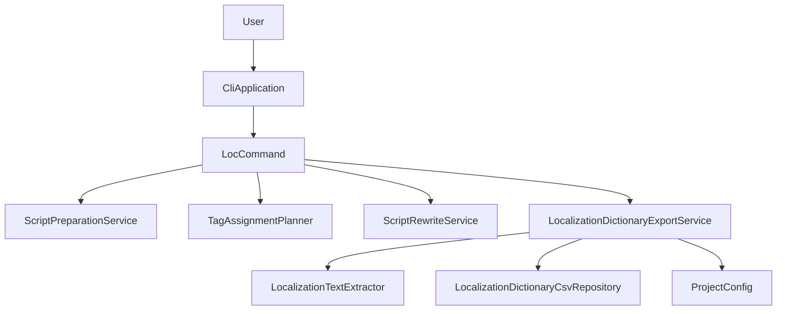
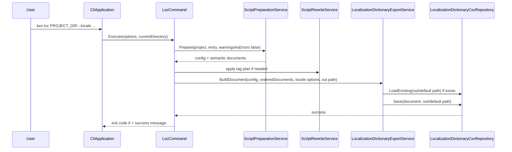

# Design Document

## Overview

この feature は、CLI 利用者が `kes loc` を実行して、翻訳作業に渡すためのローカライズ辞書テンプレート `.csv` を公開仕様どおり生成できるようにする。対象利用者は `.kc` / `.kel` を管理するシナリオ開発者と翻訳フローを整備する CLI 利用者であり、タグ補完済みスクリプトから原文抽出、既存辞書の再利用、言語列制御を 1 コマンドで完結できることが価値である。

この設計は既存の `kes correct` と共通の解析・タグ補完資産を再利用しつつ、CSV 辞書の抽出・マージ・保存を新しい責務として追加する。現在の CLI は `build` / `correct` / `init` のみを持つため、`loc` を同じ command 境界で追加し、将来の `kes build --loc` が同じ辞書 model を入力として利用できるよう整える。

### Goals

- `kes loc [PROJECT_DIR] [options]` を CLI に追加し、既存診断契約のまま実行できるようにする
- `kes correct` 相当の前処理を経た `.kc` からローカライズ辞書テンプレート `.csv` を生成できるようにする
- 既存辞書がある場合に翻訳列と翻訳内容を保持しつつ不足行と不足列を補えるようにする

### Non-Goals

- `kes build --loc` の言語別 `.klib` 生成
- ランタイムでのローカライズ解決
- 翻訳文の妥当性検証や `localize.get` 参照整合性の build-time 検証
- `Paths.Locale` 配下への別形式成果物生成

## Boundary Commitments

### This Spec Owns

- `kes loc` コマンドの引数受付、実行 orchestration、成功出力
- `kes correct` 相当の前処理を利用したタグ補完と必要時の `.kc` 書き戻し
- `say` / `nar` / `select-case` からのローカライズ抽出
- ローカライズ辞書 `.csv` の読込、マージ、UTF-8 BOM 付き保存
- `--locale` と `--out` の解釈、および既存辞書保持規則

### Out of Boundary

- `.csv` を入力にした `.klib` コンパイル
- `localize.get` の解決や手動追加 tag の利用検証
- `kes correct` 単体コマンドの UI 契約変更
- `kes.xml` の schema 拡張

### Allowed Dependencies

- `Commands` 層: `CliApplication`, `DiagnosticSink`, `CliExitCode`
- `Build` 層: `ScriptPreparationService`, `SourceFileParser`, `KelScriptReferenceResolver`
- `Localization` 層: `TagAssignmentPlanner`, `ScriptRewriteService`, 新規辞書 export / repository
- `ProjectSystem` 層: `ProjectRootResolver`, `ProjectConfigLoader`, `ProjectConfig`
- `Semantics` / `Parsing` 層: `ScriptDocument`, `ScriptSyntax`, `StatementSyntax`

### Revalidation Triggers

- `docs/spec/localization-dictionary-spec.md` の列構成や更新規則が変わる場合
- `kes correct` のタグ補完対象や書き戻し契約が変わる場合
- `CliApplication` のコマンドパース契約や標準 diagnostics が変わる場合
- `kes build --loc` が辞書 model を共有利用する設計に進む場合

## Architecture

### Existing Architecture Analysis

- 既存 CLI は `CliApplication` でサブコマンドを分岐し、各コマンドは `CommandOptions` と `CommandResult` を持つ構成である。
- `ScriptPreparationService` が project root 解決から semantic analysis までを担当しており、`CorrectCommand` と `BuildPreparationService` がこの境界を再利用している。
- `Localization` 配下にはタグ補完と書き戻しに必要な型が揃っているが、辞書抽出と CSV 永続化はまだ存在しない。

### Architecture Pattern & Boundary Map



**Architecture Integration**

- Selected pattern: 既存 CLI 拡張パターン。command が orchestration を持ち、辞書生成は localization service へ委譲する。
- Domain/feature boundaries: `Commands` は入力境界、`Build` は解析準備、`Localization` はタグ補完と辞書生成、`ProjectSystem` は設定解決を担当する。
- Existing patterns preserved: `CommandOptions` / `CommandResult`、`CliExitCode`、`DiagnosticSink`、service 主導の orchestration。
- New components rationale: CSV の契約と既存翻訳保持を CLI 境界から分離し、unit test 可能にするため。
- Steering compliance: 単一 CLI アプリのレイヤ分離を保ち、新規責務を `Localization` に閉じ込める。

### Technology Stack

| Layer | Choice / Version | Role in Feature | Notes |
|-------|------------------|-----------------|-------|
| Frontend / CLI | C# / .NET 10 | `kes loc` の引数受付と診断出力 | 既存 `CliApplication` を拡張 |
| Backend / Services | C# service classes | 解析結果から辞書 model を生成 | 既存 `ScriptPreparationService` を再利用 |
| Data / Storage | CSV UTF-8 BOM | 辞書テンプレートの保存形式 | 仕様書が列契約を所有 |
| Infrastructure / Runtime | File system | 既存辞書読込と出力先書込 | project root / `--out` を解決 |

## File Structure Plan

### Directory Structure

```text
source/cli/KoromoEventScript.Cli/
├── Commands/
│   ├── CliApplication.cs
│   └── Loc/
│       ├── LocCommand.cs
│       ├── LocCommandOptions.cs
│       └── LocCommandResult.cs
└── Localization/
    ├── LocalizationDictionaryExportService.cs
    ├── LocalizationDictionaryCsvRepository.cs
    ├── LocalizationDictionaryDocument.cs
    ├── LocalizationDictionaryEntry.cs
    ├── LocalizationLocaleSelection.cs
    └── LocalizationTextExtractor.cs
```

### Modified Files

- `source/cli/KoromoEventScript.Cli/Commands/CliApplication.cs` — `loc` の引数パース、コマンド分岐、unsupported command 文言の更新
- `source/cli/KoromoEventScript.Cli/Build/ScriptPreparationService.cs` — 必要であれば `kes loc` 成功出力向けに利用しやすい戻り情報を補強するが、責務は project/semantic preparation に留める
- `tests/KoromoEventScript.Cli.Tests/Commands/CliApplicationTests.cs` — `loc` の parse / dispatch / command line error を追加
- `tests/KoromoEventScript.Cli.Tests/Commands/CorrectCommandTests.cs` — `kes loc` が共有前処理を使う前提の退行観点を追加する場合に更新

### New Files

- `source/cli/KoromoEventScript.Cli/Commands/Loc/LocCommand.cs` — `kes loc` の orchestration
- `source/cli/KoromoEventScript.Cli/Commands/Loc/LocCommandOptions.cs` — `PROJECT_DIR`, `--locale`, `--out`, `--log-format` の入力契約
- `source/cli/KoromoEventScript.Cli/Commands/Loc/LocCommandResult.cs` — exit code, diagnostics, success message の戻り契約
- `source/cli/KoromoEventScript.Cli/Localization/LocalizationDictionaryExportService.cs` — 抽出結果と既存辞書を統合して出力 document を構成
- `source/cli/KoromoEventScript.Cli/Localization/LocalizationDictionaryCsvRepository.cs` — CSV 読込 / 保存、UTF-8 BOM、必須列検証
- `source/cli/KoromoEventScript.Cli/Localization/LocalizationDictionaryDocument.cs` — 辞書全体の model
- `source/cli/KoromoEventScript.Cli/Localization/LocalizationDictionaryEntry.cs` — 1 行分の model
- `source/cli/KoromoEventScript.Cli/Localization/LocalizationLocaleSelection.cs` — `--locale` と既存辞書列から最終言語列を決める value object
- `source/cli/KoromoEventScript.Cli/Localization/LocalizationTextExtractor.cs` — `ScriptSyntax` から辞書抽出対象を列挙
- `tests/KoromoEventScript.Cli.Tests/Commands/LocCommandTests.cs` — command 成功 / 失敗 / 出力ファイル観点の統合テスト
- `tests/KoromoEventScript.Cli.Tests/Localization/LocalizationDictionaryExportServiceTests.cs` — 抽出、マージ、列選択規則の unit test
- `tests/KoromoEventScript.Cli.Tests/Localization/LocalizationDictionaryCsvRepositoryTests.cs` — UTF-8 BOM、必須列検証、一意 tag 検証の unit test

## System Flows



- `kes loc` は `--check-only` を持たないため、前処理で必要なタグ補完があれば `.kc` に反映してから辞書を書き出す。
- 抽出は再 parse を必須にせず、`TagAssignmentPlan` を補助入力として未設定タグを論理的に補完した view を使う。
- 出力対象言語列は既存辞書読込後に確定するため、locale merge は repository 読込の後段で行う。

## Requirements Traceability

| Requirement | Summary | Components | Interfaces | Flows |
|-------------|---------|------------|------------|-------|
| 1.1 | `kes loc` で辞書生成を開始する | `CliApplication`, `LocCommand` | `LocCommandOptions` | Sequence |
| 1.2 | `PROJECT_DIR` を対象プロジェクトにする | `CliApplication`, `ScriptPreparationService` | `LocCommandOptions` | Sequence |
| 1.3 | `--out` の明示出力先を使う | `LocCommand`, `LocalizationDictionaryCsvRepository` | `LocCommandOptions` | Sequence |
| 1.4 | `--out` 省略時に project root を使う | `LocCommand`, `LocalizationDictionaryExportService` | `LocCommandOptions` | Sequence |
| 1.5 | 不正引数は command line error にする | `CliApplication` | parser contract | なし |
| 1.6 | プロジェクトや出力先解決失敗を file error にする | `ScriptPreparationService`, `LocalizationDictionaryCsvRepository` | result contract | Sequence |
| 2.1 | `kes correct` 相当前処理を行う | `LocCommand`, `TagAssignmentPlanner`, `ScriptRewriteService` | `LocCommand.Execute` | Sequence |
| 2.2 | entry `.kel` から `.kc` と import を解決する | `ScriptPreparationService` | `ScriptPreparationRequest` | Sequence |
| 2.3 | semantic analysis 後に辞書生成可否を決める | `ScriptPreparationService` | `ScriptPreparationResult` | Sequence |
| 2.4 | 構文/意味エラー時は辞書生成しない | `ScriptPreparationService`, `LocCommand` | diagnostics contract | Sequence |
| 2.5 | タグ補完/書き戻し失敗時は不完全な辞書を出さない | `ScriptRewriteService`, `LocCommand` | rewrite result contract | Sequence |
| 3.1 | 公開仕様どおりの CSV を出力する | `LocalizationDictionaryExportService`, `LocalizationDictionaryCsvRepository` | document contract | Sequence |
| 3.2 | UTF-8 BOM で保存する | `LocalizationDictionaryCsvRepository` | save contract | なし |
| 3.3 | `tag,say,original,<locale...>` の列順を守る | `LocalizationDictionaryDocument`, `LocalizationDictionaryCsvRepository` | document contract | なし |
| 3.4 | `say` / `nar` / `select-case` を抽出する | `LocalizationTextExtractor` | extraction contract | なし |
| 3.5 | `say` では話者名を `say` 列へ入れる | `LocalizationTextExtractor` | entry contract | なし |
| 3.6 | `say` 列を補助情報として扱う | `LocalizationDictionaryEntry`, `LocalizationDictionaryExportService` | entry contract | なし |
| 3.7 | `original` に改行やマクロを保持する | `LocalizationTextExtractor` | extraction contract | なし |
| 3.8 | `tag` を安定キーとして使う | `LocalizationDictionaryEntry`, `LocalizationDictionaryExportService` | entry contract | なし |
| 4.1 | 既存辞書の翻訳列と翻訳内容を引き継ぐ | `LocalizationDictionaryCsvRepository`, `LocalizationDictionaryExportService` | document contract | Sequence |
| 4.2 | `--locale` 省略時は既存言語列を使う | `LocalizationLocaleSelection`, `LocalizationDictionaryExportService` | locale selection contract | Sequence |
| 4.3 | 既存辞書がないときは基準言語のみを使う | `LocalizationLocaleSelection`, `LocalizationDictionaryExportService` | locale selection contract | Sequence |
| 4.4 | `--locale` 指定時は既存列へマージする | `LocalizationLocaleSelection` | locale selection contract | Sequence |
| 4.5 | 既存言語列を削除しない | `LocalizationLocaleSelection`, `LocalizationDictionaryDocument` | locale selection contract | なし |
| 4.6 | 同一 tag の既存翻訳を保持する | `LocalizationDictionaryExportService` | merge contract | なし |
| 4.7 | 不足行/不足列を追加する | `LocalizationDictionaryExportService` | merge contract | なし |
| 4.8 | 必須列不足を辞書形式エラーにする | `LocalizationDictionaryCsvRepository` | load contract | なし |
| 4.9 | 非一意 tag を辞書形式エラーにする | `LocalizationDictionaryCsvRepository` | load contract | なし |
| 5.1 | 成功時 exit code 0 | `LocCommandResult`, `LocCommand` | result contract | Sequence |
| 5.2 | 引数エラー時 exit code 2 | `CliApplication` | parser contract | なし |
| 5.3 | 構文検証エラー時 exit code 3 | `ScriptPreparationService`, `LocCommand` | result contract | Sequence |
| 5.4 | compile diagnostics 時 exit code 4 | `ScriptPreparationService`, `LocCommand` | result contract | Sequence |
| 5.5 | 入出力エラー時 exit code 6 | `LocalizationDictionaryCsvRepository`, `ScriptPreparationService` | result contract | Sequence |
| 5.6 | diagnostics は標準形式で出力する | `DiagnosticSink`, `CliApplication` | diagnostic contract | なし |
| 5.7 | 正常終了時に出力先を示す | `LocCommandResult`, `LocCommand` | success message contract | Sequence |

## Components and Interfaces

| Component | Domain/Layer | Intent | Req Coverage | Key Dependencies (P0/P1) | Contracts |
|-----------|--------------|--------|--------------|--------------------------|-----------|
| `CliApplication` loc branch | Commands | `loc` の parse と dispatch | 1.1, 1.2, 1.5, 5.2, 5.6 | `LocCommand` (P0), `DiagnosticSink` (P0) | Service |
| `LocCommand` | Commands | `kes loc` の orchestration | 1.1-1.6, 2.1-2.5, 5.1-5.7 | `ScriptPreparationService` (P0), `TagAssignmentPlanner` (P0), `ScriptRewriteService` (P0), `LocalizationDictionaryExportService` (P0) | Service, State |
| `LocalizationDictionaryExportService` | Localization | 抽出、既存辞書マージ、最終 document 生成 | 3.1-3.8, 4.1-4.7 | `LocalizationTextExtractor` (P0), `LocalizationDictionaryCsvRepository` (P0), `LocalizationLocaleSelection` (P0) | Service |
| `LocalizationDictionaryCsvRepository` | Localization | CSV の読込、検証、保存 | 1.3, 1.4, 1.6, 3.1-3.3, 4.1, 4.8, 4.9, 5.5 | File system (P0) | Service |
| `LocalizationTextExtractor` | Localization | `ScriptSyntax` からローカライズ対象行を抽出 | 3.4-3.8 | `ScriptDocument` (P0), syntax nodes (P0) | Service |
| `LocalizationDictionaryDocument` | Localization | 辞書全体の型安全な表現 | 3.1-3.3, 4.1-4.7 | なし | State |
| `LocalizationLocaleSelection` | Localization | 最終出力言語列を決定 | 4.2-4.5 | `LocCommandOptions` (P1), existing document (P0) | State |

### Commands

#### LocCommand

| Field | Detail |
|-------|--------|
| Intent | `kes loc` の前処理、辞書生成、結果返却を統括する |
| Requirements | 1.1, 1.2, 1.3, 1.4, 1.6, 2.1, 2.4, 2.5, 5.1, 5.3, 5.4, 5.5, 5.7 |

**Responsibilities & Constraints**

- `ScriptPreparationService` を呼び、entry から到達可能な `.kc` 群を semantic analysis 済みで取得する
- `TagAssignmentPlanner` と `ScriptRewriteService` を使い、必要なタグ補完を `.kc` に反映する
- export service へ `OrderedDocuments` と `TagAssignmentPlan` の両方を渡し、書き戻し直後でも tag-complete な抽出を行わせる
- 解析または書き戻しが失敗した場合は CSV 生成へ進まない
- 成功時は output path を含む success message を返す

**Dependencies**

- Inbound: `CliApplication` — サブコマンド実行 (P0)
- Outbound: `ScriptPreparationService` — project / semantic preparation (P0)
- Outbound: `TagAssignmentPlanner` — tag assignment plan generation (P0)
- Outbound: `ScriptRewriteService` — `.kc` rewrite (P0)
- Outbound: `LocalizationDictionaryExportService` — document 生成と保存 (P0)

**Contracts**: Service [x] / API [ ] / Event [ ] / Batch [ ] / State [x]

##### Service Interface

```csharp
public sealed record LocCommandOptions(
    string? ProjectDirectory,
    string? LocaleList,
    string? OutputPath,
    DiagnosticOutputFormat OutputFormat);

public sealed record LocCommandResult(
    CliExitCode ExitCode,
    IReadOnlyList<Diagnostic> Diagnostics,
    string? SuccessMessage);

public sealed class LocCommand
{
    public LocCommandResult Execute(LocCommandOptions options, string currentDirectory);
}
```

- Preconditions:
  - `options` は null でない
  - `currentDirectory` は空でない
- Postconditions:
  - 成功時は `ExitCode == Success`、辞書ファイルが保存済み、`SuccessMessage` に出力先が含まれる
  - 失敗時は対応する diagnostics を返し、CSV は新規生成または上書きされない
- Invariants:
  - command layer は CSV 形式詳細を直接組み立てない
  - diagnostic 出力形式は `CliApplication` が担う

**Implementation Notes**

- Integration: `CorrectCommand` の内部資産を service 単位で再利用し、`CorrectCommand` 自体の success output には依存しない
- Validation: parse errors と file errors は既存 exit code 規約に従う
- Risks: rewrite 後の抽出対象と in-memory syntax の整合を崩さないよう、export は semantic result の ordered documents を authoritative input とする

### Localization

#### LocalizationDictionaryExportService

| Field | Detail |
|-------|--------|
| Intent | 抽出結果、既存辞書、locale 指定から最終 CSV document を構成して保存する |
| Requirements | 3.1, 3.3, 3.8, 4.1, 4.2, 4.3, 4.4, 4.5, 4.6, 4.7 |

**Responsibilities & Constraints**

- `LocalizationTextExtractor` で得た抽出結果を tag 単位に正規化する
- 既存辞書があれば読み込み、翻訳列と翻訳内容を保持したまま merge する
- 最終言語列を `LocalizationLocaleSelection` で決める
- document 構築後に repository へ保存を委譲する

**Dependencies**

- Inbound: `LocCommand` — export 実行要求 (P0)
- Outbound: `LocalizationTextExtractor` — row extraction (P0)
- Outbound: `LocalizationDictionaryCsvRepository` — existing document load / save (P0)
- Outbound: `LocalizationLocaleSelection` — locale selection policy (P0)

**Contracts**: Service [x] / API [ ] / Event [ ] / Batch [ ] / State [ ]

##### Service Interface

```csharp
public sealed record LocalizationExportRequest(
    ProjectConfig Config,
    IReadOnlyList<ScriptDocument> OrderedDocuments,
    TagAssignmentPlan TagPlan,
    IReadOnlyList<string> RequestedLocales,
    string OutputPath);

public sealed class LocalizationDictionaryExportService
{
    public LocalizationExportResult Export(LocalizationExportRequest request);
}
```

- Preconditions:
  - `OrderedDocuments` は semantic import graph の順序で与えられる
  - `TagPlan` は同じ document 集合に対して生成されたものである
  - `OutputPath` は absolute path に正規化済みである
- Postconditions:
  - 成功時は保存済みの document と最終 locale 列が得られる
  - 同一 tag の既存翻訳は保持される
- Invariants:
  - 出力 document は `tag` / `say` / `original` 固定列を保持する
  - locale 列は既存辞書の列を暗黙削除しない

**Implementation Notes**

- Integration: project root 既定出力と `--out` 明示出力を同一 service 契約で扱う
- Validation: 既存辞書の読み込み失敗は保存前に停止する
- Risks: 手動追加 tag は `loc` では削除せず保持するかが公開仕様依存になるため、今回の範囲では既存辞書読込時に保持対象として document に残す

#### LocalizationDictionaryCsvRepository

| Field | Detail |
|-------|--------|
| Intent | ローカライズ辞書 CSV の永続化契約を所有する |
| Requirements | 1.3, 1.4, 1.6, 3.1, 3.2, 3.3, 4.1, 4.8, 4.9, 5.5 |

**Responsibilities & Constraints**

- 既存辞書が存在する場合に UTF-8 BOM CSV を読み込む
- 必須列、tag 一意性、ヘッダ順を検証する
- 保存時は UTF-8 BOM 付きで固定列順序を守る
- repository は CSV 契約のみを扱い、抽出や merge 判断は行わない

**Dependencies**

- Inbound: `LocalizationDictionaryExportService` — load / save (P0)
- External: file system — file access (P0)

**Contracts**: Service [x] / API [ ] / Event [ ] / Batch [ ] / State [ ]

##### Service Interface

```csharp
public sealed class LocalizationDictionaryCsvRepository
{
    public LocalizationDictionaryLoadResult Load(string path);
    public LocalizationDictionarySaveResult Save(string path, LocalizationDictionaryDocument document);
}
```

- Preconditions:
  - `path` は対象ファイルパスまたは既定出力パス
- Postconditions:
  - `Load` は既存ファイルなしを distinguish できる
  - `Save` は UTF-8 BOM 付き CSV を出力する
- Invariants:
  - fixed columns は常に `tag`, `say`, `original`
  - 既存辞書読み込み時の validation error は file / dictionary diagnostics として返す

**Implementation Notes**

- Integration: `System.Text` と標準 file API のみで完結し、新規外部依存を導入しない
- Validation: 改行やカンマを含む本文は CSV として安全に round-trip できることを保証する
- Risks: 独自 CSV 実装は quoting バグを生みやすいため、repository test で round-trip を固定する

#### LocalizationTextExtractor

| Field | Detail |
|-------|--------|
| Intent | script AST からローカライズ対象の辞書行候補を抽出する |
| Requirements | 3.4, 3.5, 3.6, 3.7, 3.8 |

**Responsibilities & Constraints**

- `say` 本文、`nar` 本文、`select` の `case` 選択肢を抽出する
- statement にタグが未設定でも、同位置に対応する `TagAssignmentPlan` の候補から有効 tag を解決できるようにする
- `say` は話者名を `say` 列へ入れる
- `nar` / `select` は `say` 列を補助情報として空または規則化された値で表現できるが、主キーにしない
- `original` はインラインマクロ、改行、ページ区切りを保持した文字列で返す

**Dependencies**

- Inbound: `LocalizationDictionaryExportService` — extraction request (P0)
- External: syntax nodes — `ScriptSyntax`, `StatementSyntax` (P0)

**Contracts**: Service [x] / API [ ] / Event [ ] / Batch [ ] / State [ ]

##### Service Interface

```csharp
public sealed record LocalizationSourceEntry(
    string Tag,
    string Speaker,
    string Original);

public sealed class LocalizationTextExtractor
{
    public IReadOnlyList<LocalizationSourceEntry> Extract(
        IReadOnlyList<ScriptDocument> orderedDocuments,
        TagAssignmentPlan tagPlan);
}
```

- Preconditions:
  - `tagPlan` は `orderedDocuments` と同じ source set に対する plan である
- Postconditions:
  - 返却行は出現順を保持する
  - 各行は空でない `Tag` を持つ
- Invariants:
  - 抽出対象は `say` / `nar` / `select-case` のみ

**Implementation Notes**

- Integration: `TagAssignmentPlanner` の対象と抽出対象を一致させる
- Validation: タグ欠落行が残っている場合は upstream failure として扱う
- Risks: text block の再構成規則が parser AST 表現に依存するため、fixture ベースの snapshot に近いテストを置く

## Data Models

### Domain Model

- `LocalizationDictionaryDocument`
  - 辞書全体の authoritative model
  - 固定列定義と locale columns を保持する
  - `tag` 一意性を不変条件に持つ
- `LocalizationDictionaryEntry`
  - 1 行分の model
  - `Tag`, `Speaker`, `Original`, `TranslationsByLocale`
- `LocalizationLocaleSelection`
  - `RequestedLocales`, `ExistingLocales`, `PrimaryLocale` から最終 `OutputLocales` を決める value object

### Logical Data Model

| Entity | Key | Attributes | Rules |
|--------|-----|------------|-------|
| `LocalizationDictionaryDocument` | なし | `Entries`, `LocaleColumns` | `LocaleColumns` は固定列の後段に並ぶ |
| `LocalizationDictionaryEntry` | `Tag` | `Speaker`, `Original`, `Translations` | `Tag` は document 内で一意 |
| `Translations` | `LocaleTag` | localized text | locale ごとに 0..1 値 |

**Consistency & Integrity**

- `tag` は document 内で一意
- `original` は抽出結果を source of truth とし、既存辞書値で上書きしない
- 既存翻訳は同一 `tag` と locale の組み合わせでのみ再利用する

### Data Contracts & Integration

**CSV Schema**

| Column | Type | Required | Notes |
|--------|------|----------|-------|
| `tag` | string | Yes | stable key |
| `say` | string | Yes | speaker or auxiliary hint |
| `original` | string | Yes | base language text |
| `<locale>` | string | No | translation text |

**Serialization Rules**

- 文字コードは UTF-8 BOM
- ヘッダ行は固定列の後に locale columns
- 改行やカンマを含む本文は CSV quoting により保持する

## Error Handling

### Error Strategy

- 引数エラーは `CliApplication` で即時失敗する
- project root / `kes.xml` / entry `.kel` / `.kc` 解決エラーは `ScriptPreparationService` が返し、`LocCommand` はそのまま中断する
- 既存辞書の形式エラーや保存失敗は repository が diagnostic 化し、CSV 更新を成功扱いしない

### Error Categories and Responses

- **User Errors**: 不正オプション、値不足、重複引数。`KES9001` 系 diagnostics と exit code `2`
- **Syntax / Compile Errors**: `.kel` / `.kc` の parse 失敗、semantic diagnostics。exit code `3` または `4`
- **File Errors**: `kes.xml` 読込不可、出力先保存不可、既存辞書読込不可。exit code `6`
- **Dictionary Contract Errors**: 必須列不足、非一意 tag。file/dictionary diagnostics として扱い、保存前に停止

### Monitoring

- 既存 CLI 同様に structured logging の新設は行わず、diagnostic stream を唯一の観測面とする
- success path では出力先パスを標準出力へ出す

## Testing Strategy

### Unit Tests

- `LocalizationTextExtractorTests`: `say` / `nar` / `select-case` のみが抽出され、タグ・話者名・原文保持が仕様どおりであることを確認する
- `LocalizationDictionaryExportServiceTests`: `--locale` 省略時の既存辞書優先、既存辞書なし時の基準言語のみ、指定 locale のマージ、既存翻訳保持、不足行追加を確認する
- `LocalizationDictionaryCsvRepositoryTests`: UTF-8 BOM 保存、必須列不足、非一意 tag、改行やカンマを含む本文の round-trip を確認する

### Integration Tests

- `LocCommandTests`: 最小プロジェクトで `kes loc` が `.kc` へ必要なタグを書き戻した上で CSV を出力することを確認する
- `LocCommandTests`: 既存辞書がある場合に翻訳列と翻訳内容を保持しながら新規抽出行を追加することを確認する
- `LocCommandTests`: `--out` 指定時に project root ではなく指定先へ保存することを確認する
- `LocCommandTests`: semantic error / file error / invalid dictionary で CSV が生成されないことを確認する

### E2E / CLI Tests

- `CliApplicationTests`: `loc` サブコマンドの parse、unsupported option、`--locale` 値不足、`--out` 値不足を確認する
- `CliApplicationTests`: `loc` 成功時に exit code `0` と success message を返し、diagnostics format が既存契約どおりであることを確認する

## Supporting References

- 詳細な調査メモと採否理由は `research.md` を参照する
