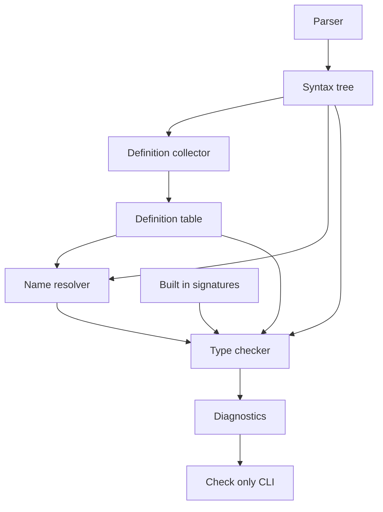
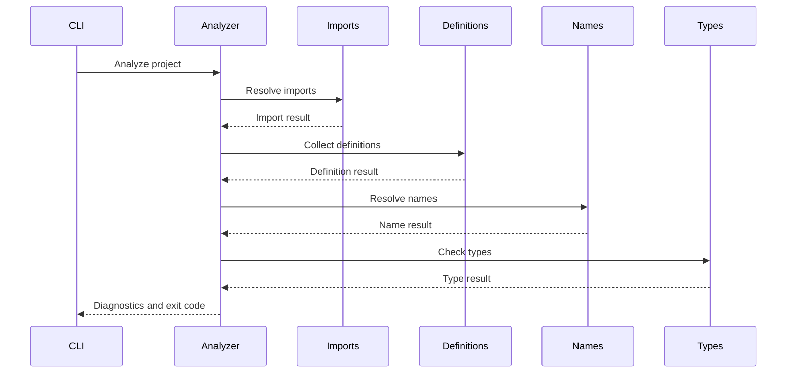

# Design Document

## Overview

この設計は、KoromoEventScript の意味解析に MVP 型検査を追加し、代入、式、命令引数の基本的な型不一致を `kes build --check-only` で compile diagnostic として報告する。CLI 利用者は `string`、`number`、`bool`、配列型、`Actor` の誤用を IR 生成や runtime 実行前に発見できる。

既存の semantic pipeline は import 解決、定義収集、名前解決の順に実行される。型検査は `NameResolver` 成功後の独立 stage とし、前段診断がある場合は実行しない。診断出力、JSON Lines、終了コードは既存の `Diagnostic` と `CliExitCode.CompileError` を使う。

### Goals

- MVP 型を `KesType` として表現し、注釈、リテラル、変数、関数、組み込み命令の型を一貫して比較する。
- 変数定義、代入、算術・比較・論理演算、配列、`if` / `while` / `for`、通常命令、LESS、式中関数呼び出しの型不一致を診断する。
- import、定義収集、未定義参照の stage ordering と既存 CLI 診断契約を維持する。

### Non-Goals

- 完全な型システム、暗黙型変換、オーバーロード解決、enum 詳細検査、ユーザー定義クラスのメンバーアクセス完全解決。
- 素材、manifest、actor の cast 済み状態、runtime 状態、IR / `.klib` 生成の検証。
- VS Code Language Server 連携、新しい公開構文、STL 完全登録、`__systemcall__` 内部検査。

## Boundary Commitments

### This Spec Owns

- MVP 型を表す semantic type model と assignability rules。
- syntax token list と既存 definition table から型環境を作る `TypeChecker` stage。
- 代入、式、配列、制御構文、命令引数、関数呼び出しの MVP 型診断。
- `if`、`while`、`for`、代入文を型検査対象にするための最小 syntax node と parser contract。
- `kes build --check-only` で型診断を compile error として表面化する統合確認。

### Out of Boundary

- import graph、定義収集、重複定義、シャドーイング、未定義参照の仕様変更。
- 式 AST 全体への parser 改修、class / enum / member access の完全解決。
- STL 実装ファイル、`__systemcall__`、runtime event、素材/manifest 検証。
- 型推論の高度化、制御フロー解析、戻り値網羅、初期化済み状態解析。

### Allowed Dependencies

- `Parsing` の `ScriptSyntax`、`StatementSyntax`、`BlockSyntax`、`SourceLocation`、token list。
- `Lexing` の `Token`、`TokenKind`。
- `Semantics` の `ImportGraph`、`DefinitionCollectionResult`、`DefinitionTable`、`DefinitionScope`、`ScopedSymbolDefinition`、`DefinitionKind`。
- `Diagnostics` の `Diagnostic`、`DiagnosticLevel`。
- `Commands` の `CliExitCode`。
- `docs/spec/kes-language-spec.md` と `docs/spec/kes-language-stl-spec.md` の MVP 型・組み込み命令定義。

### Revalidation Triggers

- `StatementSyntax`、`TokenKind`、type annotation token の形が変わる場合。
- `DefinitionTable`、scope id、`DefinitionKind`、import visibility の契約が変わる場合。
- built-in callable の登録方式または STL 署名が変更される場合。
- diagnostic ordering、diagnostic formatter、compile error exit code が変更される場合。
- 将来の full expression AST、class member resolution、enum type checking が導入される場合。

## Architecture

### Existing Architecture Analysis

`SemanticAnalyzer` は import 解決成功後に `DefinitionCollector` を実行し、定義診断がなければ `NameResolver` を呼ぶ。Issue #21 の実装により、未定義参照は名前解決 stage で compile diagnostic になる。型検査は未定義名の型を推測しないため、この成功後にだけ実行する。

現行 parser は `var` の型注釈と初期値、通常命令引数、LESS 引数を token list として保持する。これにより、MVP 型検査は完全な expression AST を導入せずに token stream evaluator で開始できる。一方で、代入、`if`、`while`、`for` の専用 syntax node はないため、この spec が最小 node と parser branch を追加する。

### Architecture Pattern & Boundary Map



**Architecture Integration**:

- Selected pattern: 既存 semantic pipeline の stage 追加。`TypeChecker` は `NameResolver` の後段に置く。
- Domain/feature boundaries: parser は検査対象構文を表現し、definition collector は名前と scope を提供し、type checker が型環境と診断を所有する。
- Existing patterns preserved: immutable record model、`Diagnostic`、`CliExitCode.CompileError`、case-sensitive name comparison、前段 failure の早期 return。
- New components rationale: `KesType` は型比較、`BuiltInSignatureRegistry` は MVP 署名、`TypeChecker` は traversal と診断生成を分離するために必要である。

### Technology Stack

| Layer | Choice / Version | Role in Feature | Notes |
|-------|------------------|-----------------|-------|
| CLI / Compiler | C# / .NET existing project | semantic validation と CLI 統合 | 新規外部依存なし |
| Parser / Lexer | 既存 hand-written lexer/parser | 最小 syntax node と token list 提供 | full expression AST は導入しない |
| Tests | NUnit existing test stack | unit / integration / CLI regression | 既存 test project に追加 |

## File Structure Plan

### Directory Structure

```text
source/
└── cli/
    └── KoromoEventScript.Cli/
        ├── Parsing/
        │   ├── SyntaxNodes.cs
        │   └── KeParser.cs
        └── Semantics/
            ├── SemanticTypes.cs
            ├── BuiltInSignatureRegistry.cs
            ├── TypeChecker.cs
            ├── SemanticModels.cs
            └── SemanticAnalyzer.cs
tests/
└── KoromoEventScript.Cli.Tests/
    ├── Parsing/
    │   └── KeParserTests.cs
    ├── Semantics/
    │   ├── TypeCheckerTests.cs
    │   └── SemanticAnalyzerTests.cs
    └── Commands/
        └── BuildCheckOnlyCommandTests.cs
testdata/
└── projects/
    └── type-checking/
        ├── success/
        └── failures/
```

### Modified Files

- `source/cli/KoromoEventScript.Cli/Parsing/SyntaxNodes.cs` — `AssignmentStatementSyntax`、`IfStatementSyntax`、`WhileStatementSyntax`、`ForStatementSyntax` を追加し、条件式や代入式を token list と location で保持する。
- `source/cli/KoromoEventScript.Cli/Parsing/KeParser.cs` — `if`、`while`、`for`、identifier assignment の parser branch を追加し、既存 command / LESS parsing と競合しない順序で判定する。
- `source/cli/KoromoEventScript.Cli/Semantics/SemanticTypes.cs` — `KesType`、`KesTypeKind`、assignability helper、type parse result を定義する新規ファイル。
- `source/cli/KoromoEventScript.Cli/Semantics/BuiltInSignatureRegistry.cs` — MVP 組み込み命令と関数の引数・戻り値 signature を定義する新規ファイル。
- `source/cli/KoromoEventScript.Cli/Semantics/TypeChecker.cs` — 型環境構築、token stream expression evaluation、statement traversal、型診断生成を行う新規ファイル。
- `source/cli/KoromoEventScript.Cli/Semantics/SemanticModels.cs` — `TypeCheckingResult` と `SemanticAnalysisResult.TypeChecking` を追加する。
- `source/cli/KoromoEventScript.Cli/Semantics/SemanticAnalyzer.cs` — `NameResolver` 成功後に `TypeChecker` を実行し、型診断を semantic result に集約する。
- `tests/KoromoEventScript.Cli.Tests/Parsing/KeParserTests.cs` — 新規 syntax node の parse と既存 command / LESS との判定順を確認する。
- `tests/KoromoEventScript.Cli.Tests/Semantics/TypeCheckerTests.cs` — MVP 型規則、組み込み署名、stage 内診断を unit test で固定する新規ファイル。
- `tests/KoromoEventScript.Cli.Tests/Semantics/SemanticAnalyzerTests.cs` — 名前解決失敗時に型検査を実行しないこと、型診断が compile error になることを確認する。
- `tests/KoromoEventScript.Cli.Tests/Commands/BuildCheckOnlyCommandTests.cs` — text / JSON Lines / exit code の CLI 統合回帰を追加する。
- `testdata/projects/type-checking/**` — CLI fixture として成功系・失敗系 project を追加する。

## System Flows



型検査は import、definition、name の各 result が成功した場合にだけ実行する。どれかが失敗した場合、既存 stage の diagnostic と exit code を維持する。

## Requirements Traceability

| Requirement | Summary | Components | Interfaces | Flows |
|-------------|---------|------------|------------|-------|
| 1.1 | supported type annotation 認識 | KesType, TypeChecker | ParseType | semantic flow |
| 1.2 | actor declaration を Actor 値として扱う | TypeChecker, TypeEnvironment | DefinitionKind.Actor | semantic flow |
| 1.3 | literals を型分類する | ExpressionTypeEvaluator | Evaluate | semantic flow |
| 1.4 | function annotations を call checking に使う | TypeChecker, TypeEnvironment | FunctionSignature | semantic flow |
| 1.5 | unknown type annotation 診断 | KesType, TypeChecker | Diagnostic | semantic flow |
| 2.1 | var annotation と initializer 整合 | TypeChecker | CheckVar | semantic flow |
| 2.2 | var initializer から推論 | TypeEnvironment | RegisterVariable | semantic flow |
| 2.3 | initializer 不一致診断 | TypeChecker | Diagnostic | semantic flow |
| 2.4 | assignment 整合 | TypeChecker, AssignmentStatementSyntax | CheckAssignment | semantic flow |
| 2.5 | assignment 不一致 message | TypeChecker | Diagnostic | semantic flow |
| 3.1 | arithmetic は number | ExpressionTypeEvaluator | EvaluateBinary | semantic flow |
| 3.2 | arithmetic 不一致診断 | TypeChecker | Diagnostic | semantic flow |
| 3.3 | ordering comparison は number to bool | ExpressionTypeEvaluator | EvaluateBinary | semantic flow |
| 3.4 | equality と null 比較 | KesType | IsAssignableTo, IsReferenceType | semantic flow |
| 3.5 | logical は bool | ExpressionTypeEvaluator | EvaluateUnary, EvaluateBinary | semantic flow |
| 4.1 | non-empty array literal | ExpressionTypeEvaluator | EvaluateArray | semantic flow |
| 4.2 | array element 不一致診断 | TypeChecker | Diagnostic | semantic flow |
| 4.3 | empty array target typing | TypeChecker | ExpectedType context | semantic flow |
| 4.4 | array access と number index | ExpressionTypeEvaluator | EvaluateIndex | semantic flow |
| 4.5 | if / else if / while condition bool | TypeChecker, SyntaxNodes | CheckCondition | semantic flow |
| 4.6 | for iterable と loop variable | TypeChecker, ForStatementSyntax | CheckFor | semantic flow |
| 5.1 | user-defined function call 引数 | TypeChecker | FunctionSignature | semantic flow |
| 5.2 | MVP built-in signature | BuiltInSignatureRegistry | ResolveSignature | semantic flow |
| 5.3 | LESS common/item 引数 | TypeChecker, LessStatementSyntax | CheckLess | semantic flow |
| 5.4 | say speaker Actor | TypeChecker, SayStatementSyntax | CheckSay | semantic flow |
| 5.5 | call argument 不一致診断 | TypeChecker | Diagnostic | semantic flow |
| 5.6 | void result value usage | ExpressionTypeEvaluator | KesType.Void | semantic flow |
| 6.1 | check-only に type diagnostics を流す | SemanticAnalyzer, CLI flow | SemanticAnalysisResult | CLI flow |
| 6.2 | compile error exit code | TypeCheckingResult | CliExitCode.CompileError | CLI flow |
| 6.3 | text output fields | DiagnosticFormatter existing | Diagnostic | CLI flow |
| 6.4 | JSON Lines fields | DiagnosticFormatter existing | Diagnostic | CLI flow |
| 6.5 | 前段 failure を優先 | SemanticAnalyzer | stage gating | semantic flow |
| 6.6 | IR/runtime 不要 | TypeChecker | syntax and definitions only | semantic flow |

## Components and Interfaces

| Component | Domain/Layer | Intent | Req Coverage | Key Dependencies | Contracts |
|-----------|--------------|--------|--------------|------------------|-----------|
| Parser Type Syntax Contract | Parsing | 型検査対象 statement と token list を AST に保持する | 2.4, 4.5, 4.6 | KeLexer P0 | State |
| KesType Model | Semantics | MVP 型と代入可能性を表す | 1.1-1.5, 3.4, 5.6 | Token P1 | State |
| BuiltInSignatureRegistry | Semantics | MVP 組み込み命令と関数の型 signature を提供する | 5.2, 5.3 | STL spec P1 | Service |
| TypeChecker | Semantics | 型環境を作り、statement と式の型診断を生成する | 1.1-6.6 | DefinitionTable P0, ImportGraph P0, BuiltInSignatureRegistry P0 | Service |
| SemanticAnalyzer Integration | Semantics | stage ordering と type result 集約を制御する | 6.1, 6.2, 6.5, 6.6 | TypeChecker P0, NameResolver P0 | Service |
| CLI Diagnostic Flow | CLI | 既存 check-only 出力へ型診断を流す | 6.1-6.4 | SemanticAnalysisResult P0 | Service |

### Parsing

#### Parser Type Syntax Contract

| Field | Detail |
|-------|--------|
| Intent | 型検査対象の代入、条件、反復を syntax tree に表現する |
| Requirements | 2.4, 4.5, 4.6 |

**Responsibilities & Constraints**

- `AssignmentStatementSyntax` は target name、target location、value tokens を保持する。
- `IfStatementSyntax` は primary condition、body、`else if` clauses、optional else body を保持する。
- `WhileStatementSyntax` は condition tokens と body を保持する。
- `ForStatementSyntax` は loop variable name/location、iterable expression tokens、body を保持する。
- 既存 `CommandStatementSyntax` と `LessStatementSyntax` の判定を壊さないため、identifier 行は `=` を持つ場合のみ assignment として扱う。

**Dependencies**

- Inbound: `KeParser` — token stream から syntax node を作る (P0)
- Outbound: `TypeChecker` — condition、assignment、iterable token を読む (P0)

**Contracts**: Service [ ] / API [ ] / Event [ ] / Batch [ ] / State [x]

##### State Management

- State model: immutable syntax record が token list と `SourceLocation` を保持する。
- Persistence & consistency: parse 結果の lifetime 内だけ利用する。
- Concurrency strategy: immutable data のため追加制御なし。

### Semantics

#### KesType Model

| Field | Detail |
|-------|--------|
| Intent | MVP 型、配列型、`null`、`void`、unknown を比較可能な値として表す |
| Requirements | 1.1-1.5, 3.4, 5.6 |

**Responsibilities & Constraints**

- `number`、`bool`、`string`、`Actor`、array、`null`、`void`、unknown、unsupported を表す。
- `null` は `string`、`Actor`、array に assignable とし、`number`、`bool`、`void` には assignable にしない。
- unknown は前段または不完全式に由来する派生診断抑制用であり、成功型として扱わない。
- unsupported は Issue #22 範囲外の型注釈を診断するために使う。

**Dependencies**

- Inbound: `TypeChecker`、`ExpressionTypeEvaluator` — 型比較に使う (P0)
- Outbound: なし

**Contracts**: Service [ ] / API [ ] / Event [ ] / Batch [ ] / State [x]

##### State Management

- State model: `KesTypeKind Kind` と optional `ElementType` を持つ immutable value。
- Invariants: array は non-null element type を持つ。primitive と `Actor` は element type を持たない。

#### BuiltInSignatureRegistry

| Field | Detail |
|-------|--------|
| Intent | MVP built-in command/function の parameter と return type を返す |
| Requirements | 5.2, 5.3 |

**Responsibilities & Constraints**

- `print`、`array_len`、`str_len`、`range`、`number_to_string`、`bool_to_string`、`assert` の core signatures を持つ。
- `cast`、`show`、`hide`、`face`、`move`、`action_jump` の actor signatures を持つ。
- `bg`、`trans`、`camera_autofocus`、`vo`、`vf`、`bgm`、`se`、`save`、`load`、`wait`、`set_config_*` など requirements の MVP command checking に必要な最小 signatures を持つ。
- 可変長、optional、generic 相当の扱いは MVP に必要な範囲だけに限定する。`array_len` は `T[] -> number`、`range` は `number, number -> number[]` とする。

**Dependencies**

- Inbound: `TypeChecker` — call checking で問い合わせる (P0)
- External: `docs/spec/kes-language-stl-spec.md` — signature source (P1)

**Contracts**: Service [x] / API [ ] / Event [ ] / Batch [ ] / State [ ]

##### Service Interface

```csharp
public sealed class BuiltInSignatureRegistry
{
    public bool TryResolve(string name, out CallableSignature signature);
}
```

- Preconditions: `name` は case-sensitive callable name。
- Postconditions: supported MVP built-in のみ signature を返す。
- Invariants: registry は diagnostics を生成しない。

#### TypeChecker

| Field | Detail |
|-------|--------|
| Intent | graph 内 document の型環境を構築し、MVP 型不一致 diagnostics を返す |
| Requirements | 1.1-6.6 |

**Responsibilities & Constraints**

- `DefinitionCollectionResult` と syntax から module、function、block scope ごとの `TypeEnvironment` を構築する。
- type annotation token を `KesType` に変換し、unknown / unsupported を区別する。
- expression token list を評価し、literal、identifier、call、array literal、index access、unary/binary operator、parenthesized expression の MVP 型を返す。
- statement traversal で var、assignment、if、while、for、say、command、LESS、function body、class member body、actor body を検査する。
- 前段が解決済みの名前だけを型対象にし、unknown 型では派生診断を抑制する。
- diagnostics は `KES2015` 以降の compile diagnostic code を使う。具体的な code 割り当ては実装時に一貫した範囲で固定する。

**Dependencies**

- Inbound: `SemanticAnalyzer` — type checking stage を呼ぶ (P0)
- Outbound: `Diagnostic` — type diagnostics を返す (P0)
- Outbound: `BuiltInSignatureRegistry` — built-in signatures を読む (P0)
- Outbound: `DefinitionTable` / `ImportGraph` — scope と import visibility を読む (P0)

**Contracts**: Service [x] / API [ ] / Event [ ] / Batch [ ] / State [ ]

##### Service Interface

```csharp
public sealed class TypeChecker
{
    public TypeCheckingResult CheckTypes(
        ImportGraph graph,
        IReadOnlyList<DefinitionCollectionResult> definitionCollections);
}
```

- Preconditions:
  - import resolution、definition collection、name resolution が成功している。
  - `definitionCollections` は `graph.OrderedDocuments` の各 document を含む。
- Postconditions:
  - 型診断がなければ `CliExitCode.Success` を返す。
  - 型診断があれば `CliExitCode.CompileError` を返す。
  - diagnostics は `graph.OrderedDocuments` と statement traversal の順序で安定する。
- Invariants:
  - syntax tree、definition table、import graph を変更しない。
  - IR、manifest、runtime を参照しない。
  - undefined reference diagnostics を再生成しない。

**Implementation Notes**

- `ExpressionTypeEvaluator` と `TypeEnvironment` は `TypeChecker.cs` 内の private helper から開始し、再利用が必要になった時点で分離する。
- function signatures は user-defined functions と built-ins を同じ `CallableSignature` で扱う。
- named arguments は signature の parameter name と照合し、位置引数と同じ assignability rule を使う。
- LESS は shared arguments と item arguments を結合した call として検査し、nested LESS は再帰的に同じ規則で検査する。

#### SemanticAnalyzer Integration

| Field | Detail |
|-------|--------|
| Intent | 型検査 stage の実行条件と result 集約を制御する |
| Requirements | 6.1, 6.2, 6.5, 6.6 |

**Responsibilities & Constraints**

- `NameResolver` が失敗した場合は `TypeChecker` を呼ばない。
- `TypeChecker` の diagnostics を `SemanticAnalysisResult.Diagnostics` に含める。
- `TypeCheckingResult` を `SemanticAnalysisResult` に保持し、テストで stage 実行有無を確認できるようにする。

**Dependencies**

- Inbound: `BuildCheckOnlyCommand` — semantic analysis を呼ぶ (P0)
- Outbound: `NameResolver` — type checker 前段 (P0)
- Outbound: `TypeChecker` — type stage (P0)

**Contracts**: Service [x] / API [ ] / Event [ ] / Batch [ ] / State [ ]

##### Service Interface

```csharp
public sealed class SemanticAnalyzer
{
    public SemanticAnalysisResult Analyze(
        ProjectConfig config,
        IReadOnlyList<ScriptDocument> entryDocuments);
}
```

- Preconditions: `entryDocuments` は parse 成功済みである。
- Postconditions: exit code は最も早い失敗 stage の分類に従う。
- Invariants: 前段 failure を後段 type diagnostics として二重報告しない。

### CLI

#### CLI Diagnostic Flow

| Field | Detail |
|-------|--------|
| Intent | 型診断を既存 `kes build --check-only` 出力に反映する |
| Requirements | 6.1-6.4 |

**Responsibilities & Constraints**

- 新しい CLI option は追加しない。
- `DiagnosticFormatter` の text / JSON Lines schema を変更しない。
- 型診断は compile error として扱う。

**Dependencies**

- Inbound: CLI user — `kes build --check-only` を実行する (P0)
- Outbound: `SemanticAnalyzer` — diagnostics と exit code を取得する (P0)
- Outbound: `DiagnosticSink` / `DiagnosticFormatter` — 既存形式で出力する (P0)

**Contracts**: Service [x] / API [ ] / Event [ ] / Batch [ ] / State [ ]

##### Service Interface

既存 `BuildCheckOnlyCommand.Execute(BuildCommandOptions, string)` の contract を維持する。

## Data Models

### Domain Model

- `KesType`: MVP semantic type。`number`、`bool`、`string`、`Actor`、array、`null`、`void`、unknown、unsupported を表す。
- `CallableSignature`: callable name、parameters、return type、optional/named argument metadata を持つ。
- `TypeEnvironment`: scope id ごとの variable type、function signature、visible imported module signatures を保持する一時モデル。
- `TypeCheckingResult`: exit code と diagnostics を持つ semantic stage result。

### Logical Data Model

**Structure Definition**:

- `KesType.Array(elementType)` は nested array を表現できる。
- `CallableParameter` は name、type、optional flag、named argument 可否を持つ。
- `TypeEnvironment` は `DefinitionScope.Id` を key にし、scope lookup は current scope から parent scope へ進む。

**Consistency & Integrity**:

- syntax declarations と `DefinitionTable` の scope が型環境の authoritative input である。
- `TypeChecker` は environment を traversal 中に構築するが、永続状態として保存しない。
- duplicate / shadowing / undefined reference がある場合、型環境を成功入力として扱わない。

## Error Handling

### Error Strategy

- 型不一致、unknown type annotation、invalid `void` usage は compile diagnostic として報告する。
- unknown expression type は、前段または未対応構文に由来する可能性があるため派生診断を抑制する。
- 前段 failure は `SemanticAnalyzer` の stage gating で優先する。

### Error Categories and Responses

- Compile error: type mismatch、unsupported type annotation、invalid call argument、invalid condition、invalid array/index access。`CliExitCode.CompileError` を返す。
- Syntax error: parse failure。型検査は実行しない。
- File or directory error: import 入出力失敗。型検査は実行しない。

### Monitoring

追加 logging は不要。既存 CLI diagnostic output が監視可能な結果となる。

## Testing Strategy

### Unit Tests

- `TypeCheckerTests`: `number`、`bool`、`string`、`Actor`、array、`null`、`void` の assignability を確認する。
- `TypeCheckerTests`: var annotation / initializer、initializer inference、assignment mismatch が expected/actual type を含む診断になることを確認する。
- `TypeCheckerTests`: arithmetic、comparison、equality、logical operators の型規則を確認する。
- `TypeCheckerTests`: array literal、empty array target typing、array index type、for iterable element inference を確認する。
- `TypeCheckerTests`: user-defined function、built-in command、LESS、`say` speaker、`void` result usage の call checking を確認する。

### Integration Tests

- `SemanticAnalyzerTests`: name resolution failure がある場合に type diagnostics を出さないことを確認する。
- `SemanticAnalyzerTests`: type mismatch のみがある project で `CliExitCode.CompileError` と type diagnostics が返ることを確認する。
- `SemanticAnalyzerTests`: import 済み function / variable / actor の型が呼び出し元 document で利用できることを確認する。

### CLI Tests

- `BuildCheckOnlyCommandTests`: type mismatch project が compile error exit code を返すことを確認する。
- `BuildCheckOnlyCommandTests`: text output に file、line、column、level、code、message が含まれることを確認する。
- `BuildCheckOnlyCommandTests`: JSON Lines output に `file`、`line`、`column`、`code`、`level`、`message` が含まれることを確認する。
- `BuildCheckOnlyCommandTests`: valid type-checking fixture が success exit code で diagnostics を出さないことを確認する。

### Performance / Load

- 型環境は document ごとに dictionary 化し、参照ごとの全定義線形走査を避ける。
- 具体的な性能目標は本仕様では設定しないが、large fixture を追加する場合は診断順序が安定することを優先して確認する。
