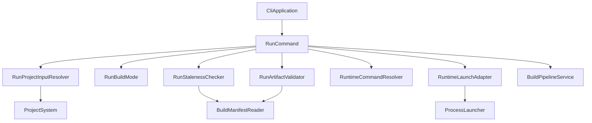
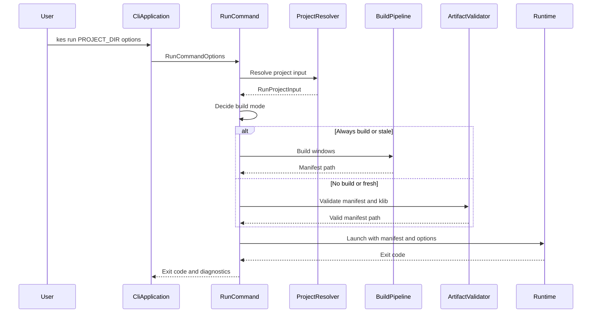

# Design Document: kes-run

## Overview

`kes run` は、`kes init` で作成されたプロジェクトを `kes.xml` 起点で Windows ランタイムへ渡す CLI 実行コマンドである。この設計は、`.kc` 単体実行、`.kel` 直接実行、manifest 直接指定を廃止し、project-first の入力解決、必要時 build、成果物検証、runtime 起動を一貫した実行フローとして再構成する。

対象ユーザーは CLI でプロジェクトを起動する開発者と、CI / smoke test で `kes run` の終了コードを利用する利用者である。既存の build pipeline と runtime 起動骨格は維持し、`RunCommand` に集中している責務を `Commands/Run` 配下の小型コンポーネントへ分離する。

### Goals

- `kes run [PROJECT_DIR]` を `kes.xml` と `Project.Entry` に基づくプロジェクト実行へ統一する。
- `--build`、`--no-build`、既定自動 build の判定を型で表現し、成果物不足と stale を起動前に診断する。
- Windows runtime 起動失敗を終了コード `7` として固定し、runtime process の終了コードはそのまま CLI へ反映する。

### Non-Goals

- `.kc` 単体実行、`.kel` 直接実行、`--manifest` による直接起動の互換維持。
- Unity / Unreal runtime の `kes run` 起動対応。
- Windows runtime 内部の VM、UI、音声、save/load 挙動変更。
- `kes build` の成果物形式そのものの変更。

## Boundary Commitments

### This Spec Owns

- `kes run` の CLI parse 契約、project root 解決、廃止済み入力診断。
- `Project.Entry` を起点とする run 用入力解決と entry ファイル存在確認。
- run 用 build 方針の決定、既存 Windows target 成果物の存在検証、既定自動 build の stale 判定。
- Windows runtime へ渡す `manifest.json` と起動オプションの組み立て。
- runtime 起動失敗の診断と `RuntimeLaunchError = 7` の終了コード。

### Out of Boundary

- `.kel` 構文、manifest スキーマ、`.klib` instruction schema の変更。
- Windows runtime が manifest を読んだ後のイベント遷移、描画、音声、STL 実行。
- `kes publish` の packaging、runtime 同梱、配布 archive 作成。
- `ProjectRootResolver` の他コマンド向け汎用挙動の破壊的変更。

### Allowed Dependencies

- `ProjectRootResolver`、`ProjectConfigLoader`、`ProjectConfig` を project root と `kes.xml` 読み込みに使用する。
- `BuildPipelineService`、`BuildCommandOptions`、`BuildOutputPlanner` の成果物契約を Windows target build に使用する。
- `BuildManifestDocument` と `BuildManifestWriter` の JSON 形状に対応する reader を run 側検証で使用する。
- `ProcessLauncher` を runtime process 起動の境界として維持する。

### Revalidation Triggers

- `docs/spec/cli-tool-spec.md` の `kes run` オプション、終了コード、build 方針が変わった場合。
- `BuildManifestDocument` の `scripts`、`inputs`、`assets`、path 表現が変わった場合。
- Windows runtime の起動引数、`--manifest` 契約、csproj 起動方法が変わった場合。
- `Project.Entry` の意味や `kes.xml` の project config schema が変わった場合。

## Architecture

### Existing Architecture Analysis

現在の CLI は `Commands` が入力境界、`Build` がファイル収集と成果物生成、`ProjectSystem` が `kes.xml` と project root 解決を担当する。`RunCommand` は既に `BuildPipelineService` と `ProcessLauncher` を利用しているが、manifest 解決、build 実行、runtime executable 探索、引数組み立てが集中している。

この設計では、`Commands/Run` 配下に run 固有の型を追加し、`Build` と `ProjectSystem` の既存責務は広げない。dependency direction は `Commands/Run` → `ProjectSystem` / `Build` / `Diagnostics` とし、`Build` から `Commands/Run` へは依存しない。

### Architecture Pattern & Boundary Map

**Architecture Integration**:

- Selected pattern: orchestration + small typed services。`RunCommand` は順序制御だけを持ち、判断は専用型へ委譲する。
- Domain/feature boundaries: project input、build policy、artifact validation、runtime command resolution を分離する。
- Existing patterns preserved: record 型による option / result、`CliExitCode`、`Diagnostic`、NUnit unit test。
- New components rationale: stale 判定と manifest 検証は複数 requirements をまたぐため、`RunCommand` 内 private method ではなく個別コンポーネントにする。
- Steering compliance: C# / .NET 10、nullable 前提、責務別ディレクトリ、仕様駆動テストを維持する。



### Technology Stack

| Layer | Choice / Version | Role in Feature | Notes |
|-------|------------------|-----------------|-------|
| CLI | C# / .NET 10 | `kes run` parse と orchestration | 新規外部依存なし |
| Services | 既存 CLI service classes | project 解決、build、artifact 検証 | `Commands/Run` 配下に追加 |
| Data / Storage | JSON manifest + filesystem timestamp | 成果物検証と stale 判定 | `System.Text.Json` を使用 |
| Infrastructure / Runtime | Windows runtime exe / csproj + `ProcessLauncher` | runtime 起動 | 既存 process boundary を維持 |

## File Structure Plan

### Directory Structure

```text
source/cli/KoromoEventScript.Cli/
├── Commands/
│   ├── CliApplication.cs                 # run option parse に --target / --build を追加し --manifest を廃止
│   ├── CliExitCode.cs                    # RuntimeLaunchError = 7 を追加
│   └── Run/
│       ├── RunCommand.cs                 # run orchestration に集中
│       ├── RunCommandOptions.cs          # Target と BuildMode を持つ project-first option
│       ├── RunBuildMode.cs               # Always / Never / IfStale の build 方針
│       ├── RunProjectInputResolver.cs    # PROJECT_DIR、kes.xml、Project.Entry、廃止済み入力診断
│       ├── RunProjectInput.cs            # 解決済み project root/config/entry/build paths
│       ├── RunArtifactValidator.cs       # manifest と .klib の存在検証
│       ├── RunStalenessChecker.cs        # 入力ファイルと成果物 timestamp の比較
│       ├── BuildManifestReader.cs        # runtime 検証用 manifest JSON 読み取り
│       ├── RuntimeCommandResolver.cs     # runtime exe / csproj 探索
│       └── RuntimeLaunchAdapter.cs       # ProcessLaunchRequest と runtime 引数構築
└── Build/
    └── BuildManifestDocument.cs          # 既存 manifest 型を reader と共有する。必要なら JSON 用補助を追加
```

### Modified Files

- `source/cli/KoromoEventScript.Cli/Commands/CliApplication.cs` — `ParseRun` で `--target windows`、`--build`、`--no-build` 排他、runtime arguments の境界を扱う。`--manifest` は unsupported option とする。
- `source/cli/KoromoEventScript.Cli/Commands/CliExitCode.cs` — `RuntimeLaunchError = 7` を追加する。
- `source/cli/KoromoEventScript.Cli/Commands/Run/RunCommand.cs` — private helper を新コンポーネントへ移し、入力解決、build 実行、検証、起動の順序制御へ縮小する。
- `source/cli/KoromoEventScript.Cli/Commands/Run/RunCommandOptions.cs` — `ManifestPath` を削除し、`Target` と `RunBuildMode` を追加する。
- `tests/KoromoEventScript.Cli.Tests/Commands/RunCommandTests.cs` — project-first run、build mode、artifact validation、runtime launch error の unit test を追加・更新する。
- `tests/KoromoEventScript.Cli.Tests/Commands/CliApplicationTests.cs` — parse 境界、unsupported `--manifest`、`.kc` / `.kel` 指定診断、`--build` / `--no-build` 排他を固定する。

## System Flows



Key decisions:

- `--build` は常に build を通す。既定は stale のときだけ build する。
- `--no-build` は build を一切行わず、成果物不足を診断して停止する。
- runtime 起動後の exit code は変換しない。

## Requirements Traceability

| Requirement | Summary | Components | Interfaces | Flows |
|-------------|---------|------------|------------|-------|
| 1.1 | カレントまたは親から `kes.xml` を探索 | RunProjectInputResolver | `Resolve(options,currentDirectory)` | run sequence |
| 1.2 | 指定 project root の `kes.xml` を使う | RunProjectInputResolver | `RunProjectInput.ProjectRoot` | run sequence |
| 1.3 | `kes.xml` 不在を診断 | RunProjectInputResolver | `RunProjectInputResult.Diagnostics` | error handling |
| 1.4 | `kes.xml` 読み取り・不正を診断 | RunProjectInputResolver, ProjectConfigLoader | `ProjectConfigLoadResult` | error handling |
| 2.1 | `Project.Entry` を実行対象にする | RunProjectInputResolver | `RunProjectInput.EntryPath` | run sequence |
| 2.2 | `Project.Entry` 未指定を診断 | ProjectConfigLoader, RunProjectInputResolver | `ProjectConfigLoadResult` | error handling |
| 2.3 | entry ファイル不在を診断 | RunProjectInputResolver | `RunProjectInputResult` | error handling |
| 2.4 | run 専用 entry override を持たない | CliApplication, RunCommandOptions | option contract | parse flow |
| 3.1 | `.kc` 指定を拒否 | RunProjectInputResolver | file-kind diagnostic | error handling |
| 3.2 | `.kel` 指定を拒否 | RunProjectInputResolver | file-kind diagnostic | error handling |
| 3.3 | file 指定を project root 要求として診断 | RunProjectInputResolver | file-kind diagnostic | error handling |
| 4.1 | target 省略または windows を許可 | CliApplication, RunCommandOptions | `Target` | parse flow |
| 4.2 | unknown target を拒否 | CliApplication | command-line diagnostic | parse flow |
| 4.3 | `--build` で必ず build | RunBuildMode, RunCommand | `Always` | run sequence |
| 4.4 | `--no-build` で build しない | RunBuildMode, RunCommand | `Never` | run sequence |
| 4.5 | `--build` と `--no-build` 排他 | CliApplication | command-line diagnostic | parse flow |
| 4.6 | 既定 stale 時だけ build | RunStalenessChecker, RunCommand | `IfStale` | run sequence |
| 4.7 | build failure を返して停止 | RunCommand, BuildPipelineService | `BuildPipelineResult` | run sequence |
| 5.1 | manifest を runtime へ渡す | RuntimeLaunchAdapter | `--manifest` args | run sequence |
| 5.2 | manifest 不在を診断 | RunArtifactValidator | validation result | error handling |
| 5.3 | `.klib` 不在を診断 | RunArtifactValidator, BuildManifestReader | validation result | error handling |
| 5.4 | 入力が新しければ stale | RunStalenessChecker | timestamp comparison | run sequence |
| 5.5 | build と同じ成果物契約を使う | BuildOutputPlanner, BuildPipelineService | build output paths | run sequence |
| 6.1 | locale を runtime へ渡す | RuntimeLaunchAdapter | runtime args | run sequence |
| 6.2 | start tag を runtime へ渡す | RuntimeLaunchAdapter | runtime args | run sequence |
| 6.3 | fullscreen を runtime へ渡す | RuntimeLaunchAdapter | runtime args | run sequence |
| 6.4 | width / height を runtime へ渡す | RuntimeLaunchAdapter | runtime args | run sequence |
| 6.5 | debug を runtime へ渡す | RuntimeLaunchAdapter | runtime args | run sequence |
| 6.6 | profile を runtime へ渡す | RuntimeLaunchAdapter | runtime args | run sequence |
| 6.7 | `--` 以降を runtime へ渡す | CliApplication, RuntimeLaunchAdapter | runtime args | parse flow |
| 7.1 | 正常終了コードを反映 | RunCommand, ProcessLauncher | `RunCommandResult.ExitCode` | run sequence |
| 7.2 | 非ゼロ終了コードを反映 | RunCommand, ProcessLauncher | `RunCommandResult.ExitCode` | run sequence |
| 7.3 | 起動失敗は `7` | RunCommand, CliExitCode | `RuntimeLaunchError` | error handling |
| 7.4 | 起動前 CLI error は分類どおり | RunCommand | `CliExitCode` | error handling |
| 7.5 | 早い処理段階の error を採用 | RunCommand | ordered orchestration | run sequence |

## Components and Interfaces

| Component | Domain/Layer | Intent | Req Coverage | Key Dependencies | Contracts |
|-----------|--------------|--------|--------------|------------------|-----------|
| `CliApplication.ParseRun` | Commands | run option を project-first 仕様に解析する | 2.4, 4.1, 4.2, 4.5, 6.7 | `Diagnostic` P0 | Service |
| `RunCommand` | Commands/Run | run の処理順序と終了コードを制御する | 4.3-4.7, 7.1-7.5 | `BuildPipelineService` P0, `ProcessLauncher` P0 | Service |
| `RunProjectInputResolver` | Commands/Run | project root と entry を解決し、廃止済み入力を診断する | 1.1-3.3 | `ProjectRootResolver` P0, `ProjectConfigLoader` P0 | Service |
| `RunStalenessChecker` | Commands/Run | 既定 run で build が必要か判定する | 4.6, 5.4 | filesystem P0, `BuildManifestReader` P1 | Service |
| `RunArtifactValidator` | Commands/Run | manifest と `.klib` の存在を起動前に検証する | 5.1-5.3, 5.5 | `BuildManifestReader` P0 | Service |
| `BuildManifestReader` | Commands/Run | run 側で manifest JSON を読み取る | 5.2-5.4 | `System.Text.Json` P0 | Service |
| `RuntimeCommandResolver` | Commands/Run | Windows runtime exe / csproj を解決する | 7.3 | filesystem P0 | Service |
| `RuntimeLaunchAdapter` | Commands/Run | runtime 引数と `ProcessLaunchRequest` を構築する | 5.1, 6.1-6.7 | `ProcessLauncher` P0 | Service |

### Commands

#### `CliApplication.ParseRun`

| Field | Detail |
|-------|--------|
| Intent | `kes run` の CLI 引数を仕様どおりの `RunCommandOptions` に変換する |
| Requirements | 2.4, 4.1, 4.2, 4.5, 6.7 |

**Responsibilities & Constraints**

- positional は最大 1 つの `PROJECT_DIR` として扱う。
- `--target` は省略時 `windows`、指定時 `windows` のみ許可する。
- `--build` と `--no-build` は `RunBuildMode` に正規化し、同時指定は command line error にする。
- `--manifest` は unsupported option として扱う。
- `--` 以降の引数は runtime arguments として保持する。

**Contracts**: Service [x] / API [ ] / Event [ ] / Batch [ ] / State [ ]

##### Service Interface

```csharp
// private parser boundary inside CliApplication
CommandParseResult ParseRun(IReadOnlyList<string> args);
```

- Preconditions: `args[0] == "run"`。
- Postconditions: 成功時は `RunCommandOptions` を持つ。失敗時は `KES9001` diagnostics を持つ。
- Invariants: `RunCommandOptions` は manifest path と entry override を持たない。

#### `RunCommand`

| Field | Detail |
|-------|--------|
| Intent | 入力解決、build 方針、成果物検証、runtime 起動を順序制御する |
| Requirements | 4.3, 4.4, 4.6, 4.7, 7.1, 7.2, 7.3, 7.4, 7.5 |

**Responsibilities & Constraints**

- 起動前 error を順序どおりに返す: parse 済み options → project input → build / validation → runtime resolve → process launch。
- `RunBuildMode.Always` は build を必ず実行する。
- `RunBuildMode.Never` は build を実行しない。
- `RunBuildMode.IfStale` は stale 判定後、必要時だけ build を実行する。
- runtime 起動失敗例外は `CliExitCode.RuntimeLaunchError` に変換する。

**Dependencies**

- Outbound: `RunProjectInputResolver` — project 解決 (P0)
- Outbound: `BuildPipelineService` — Windows build (P0)
- Outbound: `RunArtifactValidator` — 成果物検証 (P0)
- Outbound: `RuntimeLaunchAdapter` — process request 構築 (P0)

**Contracts**: Service [x] / API [ ] / Event [ ] / Batch [ ] / State [ ]

##### Service Interface

```csharp
public RunCommandResult Execute(RunCommandOptions options, string currentDirectory);
```

- Preconditions: `options.Target` は `windows` に正規化済み。
- Postconditions: runtime 起動後は process exit code を返す。起動前 failure は CLI error code と diagnostics を返す。
- Invariants: build / validation が失敗した場合 runtime は起動しない。

### Run Input and Build

#### `RunProjectInputResolver`

| Field | Detail |
|-------|--------|
| Intent | `PROJECT_DIR`、`kes.xml`、`Project.Entry` を run 用入力へ解決する |
| Requirements | 1.1, 1.2, 1.3, 1.4, 2.1, 2.2, 2.3, 3.1, 3.2, 3.3 |

**Responsibilities & Constraints**

- `.kc` / `.kel` file 指定を project root へ暗黙変換しない。
- project root と `ProjectConfig` を取得する。
- `Project.Entry` の実ファイル存在を検証する。
- 成功時は build output root と manifest path を計算できる情報を返す。

**Contracts**: Service [x] / API [ ] / Event [ ] / Batch [ ] / State [ ]

##### Service Interface

```csharp
public sealed record RunProjectInput(
    string ProjectRoot,
    ProjectConfig Config,
    string EntryPath,
    string EntryFullPath,
    string ManifestPath);

public sealed record RunProjectInputResult(
    bool Succeeded,
    RunProjectInput? Input,
    CliExitCode ExitCode,
    IReadOnlyList<Diagnostic> Diagnostics);

public RunProjectInputResult Resolve(string? projectDirectory, string currentDirectory);
```

- Preconditions: `currentDirectory` is non-empty。
- Postconditions: success なら `Input` が non-null。failure なら diagnostics が non-empty。
- Invariants: `EntryPath` は `Project.Entry` と一致し、run 専用 override は存在しない。

#### `RunStalenessChecker`

| Field | Detail |
|-------|--------|
| Intent | 既定 run で build が必要か判定する |
| Requirements | 4.6, 5.4 |

**Responsibilities & Constraints**

- manifest 不在または `.klib` 不足は stale とする。
- 現在の `kes.xml`、entry `.kel`、`EventsPath` 配下 `.kc`、`AssetsPath`、`LocalePath` 配下ファイルを入力候補に含める。
- 入力候補の最終更新時刻が manifest または `.klib` より新しい場合 stale とする。
- 読み取り不能な入力がある場合は stale 判定ではなく file error として返す。

**Contracts**: Service [x] / API [ ] / Event [ ] / Batch [ ] / State [ ]

##### Service Interface

```csharp
public sealed record RunStalenessResult(
    bool Succeeded,
    bool IsStale,
    CliExitCode ExitCode,
    IReadOnlyList<Diagnostic> Diagnostics);

public RunStalenessResult Check(RunProjectInput input);
```

#### `RunArtifactValidator`

| Field | Detail |
|-------|--------|
| Intent | `--no-build` または fresh 判定後の成果物を runtime 起動前に検証する |
| Requirements | 5.1, 5.2, 5.3, 5.5 |

**Responsibilities & Constraints**

- `manifest.json` が存在し、読み取れることを検証する。
- manifest の target が `windows` であることを検証する。
- manifest の `scripts[].klibPath` が manifest directory から解決でき、全て存在することを検証する。
- failure は runtime 起動前の file / compile boundary diagnostics として返す。

**Contracts**: Service [x] / API [ ] / Event [ ] / Batch [ ] / State [ ]

##### Service Interface

```csharp
public sealed record RunArtifactValidationResult(
    bool Succeeded,
    BuildManifestDocument? Manifest,
    CliExitCode ExitCode,
    IReadOnlyList<Diagnostic> Diagnostics);

public RunArtifactValidationResult Validate(string manifestPath);
```

### Runtime Launch

#### `BuildManifestReader`

| Field | Detail |
|-------|--------|
| Intent | run 側検証に必要な範囲で manifest JSON を `BuildManifestDocument` として読む |
| Requirements | 5.2, 5.3, 5.4 |

**Responsibilities & Constraints**

- `BuildManifestWriter` の JSON property naming と一致する options を使う。
- 読み取り不能、JSON 不正、必須 field 不足を diagnostics に変換する。
- manifest schema の所有者にはならない。

**Contracts**: Service [x] / API [ ] / Event [ ] / Batch [ ] / State [ ]

##### Service Interface

```csharp
public sealed record BuildManifestReadResult(
    bool Succeeded,
    BuildManifestDocument? Manifest,
    IReadOnlyList<Diagnostic> Diagnostics);

public BuildManifestReadResult Read(string manifestPath);
```

#### `RuntimeCommandResolver`

| Field | Detail |
|-------|--------|
| Intent | Windows runtime executable または csproj の起動対象を解決する |
| Requirements | 7.3 |

**Responsibilities & Constraints**

- 既存 `DefaultRuntimeExecutablePath` の探索順を維持する。
- app base directory 同梱 exe、repo 内 runtime csproj、runtime bin exe、最後に `KoromoEventScript.Runtime.Windows.exe` の順に解決する。
- 解決文字列は存在検証の最終責任を持たず、起動失敗は `RunCommand` が `7` に変換する。

**Contracts**: Service [x] / API [ ] / Event [ ] / Batch [ ] / State [ ]

##### Service Interface

```csharp
public string Resolve();
```

#### `RuntimeLaunchAdapter`

| Field | Detail |
|-------|--------|
| Intent | manifest path と run options から runtime 起動 request を構築する |
| Requirements | 5.1, 6.1, 6.2, 6.3, 6.4, 6.5, 6.6, 6.7 |

**Responsibilities & Constraints**

- runtime args は `--manifest <path>` から始める。
- optional args は指定されたものだけ追加する。
- `--` 以降の runtime arguments は順序を保って末尾に追加する。
- `.csproj` 起動時は既存の `dotnet run --project ... -- --args <serialized>` 形式を維持する。

**Contracts**: Service [x] / API [ ] / Event [ ] / Batch [ ] / State [ ]

##### Service Interface

```csharp
public ProcessLaunchRequest Create(
    string runtimeCommandPath,
    string manifestPath,
    RunCommandOptions options,
    string currentDirectory);
```

## Data Models

### Domain Model

- `RunBuildMode`: `Always`, `Never`, `IfStale`。CLI parse で決定し、`RunCommand` が方針として消費する。
- `RunProjectInput`: project root、`ProjectConfig`、entry path、entry full path、manifest path をまとめた run 用 aggregate。
- `RunStalenessResult`: stale 判定と file error を区別する result。
- `RunArtifactValidationResult`: manifest 読み取り結果と `.klib` 存在検証結果をまとめる。

### Logical Data Model

- `manifestPath`: `<ProjectRoot>/<BuildPath>/windows/manifest.json`。
- `.klib` path: manifest directory から `scripts[].klibPath` を解決する。
- input candidates: `kes.xml`、`Project.Entry`、`EventsPath/**/*.kc`、`AssetsPath/**/*`、`LocalePath/**/*`。

### Data Contracts & Integration

- CLI option contract:
  - `kes run [PROJECT_DIR] [--target windows] [--build|--no-build] [runtime options] [-- runtime-arguments]`
  - `--manifest` は存在しない option として扱う。
- Runtime argument contract:
  - `--manifest <manifestPath>`
  - optional: `--locale`, `--start`, `--fullscreen`, `--width`, `--height`, `--debug`, `--profile`
  - passthrough: `--` 以降の runtime arguments

## Error Handling

### Error Strategy

- Command line parse error は `KES9001` と `CliExitCode.CommandLineError`。
- project root / `kes.xml` / entry / artifact 不足は runtime 起動前 error として返し、process は起動しない。
- build error は `BuildPipelineService` の diagnostics と exit code をそのまま返す。
- process 起動例外は `KES9xxx` diagnostic と `CliExitCode.RuntimeLaunchError` に変換する。
- process が起動した後の終了コードは成功・失敗を問わず変換しない。

### Error Categories and Responses

- User Errors: unsupported option、unknown target、`--build` / `--no-build` 同時指定、`.kc` / `.kel` 指定。
- File Errors: `kes.xml` 不在、entry 不在、manifest 不在、`.klib` 不在、manifest 読み取り不能。
- Runtime Launch Errors: executable / csproj 起動失敗、process start failure。

### Monitoring

この機能では新規 logging infrastructure は追加しない。CLI diagnostics と exit code を観測点とし、テストで固定する。

## Testing Strategy

### Unit Tests

- `RunProjectInputResolverTests`: `PROJECT_DIR` 省略時の親探索、明示 project root、`.kc` / `.kel` 指定拒否、entry 不在診断を検証する。
- `RunStalenessCheckerTests`: manifest 不在、`.klib` 不足、入力が成果物より新しい場合、成果物が新しい場合の判定を検証する。
- `RunArtifactValidatorTests`: manifest 読み取り、target mismatch、`.klib` 不足、writer 出力 manifest の読み取りを検証する。
- `RuntimeLaunchAdapterTests`: locale/start/window/debug/profile/passthrough と csproj 起動時 serialization を検証する。

### Integration Tests

- `RunCommandTests`: `--build` が build を呼んで runtime を起動すること、`--no-build` が build を呼ばず成果物を検証すること、既定 fresh では build しないこと、既定 stale では build することを検証する。
- `RunCommandTests`: runtime 起動例外が `RuntimeLaunchError = 7` になること、runtime process の非ゼロ終了コードがそのまま返ることを検証する。
- `CliApplicationTests`: `--target windows`、unknown target、`--build` / `--no-build` 排他、`--manifest` unsupported、runtime arguments passthrough を検証する。

### E2E / Smoke Tests

- `testdata/projects/full-command-sample` に対して `kes run --no-build` が既存成果物で runtime launch request を構築できることを process launcher stub で確認する。
- `kes run` 既定実行で build 成果物がない場合に build 後 runtime launch request へ到達することを確認する。

## Security Considerations

- runtime arguments は CLI で解釈しないが、通常 exe 起動では `ProcessStartInfo.ArgumentList` を使い、shell 文字列連結を避ける。
- `.csproj` 起動時の serialized args は既存 escape 処理を維持し、空文字、空白、引用符、backslash を含む引数をテストする。

## Performance & Scalability

- stale 判定は project 内の `EventsPath`、`AssetsPath`、`LocalePath` を列挙する。MVP では安全側の保守的判定を優先し、巨大 project で問題が出た場合は manifest metadata 拡張により精度を上げる。
- build を回避できる fresh 判定を追加するため、現行の常時 build より通常起動は軽くなる。

## Migration Strategy

- `--manifest` に依存する既存テストと手元運用は project-first run へ移行する。
- `.kc` / `.kel` 直接指定は互換維持しない。診断で project root 指定を促す。
- `CliExitCode.RuntimeLaunchError = 7` の追加により、runtime 起動失敗を期待するテストは終了コードを更新する。
