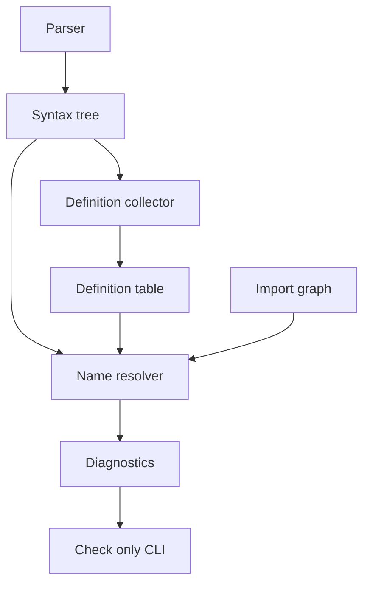

# Design Document

## Overview

この設計は、KoromoEventScript の意味解析で未定義の変数、actor、label、関数参照を compile diagnostic として報告する。CLI 利用者は `kes build --check-only` と CI で参照誤りを実行前に検出できる。

既存の `ImportResolver`、`DefinitionCollector`、`NameResolver`、`SemanticAnalyzer` の流れを維持し、未定義参照診断は `NameResolver` の責務として拡張する。診断出力、JSON Lines、終了コードは既存の `Diagnostic` と `CliExitCode.CompileError` を使う。

### Goals

- 変数、actor、label、関数参照を参照種別ごとに解決し、未解決なら参照箇所を指す診断を出す。
- 既存の import 解決、定義収集、重複定義、シャドーイングの stage ordering を維持する。
- 既存の semantic validation と CLI check-only の診断契約を壊さない。

### Non-Goals

- 型検査、引数数検査、オーバーロード解決、式評価は扱わない。
- actor のロード済み状態、素材、manifest、runtime 実行は検証しない。
- VS Code Language Server や新しい構文は実装しない。

## Boundary Commitments

### This Spec Owns

- `NameResolver` における参照分類、scope-aware lookup、未定義参照診断。
- 参照名の source location を syntax node へ保持するための parser contract。
- `kes build --check-only` で未定義参照を compile error として表面化する統合確認。

### Out of Boundary

- import graph の構築、循環 import、未存在 import、import ルールの変更。
- 定義収集の重複定義およびシャドーイング診断の仕様変更。
- 型、引数、戻り値、アクセス修飾子、実行時状態の検査。
- STL の完全な組み込み定義登録。ただし既存の callable built-in 表現がある場合は参照可能集合として利用できる。

### Allowed Dependencies

- `Parsing` の `ScriptSyntax`、`StatementSyntax`、`SourceLocation`。
- `Semantics` の `DefinitionTable`、`ScopedSymbolDefinition`、`DefinitionKind`、`ImportGraph`、`DefinitionCollectionResult`。
- `Diagnostics` の `Diagnostic`、`DiagnosticLevel`。
- `Commands` の `CliExitCode`。

### Revalidation Triggers

- `StatementSyntax` の参照名や位置情報の形が変わる場合。
- `DefinitionKind`、scope 階層、`DefinitionTable` の契約が変わる場合。
- import の可視性ルール、diagnostic ordering、または CLI 診断出力形式が変わる場合。
- STL や組み込み callable の登録方式が追加される場合。

## Architecture

### Existing Architecture Analysis

`SemanticAnalyzer` は import 解決に成功した後、到達可能 document の定義収集を実行し、定義診断がない場合だけ `NameResolver` を呼ぶ。この構造により、6.1、6.2、6.3 の stage ordering は既に守られている。

現在の `NameResolver` は `SymbolDefinition` を使って module-level の名前と tag を解決しているが、`SymbolDefinition` は `DefinitionKind` を持たない。そのため、actor 参照と関数参照を区別するには `DefinitionTable` を resolver 入力に含める必要がある。

### Architecture Pattern & Boundary Map



**Architecture Integration**:

- Selected pattern: 既存 semantic pipeline の拡張。新しい top-level stage は追加しない。
- Domain/feature boundaries: parser は位置情報を保持し、definition collector は定義表を提供し、name resolver が参照可否を判定する。
- Existing patterns preserved: `Diagnostic`、`CliExitCode.CompileError`、`StringComparer.Ordinal` による case-sensitive 比較、import/definition/name resolution の順序。
- New components rationale: `ReferenceCollector` 相当の private helper と `ReferenceKind` は `NameResolver` 内の責務分離のために追加する。

### Technology Stack

| Layer | Choice / Version | Role in Feature | Notes |
|-------|------------------|-----------------|-------|
| CLI / Compiler | C# / .NET project existing stack | semantic validation と CLI 統合 | 新規外部依存なし |
| Tests | NUnit existing test stack | unit / integration / CLI regression | 既存 test project に追加 |

## File Structure Plan

### Directory Structure

```text
source/
└── cli/
    └── KoromoEventScript.Cli/
        ├── Parsing/
        │   ├── SyntaxNodes.cs
        │   └── KeParser.cs
        └── Semantics/
            ├── NameResolver.cs
            ├── SemanticAnalyzer.cs
            └── SemanticModels.cs
tests/
└── KoromoEventScript.Cli.Tests/
    ├── Parsing/
    │   └── KeParserTests.cs
    ├── Semantics/
    │   ├── NameResolverTests.cs
    │   └── SemanticAnalyzerTests.cs
    └── Commands/
        └── BuildCheckOnlyCommandTests.cs
```

### Modified Files

- `source/cli/KoromoEventScript.Cli/Parsing/SyntaxNodes.cs` — `CommandStatementSyntax`、`LessStatementSyntax`、`SayStatementSyntax` に参照名 location を追加する。
- `source/cli/KoromoEventScript.Cli/Parsing/KeParser.cs` — parser が既存 token location から name location を syntax node に渡す。
- `source/cli/KoromoEventScript.Cli/Semantics/SemanticModels.cs` — `NameResolutionResult` または resolver 入力に `DefinitionTable` ベースの symbols を持たせる契約を調整する。
- `source/cli/KoromoEventScript.Cli/Semantics/SemanticAnalyzer.cs` — `DefinitionCollectionResult` / `DefinitionTable` を `NameResolver` へ渡す。import 失敗と定義診断時の早期 return は維持する。
- `source/cli/KoromoEventScript.Cli/Semantics/NameResolver.cs` — 参照収集、参照種別、scope-aware lookup、未定義診断を実装する中心ファイル。
- `tests/KoromoEventScript.Cli.Tests/Parsing/KeParserTests.cs` — command / LESS / say の name location が保持されることを確認する。
- `tests/KoromoEventScript.Cli.Tests/Semantics/NameResolverTests.cs` — 変数、actor、label、関数、import、case-sensitive、診断位置の unit test を追加または更新する。
- `tests/KoromoEventScript.Cli.Tests/Semantics/SemanticAnalyzerTests.cs` — import/definition 診断が name resolution より前に返ること、正常系で診断しないことを確認する。
- `tests/KoromoEventScript.Cli.Tests/Commands/BuildCheckOnlyCommandTests.cs` — CLI text / JSON Lines / exit code の統合回帰を追加する。

## Requirements Traceability

| Requirement | Summary | Components | Interfaces | Flows |
|-------------|---------|------------|------------|-------|
| 1.1 | 未定義変数を診断する | NameResolver | ResolveNames | semantic validation |
| 1.2 | 可視変数は診断しない | NameResolver | DefinitionTable lookup | semantic validation |
| 1.3 | 不可視定義は未定義扱い | NameResolver | ImportGraph visibility | semantic validation |
| 1.4 | 変数名を message に含める | NameResolver | Diagnostic | diagnostic output |
| 1.5 | case-sensitive 比較 | NameResolver | StringComparer.Ordinal | semantic validation |
| 2.1 | `say` actor を診断する | SyntaxNodes, KeParser, NameResolver | SourceLocation, ReferenceKind | parse to diagnostic |
| 2.2 | actor 系引数を診断する | NameResolver | ReferenceKind.Actor | semantic validation |
| 2.3 | 可視 actor は診断しない | NameResolver | DefinitionKind.Actor | semantic validation |
| 2.4 | 到達不能 actor は未定義扱い | NameResolver | ImportGraph visibility | semantic validation |
| 2.5 | actor token を診断位置にする | SyntaxNodes, NameResolver | SourceLocation | diagnostic output |
| 3.1 | `jump` 未定義 tag を診断する | NameResolver | TagReference | semantic validation |
| 3.2 | `case` 未定義 tag を診断する | NameResolver | TagReference | semantic validation |
| 3.3 | 同一 document の jump target を許可 | DefinitionCollector, NameResolver | local tag symbols | semantic validation |
| 3.4 | imported tag は許可しない | NameResolver | local-only tag lookup | semantic validation |
| 3.5 | tag token を診断位置にする | NameResolver | SourceLocation | diagnostic output |
| 4.1 | 通常命令の未定義関数を診断 | SyntaxNodes, NameResolver | ReferenceKind.Function | semantic validation |
| 4.2 | LESS の未定義関数を診断 | SyntaxNodes, NameResolver | ReferenceKind.Function | semantic validation |
| 4.3 | 式中関数呼び出しを診断 | NameResolver | token reference scan | semantic validation |
| 4.4 | 可視 callable は診断しない | NameResolver | DefinitionKind.Function, ClassMethod | semantic validation |
| 4.5 | function name token を診断位置にする | SyntaxNodes, NameResolver | SourceLocation | diagnostic output |
| 5.1 | check-only に診断を流す | SemanticAnalyzer, BuildCheckOnlyCommand | SemanticAnalysisResult | CLI flow |
| 5.2 | compile error exit code | NameResolutionResult | CliExitCode.CompileError | CLI flow |
| 5.3 | text 出力 fields | DiagnosticFormatter existing | Diagnostic | diagnostic output |
| 5.4 | JSON Lines fields | DiagnosticFormatter existing | Diagnostic | diagnostic output |
| 5.5 | deterministic ordering | NameResolver | ordered traversal | semantic validation |
| 6.1 | syntax failure を優先 | SemanticAnalyzer existing | parse status | CLI flow |
| 6.2 | import failure を優先 | SemanticAnalyzer existing | ImportResolutionResult | semantic validation |
| 6.3 | definition diagnostics を優先 | SemanticAnalyzer existing | DefinitionCollectionResult | semantic validation |
| 6.4 | 型検査等を要求しない | NameResolver | syntax and definitions only | semantic validation |
| 6.5 | 正常 script で診断しない | NameResolver | ResolveNames | semantic validation |

## Components and Interfaces

| Component | Domain/Layer | Intent | Req Coverage | Key Dependencies | Contracts |
|-----------|--------------|--------|--------------|------------------|-----------|
| Syntax Location Contract | Parsing | 参照名 token の位置を syntax tree に保持する | 2.5, 4.5 | Token P0 | State |
| NameResolver | Semantics | 参照種別ごとの解決と未定義診断を行う | 1.1-6.5 | DefinitionTable P0, ImportGraph P0 | Service |
| SemanticAnalyzer Integration | Semantics | stage ordering と resolver 入力を制御する | 5.1, 6.1-6.3 | ImportResolver P0, DefinitionCollector P0, NameResolver P0 | Service |
| CLI Diagnostic Flow | CLI | 既存 diagnostic output と exit code に反映する | 5.1-5.5 | SemanticAnalysisResult P0 | Service |

### Parsing

#### Syntax Location Contract

| Field | Detail |
|-------|--------|
| Intent | command、LESS、say の参照名位置を保持する |
| Requirements | 2.5, 4.5 |

**Responsibilities & Constraints**

- `CommandStatementSyntax` は command name と `NameLocation` を保持する。
- `LessStatementSyntax` は LESS call name と `NameLocation` を保持する。
- `SayStatementSyntax` は speaker name と `SpeakerLocation` を保持する。
- 既存テストの手動 syntax 構築を壊しにくいよう、location は default 値を許容する。

**Dependencies**

- Inbound: `KeParser` — token location を渡す (P0)
- Outbound: `NameResolver` — 診断位置として利用する (P0)

**Contracts**: Service [ ] / API [ ] / Event [ ] / Batch [ ] / State [x]

##### State Management

- State model: syntax node が `SourceLocation` を immutable record field として保持する。
- Persistence & consistency: 永続化なし。parse 結果の lifetime 内でのみ利用する。
- Concurrency strategy: immutable syntax tree のため追加制御なし。

### Semantics

#### NameResolver

| Field | Detail |
|-------|--------|
| Intent | syntax references を `DefinitionTable` と `ImportGraph` に照合して未定義診断を作る |
| Requirements | 1.1-6.5 |

**Responsibilities & Constraints**

- `ReferenceKind` を内部的に持ち、Variable、Actor、Function、Label を分ける。
- 変数参照は現在 scope から親 scope へ探索し、必要に応じて module と reachable imports を見る。
- actor / function 参照は許可された `DefinitionKind` のみを成功とする。
- label 参照は同一 document の tag symbols のみを成功とし、imported tag は成功にしない。
- 名前比較は `StringComparer.Ordinal` / `StringComparison.Ordinal` で統一する。
- 診断コードは既存の未定義名 `KES2010` と未定義 tag `KES2013` を維持し、必要に応じて message で参照種別を識別する。

**Dependencies**

- Inbound: `SemanticAnalyzer` — import graph と definition collections を渡す (P0)
- Outbound: `Diagnostic` — compile diagnostics を返す (P0)
- Outbound: `DefinitionTable` — scope と kind を読む (P0)
- Outbound: `ImportGraph` — reachable imports を読む (P0)

**Contracts**: Service [x] / API [ ] / Event [ ] / Batch [ ] / State [ ]

##### Service Interface

```csharp
public sealed class NameResolver
{
    public NameResolutionResult ResolveNames(
        ImportGraph graph,
        IReadOnlyList<DefinitionCollectionResult> definitionCollections);
}
```

- Preconditions:
  - `graph` は import 解決成功後の graph である。
  - `definitionCollections` は `graph.OrderedDocuments` に対応する定義収集結果である。
  - 定義収集診断がある場合、`SemanticAnalyzer` はこの method を呼ばない。
- Postconditions:
  - 未定義参照がなければ `CliExitCode.Success` を返す。
  - 未定義参照または既存の名前衝突診断があれば `CliExitCode.CompileError` を返す。
  - diagnostics は deterministic な document traversal と statement traversal の順序を保つ。
- Invariants:
  - import graph の到達可能性を変更しない。
  - definition table を変更しない。
  - 型検査や runtime 実行を行わない。

**Implementation Notes**

- `ReferenceCollector` は private helper とし、syntax node から `ReferenceKind`、name、file、line、column、scope context を持つ内部 record を返す。
- scope context は `DefinitionScope` の parent-child と owner name から復元する。重複定義がある場合は resolver 前に止まるため、owner ambiguity は compile flow 上の前提にしない。
- import ambiguity `KES2012` と local/import collision `KES2011` は既存テストを維持し、未定義診断と ordering が衝突しないようにする。

#### SemanticAnalyzer Integration

| Field | Detail |
|-------|--------|
| Intent | resolver に definition collections を渡し、前段エラー時は resolver を実行しない |
| Requirements | 5.1, 6.1, 6.2, 6.3 |

**Responsibilities & Constraints**

- import 解決失敗時の早期 return を維持する。
- definition diagnostics がある場合の早期 return を維持する。
- name resolution 成功/失敗を `SemanticAnalysisResult.From` に渡す。

**Dependencies**

- Inbound: `BuildCheckOnlyCommand` — semantic analysis を呼ぶ (P0)
- Outbound: `ImportResolver` — import stage (P0)
- Outbound: `DefinitionCollector` — definition stage (P0)
- Outbound: `NameResolver` — reference stage (P0)

**Contracts**: Service [x] / API [ ] / Event [ ] / Batch [ ] / State [ ]

##### Service Interface

```csharp
public sealed class SemanticAnalyzer
{
    public SemanticAnalysisResult Analyze(
        ProjectConfig config,
        IReadOnlyList<ScriptDocument> entryDocuments);
}
```

- Preconditions: `entryDocuments` は parse 成功済みである。
- Postconditions: diagnostics は import diagnostics、name/definition diagnostics の順で集約される。
- Invariants: 前段 failure を後段 undefined reference として二重報告しない。

### CLI

#### CLI Diagnostic Flow

| Field | Detail |
|-------|--------|
| Intent | semantic diagnostics を既存の check-only 出力に流す |
| Requirements | 5.1-5.5 |

**Responsibilities & Constraints**

- 既存 `BuildCheckOnlyCommand` の semantic result handling を利用する。
- `DiagnosticFormatter` の text / JSON Lines 契約を変更しない。
- undefined reference diagnostics は compile error として扱う。

**Dependencies**

- Inbound: CLI user — `kes build --check-only` を実行する (P0)
- Outbound: `SemanticAnalyzer` — diagnostics と exit code を取得する (P0)
- Outbound: `DiagnosticSink` / `DiagnosticFormatter` — 出力する (P0)

**Contracts**: Service [x] / API [ ] / Event [ ] / Batch [ ] / State [ ]

##### Service Interface

既存 `BuildCheckOnlyCommand` の contract を維持する。新しい CLI option は追加しない。

## Data Models

### Domain Model

- `ReferenceKind`: Variable、Actor、Function、Label の内部分類。
- `Reference`: name、kind、file、line、column、scope id または local document context を持つ内部値。
- `ScopedSymbolDefinition`: 既存定義。name、kind、module、file、location、scope id を持つ。
- `DefinitionScope`: 既存 scope。parent-child を通じて可視性を決める。

### Logical Data Model

**Structure Definition**:

- `Reference` は永続化されない内部値で、resolver traversal 中に生成される。
- `DefinitionTable.Definitions` は name と kind で候補を絞り、`DefinitionTable.Scopes` は可視性探索に使う。
- imported definitions は `ImportGraph.GetReachableImports(moduleName)` の結果に含まれる module の module-scope 定義に限定して参照可能とする。

**Consistency & Integrity**:

- `DefinitionCollector` が作成した `DefinitionTable` を authoritative source とする。
- resolver は definition data を変更しない。
- duplicate / shadowing がある definition collection は resolver の入力にしない。

## Error Handling

### Error Strategy

- undefined variable / actor / function は compile diagnostic として報告する。
- undefined label は compile diagnostic として報告する。
- syntax、import、definition collection の前段 failure は既存の早期 return で優先する。

### Error Categories and Responses

- Compile error: unresolved reference。`CliExitCode.CompileError` を返す。
- File or directory error: import 入出力失敗。既存 import stage の結果を維持する。
- Syntax error: parse failure。resolver は実行しない。

### Monitoring

追加の logging や monitoring は不要。既存 CLI diagnostic output が監視可能な結果となる。

## Testing Strategy

### Unit Tests

- `NameResolverTests`: 関数内の未定義変数参照が `KES2010` になり、line/column が参照 token を指すことを確認する。
- `NameResolverTests`: visible な local、parameter、module、imported definition は未定義診断にならないことを確認する。
- `NameResolverTests`: `say Missing:` と actor 系 command argument の未定義 actor が actor token 位置で診断されることを確認する。
- `NameResolverTests`: `jump` / `case` は同一 document の `label`、tagged `say`、tagged `nar` のみを解決し、imported tag は解決しないことを確認する。
- `NameResolverTests`: normal command、LESS call、function call expression の未定義関数が function name token 位置で診断されることを確認する。

### Integration Tests

- `SemanticAnalyzerTests`: import failure 時に name resolution が実行されず、import diagnostic のみが返ることを確認する。
- `SemanticAnalyzerTests`: duplicate definition / shadowing diagnostics が undefined reference より前に優先されることを確認する。
- `SemanticAnalyzerTests`: reachable import の actor/function/variable は未定義扱いにならず、unreachable file の定義は未定義扱いになることを確認する。

### CLI Tests

- `BuildCheckOnlyCommandTests`: undefined reference を含む project が compile error exit code を返すことを確認する。
- `BuildCheckOnlyCommandTests`: text output に file、line、column、level、code、message が含まれることを確認する。
- `BuildCheckOnlyCommandTests`: JSON Lines output に `file`、`line`、`column`、`code`、`level`、`message` が含まれることを確認する。

### Performance / Load

- 大きな project でも参照ごとに全定義を過剰走査しないよう、resolver 内で module-scope definitions と local scope definitions を dictionary 化する unit-level 検証を追加する。具体的な性能目標は本仕様では設定しない。
