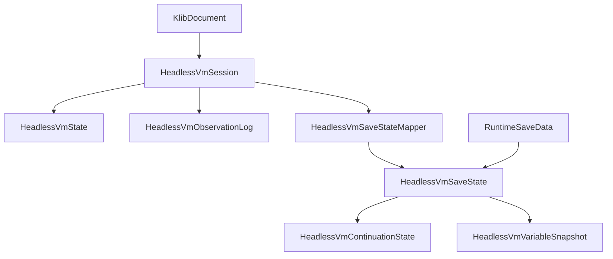
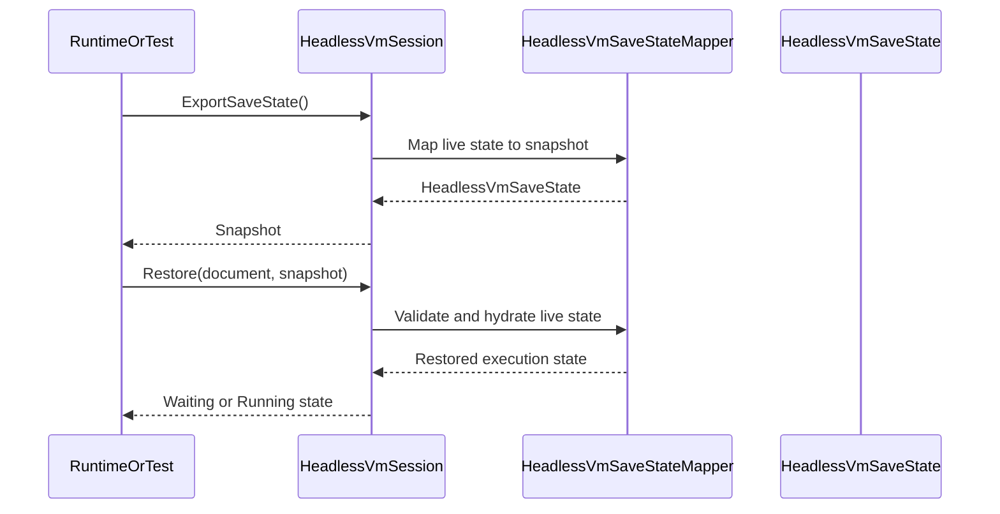

# Design Document

## Overview

`kes-vm-save-state` は、KoromoEventScript の headless VM が save/load で参照する「保存可能な VM snapshot 契約」を定義する設計である。対象利用者はコンパイラ開発者、VM 実装者、将来の runtime 実装者であり、実行位置、変数、継続状態、待機状態を runtime 固有の画面・音声状態から分離して扱えることを目的とする。

本設計は serializer、保存先、Windows runtime の完全セーブデータを定義しない。既存 `HeadlessVmSession` と `KlibDocument` を前提に、保存専用 aggregate を `Execution` 名前空間へ追加し、session の live state と persistence state の責務境界を固定する。

### Goals

- save/load が参照する VM snapshot の最小契約を定義する。
- `scriptId`、再開位置、変数状態、call/continuation state、待機状態の保存責務を明確化する。
- runtime 固有状態と独立にテスト可能な export/import 契約を `Execution` 層へ追加できる状態にする。

### Non-Goals

- JSON、XML、binary など具体的な serializer 実装。
- Windows / Unity / Unreal runtime の画面状態、音声状態、既読情報、サムネイル、セーブ UI。
- セーブスロット管理、保存先、暗号化、署名、クラウド同期。

## Boundary Commitments

### This Spec Owns

- VM save state の authoritative な aggregate とその子データ契約。
- live session state から save snapshot を export/import する API 契約。
- `.klib` の安定識別子を参照した復元可能性の前提。
- save snapshot の妥当性検証と fault 境界。

### Out of Boundary

- runtime 完全セーブデータの構造。
- 画面描画、音声、既読情報、メタ情報の保存。
- 永続化フォーマット、保存先、serializer、schema registry。
- `.klib` 命令仕様や manifest 契約の再定義。

### Allowed Dependencies

- `source/cli/KoromoEventScript.Cli/Execution/` の既存 `HeadlessVmSession`、`HeadlessVmState`、`HeadlessVmExecutor`。
- `source/cli/KoromoEventScript.Cli/Compilation/KlibModels.cs` の `KlibDocument`、`KlibVariable`、`KlibOpCode`。
- `docs/spec/k-intermediate-representation-spec.md` の save/load 境界。
- `docs/spec/windows-runtime-spec.md` の VM 状態と runtime 状態の分離前提。
- 既存 NUnit test project と `HeadlessVmTestHelper`。

### Revalidation Triggers

- `.klib` の実行位置参照が `scriptId` / `bytecodeOffset` 以外へ変わるとき。
- `HeadlessVmSession` が call stack、変数、wait payload の所有方法を変更するとき。
- runtime save/load が VM snapshot に画面状態や音声状態の内包を要求し始めるとき。
- serializer 仕様や save file 互換性ポリシーを同じ spec で固定しようとするとき。

## Architecture

### Existing Architecture Analysis

現行 `Execution` 層は headless VM の実行境界として `HeadlessVmSession`、`HeadlessVmState`、`HeadlessVmObservationLog`、`HeadlessVmExecutor` を持つが、待機境界を越えて復元可能な保存モデルはまだ存在しない。`HeadlessVmExecutor` の評価スタックはローカル変数で保持され、`HeadlessVmState` は pending choices と fault を保持する一方で、変数状態や call/continuation state を持たない。このため、save/load 対応は live execution model と persistence model の責務分離から始める必要がある。

### Architecture Pattern & Boundary Map

**Architecture Integration**:

- Selected pattern: Session + Snapshot aggregate。live 実行は `HeadlessVmSession` が所有し、保存可能な表現は `HeadlessVmSaveState` aggregate に正規化する。
- Domain/feature boundaries: `Compilation` は `.klib` 契約、`Execution` は live state と save snapshot、runtime は完全セーブデータ構成を担当する。
- Existing patterns preserved: CLI 内の責務別ディレクトリ分割、`record` 中心の値契約、NUnit による状態検証。
- New components rationale: 保存 aggregate、continuation snapshot、variable snapshot、export/import API が必要である。
- Steering compliance: `.kiro/steering/` は未配置のため、`AGENTS.md`、既存 `.kiro/specs`、公開仕様文書の境界に従う。



### Technology Stack

| Layer | Choice / Version | Role in Feature | Notes |
|-------|------------------|-----------------|-------|
| Frontend / CLI | .NET CLI 既存構成 | save state 契約を利用する host | 新規 CLI コマンドは対象外 |
| Backend / Services | C# / .NET 既存 runtime | session、save snapshot、妥当性検証 | `Execution` 名前空間を継続利用 |
| Data / Storage | In-memory record model | save snapshot の論理契約 | 永続化実装は対象外 |
| Infrastructure / Runtime | NUnit / `dotnet test` | export/import と復元境界の検証 | UI 起動なし |

## File Structure Plan

### Directory Structure

```text
source/cli/KoromoEventScript.Cli/
└── Execution/
    ├── HeadlessVmSession.cs                 # live session と export/import API
    ├── HeadlessVmState.cs                   # live 実行状態、停止理由、fault
    ├── HeadlessVmSaveState.cs               # save snapshot aggregate、execution position、variable/call frame snapshot
    ├── HeadlessVmContinuationState.cs       # wait/call/continuation の保存契約
    ├── HeadlessVmValueSnapshot.cs           # serializable value 表現
    └── HeadlessVmSaveStateMapper.cs         # session/state と save snapshot の相互変換
tests/KoromoEventScript.Cli.Tests/
└── Execution/
    ├── HeadlessVmExecutionTests.cs          # 既存 live 実行テスト
    ├── HeadlessVmSaveStateTests.cs          # export/import と妥当性の検証
    └── HeadlessVmTestHelper.cs              # save state 用 fixture 共有
```

### Modified Files

- `source/cli/KoromoEventScript.Cli/Execution/HeadlessVmSession.cs` — save snapshot の export/import 入口を追加する。
- `source/cli/KoromoEventScript.Cli/Execution/HeadlessVmState.cs` — live state から save snapshot へ必要な continuation 参照を露出できるように調整する。
- `source/cli/KoromoEventScript.Cli/Execution/HeadlessVmExecutor.cs` — 復元に必要な continuation payload を session へ返せるようにする。
- `source/cli/KoromoEventScript.Cli/Compilation/KlibModels.cs` — 既存型を再利用するため、保存契約に必要な stable identifier 参照だけを読む。
- `tests/KoromoEventScript.Cli.Tests/Execution/HeadlessVmTestHelper.cs` — save/import シナリオ用 helper を追加する。

## System Flows



重要な判断は 2 つある。1 つ目は save snapshot が observation や UI payload を authoritative data にしないこと、2 つ目は load が debug source map ではなく `.klib` の安定識別子と snapshot 自身の continuation から復元することである。

## Requirements Traceability

| Requirement | Summary | Components | Interfaces | Flows |
|-------------|---------|------------|------------|-------|
| 1.1 | script と再開位置を保存対象に含める | HeadlessVmSaveState, HeadlessVmSaveStateMapper | Save state contract | Export/Restore flow |
| 1.2 | 保存対象スコープの変数状態を含める | HeadlessVmVariableSnapshot, HeadlessVmValueSnapshot | State contract | Export/Restore flow |
| 1.3 | call/継続スタックを保存対象に含める | HeadlessVmContinuationState, HeadlessVmSaveStateMapper | State contract | Export/Restore flow |
| 1.4 | 入力待ち・選択待ち pending 状態を含める | HeadlessVmContinuationState, HeadlessVmSession | Service, State | Export/Restore flow |
| 2.1 | 画面・音声・既読などを VM 保存対象にしない | HeadlessVmSaveState | State contract | N/A |
| 2.2 | runtime 側責務と区別できるようにする | HeadlessVmSaveState | State contract | Export/Restore flow |
| 2.3 | runtime 表示復元専用状態を必須にしない | HeadlessVmSaveStateMapper | Validation contract | Export flow |
| 2.4 | 完全セーブデータの一部でも VM 部分を識別できる | HeadlessVmSaveState | State contract | Export/Restore flow |
| 3.1 | 値として表現できる情報だけを保存対象にする | HeadlessVmValueSnapshot | State contract | Export flow |
| 3.2 | 実行位置を安定識別子で参照する | HeadlessVmSaveState | State contract | Restore flow |
| 3.3 | シリアライズ不能値を除外または識別する | HeadlessVmValueSnapshot, HeadlessVmSaveStateMapper | Validation contract | Export flow |
| 3.4 | 特定 serializer に依存しない | HeadlessVmSaveState | State contract | N/A |
| 4.1 | 同じ script と再開位置を特定できる | HeadlessVmSaveStateMapper, HeadlessVmSession | Service, State | Restore flow |
| 4.2 | 復元後の待機理由と再開条件を判定できる | HeadlessVmContinuationState, HeadlessVmState | State contract | Restore flow |
| 4.3 | 無効 script / offset を検出できる | HeadlessVmSaveStateMapper, HeadlessVmFault | Service, State | Restore flow |
| 4.4 | debug source map に依存しない | HeadlessVmSaveState, HeadlessVmSaveStateMapper | State contract | Restore flow |

## Components and Interfaces

| Component | Domain/Layer | Intent | Req Coverage | Key Dependencies | Contracts |
|-----------|--------------|--------|--------------|------------------|-----------|
| HeadlessVmSaveState | Execution | 保存可能な VM snapshot aggregate | 1.1, 1.2, 2.1, 2.4, 3.2, 3.4, 4.4 | HeadlessVmValueSnapshot (P0), HeadlessVmContinuationState (P0) | State |
| HeadlessVmContinuationState | Execution | wait/call/continuation の保存契約 | 1.3, 1.4, 4.2 | KlibDocument (P1), HeadlessVmState (P0) | State |
| HeadlessVmValueSnapshot | Execution | serializable な VM 値表現 | 1.2, 3.1, 3.3 | KlibVariableType (P1) | State |
| HeadlessVmSaveStateMapper | Execution | live state と save snapshot の相互変換と妥当性検証 | 1.1, 1.3, 2.3, 3.3, 4.1, 4.3, 4.4 | HeadlessVmSession (P0), KlibDocument (P0) | Service, State |
| HeadlessVmSession | Execution | export/import API の公開窓口 | 1.4, 4.1, 4.2 | HeadlessVmExecutor (P0), HeadlessVmSaveStateMapper (P0) | Service, State |
| HeadlessVmSaveStateTests | Tests | save snapshot の受け入れ条件固定 | 1.1, 1.4, 2.1, 3.3, 4.1, 4.3 | HeadlessVmSession (P0), HeadlessVmTestHelper (P1) | Service |

### Execution

#### HeadlessVmSaveState

| Field | Detail |
|-------|--------|
| Intent | VM save/load が参照する persistence 向け aggregate |
| Requirements | 1.1, 1.2, 2.1, 2.4, 3.2, 3.4, 4.4 |

**Responsibilities & Constraints**

- `scriptId`、`instructionOffset`、保存対象変数、call/continuation snapshot、schema version を authoritative に保持する。
- observation transcript、画面表示状態、音声状態、既読情報は保持しない。
- serializer 実装に依存しない value-object 群として定義する。

**Dependencies**

- Inbound: `HeadlessVmSession` — export/import の入出力（P0）
- Inbound: runtime save data — 完全セーブデータへ合成される VM 部分（P1）
- Outbound: `HeadlessVmContinuationState` — 待機・継続情報（P0）
- Outbound: `HeadlessVmVariableSnapshot` — 変数状態（P0）

**Contracts**: Service [ ] / API [ ] / Event [ ] / Batch [ ] / State [x]

##### State Management

- State model: 単一 snapshot aggregate
- Persistence & consistency: in-memory / serializer-neutral
- Concurrency strategy: immutable record として扱う

**Implementation Notes**

- Integration: runtime はこの aggregate を自身の完全セーブデータへ埋め込む。
- Validation: schema version と必須項目の欠落を constructor または factory レベルで拒否する。
- Risks: 将来 serializer 固定を同時に入れると責務過多になるため、この spec では行わない。

#### HeadlessVmContinuationState

| Field | Detail |
|-------|--------|
| Intent | call/branch/wait の復元に必要な最小 continuation を保持 |
| Requirements | 1.3, 1.4, 4.2 |

**Responsibilities & Constraints**

- `Running`、`WaitingForAdvance`、`WaitingForSelection`、将来の call/return 継続を区別できる discriminated state とする。
- `WaitingForSelection` では再開位置、選択待ち理由、必要なら serializable pending payload を保持する。
- raw operand stack の全面保存を前提にせず、復元不能な wait kind の場合だけ最小の operand snapshot を保持する。

**Dependencies**

- Inbound: `HeadlessVmSaveState` — aggregate 配下（P0）
- Outbound: `HeadlessVmValueSnapshot` — pending value の補助保存（P1）
- External: `KlibOpCode` — wait kind と offset の整合確認（P1）

**Contracts**: Service [ ] / API [ ] / Event [ ] / Batch [ ] / State [x]

##### State Management

- State model: continuation kind + resume metadata
- Persistence & consistency: immutable; kind と payload の不一致を禁止
- Concurrency strategy: session 単位で単独利用

**Implementation Notes**

- Integration: `SELECT`、text advance、将来の call/return を同一契約で表せるようにする。
- Validation: `WaitingForSelection` で必要な payload が欠落している snapshot は invalid save state として扱う。
- Risks: continuation kind を増やす際は restore validation と tests の再検証が必要。

#### HeadlessVmValueSnapshot

| Field | Detail |
|-------|--------|
| Intent | serializable な VM 値の共通表現 |
| Requirements | 1.2, 3.1, 3.3 |

**Responsibilities & Constraints**

- `number`、`bool`、`string`、`null`、配列、安定参照 ID を持つ reference 値を保持できる。
- live object instance や process-local handle を必須保存対象にしない。
- シリアライズ不能値を `Unsupported` として識別可能にするか、export 時に fault として拒否できるようにする。

**Dependencies**

- Inbound: `HeadlessVmSaveStateMapper` — live 値の正規化（P0）
- External: `KlibVariableType` — 型整合の参照（P1）

**Contracts**: Service [ ] / API [ ] / Event [ ] / Batch [ ] / State [x]

##### State Management

- State model: kind + typed payload
- Persistence & consistency: serializer-neutral primitive/value graph
- Concurrency strategy: immutable

**Implementation Notes**

- Integration: 将来 serializer が JSON / binary のどちらでも map できる単純な木構造に保つ。
- Validation: unsupported value は silent drop せず、除外規則または fault に正規化する。
- Risks: reference 型の表現は `.klib` の stable identifier と整合させる必要がある。

#### HeadlessVmSaveStateMapper

| Field | Detail |
|-------|--------|
| Intent | live session state と persistence snapshot の相互変換 |
| Requirements | 1.1, 1.3, 2.3, 3.3, 4.1, 4.3, 4.4 |

**Responsibilities & Constraints**

- session から save snapshot を export し、`KlibDocument` と snapshot から live state を restore する。
- invalid script id、無効 offset、payload 不整合、unsupported value を識別可能な failure へ正規化する。
- restore は debug source map を使わず、`scriptId`、`instructionOffset`、continuation payload だけで成立させる。

**Dependencies**

- Inbound: `HeadlessVmSession` — 公開 API の内部委譲先（P0）
- Outbound: `HeadlessVmSaveState` — export 結果（P0）
- Outbound: `HeadlessVmState` — restore 後の live state（P0）
- External: `KlibDocument` — 復元対象命令列の検証（P0）

**Contracts**: Service [x] / API [ ] / Event [ ] / Batch [ ] / State [x]

##### Service Interface

```csharp
public interface IHeadlessVmSaveStateMapper
{
    HeadlessVmSaveState Export(HeadlessVmSession session);
    void Restore(HeadlessVmSession session, KlibDocument document, HeadlessVmSaveState snapshot);
}
```

- Preconditions:
  - `Export` は started session に対してのみ呼び出す。
  - `Restore` は `snapshot.ScriptId` が `document.Module.ScriptId` と一致する前提で検証を始める。
- Postconditions:
  - `Export` は serializer-neutral な aggregate を返す。
  - `Restore` は `Running`、待機、完了、fault のいずれかの live state を返す。
- Invariants:
  - debug metadata の有無で restore 可否が変わらない。

##### State Management

- State model: mapping service。永続状態は持たない
- Persistence & consistency: export/import ごとに純粋変換
- Concurrency strategy: stateless service

**Implementation Notes**

- Integration: mapper は `HeadlessVmSession` が保持する live VM 内部状態を読み書きし、公開 `Observation` を authoritative source にしない。
- Validation: offset 存在確認、required payload 検証、unsupported value handling を一か所へ集約する。
- Risks: current executor が変数や stack を surface していないため、実装時に session 内部 state の拡張が必要。

#### HeadlessVmSession

| Field | Detail |
|-------|--------|
| Intent | save snapshot export/import の公開窓口 |
| Requirements | 1.4, 4.1, 4.2 |

**Responsibilities & Constraints**

- `ExportSaveState()` と `Restore(...)` を通して mapper を利用する。
- live 実行 API と save API のライフサイクル整合を守る。
- restore 後に `ResumeAdvance` / `ResumeSelection` が従来どおり機能する状態を提供する。

**Dependencies**

- Inbound: tests / 将来 runtime adapter — 公開利用口（P0）
- Outbound: `HeadlessVmExecutor` — live 実行継続（P0）
- Outbound: `HeadlessVmSaveStateMapper` — save/export 変換（P0）

**Contracts**: Service [x] / API [ ] / Event [ ] / Batch [ ] / State [x]

##### Service Interface

```csharp
public interface IHeadlessVmSaveSession
{
    HeadlessVmState State { get; }
    HeadlessVmSaveState ExportSaveState();
    void Restore(KlibDocument document, HeadlessVmSaveState snapshot);
}
```

- Preconditions:
  - `ExportSaveState` は started かつ fault でない session に対して定義する。
  - `Restore` は対象 `KlibDocument` を受け取る。
- Postconditions:
  - `Restore` 後の session は開始済みとして扱える。
- Invariants:
  - save/export は observation を authoritative source にしない。

**Implementation Notes**

- Integration: 既存 `Start` / `Resume*` API と対称な lifecycle を保つ。
- Validation: restore 失敗は invalid save state fault と API misuse を区別する。
- Risks: static factory に寄せるか instance restore にするかは実装時に最終調整可能だが、公開契約は 1 session = 1 current state を維持する。

### Tests

#### HeadlessVmSaveStateTests

| Field | Detail |
|-------|--------|
| Intent | save snapshot の要求と境界を自動テストで固定する |
| Requirements | 1.1, 1.4, 2.1, 3.3, 4.1, 4.3 |

**Responsibilities & Constraints**

- save snapshot が script / offset / wait kind / variable state を保持できることを検証する。
- runtime 観測状態や画面専用状態が snapshot の必須項目でないことを検証する。
- invalid snapshot が restore fault になることを検証する。

**Dependencies**

- Outbound: `HeadlessVmSession` — export/import 対象（P0）
- Outbound: `HeadlessVmTestHelper` — fixture 生成（P1）

**Contracts**: Service [x] / API [ ] / Event [ ] / Batch [ ] / State [ ]

**Implementation Notes**

- Integration: 既存 `HeadlessVmExecutionTests` と同じ project / fixture を使う。
- Validation: waiting-for-advance、waiting-for-selection、completed 近傍、invalid script/offset、unsupported value handling を固定する。
- Risks: 変数・call frame 実装が未完了なら document-level テストと minimal fake snapshot テストを併用する。

## Data Models

### Domain Model

- `HeadlessVmSaveState`: VM save/load が参照する aggregate。
- `HeadlessVmExecutionPosition`: `scriptId` と `instructionOffset` の value object。
- `HeadlessVmVariableSnapshot`: 保存対象スコープの変数値。
- `HeadlessVmCallFrameSnapshot`: call/return 継続の最小 frame。
- `HeadlessVmContinuationState`: wait kind と pending payload。
- `HeadlessVmValueSnapshot`: serializable な VM 値。

### Logical Data Model

- `HeadlessVmSaveState` は 1 つの execution position、0..n 件の variable snapshots、0..n 件の call frames、0..1 件の continuation を持つ。
- `HeadlessVmVariableSnapshot` は variable stable id、scope kind、scope id、value を持つ。
- `HeadlessVmContinuationState` は state kind に応じた payload を持ち、kind と payload の不一致を許さない。
- `HeadlessVmValueSnapshot` は primitive、array、stable reference id のみを保持し、process-local object 参照を持たない。

### Data Contracts & Integration

- Session export output: `HeadlessVmSaveState`
- Session restore input: `KlibDocument` + `HeadlessVmSaveState`
- Runtime integration: complete save data のうち VM 部分として埋め込まれる

## Error Handling

### Error Strategy

save snapshot は「保存できないものを黙って失う」ことを許さない。unsupported value、無効 offset、不整合な continuation payload、document と一致しない `scriptId` は、restore/export の fault または明示的拒否として扱う。一方、serializer 不在や保存先不在はこの spec の責務外であり、ここではエラー契約を定義しない。

### Error Categories and Responses

- User Errors: 対象外。end-user 操作ではなく内部契約である。
- System Errors: 無効 `scriptId`、無効 `instructionOffset`、不整合 payload は invalid save state fault とする。
- Business Logic Errors: save/export 不可状態での API 呼び出しは session misuse として拒否する。

### Monitoring

- NUnit failure で `scriptId`、offset、continuation kind、欠落 payload を表示できる構造にする。
- restore failure は debug source map がなくても識別可能な fault message を持つ。

## Testing Strategy

### Unit Tests

- `HeadlessVmValueSnapshot` が primitive / array / stable reference を区別して表現できる。
- `HeadlessVmContinuationState` が wait kind ごとの必須 payload を検証する。
- `HeadlessVmSaveStateMapper` が invalid `scriptId` / offset を fault に正規化する。
- unsupported value が silent drop されず、除外規則または fault として扱われる。

### Integration Tests

- `HeadlessVmSession` が waiting-for-advance 中の state を export し、restore 後も同じ wait kind を維持できる。
- `HeadlessVmSession` が waiting-for-selection 中の state を export し、restore 後に `ResumeSelection` できる。
- build fixture から得た `KlibDocument` に対し、save snapshot の export/import が `.klib` 安定識別子だけで成立する。
- invalid snapshot を restore すると fault になり、観測状態依存では復元されない。

## Supporting References

- `research.md` に live state と save snapshot の分離根拠、`.klib` save/load 境界との整合、serializer 非依存判断を記録する。
