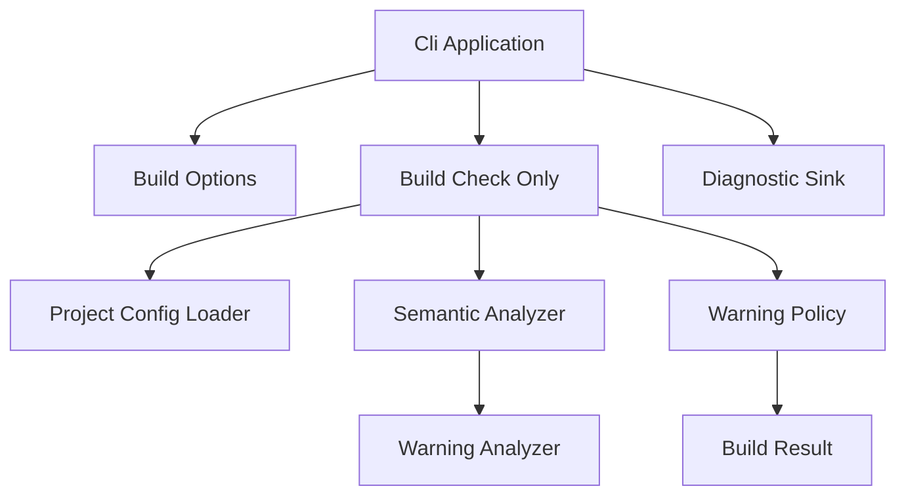
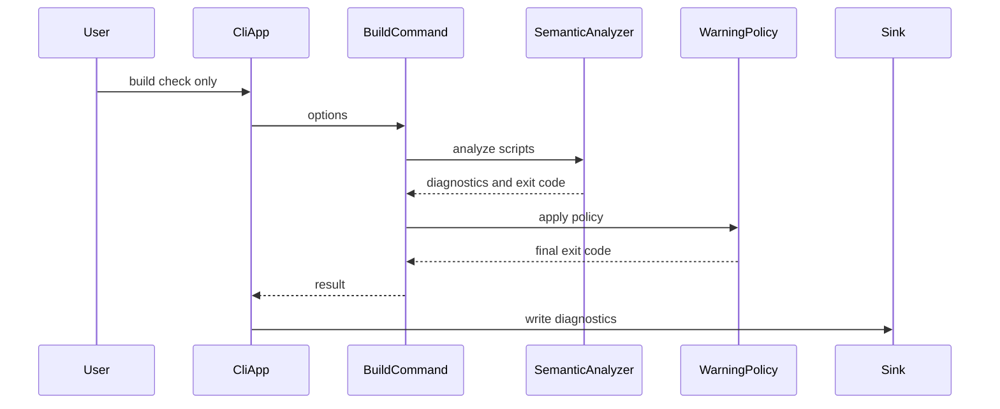

# Design Document

## Overview

この機能は、`kes build --check-only` の診断 pipeline に warning level 診断と warnings-as-errors の終了コード規則を接続する。CLI 利用者と CI は、警告を `warning` として確認しながら、設定に応じて警告だけの検証結果を失敗として扱える。

既存の `DiagnosticLevel.Warning`、`DiagnosticFormatter`、`DiagnosticSink` は維持する。新規設計は、`--warnings-as-errors` / `Build.WarningsAsErrors` の設定伝搬、warning-only 結果の exit code 昇格、最小の warning producer を追加する。

### Goals

- `kes build --check-only` が warning level 診断を text / JSON Lines で出力できる。
- warnings-as-errors が有効な場合、warning-only の結果を終了コード `9` に昇格する。
- syntax / compile / file I/O error の既存終了コード優先順位を維持する。

### Non-Goals

- runtime / publish / run / clean / init の警告ポリシー変更。
- 素材 manifest、未使用変数、到達不能コードなどの完全な lint 実装。
- warning diagnostic を error 表記へ変換すること。
- 既存 compile error 診断コードや stage ordering の変更。

## Boundary Commitments

### This Spec Owns

- `kes build --check-only` の warning diagnostics 出力 contract。
- CLI option `--warnings-as-errors` と `kes.xml` の `Build.WarningsAsErrors` を検証設定へ反映する contract。
- warning-only 結果を `CliExitCode.WarningsAsErrors` へ昇格する policy。
- 最小 warning producer として、空の `.ke` ドキュメントを `KES4001` warning として報告する semantic warning stage。

### Out of Boundary

- warning rule 全体の体系化や lint framework。
- runtime 実行中の warning handling。
- publish / run / clean / init の exit code mapping。
- `DiagnosticLevel.Warning` の表示形式変更。
- error level diagnostic が存在する場合の warning-as-error 優先化。

### Allowed Dependencies

- `Diagnostic`, `DiagnosticLevel`, `DiagnosticFormatter`, `DiagnosticSink`
- `CliApplication`, `BuildCommandOptions`, `BuildCheckOnlyCommand`, `BuildCheckOnlyResult`
- `ProjectConfigLoader`, `ProjectConfig`
- `SemanticAnalyzer`, `ScriptDocument`, `ImportGraph`, `SemanticAnalysisResult`
- `docs/spec/cli-tool-spec.md` と `docs/spec/kes-config.xsd` の既存公開仕様

### Revalidation Triggers

- `DiagnosticLevel` または text / JSON Lines diagnostic schema が変更される場合。
- `CliExitCode` の数値、意味、優先順位が変更される場合。
- `BuildCommandOptions` または `ProjectConfig` の設定伝搬 contract が変更される場合。
- semantic analysis stage ordering が変更される場合。
- `Build.WarningsAsErrors` の config schema が変更される場合。

## Architecture

### Existing Architecture Analysis

`CliApplication` は build 引数を parse し、`BuildCheckOnlyCommand.Execute` の結果 diagnostics を `DiagnosticSink` で標準エラーへ出力する。`BuildCheckOnlyCommand` は project root、`kes.xml`、`.kel` / `.ke` parse、semantic analysis の順に検証し、最初に失敗した stage の exit code を返す。

warning 表示自体は formatter / sink に存在するが、build flow に warning-only を成功または warning-as-error として集約する policy がない。また、`CliExitCode` は公開仕様上の `9` をまだ持たない。

### Architecture Pattern & Boundary Map



**Architecture Integration**:

- Selected pattern: 既存 build validation pipeline への policy service 追加。
- Domain/feature boundaries: warning diagnostic の生成は semantic warning stage、warnings-as-errors の終了コード判断は build result policy に分離する。
- Existing patterns preserved: `Diagnostic` list と `CliExitCode` を result object で返し、`CliApplication` が出力する流れを維持する。
- New components rationale: `WarningPolicy` は exit code 昇格規則を集約し、`WarningAnalyzer` は build 統合で観測可能な最小 warning source を提供する。
- Steering compliance: `.kiro/steering/` は未作成。既存 docs と code pattern を優先する。

### Technology Stack

| Layer | Choice / Version | Role in Feature | Notes |
|-------|------------------|-----------------|-------|
| CLI | .NET / C# | build option parsing、exit code、diagnostic output | 既存 `KoromoEventScript.Cli` を拡張 |
| Tests | NUnit | warning policy、config、CLI 統合検証 | 既存 `KoromoEventScript.Cli.Tests` に追加 |
| Data / Storage | なし | 永続化なし | `kes.xml` 読み取りのみ |

## File Structure Plan

### Directory Structure

```text
source/cli/KoromoEventScript.Cli/
├── Commands/
│   ├── CliApplication.cs
│   ├── CliExitCode.cs
│   └── Build/
│       ├── BuildCommandOptions.cs
│       ├── BuildCheckOnlyCommand.cs
│       ├── BuildCheckOnlyResult.cs
│       └── WarningPolicy.cs
├── ProjectSystem/
│   ├── ProjectConfig.cs
│   └── ProjectConfigLoader.cs
└── Semantics/
    ├── SemanticAnalyzer.cs
    ├── SemanticModels.cs
    └── WarningAnalyzer.cs

tests/KoromoEventScript.Cli.Tests/
├── Commands/
│   ├── BuildCheckOnlyCommandTests.cs
│   └── WarningPolicyTests.cs
├── ProjectSystem/
│   └── ProjectConfigLoaderTests.cs
└── Semantics/
    ├── SemanticAnalyzerTests.cs
    └── WarningAnalyzerTests.cs
```

### Modified Files

- `source/cli/KoromoEventScript.Cli/Commands/CliExitCode.cs` — `WarningsAsErrors = 9` を追加する。
- `source/cli/KoromoEventScript.Cli/Commands/CliApplication.cs` — `--warnings-as-errors` を parse し、`BuildCommandOptions` へ渡す。
- `source/cli/KoromoEventScript.Cli/Commands/Build/BuildCommandOptions.cs` — CLI option 由来の `WarningsAsErrors` を保持する。
- `source/cli/KoromoEventScript.Cli/Commands/Build/BuildCheckOnlyCommand.cs` — config と option を合成し、semantic result に `WarningPolicy` を適用する。
- `source/cli/KoromoEventScript.Cli/Commands/Build/BuildCheckOnlyResult.cs` — 必要に応じて warning policy の結果を保持できる既存形を維持する。
- `source/cli/KoromoEventScript.Cli/ProjectSystem/ProjectConfig.cs` — `WarningsAsErrors` を保持する。
- `source/cli/KoromoEventScript.Cli/ProjectSystem/ProjectConfigLoader.cs` — `Build.WarningsAsErrors` を読み取り、未指定を `false` とする。
- `source/cli/KoromoEventScript.Cli/Semantics/SemanticAnalyzer.cs` — warning analyzer を semantic success path に接続する。
- `source/cli/KoromoEventScript.Cli/Semantics/SemanticModels.cs` — warning diagnostics を success result に含めるための result 合成を拡張する。
- `source/cli/KoromoEventScript.Cli/Diagnostics/DiagnosticFormatter.cs` — warning 表示 contract の既存実装として維持し、必要な場合のみ回帰テストを追加する。
- `source/cli/KoromoEventScript.Cli/Diagnostics/DiagnosticSink.cs` — warning diagnostics の標準エラー出力 contract の既存実装として維持する。

### Created Files

- `source/cli/KoromoEventScript.Cli/Commands/Build/WarningPolicy.cs` — diagnostics、現在の exit code、warnings-as-errors flag から最終 exit code を決める。
- `source/cli/KoromoEventScript.Cli/Semantics/WarningAnalyzer.cs` — 空 `.ke` ドキュメントに `KES4001` warning を生成する。
- `tests/KoromoEventScript.Cli.Tests/Commands/WarningPolicyTests.cs` — warning-only 昇格と既存 error 優先を検証する。
- `tests/KoromoEventScript.Cli.Tests/Semantics/WarningAnalyzerTests.cs` — `KES4001` warning の生成条件を検証する。

## System Flows



Key decisions:

- `WarningPolicy` は diagnostics を変更しない。
- `WarningPolicy` は existing exit code が `Success` の場合だけ `WarningsAsErrors` へ昇格する。
- `DiagnosticSink` の出力先と形式は変更しない。

## Requirements Traceability

| Requirement | Summary | Components | Interfaces | Flows |
|-------------|---------|------------|------------|-------|
| 1.1 | warning diagnostic を check-only 出力に含める | WarningAnalyzer, SemanticAnalyzer, BuildCheckOnlyCommand | `Diagnostic` | CLI build flow |
| 1.2 | text level を `warning` にする | DiagnosticFormatter, DiagnosticSink | `DiagnosticLevel.Warning` | CLI build flow |
| 1.3 | JSON Lines level を `warning` にする | DiagnosticFormatter, DiagnosticSink | `DiagnosticLevel.Warning` | CLI build flow |
| 1.4 | diagnostic fields を維持する | WarningAnalyzer, Diagnostic | `Diagnostic` | CLI build flow |
| 1.5 | 標準エラーへ出力する | CliApplication, DiagnosticSink | `TextWriter error` | CLI build flow |
| 2.1 | CLI option で warnings-as-errors を有効化 | CliApplication, BuildCommandOptions | `--warnings-as-errors` | CLI build flow |
| 2.2 | config で warnings-as-errors を有効化 | ProjectConfigLoader, ProjectConfig | `Build.WarningsAsErrors` | CLI build flow |
| 2.3 | CLI option が false config を上書きする | BuildCheckOnlyCommand, WarningPolicy | `BuildCommandOptions` | CLI build flow |
| 2.4 | 未指定または false は warning-only を失敗にしない | WarningPolicy | `Apply` | CLI build flow |
| 3.1 | warning-only 無効時は `0` | WarningPolicy | `CliExitCode.Success` | CLI build flow |
| 3.2 | warning-only 有効時は `9` | WarningPolicy, CliExitCode | `CliExitCode.WarningsAsErrors` | CLI build flow |
| 3.3 | 複数 warning でも `9` | WarningPolicy | `Apply` | CLI build flow |
| 3.4 | 診断 level を warning のまま維持 | WarningPolicy, DiagnosticSink | `Diagnostic` | CLI build flow |
| 4.1 | syntax error を優先する | BuildCheckOnlyCommand, WarningPolicy | `CliExitCode.SyntaxError` | CLI build flow |
| 4.2 | compile error を優先する | SemanticAnalyzer, WarningPolicy | `CliExitCode.CompileError` | CLI build flow |
| 4.3 | file I/O error を優先する | BuildCheckOnlyCommand, WarningPolicy | `CliExitCode.FileOrDirectoryError` | CLI build flow |
| 4.4 | warnings-as-errors 有効でも error を優先する | WarningPolicy | `Apply` | CLI build flow |
| 5.1 | `KES4xxx` warning を扱う | WarningAnalyzer, DiagnosticFormatter | `KES4001` | CLI build flow |
| 5.2 | warning を error 表記にしない | WarningPolicy, DiagnosticFormatter | `DiagnosticLevel.Warning` | CLI build flow |
| 5.3 | runtime warning は対象外 | Boundary commitments | なし | なし |
| 5.4 | publish/run/clean/init は対象外 | Boundary commitments | なし | なし |
| 5.5 | compile error 分類を変更しない | WarningPolicy, CliExitCode | existing error codes | CLI build flow |

## Components and Interfaces

| Component | Domain/Layer | Intent | Req Coverage | Key Dependencies | Contracts |
|-----------|--------------|--------|--------------|------------------|-----------|
| WarningPolicy | Commands/Build | warning-only result の exit code を決める | 2.3, 2.4, 3.1-3.4, 4.1-4.4, 5.2, 5.5 | `Diagnostic` P0, `CliExitCode` P0 | Service |
| WarningAnalyzer | Semantics | 最小 warning diagnostic を生成する | 1.1, 1.4, 5.1 | `ImportGraph` P0, `ScriptDocument` P0 | Service |
| Build option/config integration | CLI/ProjectSystem | warnings-as-errors 設定を build flow へ渡す | 2.1-2.4 | `CliApplication` P0, `ProjectConfigLoader` P0 | State |
| Diagnostic output | Diagnostics | warning diagnostic を既存形式で出力する | 1.2, 1.3, 1.5, 3.4, 5.2 | `DiagnosticFormatter` P0, `DiagnosticSink` P0 | Service |

### Commands / Build

#### WarningPolicy

| Field | Detail |
|-------|--------|
| Intent | diagnostics と warnings-as-errors flag から最終 exit code を決める |
| Requirements | 2.3, 2.4, 3.1, 3.2, 3.3, 3.4, 4.1, 4.2, 4.3, 4.4, 5.2, 5.5 |

**Responsibilities & Constraints**

- `DiagnosticLevel.Warning` を含む diagnostics を検出する。
- `currentExitCode == CliExitCode.Success` かつ warnings-as-errors が有効で、warning がある場合だけ `CliExitCode.WarningsAsErrors` を返す。
- diagnostics の level、code、location、message を変更しない。
- 既存 error exit code を上書きしない。

**Dependencies**

- Inbound: `BuildCheckOnlyCommand` — final result 作成前に policy を適用する (P0)
- Outbound: `Diagnostic` — warning level の有無を判定する (P0)
- Outbound: `CliExitCode` — final exit code を返す (P0)

**Contracts**: Service [x] / API [ ] / Event [ ] / Batch [ ] / State [ ]

##### Service Interface

```csharp
public sealed class WarningPolicy
{
    public CliExitCode Apply(
        CliExitCode currentExitCode,
        IReadOnlyList<Diagnostic> diagnostics,
        bool warningsAsErrors);
}
```

- Preconditions: `diagnostics` は null でない。
- Postconditions: `currentExitCode != Success` の場合、戻り値は `currentExitCode`。
- Invariants: diagnostics は変更されない。

### Semantics

#### WarningAnalyzer

| Field | Detail |
|-------|--------|
| Intent | semantic success path で warning level diagnostics を生成する |
| Requirements | 1.1, 1.4, 5.1 |

**Responsibilities & Constraints**

- import、definition、name、type checking が成功した後に実行する。
- 空の `.ke` ドキュメントを `KES4001` warning として報告する。
- 警告だけを持つ場合、semantic result の exit code は `Success` のままにする。
- compile error の代替として warning を出さない。

**Dependencies**

- Inbound: `SemanticAnalyzer` — semantic pipeline の最後に呼び出す (P0)
- Outbound: `ImportGraph` — 検査対象 document を取得する (P0)
- Outbound: `Diagnostic` — warning diagnostic を生成する (P0)

**Contracts**: Service [x] / API [ ] / Event [ ] / Batch [ ] / State [ ]

##### Service Interface

```csharp
public sealed class WarningAnalyzer
{
    public WarningAnalysisResult Analyze(ImportGraph graph);
}

public sealed record WarningAnalysisResult(IReadOnlyList<Diagnostic> Diagnostics);
```

- Preconditions: `graph` は null でない。
- Postconditions: 空 `.ke` document には `DiagnosticLevel.Warning`, `KES4001` が返る。
- Invariants: warning diagnostics は `CliExitCode` を直接持たない。

### CLI / ProjectSystem

#### Build option/config integration

| Field | Detail |
|-------|--------|
| Intent | CLI option と project config の warnings-as-errors を build flow へ渡す |
| Requirements | 2.1, 2.2, 2.3, 2.4 |

**Responsibilities & Constraints**

- `CliApplication` は `--warnings-as-errors` を supported build option として受け取る。
- `BuildCommandOptions` は CLI option 由来の boolean を保持する。
- `ProjectConfigLoader` は `Build.WarningsAsErrors` を読み、未指定は `false` とする。
- `BuildCheckOnlyCommand` は CLI option または config のいずれかが true の場合に warnings-as-errors を有効にする。

**Dependencies**

- Inbound: `CliApplication.Run` — command line args を parse する (P0)
- Outbound: `ProjectConfigLoader` — config 由来設定を取得する (P0)
- Outbound: `WarningPolicy` — 合成済み boolean を渡す (P0)

**Contracts**: Service [ ] / API [ ] / Event [ ] / Batch [ ] / State [x]

##### State Management

- State model: `BuildCommandOptions.WarningsAsErrors` と `ProjectConfig.WarningsAsErrors`。
- Persistence & consistency: 永続化は `kes.xml` のみ。CLI option は invocation-local。
- Concurrency strategy: なし。

## Data Models

### Domain Model

- `BuildCommandOptions`: CLI invocation の build option。`ProjectDirectory`, `OutputFormat`, `WarningsAsErrors` を持つ。
- `ProjectConfig`: `kes.xml` 由来の project configuration。`WarningsAsErrors` を追加する。
- `WarningAnalysisResult`: warning diagnostics の集合。exit code を持たず、policy に判断を委譲する。

### Data Contracts & Integration

- Text diagnostic: `file:line:column warning KES4xxx: message`
- JSON Lines diagnostic: `level`, `code`, `file`, `line`, `column`, `message`
- Exit code: `CliExitCode.WarningsAsErrors = 9`

## Error Handling

### Error Strategy

- CLI option parsing error は既存どおり `KES9001` と `CommandLineError` を返す。
- `Build.WarningsAsErrors` が boolean として読めない場合は config load failure とし、既存の file/config error path を使う。
- warning-only は semantic success として扱い、final policy だけが exit code を変える。

### Error Categories and Responses

- Command-line error: unsupported or malformed option は `2`。
- File/config error: `kes.xml` 読み取りまたは boolean parse failure は `6`。
- Syntax error: warning が存在しても `3`。
- Compile error: warning が存在しても `4`。
- Warning-as-error: warning-only かつ warnings-as-errors 有効時は `9`。

## Testing Strategy

### Unit Tests

- `WarningPolicyTests`: warning-only + warnings-as-errors false は `Success` を返す。
- `WarningPolicyTests`: warning-only + warnings-as-errors true は `WarningsAsErrors` を返す。
- `WarningPolicyTests`: `SyntaxError`, `CompileError`, `FileOrDirectoryError` は warning と flag に関係なく維持する。
- `WarningAnalyzerTests`: 空 `.ke` document で `KES4001`, `DiagnosticLevel.Warning`, file/line/column/message を返す。
- `ProjectConfigLoaderTests`: `Build.WarningsAsErrors` true / false / omitted の読み取りを固定する。

### Integration Tests

- `BuildCheckOnlyCommandTests`: 空 script project が warning diagnostic を返し、warnings-as-errors 無効なら exit code `0`。
- `BuildCheckOnlyCommandTests`: 同じ project で config true の場合 exit code `9`。
- `BuildCheckOnlyCommandTests`: CLI `--warnings-as-errors` が config false を上書きして exit code `9`。
- `BuildCheckOnlyCommandTests`: warning と compile error が同居する場合 exit code `4` を維持する。
- `BuildCheckOnlyCommandTests`: JSON Lines 出力で level が `warning` のままになる。

### Process Tests

- `ProcessInvocation`: `build --check-only --warnings-as-errors` が warning-only project で process exit code `9` を返し、標準エラーに warning を出す。

## Supporting References

- `research.md` — 既存実装の調査結果、採用/却下した設計選択、リスク。
