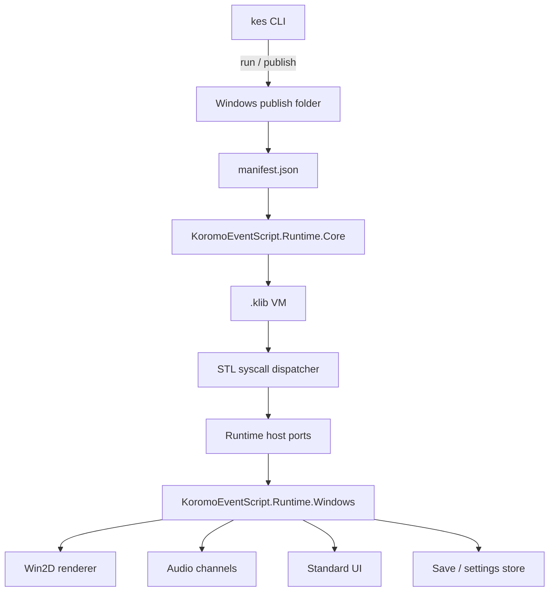
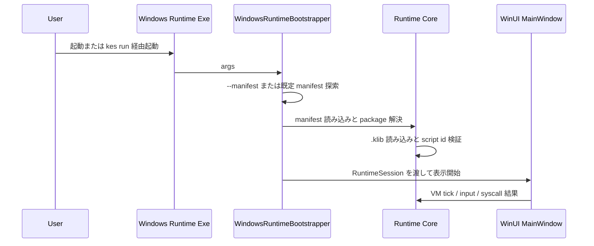
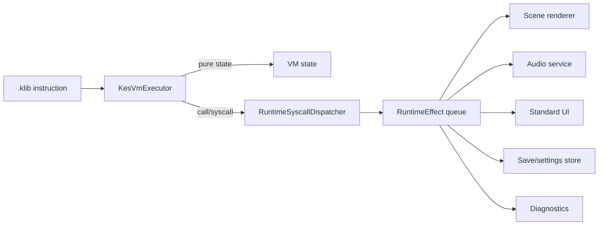

# Design Document

## Overview

Windows runtime は、CLI が生成した Windows 向け成果物を Windows 11 上で実行する配布用プレイヤーである。設計は VM と Windows UI を分離し、`.klib` 全命令と STL / runtime syscall を platform-neutral な core で扱い、描画、音声、入力、保存、診断を Windows host が adapter として実行する。

この分離により、runtime の振る舞いを UI なしで検証できる。Windows app は WinUI 3 / Windows App SDK、Win2D、media API に責務を限定し、CLI は `kes run` と `kes publish --target windows` の接続点だけを持つ。

## Boundary

### In Scope

- Windows 11 向け runtime app の起動、引数解析、manifest 探索、終了コード返却。
- `manifest.json`、`.klib`、素材、ロケール、runtime 設定、build 情報の読み込み。
- `.klib` 命令セット全体の VM 実行。
- STL / runtime syscall の runtime 側効果。
- 1920x1080 制作座標、レターボックス、入力座標変換、レイヤー合成、transition。
- BGM / SE / Voice の channel 管理。
- 標準入力、標準 UI、セーブ、ロード、既読、ユーザー設定。
- 通常モードと debug / profile モードの診断。
- `kes run` と `kes publish --target windows` から見える runtime 接続。

### Out of Scope

- `.kc` / `.kel` の直接実行。
- `.klib` instruction schema と binary format の再設計。
- CLI build / publish 全体の一般再設計。
- Unity / Unreal runtime、VS Code 拡張、macOS、Linux、Windows 10 以前。
- UI skin 差し替え、キーコンフィグ、正式な gamepad 対応。
- MSIX、cloud save、runtime plugin。

### Dependencies

- 既存 CLI の build 成果物、manifest、`.klib`、`.klibtxt` 補助出力。
- `docs/spec/windows-runtime-spec.md`、`docs/spec/k-intermediate-representation-spec.md`、`docs/spec/kes-language-stl-spec.md`、`docs/spec/cli-tool-spec.md`。
- Windows App SDK / WinUI 3。
- Microsoft.Graphics.Win2D。
- Windows media API。
- `System.Text.Json`、NUnit。

### Revalidation Triggers

- `.klib` opcode、operand、source mapping、binary format が変更されたとき。
- STL syscall または runtime effect が追加・変更されたとき。
- manifest schema、publish layout、CLI run 引数が変更されたとき。
- Windows App SDK、Win2D、media API の major version を上げるとき。
- save schema version または互換性方針を変更するとき。

## Architecture

### Layering



`KoromoEventScript.Runtime.Core` は manifest、package 解決、`.klib` loader、VM、STL syscall registry、runtime state、save model、diagnostics contract を持つ。Windows API へは依存しない。

`KoromoEventScript.Runtime.Windows` は WinUI 3 app として Core を host する。描画、音声、入力、標準 UI、保存場所、debug overlay、process exit を実装する。

CLI は runtime を build/publish する入口であり、VM の内部実行を所有しない。

### Startup Flow



### VM Effect Flow



VM は命令実行と runtime effect 生成を分ける。Windows host は effect を観測可能な状態へ反映し、入力待ち、選択肢、音声完了待ちなどの非同期状態を Core に返す。

## Technology Stack

| 領域 | 技術 | 用途 |
| --- | --- | --- |
| Runtime Core | C# / .NET 10 | manifest、VM、STL、save model、diagnostics contract |
| Windows App | WinUI 3 / Windows App SDK | window、XAML UI、lifecycle、配布 runtime |
| 描画 | Microsoft.Graphics.Win2D | 2D scene 合成、transition、text drawing 補助 |
| 音声 | Windows media API | BGM / SE / Voice channel 再生 |
| JSON | System.Text.Json | manifest、settings、save metadata |
| Test | NUnit | Core と CLI 接続の自動テスト |
| 配布 | unpackaged self-contained folder / zip | `kes publish --target windows` 成果物 |

## Components and Interfaces

### Runtime Core

| Component | Path | Responsibility |
| --- | --- | --- |
| Manifest reader | `source/runtime/KoromoEventScript.Runtime.Core/Manifests/RuntimeManifestReader.cs` | manifest 読み込み、schema version、相対パス解決 |
| Package resolver | `source/runtime/KoromoEventScript.Runtime.Core/Packages/RuntimePackageResolver.cs` | `.klib` と素材の実体解決、script id 検証 |
| Klib loader | `source/runtime/KoromoEventScript.Runtime.Core/Klib/KlibModuleLoader.cs` | `.klib` binary/text loader、命令 validation |
| VM executor | `source/runtime/KoromoEventScript.Runtime.Core/Execution/KesVmExecutor.cs` | 全 opcode の dispatch と VM 状態更新 |
| VM session | `source/runtime/KoromoEventScript.Runtime.Core/Execution/KesVmSession.cs` | instruction pointer、stack、variables、await 状態 |
| STL dispatcher | `source/runtime/KoromoEventScript.Runtime.Core/Stl/StlSyscallDispatcher.cs` | STL syscall を runtime effect または return value に変換 |
| Effect model | `source/runtime/KoromoEventScript.Runtime.Core/Effects/RuntimeEffect.cs` | 描画、音声、UI、保存、診断の effect 表現 |
| Save model | `source/runtime/KoromoEventScript.Runtime.Core/Persistence/SaveEnvelope.cs` | VM、画面、音声、既読、meta の保存単位 |
| Diagnostics | `source/runtime/KoromoEventScript.Runtime.Core/Diagnostics/RuntimeDiagnostic.cs` | warning/error/profile/source mapping |

主要 interface:

```csharp
public interface IRuntimeManifestReader
{
    RuntimeManifestDocument Read(string manifestPath);
}

public interface IKesVmSession
{
    RuntimeStepResult Step(RuntimeInput input, CancellationToken cancellationToken);
    RuntimeSaveSnapshot CaptureSnapshot();
    void Restore(RuntimeSaveSnapshot snapshot);
}

public interface IRuntimeSyscallDispatcher
{
    RuntimeSyscallResult Invoke(RuntimeSyscallInvocation invocation, RuntimeExecutionContext context);
}
```

### Windows Runtime

| Component | Path | Responsibility |
| --- | --- | --- |
| App entry | `source/runtime/KoromoEventScript.Runtime.Windows/App.xaml.cs` | WinUI lifecycle と例外処理 |
| Bootstrapper | `source/runtime/KoromoEventScript.Runtime.Windows/Bootstrap/WindowsRuntimeBootstrapper.cs` | args、manifest 探索、session 初期化 |
| Main window | `source/runtime/KoromoEventScript.Runtime.Windows/MainWindow.xaml.cs` | window 状態、fullscreen、root view |
| Renderer | `source/runtime/KoromoEventScript.Runtime.Windows/Rendering/Win2DSceneRenderer.cs` | Win2D による layer 合成 |
| Coordinate mapper | `source/runtime/KoromoEventScript.Runtime.Windows/Rendering/CoordinateMapper.cs` | 1920x1080 と表示座標の相互変換 |
| Audio service | `source/runtime/KoromoEventScript.Runtime.Windows/Audio/AudioChannelService.cs` | BGM / SE / Voice channel |
| Input router | `source/runtime/KoromoEventScript.Runtime.Windows/Input/WindowsInputRouter.cs` | mouse / keyboard を runtime input へ変換 |
| Standard UI | `source/runtime/KoromoEventScript.Runtime.Windows/Ui/*ViewModel.cs` | message、choice、backlog、menu、save/load、settings |
| Store | `source/runtime/KoromoEventScript.Runtime.Windows/Persistence/WindowsSaveStore.cs` | writable user data への保存 |
| Diagnostics | `source/runtime/KoromoEventScript.Runtime.Windows/Diagnostics/RuntimeLogWriter.cs` | debug overlay、log、profile |

主要 interface:

```csharp
public interface ISceneRenderer
{
    void Apply(RuntimeSceneState sceneState);
    RuntimeCoordinate ToDesignCoordinate(Point displayPoint);
}

public interface IAudioChannelService
{
    Task PlayAsync(AudioChannel channel, RuntimeAssetId assetId, AudioPlaybackOptions options);
    Task StopAsync(AudioChannel channel, AudioStopOptions options);
    void ApplyVolume(UserVolumeSettings settings);
}

public interface ISaveStore
{
    Task SaveAsync(SaveSlot slot, SaveEnvelope save, CancellationToken cancellationToken);
    Task<SaveEnvelope> LoadAsync(SaveSlot slot, CancellationToken cancellationToken);
}
```

### CLI Integration

| File | Change |
| --- | --- |
| `source/cli/KoromoEventScript.Cli/KoromoEventScript.Cli.csproj` | `KoromoEventScript.Runtime.Core` 参照を追加 |
| `source/cli/KoromoEventScript.Cli/Commands/CliApplication.cs` | `run` と `publish` の runtime 接続を追加 |
| `source/cli/KoromoEventScript.Cli/Commands/Run/RunCommand.cs` | runtime exe 起動、`--manifest` 受け渡し |
| `source/cli/KoromoEventScript.Cli/Commands/Publish/WindowsPublishCommand.cs` | self-contained runtime、`data/manifest.json`、`.klib`、assets を配置 |
| `source/cli/KoromoEventScript.Cli/Compilation/KlibModels.cs` | Core へ移動または shared type に変更 |
| `source/cli/KoromoEventScript.Cli/Build/BuildManifestDocument.cs` | runtime 用 manifest fields を追加 |
| `KoromoEventScript.slnx` | runtime core、Windows app、test project を追加 |

## Data Models

```csharp
public sealed record RuntimeManifestDocument(
    string SchemaVersion,
    string GameId,
    string Title,
    string DefaultLocale,
    IReadOnlyList<RuntimeScriptEntry> Scripts,
    IReadOnlyList<RuntimeAssetEntry> Assets,
    RuntimeSettings Defaults,
    RuntimeBuildInfo Build);

public sealed record RuntimeScriptEntry(
    string ScriptId,
    string Locale,
    string KlibPath,
    bool IsEntry,
    string? StartLabel);

public sealed record SaveEnvelope(
    string SchemaVersion,
    string GameId,
    string BuildId,
    RuntimeSaveSnapshot Snapshot,
    RuntimeSceneState Scene,
    AudioSaveState Audio,
    ReadState Read,
    SaveMetadata Metadata);
```

セーブの安定参照は file path ではなく `scriptId` と `instructionIndex` を使う。素材は manifest 基準の相対パスから解決し、配布物ディレクトリに書き込めない前提で save/settings は Windows user data 側へ保存する。

## Error Handling

| Error | Handling | Exit |
| --- | --- | --- |
| 不正引数 | usage と短いエラーを表示 | runtime argument error |
| manifest 不在または読込不可 | 起動エラーとして表示、debug では探索 path を出力 | runtime startup error |
| `.klib` または必須素材不在 | file / IO error | IO error |
| 未対応 opcode / schema 違反 | VM 位置と source mapping を diagnostic に記録 | runtime error |
| 未知 transition / 不正 skip mode | 実行時エラー | runtime error |
| Voice 欠落 | warning、実行継続 | success unless fatal later |
| save 失敗 | UI 通知、debug log、slot は更新しない | normally continue |

通常配布モードでは内部 stack、素材探索詳細、VM dump を画面に出さない。`--debug` では FPS、VM 位置、resource state、audio state、warning/error を overlay または log に出す。`--profile` では draw、VM、asset load の時間を収集する。

## Testing Strategy

### Unit Tests

- `tests/KoromoEventScript.Runtime.Core.Tests/Execution/KesVmExecutorOpcodeCoverageTests.cs`: `KlibOpCode` enum の全値が executor dispatch に登録されていることを検証する。
- `tests/KoromoEventScript.Runtime.Core.Tests/Execution/KesVmExecutorBehaviorTests.cs`: stack、const、variables、arithmetic、comparison、control flow、array、class、field、method、call、syscall、select、end の代表挙動を検証する。
- `tests/KoromoEventScript.Runtime.Core.Tests/Stl/StlSyscallCoverageTests.cs`: `docs/spec/kes-language-stl-spec.md` 由来の syscall fixture と registry の対応を検証する。
- `tests/KoromoEventScript.Runtime.Core.Tests/Manifests/RuntimeManifestReaderTests.cs`: 相対パス、locale variant、必須項目、schema version を検証する。
- `tests/KoromoEventScript.Runtime.Windows.Tests/Rendering/CoordinateMapperTests.cs`: 16:9、非 16:9、mouse 座標変換を検証する。
- `tests/KoromoEventScript.Runtime.Windows.Tests/Persistence/WindowsSaveStoreTests.cs`: writable user data、game id 分離、invalid load を検証する。

### Integration Tests

- `testdata/projects/full-command-sample` を Windows runtime manifest として解決し、entry `.klib` を VM session で起動できることを検証する。
- `kes run` が runtime exe に `--manifest`、`--locale`、`--start`、debug/profile 引数を渡すことを process launcher の fake で検証する。
- `kes publish --target windows` の成果物に runtime exe、`data/manifest.json`、`data/events/**/*.klib`、`data/assets/**` が含まれることを検証する。
- STL の scene / actor / text / audio / flow / state / system syscall が Windows host effect へ変換されることを fake host adapter で検証する。

### Manual / UI Verification

- Windows runtime を sample project で起動し、左クリック、Enter、Space、Esc、Ctrl、Tab、wheel、上下キー、F11 を確認する。
- message、choice、backlog、skip、auto、save、load、settings、title、exit を確認する。
- BGM / SE / Voice の同時再生、voice 欠落 warning、voice stop on skip、volume 変更を確認する。
- debug overlay と profile log が通常 mode では露出しないことを確認する。

## Traceability

| Requirement IDs | Design Coverage |
| --- | --- |
| 1.1, 1.2, 1.3, 1.4, 1.5 | Startup flow、Bootstrapper、CLI Integration、Error Handling |
| 2.1, 2.2, 2.3, 2.4, 2.5, 2.6 | Manifest reader、Package resolver、Data Models、Testing Strategy |
| 3.1, 3.2, 3.3, 3.4, 3.5, 3.6, 3.7 | Win2D renderer、Coordinate mapper、RuntimeSceneState、Error Handling |
| 4.1, 4.2, 4.3, 4.4, 4.5, 4.6, 4.7 | Klib loader、KesVmExecutor、VM Effect Flow、opcode coverage tests |
| 5.1, 5.2, 5.3, 5.4, 5.5, 5.6, 5.7, 5.8, 5.9, 5.10 | StlSyscallDispatcher、RuntimeEffect、Audio service、Save store、STL coverage tests |
| 6.1, 6.2, 6.3, 6.4, 6.5, 6.6, 6.7 | AudioChannelService、AudioSaveState、Error Handling、manual verification |
| 7.1, 7.2, 7.3, 7.4, 7.5, 7.6, 7.7, 7.8 | Input router、Standard UI、MainWindow、manual verification |
| 8.1, 8.2, 8.3, 8.4, 8.5, 8.6, 8.7, 8.8 | SaveEnvelope、WindowsSaveStore、UserSettingsStore、save tests |
| 9.1, 9.2, 9.3, 9.4, 9.5, 9.6, 9.7 | Diagnostics、RuntimeLogWriter、Debug overlay、Error Handling |
| 10.1, 10.2, 10.3, 10.4, 10.5 | WindowsPublishCommand、Runtime manifest、Package resolver、publish tests |

## Implementation Plan Boundaries

実装タスクでは最初に Runtime Core project を追加し、既存 `.klib` model と headless VM の共有化を行う。次に STL syscall registry と effect model を作り、最後に Windows host と CLI run/publish を接続する。UI の見た目は標準 UI の操作可能性を優先し、skin 差し替えや高度な演出 editor は扱わない。
